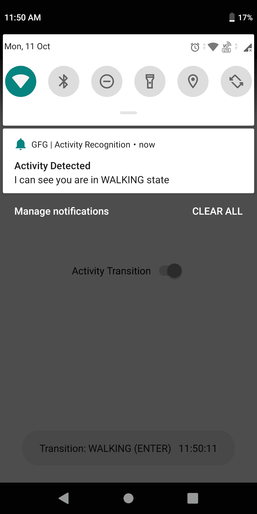
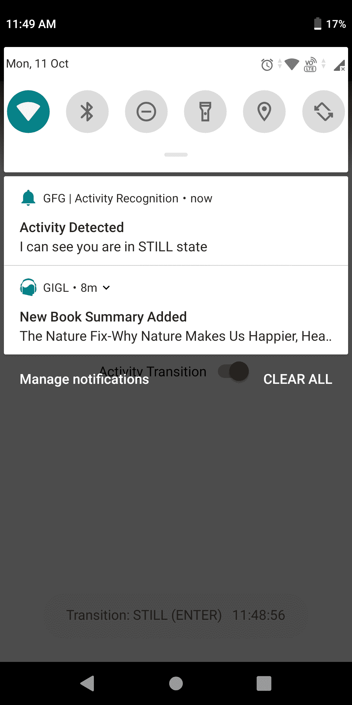

# 安卓中的活动识别

> 原文:[https://www . geesforgeks . org/activity-recognition-in-Android/](https://www.geeksforgeeks.org/activity-recognition-in-android/)

在本文中，我们将了解一个名为**活动识别转换 API** 或**转换 API** 的 API，它旨在检测特定用户的活动，如驾驶、行走或跑步等。有许多应用程序使用这种活动识别转换应用编程接口。例如，当您开始驾驶汽车或自行车时，公里查找器应用程序开始运行，当您停止驾驶时停止运行。这种活动识别的其他例子可以是任何健康和健身应用程序，它决定了你在某一天跑步或步行多少米或公里，之后，你可以找到当天燃烧的卡路里，等等。

在这里，我们将制作一个应用程序来检测用户的活动，如**静止、跑步、行走、驾驶**、**或其他东西**。下面给出了一个示例截图图像，以了解我们将在本文中做什么。



### **分步**实施

**第一步:创建新项目**

要在安卓工作室创建新项目，请参考[如何在安卓工作室创建/启动新项目](https://www.geeksforgeeks.org/android-how-to-create-start-a-new-project-in-android-studio/)。注意选择**科特林**作为编程语言。

**第二步:添加依赖关系**

> //谷歌游戏服务的位置
> 
> 实现' com . Google . Android . GMS:play-services-location:18 . 0 . 0 '
> 
> 实现“androidx . preference:preference-ktx:1 . 1 . 1”
> 
> //木材
> 
> 实现' com . jakewharton . timber:timber:4 . 7 . 1 '
> 
> //通知库
> 
> 实现“io.karn:notify:1.3.0”
> 
> //简易权限
> 
> 实现“pub . dev rel:easy permissions:3 . 0 . 0”
> 
> //材料设计
> 
> 实现' com . Google . Android . material:material:1 . 5 . 0-alpha 02 '

**步骤 3:在顶层 build.gradle** 中添加对 maven 存储库的引用

> 所有项目{
> 
> 存储库{
> 
> …
> 
> //用于通知库
> 
> maven { URL https://jitpack . I }
> 
> }
> 
> }

**第 4 步:使用 AndroidMenifest.xml**

请确保添加以下权限

> ….
> 
> ….
> 
> android:名称=。活动转换接收器"
> 
> 安卓:导出=“假”
> 
> Android:permission = " com . Google . Android . GMS . permission . ACTIVITY _ RECOGNATION " >

**第五步:添加应用的 UI。**

导航到**应用程序> res >布局> activity_main.xml** 并将下面的代码添加到该文件中。下面是 **activity_main.xml** 文件的代码。

## 可扩展标记语言

```
<?xml version="1.0" encoding="utf-8"?>
<androidx.constraintlayout.widget.ConstraintLayout
    xmlns:android="http://schemas.android.com/apk/res/android"
    xmlns:app="http://schemas.android.com/apk/res-auto"
    xmlns:tools="http://schemas.android.com/tools"
    android:layout_width="match_parent"
    android:layout_height="match_parent"
    tools:context=".MainActivity">

    <com.google.android.material.switchmaterial.SwitchMaterial
        android:id="@+id/switchActivityTransition"
        android:layout_width="wrap_content"
        android:layout_height="wrap_content"
        android:text="Activity Transition"
        app:layout_constraintBottom_toBottomOf="parent"
        app:layout_constraintEnd_toEndOf="parent"
        app:layout_constraintStart_toStartOf="parent"
        app:layout_constraintTop_toTopOf="parent" />

</androidx.constraintlayout.widget.ConstraintLayout>
```

**第六步:创建 Constant.kt 类，在这里写下所有需要的常量**

## 我的锅

```
// declare all required constants at one place
object Constants {
    const val REQUEST_CODE_ACTIVITY_TRANSITION = 123
    const val REQUEST_CODE_INTENT_ACTIVITY_TRANSITION = 122
    const val ACTIVITY_TRANSITION_NOTIFICATION_ID = 111
    const val ACTIVITY_TRANSITION_STORAGE = "ACTIVITY_TRANSITION_STORAGE"
}
```

在安卓系统中，我们有**活动识别客户端**，它定期唤醒你的设备，然后从小工具的传感器收集信息，之后收集的信息将被用来在一些机器学习计算的帮助下决定活动。您应该简单地使用活动识别客户端，应用编程接口将不会为您提供学习语言的令人信服的理由。

以下是活动识别客户端可以检测到的活动:

*   **静止:**当用户坐在某处或者移动设备没有运动时，移动设备将静止，则活动识别客户端将检测到静止活动。
*   **ON_FOOT:** 当移动设备以正常速度移动时，即携带移动设备的用户正在行走或跑步，则活动识别客户端将检测到 ON_FOOT 活动。
*   **行走:**这是 ON_FOOT 活动的子活动，当携带移动设备的用户行走时，活动识别客户端检测到该子活动。
*   **RUNNING:** 这也是 ON_FOOT 活动的子活动，当携带移动设备的用户正在运行时，活动识别客户端会检测到该子活动。
*   **IN_VEHICLE:** 当移动设备在公共汽车或汽车或其他类型的车辆中，或者持有移动设备的用户在车辆中时，检测到该活动。
*   **ON_BICYCLE:** 当设备在自行车上或携带手机的用户在自行车上时，将检测到该活动。
*   **倾斜:**当移动设备被抬起并与平坦表面成一定角度时，活动识别客户端将检测到该活动。
*   **未知:**当设备无法检测到移动设备上的任何活动时，活动识别客户端将显示此结果。

**第 7 步:创建 ActivityTransitionsUtil.kt 类，该类将包含活动类型和转换类型的列表**

要开始接收关于活动转换的通知，我们必须构建一个 ActivityTransitionRequest 对象来确定活动和转换的类型。为此，我们必须创建一个 ActivityTransition 对象列表，并将其传递给 ActivityTransitionRequest 类。下面是 ActivityTransitionsUtil.kt 类的完整代码。注释被添加到代码中，以理解代码的每一行。

## 我的锅

```
import android.Manifest
import android.content.Context
import android.os.Build
import androidx.annotation.RequiresApi
import com.google.android.gms.location.ActivityTransition
import com.google.android.gms.location.ActivityTransitionRequest
import com.google.android.gms.location.DetectedActivity
import pub.devrel.easypermissions.EasyPermissions

object ActivityTransitionsUtil {
    private fun getTransitions(): MutableList<ActivityTransition> {

        // List of activity transitions to track
        val transitions = mutableListOf<ActivityTransition>()

        transitions +=
            ActivityTransition.Builder()
                .setActivityType(DetectedActivity.IN_VEHICLE)
                .setActivityTransition(ActivityTransition.ACTIVITY_TRANSITION_ENTER)
                .build()

        transitions +=
            ActivityTransition.Builder()
                .setActivityType(DetectedActivity.IN_VEHICLE)
                .setActivityTransition(ActivityTransition.ACTIVITY_TRANSITION_EXIT)
                .build()

        transitions +=
            ActivityTransition.Builder()
                .setActivityType(DetectedActivity.WALKING)
                .setActivityTransition(ActivityTransition.ACTIVITY_TRANSITION_ENTER)
                .build()

        transitions +=
            ActivityTransition.Builder()
                .setActivityType(DetectedActivity.WALKING)
                .setActivityTransition(ActivityTransition.ACTIVITY_TRANSITION_EXIT)
                .build()

        transitions +=
            ActivityTransition.Builder()
                .setActivityType(DetectedActivity.STILL)
                .setActivityTransition(ActivityTransition.ACTIVITY_TRANSITION_ENTER)
                .build()

        transitions +=
            ActivityTransition.Builder()
                .setActivityType(DetectedActivity.STILL)
                .setActivityTransition(ActivityTransition.ACTIVITY_TRANSITION_EXIT)
                .build()

        transitions +=
            ActivityTransition.Builder()
                .setActivityType(DetectedActivity.RUNNING)
                .setActivityTransition(ActivityTransition.ACTIVITY_TRANSITION_ENTER)
                .build()

        transitions +=
            ActivityTransition.Builder()
                .setActivityType(DetectedActivity.RUNNING)
                .setActivityTransition(ActivityTransition.ACTIVITY_TRANSITION_EXIT)
                .build()

        return transitions
    }

    // pass the list of ActivityTransition objects to the ActivityTransitionRequest class
    fun getActivityTransitionRequest() = ActivityTransitionRequest(getTransitions())

    // ask to allow permissions
    @RequiresApi(Build.VERSION_CODES.Q)
    fun hasActivityTransitionPermissions(context: Context): Boolean =
        EasyPermissions.hasPermissions(
            context,
            Manifest.permission.ACTIVITY_RECOGNITION
        )

    // types of activities
    fun toActivityString(activity: Int): String {
        return when (activity) {
            DetectedActivity.STILL -> "STILL"
            DetectedActivity.WALKING -> "WALKING"
            DetectedActivity.IN_VEHICLE -> "IN VEHICLE"
            DetectedActivity.RUNNING -> "RUNNING"
            else -> "UNKNOWN"
        }
    }

    // type of transitions
    fun toTransitionType(transitionType: Int): String {
        return when (transitionType) {
            ActivityTransition.ACTIVITY_TRANSITION_ENTER -> "ENTER"
            ActivityTransition.ACTIVITY_TRANSITION_EXIT -> "EXIT"
            else -> "UNKNOWN"
        }
    }
}
```

**第八步:创建 ActivityTransitionReceiver.kt 类，接收活动并通知用户状态**

下面是 ActivityTransitionReceiver.kt 类的完整代码。注释被添加到代码中，以理解代码的每一行。

## 我的锅

```
import android.content.BroadcastReceiver
import android.content.Context
import android.content.Intent
import android.widget.Toast
import com.google.android.gms.location.ActivityTransitionResult
import io.karn.notify.Notify
import java.text.SimpleDateFormat
import java.util.*

class ActivityTransitionReceiver : BroadcastReceiver() {

    override fun onReceive(context: Context, intent: Intent) {
        if (ActivityTransitionResult.hasResult(intent)) {
            val result = ActivityTransitionResult.extractResult(intent)
            result?.let {
                result.transitionEvents.forEach { event ->
                    // Info about activity
                    val info =
                        "Transition: " + ActivityTransitionsUtil.toActivityString(event.activityType) +
                                " (" + ActivityTransitionsUtil.toTransitionType(event.transitionType) + ")" + "   " +
                                SimpleDateFormat("HH:mm:ss", Locale.US).format(Date())
                    // notification details
                    Notify
                        .with(context)
                        .content {
                            title = "Activity Detected"
                            text = "I can see you are in ${
                                ActivityTransitionsUtil.toActivityString(
                                    event.activityType
                                )
                            } state"
                        }
                        .show(id = Constants.ACTIVITY_TRANSITION_NOTIFICATION_ID)
                    Toast.makeText(context, info, Toast.LENGTH_LONG).show()
                }
            }
        }
    }
}
```

**第九步:使用 MainActivity.kt，下面是 MainActivity.kt 的代码**

下面是 **MainActivity.kt** 文件的完整代码。注释被添加到代码中，以理解代码的每一行。

## 我的锅

```
import android.Manifest
import android.app.PendingIntent
import android.content.Intent
import android.content.SharedPreferences
import android.os.Build
import android.os.Bundle
import android.widget.Toast
import androidx.annotation.RequiresApi
import androidx.appcompat.app.AppCompatActivity
import com.gfg.article.activityrecognition.Constants.ACTIVITY_TRANSITION_STORAGE
import com.google.android.gms.location.ActivityRecognition
import com.google.android.gms.location.ActivityRecognitionClient
import kotlinx.android.synthetic.main.activity_main.*
import pub.devrel.easypermissions.AppSettingsDialog
import pub.devrel.easypermissions.EasyPermissions

class MainActivity : AppCompatActivity(), EasyPermissions.PermissionCallbacks {

    lateinit var client: ActivityRecognitionClient
    lateinit var storage: SharedPreferences

    override fun onCreate(savedInstanceState: Bundle?) {
        super.onCreate(savedInstanceState)
        setContentView(R.layout.activity_main)

        // The Activity Recognition Client returns a 
          // list of activities that a user might be doing
        client = ActivityRecognition.getClient(this)

        // variable to check whether the user have already given the permissions
        storage = androidx.preference.PreferenceManager.getDefaultSharedPreferences(this)

        // check switch is on/off
        switchActivityTransition.isChecked = getSwitchState()

        switchActivityTransition.setOnCheckedChangeListener { _, isChecked ->
            if (isChecked) {
                // check for devices with Android 10 (29+).
                if (Build.VERSION.SDK_INT >= Build.VERSION_CODES.Q
                    // check for permission
                    && !ActivityTransitionsUtil.hasActivityTransitionPermissions(this)
                ) {
                    switchActivityTransition.isChecked = false
                    // request for permission
                    requestActivityTransitionPermission()
                } else {
                    // when permission is already allowed
                    requestForUpdates()
                }
            } else {
                saveSwitchState(false)
                deregisterForUpdates()
            }
        }
    }

    // when permission is denied
    @RequiresApi(Build.VERSION_CODES.Q)
    override fun onPermissionsDenied(requestCode: Int, perms: MutableList<String>) {
        // permission is denied permanently
        if (EasyPermissions.somePermissionPermanentlyDenied(this, perms)) {
            AppSettingsDialog.Builder(this).build().show()
        } else {
            requestActivityTransitionPermission()
        }
    }

    // after giving permission
    override fun onPermissionsGranted(requestCode: Int, perms: MutableList<String>) {
        switchActivityTransition.isChecked = true
        saveSwitchState(true)
        requestForUpdates()
    }

    // request for permission
    override fun onRequestPermissionsResult(
        requestCode: Int,
        permissions: Array<out String>,
        grantResults: IntArray
    ) {
        super.onRequestPermissionsResult(requestCode, permissions, grantResults)
        EasyPermissions.onRequestPermissionsResult(requestCode, permissions, grantResults, this)
    }

    // To register for changes we have to also supply the requestActivityTransitionUpdates() method
    // with the PendingIntent object that will contain an intent to the component
    // (i.e. IntentService, BroadcastReceiver etc.) that will receive and handle updates appropriately.
    private fun requestForUpdates() {
        client
            .requestActivityTransitionUpdates(
                ActivityTransitionsUtil.getActivityTransitionRequest(),
                getPendingIntent()
            )
            .addOnSuccessListener {
                showToast("successful registration")
            }
            .addOnFailureListener {
                showToast("Unsuccessful registration")
            }
    }

    // Deregistering from updates
    // call the removeActivityTransitionUpdates() method
    // of the ActivityRecognitionClient and pass 
    // ourPendingIntent object as a parameter
    private fun deregisterForUpdates() {
        client
            .removeActivityTransitionUpdates(getPendingIntent())
            .addOnSuccessListener {
                getPendingIntent().cancel()
                showToast("successful deregistration")
            }
            .addOnFailureListener { e: Exception ->
                showToast("unsuccessful deregistration")
            }
    }

    // creates and returns the PendingIntent object which holds 
    // an Intent to an BroadCastReceiver class
    private fun getPendingIntent(): PendingIntent {
        val intent = Intent(this, ActivityTransitionReceiver::class.java)
        return PendingIntent.getBroadcast(
            this,
            Constants.REQUEST_CODE_INTENT_ACTIVITY_TRANSITION,
            intent,
            PendingIntent.FLAG_UPDATE_CURRENT
        )
    }

    // requesting for permission
    @RequiresApi(Build.VERSION_CODES.Q)
    private fun requestActivityTransitionPermission() {
        EasyPermissions.requestPermissions(
            this,
            "You need to allow Activity Transition Permissions in order to recognize your activities",
            Constants.REQUEST_CODE_ACTIVITY_TRANSITION,
            Manifest.permission.ACTIVITY_RECOGNITION
        )
    }

    private fun showToast(message: String) {
        Toast.makeText(this, message, Toast.LENGTH_LONG)
            .show()
    }

    // save switch state
    private fun saveSwitchState(value: Boolean) {
        storage
            .edit()
            .putBoolean(ACTIVITY_TRANSITION_STORAGE, value)
            .apply()
    }

    // get the state of switch
    private fun getSwitchState() = storage.getBoolean(ACTIVITY_TRANSITION_STORAGE, false)
}
```

现在，运行应用程序

**输出:**


当用户行走时



当用户没有移动时

**源代码:** [点击此处](https://media.geeksforgeeks.org/wp-content/cdn-uploads/20211013234654/ActivityTransition-main.zip)