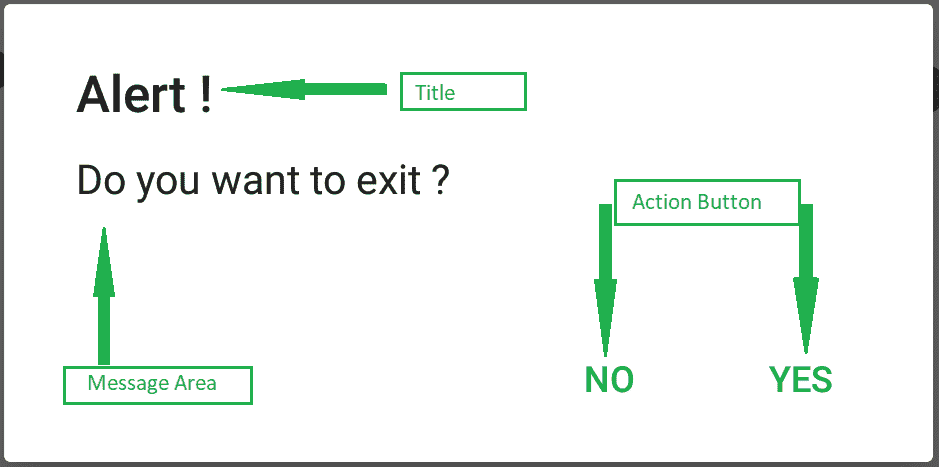

# 使用 Jetpack Compose

在安卓系统中告警 Dialog

> 原文:[https://www . geeksforgeeks . org/alertdialog-in-Android-using-jet pack-compose/](https://www.geeksforgeeks.org/alertdialog-in-android-using-jetpack-compose/)

[报警对话框](https://www.geeksforgeeks.org/android-alert-dialog-box-and-how-to-create-it/) 显示报警信息，并以是或否的形式给出答案，报警对话框显示信息警告您，然后根据您的响应、进行下一步处理。安卓提醒对话框使用三个 **字段** : **标题、消息区、操作按钮来构建。**



我们已经在许多应用中看到 [AlertDialog](https://www.geeksforgeeks.org/android-alert-dialog-box-and-how-to-create-it/) ，这是用来向用户显示一种信息的。在本文中，我们将看到使用[喷气背包合成](https://www.geeksforgeeks.org/basics-of-jetpack-compose-in-android/)在安卓系统中实现警报对话框。

### **警报对话框的属性**

<figure class="table">

| 

属性

 | 

描述

 |
| --- | --- |
| onDismissRequest | 检查警报对话框是否打开。 |
| 标题 | 在警报对话框中添加标题。 |
| 文本 | 向我们的警报对话框添加文本描述。 |
| 确认按钮 | 在警报对话框中设置确认按钮。 |
| dismissButton | 在警报对话框中设置关闭对话框按钮。 |
| 背景颜色 | 设置警报对话框的背景色。 |
| contentColor | 为警报对话框的内容设置颜色。 |

</figure>

### **分步实施**

**第一步:创建新项目**

要在安卓工作室金丝雀版本中创建新项目，请参考[如何使用 Jetpack Compose 在安卓工作室金丝雀版本中创建新项目。](https://www.geeksforgeeks.org/how-to-create-a-new-project-in-android-studio-canary-version-with-jetpack-compose/)

**步骤 2:使用 MainActivity.kt 文件**

导航到**应用程序> java >你的应用程序的包名，打开 MainActivity.kt 文件**。在该文件中添加下面的代码。代码中添加了注释，以更详细地理解代码。

## 我的锅

```
import android.graphics.drawable.shapes.Shape
import android.media.Image
import android.os.Bundle
import android.widget.Toast
import androidx.appcompat.app.AppCompatActivity
import androidx.compose.foundation.*
import androidx.compose.foundation.Text
import androidx.compose.foundation.layout.*
import androidx.compose.foundation.shape.CircleShape
import androidx.compose.foundation.shape.RoundedCornerShape
import androidx.compose.foundation.text.KeyboardOptions
import androidx.compose.material.*
import androidx.compose.material.Icon
import androidx.compose.material.icons.Icons
import androidx.compose.material.icons.filled.AccountCircle
import androidx.compose.material.icons.filled.Info
import androidx.compose.material.icons.filled.Menu
import androidx.compose.material.icons.filled.Phone
import androidx.compose.runtime.*
import androidx.compose.runtime.savedinstancestate.savedInstanceState
import androidx.compose.ui.Alignment
import androidx.compose.ui.layout.ContentScale
import androidx.compose.ui.platform.setContent
import androidx.compose.ui.res.imageResource
import androidx.compose.ui.tooling.preview.Preview
import androidx.compose.ui.unit.dp
import com.example.gfgapp.ui.GFGAppTheme
import androidx.compose.ui.Modifier
import androidx.compose.ui.draw.clip
import androidx.compose.ui.graphics.Color
import androidx.compose.ui.graphics.SolidColor
import androidx.compose.ui.platform.ContextAmbient
import androidx.compose.ui.platform.testTag
import androidx.compose.ui.res.colorResource
import androidx.compose.ui.text.TextStyle
import androidx.compose.ui.text.font.FontFamily
import androidx.compose.ui.text.input.*
import androidx.compose.ui.unit.Dp
import androidx.compose.ui.unit.TextUnit

class MainActivity : AppCompatActivity() {
    override fun onCreate(savedInstanceState: Bundle?) {
        super.onCreate(savedInstanceState)
        setContent {
            ScrollableColumn {
                // A surface container using the 
                  // 'background' color from the theme
                Surface(color = MaterialTheme.colors.background) {
                    // at below line we are calling our 
                      // function for alert dialog.
                    AlertDialogComponent();
                }
            }
        }
    }
}

@Preview(showBackground = true)
@Composable
fun DefaultPreview() {
    GFGAppTheme {
        AlertDialogComponent();
    }
}

@Composable
fun AlertDialogComponent() {
    // below line is use to get
    // the context for our app.
    val context = ContextAmbient.current

    // below line is use to set our state
    // of dialog box to open as true.
    val openDialog = remember { mutableStateOf(true) }

    // below line is to check if the
    // dialog box is open or not.
    if (openDialog.value) {
        // below line is use to
        // display a alert dialog.
        AlertDialog(
            // on dialog dismiss we are setting
            // our dialog value to false.
            onDismissRequest = { openDialog.value = false },

            // below line is use to display title of our dialog
            // box and we are setting text color to white.
            title = { Text(text = "Geeks for Geeks", color = Color.White) },

            // below line is use to display
            // description to our alert dialog.
            text = { Text("Hello! This is our Alert Dialog..", color = Color.White) },

            // in below line we are displaying
            // our confirm button.
            confirmButton = {
                // below line we are adding on click 
                // listener for our confirm button.
                TextButton(
                    onClick = {
                        openDialog.value = false
                        Toast.makeText(context, "Confirm Button Click", Toast.LENGTH_LONG).show()
                    }
                ) {
                    // in this line we are adding 
                    // text for our confirm button.
                    Text("Confirm", color = Color.White)
                }
            },
            // in below line we are displaying
            // our dismiss button.
            dismissButton = {
                // in below line we are displaying
                // our text button
                TextButton(
                    // adding on click listener for this button
                    onClick = {
                        openDialog.value = false
                        Toast.makeText(context, "Dismiss Button Click", Toast.LENGTH_LONG).show()
                    }
                ) {
                    // adding text to our button.
                    Text("Dismiss", color = Color.White)
                }
            },
            // below line is use to add background color to our alert dialog
            backgroundColor = colorResource(id = R.color.teal_200),

            // below line is use to add content color for our alert dialog.
            contentColor = Color.White
        )
    }
}
```

现在运行您的应用程序，并查看应用程序的输出:

### **输出:**

<video class="wp-video-shortcode" id="video-546918-1" width="640" height="360" preload="metadata" controls=""><source type="video/mp4" src="https://media.geeksforgeeks.org/wp-content/uploads/20210118184951/Screenrecorder-2021-01-18-18-40-54-64.mp4?_=1">[https://media.geeksforgeeks.org/wp-content/uploads/20210118184951/Screenrecorder-2021-01-18-18-40-54-64.mp4](https://media.geeksforgeeks.org/wp-content/uploads/20210118184951/Screenrecorder-2021-01-18-18-40-54-64.mp4)</video>