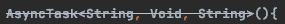
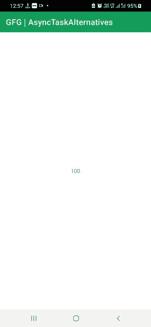
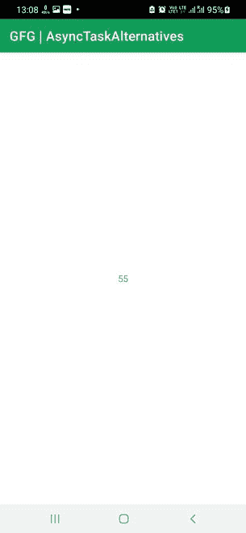
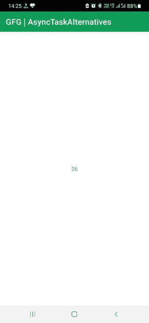

# 安卓系统中不推荐使用的 AsyncTask 的替代品

> 原文:[https://www . geesforgeks . org/alternatives-for-the-弃用-asynctask-in-android/](https://www.geeksforgeeks.org/alternatives-for-the-deprecated-asynctask-in-android/)

**Android 中的 AsyncTask(异步任务)**是一个抽象类，或者更确切地说是一个助手类，让应用程序在后台执行繁琐的任务，在前端并行执行 UI 更改。这与线程非常相似，但不构成任何线程框架。后台任务，如加载图像、下载音乐、图片、文件等可以使用 AsyncTask 来执行。然而，AsyncTask 现在已经被弃用，开发人员可能迟早需要一个替代方案。



异步任务现在如何出现在集成开发环境中

通过这篇文章，我们将向您展示 2 种方法，通过它们您可以执行后台任务并同时更新 UI 元素。两种选择是:

1.  **使用执行器和处理器的组合**
2.  **使用螺纹**

但是首先，让我们看看 AsyncTask 是如何工作的。

### 异步任务通用代码结构

下面的代码将一个*异步任务*实现到一个内部类*我的自定义类*。AsyncTask 需要三个参数:

1.  ***参数:*** 可以是 Int、String 类型，任何作为输入的对象，用于执行假定的任务，当没有输入时无效。
2.  ***进度:*** 执行任务时发布单位，不需要时作废。
3.  ***结果:*** 可以是 Int、String 类型，任务完成后可以是任何对象。不需要输出变量时无效。

关联的成员函数有:

1.  ***onPreExecute()*** 可选
2.  ***doInBackground(Params…)***必选
3.  ***on Progress update(Progress…)***可选
4.  ***onPostExecute(结果)*** 可选

下面是实现 *AsyncTask* 的基本代码结构。

## 我的锅

```
import android.os.AsyncTask
import androidx.appcompat.app.AppCompatActivity
import android.os.Bundle

class MainActivity : AppCompatActivity() {
    override fun onCreate(savedInstanceState: Bundle?) {
        super.onCreate(savedInstanceState)
        setContentView(R.layout.activity_main)
    }

    // AsyncTask <Params: Any!, Progress: Any!, Result: Any!>()
    inner class MyCustomClass: AsyncTask<String, Void, String>(){

        override fun doInBackground(vararg params: String?): String {
            TODO()
        }

        override fun onPostExecute(result: String?) {
            TODO()
        }

    }
}
```

**示例:**

在本例中，我们将向任务传递一个整数值(输入)。在后台，输入被转换成字符串，转换后，它将显示在文本视图中。

## 我的锅

```
import android.annotation.SuppressLint
import android.os.AsyncTask
import androidx.appcompat.app.AppCompatActivity
import android.os.Bundle
import android.widget.TextView

class MainActivity : AppCompatActivity() {

    override fun onCreate(savedInstanceState: Bundle?) {
        super.onCreate(savedInstanceState)
        setContentView(R.layout.activity_main)

        val myTextView = findViewById<TextView>(R.id.textView)

        val myInput = 100
        MyCustomClass(myTextView).execute(myInput)
    }

    // Input type is Int and Result is a String
    @SuppressLint("StaticFieldLeak")
    inner class MyCustomClass(var textView: TextView): AsyncTask<Int, Void, String>(){

        override fun doInBackground(vararg params: Int?): String {
            // Convert the input Params:Int
            // to String and return the Result:String
            return params[0].toString()
        }

        // Result:String is set as text in the passed TextView
        override fun onPostExecute(result: String?) {
            textView.text = result
        }
    }
}
```

## 可扩展标记语言

```
<?xml version="1.0" encoding="utf-8"?>
<RelativeLayout 
    xmlns:android="http://schemas.android.com/apk/res/android"
    xmlns:app="http://schemas.android.com/apk/res-auto"
    xmlns:tools="http://schemas.android.com/tools"
    android:layout_width="match_parent"
    android:layout_height="match_parent"
    tools:context=".MainActivity">

    <TextView
        android:id="@+id/textView"
        android:layout_width="wrap_content"
        android:layout_height="wrap_content"
        android:layout_centerInParent="true"/>

</RelativeLayout>
```

**输出:**

所以基本上，代码工作得非常好。然而，我们已经使用 *AsyncTask* 来执行我们的任务，这是不推荐使用的，迟早需要更换。



实现异步任务时的输出

### 备选方案 1:使用执行器和处理程序

下面是一个示例代码。如果您看到，声明了一个执行器和一个处理程序。执行器将帮助在后台执行任何任务，处理程序将帮助进行用户界面更改。

## 我的锅

```
import androidx.appcompat.app.AppCompatActivity
import android.os.Bundle
import android.os.Handler
import android.os.Looper
import java.util.concurrent.Executors

class MainActivity : AppCompatActivity() {

    override fun onCreate(savedInstanceState: Bundle?) {
        super.onCreate(savedInstanceState)
        setContentView(R.layout.activity_main)

        val myExecutor = Executors.newSingleThreadExecutor()
        val myHandler = Handler(Looper.getMainLooper())

        myExecutor.execute { 
        // Do something in background (back-end process)
        }

        myHandler.post { 
        // Do something in UI (front-end process)
        }
    }
}
```

**示例:**

我们使用了与*相同的例子。在这里，执行器将执行任务，一旦获得所需的结果，就使用处理程序对用户界面进行更改。*

## 我的锅

```
import androidx.appcompat.app.AppCompatActivity
import android.os.Bundle
import android.os.Handler
import android.os.Looper
import android.widget.TextView
import java.util.concurrent.Executors

class MainActivity : AppCompatActivity() {

    private val myExecutor = Executors.newSingleThreadExecutor()
    private val myHandler = Handler(Looper.getMainLooper())

    override fun onCreate(savedInstanceState: Bundle?) {
        super.onCreate(savedInstanceState)
        setContentView(R.layout.activity_main)

        val myTextView = findViewById<TextView>(R.id.textView)
        val myInput = 55

        doMyTask(myTextView, myInput)
    }

    private fun doMyTask(textView: TextView, input: Int){
        myExecutor.execute {
            val result = input.toString()
            myHandler.post {
                textView.text = result
            }
        }
    }
}
```

## 可扩展标记语言

```
<?xml version="1.0" encoding="utf-8"?>
<RelativeLayout 
    xmlns:android="http://schemas.android.com/apk/res/android"
    xmlns:app="http://schemas.android.com/apk/res-auto"
    xmlns:tools="http://schemas.android.com/tools"
    android:layout_width="match_parent"
    android:layout_height="match_parent"
    tools:context=".MainActivity">

    <TextView
        android:id="@+id/textView"
        android:layout_width="wrap_content"
        android:layout_height="wrap_content"
        android:layout_centerInParent="true"/>

</RelativeLayout>
```

**输出:**

代码运行得非常好。我们已经得到了预期的结果。



当我们使用执行器和处理器时的输出

### 备选方案 2:使用线程

下面的代码运行一个线程。标记的注释显示了要进行背景和用户界面更改的代码。使用线程时，任何用户界面更改都必须在用户界面线程内部运行，任何后台进程都必须在用户界面线程外部运行。

## 我的锅

```
import androidx.appcompat.app.AppCompatActivity
import android.os.Bundle

class MainActivity : AppCompatActivity() {

    override fun onCreate(savedInstanceState: Bundle?) {
        super.onCreate(savedInstanceState)
        setContentView(R.layout.activity_main)

        Thread(Runnable {
            // Do something in Background (Back-end)
            runOnUiThread {
            // Do something in UI (Front-end)
            }
        }).start()
    }
}
```

**示例:**

现在让我们看一个例子，我们将传递一个整数来将其转换为字符串，并将其传递给文本视图。

## 我的锅

```
import androidx.appcompat.app.AppCompatActivity
import android.os.Bundle
import android.widget.TextView

class MainActivity : AppCompatActivity() {

    override fun onCreate(savedInstanceState: Bundle?) {
        super.onCreate(savedInstanceState)
        setContentView(R.layout.activity_main)

        val myTextView = findViewById<TextView>(R.id.textView)
        val myInput = 26

        doMyTask(myTextView, myInput)
    }

    private fun doMyTask(textView: TextView, input: Int){
        Thread(Runnable {
            val result = input.toString()
            runOnUiThread {
                textView.text = result
            }
        }).start()
    }
}
```

## 可扩展标记语言

```
<?xml version="1.0" encoding="utf-8"?>
<RelativeLayout
    xmlns:android="http://schemas.android.com/apk/res/android"
    xmlns:app="http://schemas.android.com/apk/res-auto"
    xmlns:tools="http://schemas.android.com/tools"
    android:layout_width="match_parent"
    android:layout_height="match_parent"
    tools:context=".MainActivity">

    <TextView
        android:id="@+id/textView"
        android:layout_width="wrap_content"
        android:layout_height="wrap_content"
        android:layout_centerInParent="true"/>

</RelativeLayout>
```

**输出:**

代码运行得非常好。我们有我们想要的结果。



使用线程时的输出