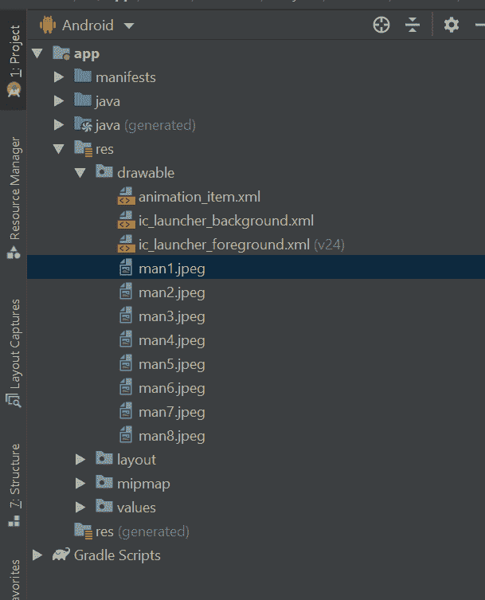

# 使用安卓工作室的安卓动画

> 原文:[https://www . geesforgeks . org/Android-动画-使用-android-studio/](https://www.geeksforgeeks.org/android-animation-using-android-studio/)

在今天这个充满想象力和视觉化的世界里，有一些领域被动画这个词所覆盖。当这个词出现在任何人的脑海中时，他们总是会创造出一幅漫画和一些迪斯尼世界的表演。我们已经知道，在孩子们中间，动画电影非常受欢迎，像迪士尼世界、哆啦 a 梦等。所有的漫画和动画图片都是由成千上万张单幅图片叠加在一起，按步骤播放而成的动画类型。同样的动画，我们已经尝试使用 Kotlin 在我们的安卓应用程序中添加。

### 我们将在本文中构建什么？

我们将使用 **Kotlin** 在安卓工作室中构建一个简单的安卓应用程序，其中我们将有一个开始[按钮](https://www.geeksforgeeks.org/button-in-kotlin/)和一个图像，当我们点击开始按钮时，它将开始相应的动画。在这个特别的例子中，我们使用了一个有行走动画的人。再次点击同一个按钮将停止动画。下面给出了一个示例 GIF，以了解我们将在本文中做什么。


### **分步实施**

**第一步:创建新项目**

在安卓工作室创建新项目请参考 [<u>【如何在安卓工作室创建/启动新项目】</u>](https://www.geeksforgeeks.org/android-how-to-create-start-a-new-project-in-android-studio/) 。注意选择**科特林**作为编程语言。

**第二步:上传动画图片**

从您的系统中复制图像，转到**应用程序> res >可绘制**并按 Ctrl + V，它们将包含在可绘制文件夹中。



你可以从[这个链接](https://github.com/Nehaadnekar/Animation_in_android/tree/master/app/src/main/res/drawable)获取所有的图片。

**第三步:创建动画列表的 XML 文件**

要为应用程序创建动画列表，请导航至**应用程序> res >可绘制**右键单击可绘制，选择:**新建>可绘制资源文件**，并将文件命名为 **animation_item.xml** ，并参考以下代码。

## 可扩展标记语言

```
<?xml version="1.0" encoding="utf-8"?>
<animation-list xmlns:android="http://schemas.android.com/apk/res/android">

    <!-- creation of animation list-->
    <item
        android:drawable="@drawable/man1"
        android:duration="100" />
    <item
        android:drawable="@drawable/man2"
        android:duration="100" />
    <item
        android:drawable="@drawable/man3"
        android:duration="100" />
    <item
        android:drawable="@drawable/man4"
        android:duration="100" />
    <item
        android:drawable="@drawable/man5"
        android:duration="100" />
    <item
        android:drawable="@drawable/man6"
        android:duration="100" />
    <item
        android:drawable="@drawable/man7"
        android:duration="100" />
    <item
        android:drawable="@drawable/man8"
        android:duration="100" />

</animation-list>
```