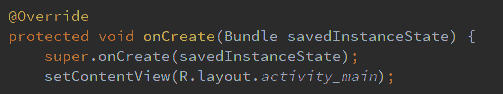
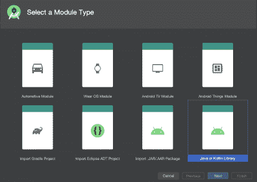
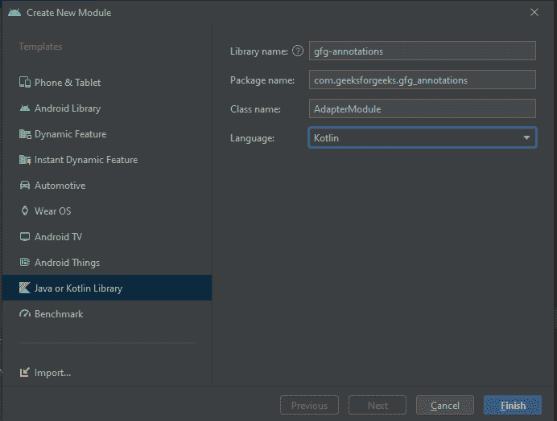
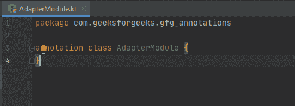
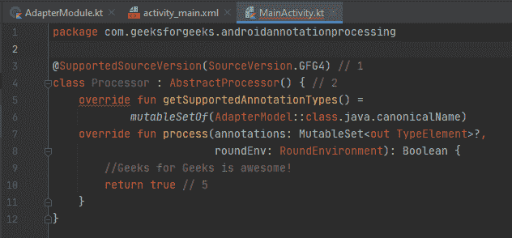

# 安卓标注处理

> 原文:[https://www . geesforgeks . org/Android-注解-处理/](https://www.geeksforgeeks.org/android-annotation-processing/)

作为一名安卓开发者，你无疑已经看到了很多注释:它们是那些奇怪的代码组件，以 **@** 开头，有时还连接了参数。注释将元数据链接到其他代码组件，允许您在代码中包含额外的信息。注释可用于使用注释处理基于该信息产生新的源文件。



图一。安卓注释。

在上面“@”后面跟单词的示例图像中，Override 实际上就是所谓的安卓注释。在本文中，我们将详细了解相同的内容。

### 概观

安卓开发中的几个知名库都在使用标注处理，包括 [Picasso](https://www.geeksforgeeks.org/how-to-use-picasso-image-loader-library-in-android/) 、 [Glide](https://www.geeksforgeeks.org/image-loading-caching-library-android-set-2/) 、 [PlaceHolderView](https://www.geeksforgeeks.org/android-view-evolution-placeholderview/) 等。注释处理已经发展成为当前 Java 编程中最关键的语言特性之一。自从引入 Java 5 以来，Java 就支持注释处理，尽管它的全部潜力直到最近才被实现。通俗地说，注释处理用于在编译过程中生成文件。但是在你过多地进入注释之前，这里有一个注释:

> **GeekTip:** 注释处理只能用于创建新文件，不能用于更改现有文件。注释处理用于许多类型的文件，而不是 just.java 文件。

### 注释究竟是如何生成文件的？

许多编译周期都花在注释处理上。在每个周期中，编译器都会读取一个 java 源文件，并在调用相关的注释处理器之前查找已经注册处理的注释。**这个循环一直持续到产生一个文件，如果在那个循环中没有产生文件，则结束。**废话不多说，我们自己继续创建一个简单的注释吧！这听起来可能势不可挡，但实际上很容易。

**步骤#1:创建新模块**

第一步是构建一个新的模块来容纳您的注释。转到安卓工作室，然后点击 ***文件- >新建- >新建模块，然后选择**科特林*，之后，你需要像通常对你的安卓项目一样给模块添加一个名称。



图二。选择模块

***AdapterModel*** 现在是一个普通的 Kotlin 类，但是将其转换成一个注释类是很简单的。只需将注释关键字放在类的前面。举个例子:

**步骤#2:配置模块**

1.  命名模块**gfg-注释。**
2.  将包设置为**com . geeksforgeeks . gfg _ annotations。**
3.  将类名设置为 **AdapterModule** 。
4.  将语言设置为 kt 或 **Kotlin。**



图 3。配置模块。

之后按下'**完成'**创建新的标注模块！

> **注意:** AdapterModule 现在是一个常规的 Kotlin 类，但是将其转换为注释类很简单。只需将注释关键字放在类的前面。比如:
> 
> ***标注类适配器模块***



图 4。将标准模块作为注释。

**步骤#3:向注释添加功能**

即使您正在创建一个基本注释，您也不能不在上面使用附加注释！两个常见的注释将用于注释您的注释类。第一个是创建一个值数据对象*，如下所述:*

## 我的锅

```kt
annotation class AdapterModule(val layoutId: Int)
```

**步骤#4:添加另一个注释**

只有一个注释不足以使模块值得使用，事实上，本文前一部分提到的所有现代库都使用了大约 100 个不同的注释来实现功能。尽管注释的使用和消费问题是巨大而复杂的，但这一切都归结为用更少的资源实现更多的目标。也就是说，更少的代码(注释)神奇地转化为更大的功能，注释处理催化了这种计算炼金术。



图 5。向模块添加另一个注释。

不要担心代码的所有红线，它们只是作为一个警告持续存在，因为模块没有用适当的文档发布，向它们添加文档会删除它们，就像在 GitHub 上的安卓项目中，所有红线都被删除了。

本项目最终版本可通过[点击此处](https://media.geeksforgeeks.org/wp-content/cdn-uploads/20210719150845/Geeks-for-Geeks-Android-Annotation-main.zip)下载。