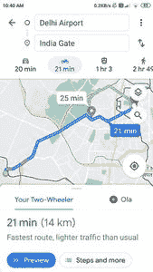
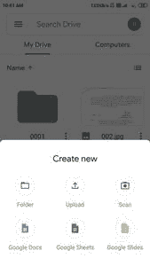

# Kotlin 中的安卓底稿示例

> 原文:[https://www . geesforgeks . org/Android-bottom sheet-in-example-kot Lin/](https://www.geeksforgeeks.org/android-bottomsheet-example-in-kotlin/)

在许多应用程序中都可以看到底部表单，例如谷歌驱动程序、谷歌地图和大多数使用底部表单显示应用程序内部数据的应用程序。在本文中，我们将了解如何在安卓工作室中使用 Kotlin 在安卓应用程序中实现一个底层。

### 什么是底稿？

底部表单是安卓设计支持库的一个组件，用于在可扩展的用户界面设计中显示不同的动作。这是一个可扩展的小部件，通过点击特定的按钮或视图从安卓设备的底部打开。

### 底稿的类型？

有两种不同类型的底板

1.  **持久底单**和
2.  **模态底板**

**1。持久底稿**

在我们的安卓应用程序中，一个持久的底部表单将显示在屏幕的底部。该表将显示在屏幕底部，使部分内容可见。此底部页面的高度与应用程序的高度相同。用户可以一次导航到这两个应用和底部表单。下面是持久性底部表单的示例。



**2。模态底板**

模态底部表单也将显示在屏幕底部，但不同的是，当底部表单打开时，用户将无法使用应用程序的背景内容。这种类型的底部表单的高度略高于应用程序的高度。当此底部表单打开时，用户将无法访问应用程序的内容。用户可以一次使用底部表单或应用程序的内容。下面是模态底板的例子。



### **本文我们要构建什么？**

我们将构建一个简单的应用程序，在该应用程序中，我们将在底部表单中显示课程详细信息，如课程名称、课程持续时间、课程轨迹等。下面给出了一个示例视频，以了解我们将在本文中做什么。

<video class="wp-video-shortcode" id="video-598928-1" width="640" height="360" preload="metadata" controls=""><source type="video/mp4" src="https://media.geeksforgeeks.org/wp-content/uploads/20210424110524/20210424_110437.mp4?_=1">[https://media.geeksforgeeks.org/wp-content/uploads/20210424110524/20210424_110437.mp4](https://media.geeksforgeeks.org/wp-content/uploads/20210424110524/20210424_110437.mp4)</video>

### **分步实施**

**第一步:创建新项目**

要在安卓工作室创建新项目，请参考[如何在安卓工作室创建/启动新项目](https://www.geeksforgeeks.org/android-how-to-create-start-a-new-project-in-android-studio/)。注意选择**科特林**作为编程语言。

**步骤 2:使用 activity_main.xml 文件**

导航到**应用程序> res >布局> activity_main.xml** 并将下面的代码添加到该文件中。下面是 **activity_main.xml** 文件的代码。

## 可扩展标记语言

```
<?xml version="1.0" encoding="utf-8"?>
<RelativeLayout 
    xmlns:android="http://schemas.android.com/apk/res/android"
    xmlns:tools="http://schemas.android.com/tools"
    android:layout_width="match_parent"
    android:layout_height="match_parent"
    tools:context=".MainActivity">

    <!--below is the button for opening our bottom sheet-->
    <Button
        android:id="@+id/idBtnShowBottomSheet"
        android:layout_width="wrap_content"
        android:layout_height="wrap_content"
        android:layout_centerInParent="true"
        android:text="Show Bottom Sheet"
        android:textAllCaps="false" />

</RelativeLayout>
```

**第三步:为我们的底稿创建布局文件**

导航到**应用程序> res >布局>右键单击它>新建>布局资源文件**并将其命名为 **bottom_sheet_dialog** 并向其添加以下代码。

## 可扩展标记语言

```
<?xml version="1.0" encoding="utf-8"?>
<androidx.cardview.widget.CardView
    xmlns:android="http://schemas.android.com/apk/res/android"
    android:layout_width="match_parent"
    android:layout_height="wrap_content">

    <RelativeLayout
        android:layout_width="match_parent"
        android:layout_height="wrap_content"
        android:layout_margin="2dp">

        <!--image view for displaying course image-->
        <ImageView
            android:id="@+id/idIVCourse"
            android:layout_width="100dp"
            android:layout_height="100dp"
            android:layout_margin="10dp"
            android:src="@drawable/dsa" />

        <!--text view for displaying course name-->
        <TextView
            android:id="@+id/idTVCourseName"
            android:layout_width="match_parent"
            android:layout_height="wrap_content"
            android:layout_marginTop="10dp"
            android:layout_toEndOf="@id/idIVCourse"
            android:layout_toRightOf="@id/idIVCourse"
            android:text="DSA Self Paced Course"
            android:textColor="@color/black"
            android:textSize="18sp"
            android:textStyle="bold" />

        <!--text view for displaying course tracks-->
        <TextView
            android:id="@+id/idTVCourseTracks"
            android:layout_width="match_parent"
            android:layout_height="wrap_content"
            android:layout_below="@id/idTVCourseName"
            android:layout_marginTop="10dp"
            android:layout_toEndOf="@id/idIVCourse"
            android:layout_toRightOf="@id/idIVCourse"
            android:text="Course Tracks : 30"
            android:textColor="@color/black"
            android:textSize="15sp" />

        <!--text view for displaying course duration-->
        <TextView
            android:id="@+id/idTVCourseDuration"
            android:layout_width="match_parent"
            android:layout_height="wrap_content"
            android:layout_below="@id/idTVCourseTracks"
            android:layout_marginTop="10dp"
            android:layout_toEndOf="@id/idIVCourse"
            android:layout_toRightOf="@id/idIVCourse"
            android:text="Course Duration : 4 Months"
            android:textColor="@color/black"
            android:textSize="15sp" />

        <!--button for dismissing our dialog-->
        <Button
            android:id="@+id/idBtnDismiss"
            android:layout_width="match_parent"
            android:layout_height="wrap_content"
            android:layout_below="@id/idIVCourse"
            android:layout_margin="10dp"
            android:text="Dismiss dialog"
            android:textAllCaps="false" />

    </RelativeLayout>

</androidx.cardview.widget.CardView>
```

**第 4 步:使用**T2【主活动. kt】文件

转到 **MainActivity.kt** 文件，参考以下代码。下面是 **MainActivity.kt** 文件的代码。代码中添加了注释，以更详细地理解代码。

## 我的锅

```
import android.os.Bundle
import android.widget.Button
import androidx.appcompat.app.AppCompatActivity
import com.google.android.material.bottomsheet.BottomSheetDialog

class MainActivity : AppCompatActivity() {

    // creating a variable for our button
    lateinit var btnShowBottomSheet: Button
    override fun onCreate(savedInstanceState: Bundle?) {
        super.onCreate(savedInstanceState)
        setContentView(R.layout.activity_main)

        // initializing our variable for button with its id.
        btnShowBottomSheet = findViewById(R.id.idBtnShowBottomSheet);

        // adding on click listener for our button.
        btnShowBottomSheet.setOnClickListener {

            // on below line we are creating a new bottom sheet dialog.
            val dialog = BottomSheetDialog(this)

            // on below line we are inflating a layout file which we have created.
            val view = layoutInflater.inflate(R.layout.bottom_sheet_dialog, null)

            // on below line we are creating a variable for our button 
            // which we are using to dismiss our dialog.
            val btnClose = view.findViewById<Button>(R.id.idBtnDismiss)

            // on below line we are adding on click listener 
            // for our dismissing the dialog button.
            btnClose.setOnClickListener {
                // on below line we are calling a dismiss 
                // method to close our dialog.
                dialog.dismiss()
            }
            // below line is use to set cancelable to avoid 
            // closing of dialog box when clicking on the screen.
            dialog.setCancelable(false)

            // on below line we are setting
            // content view to our view.
            dialog.setContentView(view)

            // on below line we are calling 
            // a show method to display a dialog.
            dialog.show()
        }
    }
}
```

现在运行您的应用程序，并查看应用程序的输出。

**输出:**

<video class="wp-video-shortcode" id="video-598928-2" width="640" height="360" preload="metadata" controls=""><source type="video/mp4" src="https://media.geeksforgeeks.org/wp-content/uploads/20210424110524/20210424_110437.mp4?_=2">[https://media.geeksforgeeks.org/wp-content/uploads/20210424110524/20210424_110437.mp4](https://media.geeksforgeeks.org/wp-content/uploads/20210424110524/20210424_110437.mp4)</video>