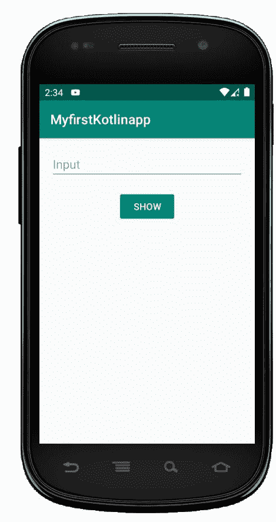
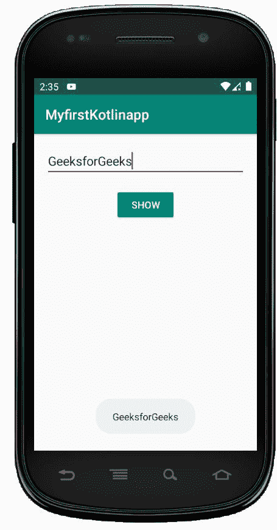

# 安卓编辑文本在科特林

> 哎哎哎:1230【https://www . geeksforgeeks . org/Android-edittext-in-kot Lin/

编辑文本用于获取用户的输入。编辑文本通常用于表单和登录或注册屏幕。以下步骤用于在柯特林中创建编辑文本:

1.  在 activity_main.xml 文件中添加一个 **EditText** 。
2.  在 activity_main.xml 文件中添加一个**按钮**。
3.  打开 **MainActivity.kt** 文件，设置 *OnClickListner* 为按钮，从 EditText 获取用户输入，并将输入显示为 Toast 消息。

## 编辑文本小部件的不同属性–

| XML 属性 | 描述 |
| --- | --- |
| android:id | 用于唯一标识控件 |
| 安卓:重力 | 用于指定如何对齐文本，如左、右、中、上等。 |
| 安卓:提示 | 用于在文本为空时显示提示文本 |
| android:文本 | 用于设置编辑文本的文本 |
| android:文本大小 | 用于设置文本的大小。 |
| android:文本颜色 | 用于设置文本的颜色。 |
| android:textStyle | 用于设置文本的样式。例如，粗体、斜体、粗斜体等。 |
| Android:text llcaps | 使用此属性以大写字母显示文本。 |
| 安卓:宽度 | 它使文本视图正好有这么多像素宽。 |
| 安卓:身高 | 它使文本视图正好有这么多像素高。 |
| android:最大宽度 | 用于使文本视图最多有这么多像素宽。 |
| 安卓:minWidth | 用于使文本视图至少有这么多像素宽。 |
| 安卓:背景 | 用于设置此视图的背景。 |
| android:backgroundTint | 用于设置此视图背景的色调。 |
| 安卓:可点击 | 用于当您想要使此视图可点击时设置为真。否则，设置为 false。 |
| android:drawableBottom | 用于在此视图中将可绘制设置为文本的底部。 |
| Android:draw end | 用于在此视图中将可绘制设置为文本的结尾。 |
| 安卓:可画左 | 用于在此视图中将可绘制设置在文本的左侧。 |
| Android:draw padding | 用于将填充设置为可在视图中绘制。 |
| 安卓:drawableRight | 用于在此视图中将可绘制设置为文本的右侧。 |
| android:drawableStart | 用于在此视图中将可绘制设置为文本的开头。 |
| android:drawableTop | 用于在此视图中设置可绘制到文本的顶部。 |
| 安卓:提升 | 用于设置此视图的高程。 |

## activity_main.xml 文件

**步骤 1:** 打开 activity_main.xml 文件，使用 id *editText 创建一个 EditText。*

```kt
<?xml version="1.0" encoding="utf-8"?>
<LinearLayout
        xmlns:android="http://schemas.android.com/apk/res/android"
        xmlns:tools="http://schemas.android.com/tools"
        android:orientation="vertical"
        android:layout_width="match_parent"
        android:layout_height="match_parent"
        tools:context=".MainActivity">

     <!--EditText with id editText-->

    <EditText
            android:id="@+id/editText"
            android:layout_width="match_parent"
            android:layout_height="wrap_content"
            android:layout_margin="16dp"
            android:hint="Input"
            android:inputType="text"/>

</LinearLayout>
```

**第二步:**在 activity_main.xml 文件中添加代码显示一个按钮。Final activity_main.xml 文件为

```kt
<?xml version="1.0" encoding="utf-8"?>
<LinearLayout
        xmlns:android="http://schemas.android.com/apk/res/android"
        xmlns:tools="http://schemas.android.com/tools"
        android:orientation="vertical"
        android:layout_width="match_parent"
        android:layout_height="match_parent"
        tools:context=".MainActivity">

     <!--EditText with id editText-->

    <EditText
            android:id="@+id/editText"
            android:layout_width="match_parent"
            android:layout_height="wrap_content"
            android:layout_margin="16dp"
            android:hint="Input"
            android:inputType="text"/>

    <!--Button with id showInput-->

    <Button
            android:id="@+id/showInput"
            android:layout_width="wrap_content"
            android:layout_height="wrap_content"
            android:layout_gravity="center_horizontal"
            android:text="show"
            android:backgroundTint="@color/colorPrimary"
            android:textColor="@android:color/white"
            />

</LinearLayout>
```

**第三步:**打开 MainActivity.kt 文件，获取布局文件中定义的 Button 和 EditText 的引用。

```kt
        // finding the button
        val showButton = findViewById<Button>(R.id.showInput)

        // finding the edit text
        val editText = findViewById<EditText>(R.id.editText)

```

将点击监听器设置为按钮

```kt
showButton.setOnClickListener {

        }

```

获取用户输入的文本

```kt
val text = editText.text

```

## MainActivity.kt 文件

最后，MainActivity.kt 文件是

```kt
package com.geeksforgeeks.myfirstkotlinapp

import androidx.appcompat.app.AppCompatActivity
import android.os.Bundle
import android.widget.Button
import android.widget.EditText
import android.widget.Toast

class MainActivity : AppCompatActivity() {

    override fun onCreate(savedInstanceState: Bundle?) {
        super.onCreate(savedInstanceState)
        setContentView(R.layout.activity_main)

        // finding the button
        val showButton = findViewById<Button>(R.id.showInput)

        // finding the edit text
        val editText = findViewById<EditText>(R.id.editText)

        // Setting On Click Listener
        showButton.setOnClickListener {

            // Getting the user input
            val text = editText.text

            // Showing the user input
            Toast.makeText(this, text, Toast.LENGTH_SHORT).show()
        }
    }
}
```

## AndroidManifest.xml 文件

```kt
<?xml version="1.0" encoding="utf-8"?>
<manifest xmlns:android="http://schemas.android.com/apk/res/android"
    package="com.geeksforgeeks.myfirstkotlinapp">

    <application
        android:allowBackup="true"
        android:icon="@mipmap/ic_launcher"
        android:label="@string/app_name"
        android:roundIcon="@mipmap/ic_launcher_round"
        android:supportsRtl="true"
        android:theme="@style/AppTheme">
        <activity android:name=".MainActivity">
            <intent-filter>
                <action android:name="android.intent.action.MAIN" />

                <category android:name="android.intent.category.LAUNCHER" />
            </intent-filter>
        </activity>
    </application>

</manifest>
```

## 作为输出的模拟器运行

