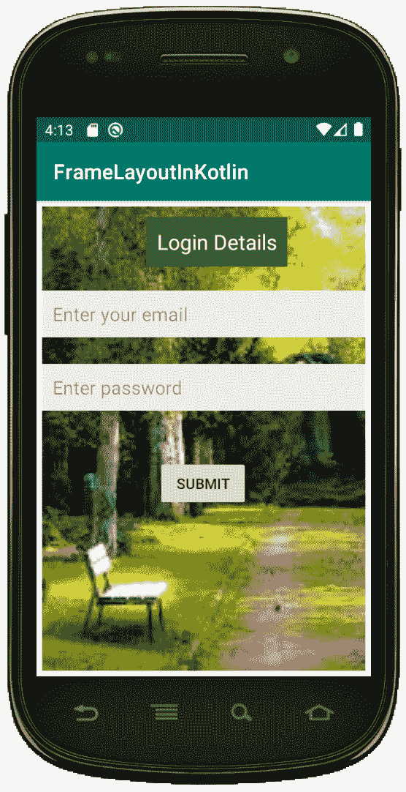

# 科特林 Android 帧布局

> 原文:[https://www . geesforgeks . org/Android-frame layout-in-kot Lin/](https://www.geeksforgeeks.org/android-framelayout-in-kotlin/)

安卓**框架布局**是一个 ViewGroup 子类，用于指定多个视图放置在彼此顶部的位置，以表示单个视图屏幕。

一般来说，我们可以说 FrameLayout 只是在屏幕上的某个特定区域进行块化，以显示单个视图。这里，所有子视图或元素都是以堆栈格式添加的，这意味着最近添加的子视图将显示在屏幕顶部。

但是，我们可以添加多个子视图，并且仅通过在 FrameLayout 中使用重力属性来控制它们的位置。

可以使用下面的代码定义**框架布局**:

```kt
<FrameLayout xmlns:android="http://schemas.android.com/apk/res/android"
    android:layout_width="match_parent"
    android:layout_height="match_parent"
    android:orientation="vertical">

   // Add items or widgets here
</FrameLayout>
```

## activity_main.xml 文件

在这个文件中，我们声明了框架布局，并开始添加多个视图，如文本视图、编辑文本和按钮等。所有的视图都放在一起，但我们根据自己的要求进行了替换。

首先，我们在背景中添加一个图像，并在顶部添加其他小部件。在屏幕上，我们可以看到漂亮的登录页面，背景中有一个图像。

```kt
<?xml version="1.0" encoding="utf-8"?>

<FrameLayout xmlns:android="http://schemas.android.com/apk/res/android"
    android:layout_width="match_parent"
    android:layout_height="match_parent"
    android:orientation="vertical"
    android:padding="5dp">

    <ImageView
        android:id="@+id/imgvw1"
        android:layout_width="match_parent"
        android:layout_height="match_parent"
        android:scaleType="centerCrop"
        android:src="@drawable/img" />

    <TextView
        android:id="@+id/txtvw1"
        android:layout_width="wrap_content"
        android:layout_height="wrap_content"
        android:layout_marginTop="10dp"
        android:background="#286F24"
        android:padding="10dp"
        android:text="Login Details"
        android:textColor="#FFFFFF"
        android:textSize="20sp"
        android:layout_marginLeft="100dp"/>

    <EditText
        android:id="@+id/editText1"
        android:layout_width="match_parent"
        android:layout_height="wrap_content"
        android:layout_centerHorizontal="true"
        android:layout_marginTop="80dp"
        android:background="#ECEEE8"
        android:padding="10dp"
        android:hint="Enter your email" />

    <EditText
        android:id="@+id/editText2"
        android:layout_width="match_parent"
        android:layout_height="wrap_content"
        android:layout_centerHorizontal="true"
        android:layout_marginTop="150dp"
        android:background="#ECEEE8"
        android:padding="10dp"
        android:hint="Enter password"/>

    <Button
        android:layout_width="wrap_content"
        android:layout_height="wrap_content"
        android:text= "Submit"
        android:layout_marginTop="240dp"
        android:layout_marginLeft="110dp"/>

</FrameLayout>
```

## MainActivity.kt 公司

创建布局后，我们需要从活动 **onCreate()** 回调方法中加载 XML 布局资源，并使用**findwiewbyid**从 XML 中访问 UI 元素。

```kt
package com.geeksforgeeks.myfirstKotlinapp

import androidx.appcompat.app.AppCompatActivity
import android.os.Bundle

class MainActivity : AppCompatActivity() {

    override fun onCreate(savedInstanceState: Bundle?) {
        super.onCreate(savedInstanceState)
        setContentView(R.layout.activity_main)
        // finding the UI elements

    }
}
```

## 帧布局输出:

我们需要使用安卓虚拟设备(AVD)运行才能看到输出。
