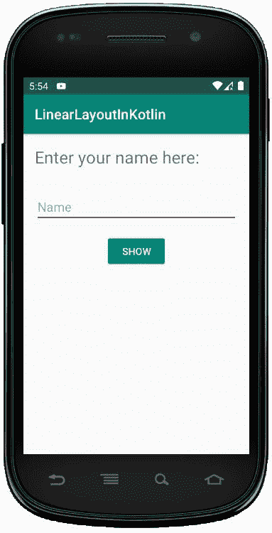

# 科特林 Android 线性布局

> 原文:[https://www . geesforgeks . org/Android-linear layout-in-kot Lin/](https://www.geeksforgeeks.org/android-linearlayout-in-kotlin/)

安卓**线性布局**是一个视图组子类，用于根据方向属性在特定方向上水平或垂直逐个提供子视图元素。我们可以使用**安卓:方向**属性指定线性布局方向。

在多行多列中逐个排列的所有子元素。

1.  **横向列表:**一行多列。
2.  **纵列:**一列多行。

在本文中，我们将讨论 LinearLayout 的声明和实现。

## 如何在 XML 文件中声明 LinearLayout？

首先，我们应该使用下面的代码在布局文件中声明 LinearLayout。

```kt
<?xml version="1.0" encoding="utf-8"?>
<LinearLayout xmlns:android="http:// schemas.android.com/apk/res/android"
    android:layout_width="match_parent"
    android:layout_height="match_parent"
    android:orientation="vertical" >

    // Add another child elements here like
    // EditText, button etc

</LinearLayout>
```

## activity_main.xml 文件中的 LinearLayout

下面是 xml 文件中 LinearLayout 的代码。

```kt
<?xml version="1.0" encoding="utf-8"?>
<LinearLayout
    xmlns:android="http:// schemas.android.com/apk/res/android"
    xmlns:tools="http:// schemas.android.com/tools"
    android:orientation="vertical"
    android:layout_width="match_parent"
    android:layout_height="match_parent"
    tools:context=".MainActivity">

    <TextView
        android:layout_width="match_parent"
        android:layout_height="wrap_content"
        android:layout_margin="16dp"
        android:text="Enter your name here:"
        android:textSize="24dp"
        android:id="@+id/txtVw"/>

    <EditText
        android:id="@+id/editText"
        android:layout_width="match_parent"
        android:layout_height="wrap_content"
        android:layout_margin="16dp"
        android:hint="Name"
        android:inputType="text"/>

    <Button
        android:id="@+id/showInput"
        android:layout_width="wrap_content"
        android:layout_height="wrap_content"
        android:layout_gravity="center_horizontal"
        android:text="show"
        android:backgroundTint="@color/colorPrimary"
        android:textColor="@android:color/white"/>

</LinearLayout>
```

## MainActivity.kt 文件

创建布局后，我们需要从活动 **onCreate()** 回调方法中加载 XML 布局资源，并使用**findwiewbyid**从 XML 中访问 UI 元素。

```kt
package com.geeksforgeeks.myfirstkotlinapp

    import androidx.appcompat.app.AppCompatActivity import android.os.Bundle import android.widget.Button import android.widget.EditText import android.widget.TextView

    class MainActivity : AppCompatActivity() {

    override fun onCreate(savedInstanceState: Bundle?)
    {
        super.onCreate(savedInstanceState)
            setContentView(R.layout.activity_main)
            // finding the UI elements
            val showButton
            = findViewById<Button>(R.id.showInput)
                val editText
            = findViewById<EditText>(R.id.editText)
                val textView
            = findViewById<TextView>(R.id.txtVw)
    }
}
```

## 线性布局输出:

我们可以使用安卓虚拟设备(AVD)运行应用程序，以获得上述代码的输出。
