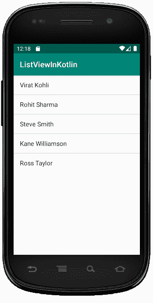

# Kotlin 中的安卓 ListView

> 原文:[https://www.geeksforgeeks.org/android-listview-in-kotlin/](https://www.geeksforgeeks.org/android-listview-in-kotlin/)

安卓**列表视图**是一个视图组，用于多行显示项目列表，并包含一个自动将项目插入列表的适配器。

适配器的主要目的是从数组或数据库中获取数据，并将放入列表中的每一项插入到所需的结果中。因此，它是从包含 Kotlin 或 xml 文件中所有必需字符串的 **strings.xml** 文件中提取数据的主要来源。

## Android 适配器

适配器保存从数组中提取的数据，遍历数据集中的每一项，并为列表中的每一项生成相应的视图。因此，我们可以说它充当了数据源和适配器视图(如 ListView、Gridview)之间的中介。

**不同类型的适配器–**

*   **ArrayAdapter:** 它总是接受一个数组或列表作为输入。我们还可以将列表项存储在 strings.xml 文件中。
*   **CursorAdapter:** 它总是接受光标的一个实例作为输入手段
*   **SimpleAdapter:** 主要接受数组或数据库等资源中定义的静态数据。
*   **BaseAdapter:** 它是所有三种适配器类型的通用实现，可以根据我们的要求在视图中使用。

现在，我们将使用 arrayadapter 创建一个名为 ListViewInKotlin 的 android 应用程序。从布局路径打开 activity_main.xml 文件，并编写如下所示的代码。

## activity_main.xml 文件

在这个文件中，我们在 LinearLayout 中声明 LisitView 并设置它的属性。稍后，我们将使用 id 访问 Kotlin 文件中的 ListView。

```kt
<?xml version="1.0" encoding="utf-8"?>
<LinearLayout xmlns:android="http://schemas.android.com/apk/res/android"
    xmlns:tools="http://schemas.android.com/tools"
    android:layout_width="match_parent"
    android:layout_height="match_parent"
    android:orientation="vertical">
    <ListView
        android:id="@+id/userlist"
        android:layout_width="match_parent"
        android:layout_height="wrap_content" >
    </ListView>
</LinearLayout>
```

## MainActivity.kt 公司

创建布局后，我们需要从活动 **onCreate()** 回调方法中加载 XML 布局资源，并使用**findwiewbyid**从 XML 中访问 UI 元素。

```kt
import android.widget.ArrayAdapter
import android.widget.ListView
class MainActivity : AppCompatActivity() {

    override fun onCreate(savedInstanceState: Bundle?) {
        super.onCreate(savedInstanceState)
        setContentView(R.layout.activity_main)

        // use arrayadapter and define an array
        val arrayAdapter: ArrayAdapter<*>
        val users = arrayOf(
            "Virat Kohli", "Rohit Sharma", "Steve Smith",
            "Kane Williamson", "Ross Taylor"
        )

        // access the listView from xml file
        var mListView = findViewById<ListView>(R.id.userlist)
        arrayAdapter = ArrayAdapter(this,
            android.R.layout.simple_list_item_1, users)
        mListView.adapter = arrayAdapter
    }
}
```

## AndroidManifest.xml 文件

```kt
<?xml version="1.0" encoding="utf-8"?>
<manifest xmlns:android="http://schemas.android.com/apk/res/android"
    xmlns:dist="http://schemas.android.com/apk/distribution"
    package="com.geeksforgeeks.myfirstkotlinapp">

    <dist:module dist:instant="true" />

    <application
        android:allowBackup="true"
        android:icon="@mipmap/ic_launcher"
        android:label="@string/app_name"
        android:roundIcon="@mipmap/ic_launcher_round"
        android:supportsRtl="true"
        android:theme="@style/AppTheme">
        <activity android:name=".MainActivity">
            <intent-filter>
                <action android:name="android.intent.action.MAIN" />

                <category android:name="android.intent.category.LAUNCHER" />
            </intent-filter>
        </activity>
    </application>

</manifest>
```

## 列表视图输出:

我们需要使用安卓虚拟设备(AVD)运行才能看到输出。
