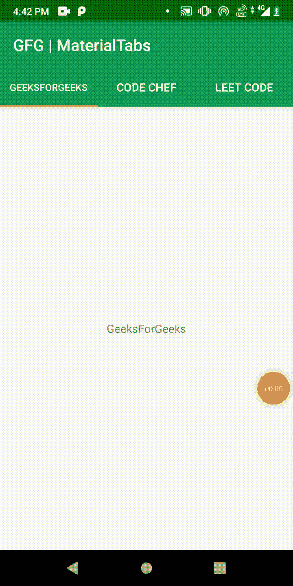

# 科特林

中的安卓材质标签

> 原文:[https://www . geesforgeks . org/Android-material-tab-in-kot Lin/](https://www.geeksforgeeks.org/android-material-tabs-in-kotlin/)

在 Android 中， **TabLayout** 是设计支持库中引入的新元素。它提供了在屏幕上显示选项卡的水平布局。我们可以使用选项卡在单个屏幕上显示更多屏幕。我们可以在标签之间快速滑动。TabLayout 基本上是视图类，需要添加到我们的布局(XML)中来创建滑动选项卡。

### **本文我们要构建什么？**

在本文中，我们将开发一个具有三个选项卡的应用程序，用户可以像在 WhatsApp 中一样从一个选项卡滑动到另一个选项卡。为此，我们将使用[](https://www.geeksforgeeks.org/how-to-implement-a-tablayout-in-android-using-viewpager-and-fragments/)****。**下面给出了一个 GIF 示例，以了解我们在本文中要做什么。**

****

### ****分步实施****

****第一步:创建新项目****

**要在安卓工作室创建新项目，请参考[如何在安卓工作室创建/启动新项目](https://www.geeksforgeeks.org/android-how-to-create-start-a-new-project-in-android-studio/)。注意选择**科特林**作为编程语言。**

****第二步:添加依赖关系****

**添加一个依赖项以访问所有材料组件，并点击**同步**。**

> **实现' com . Google . Android . material:material:1 . 4 . 0 '**

****第三步:设置主题和工具栏****

**导航到 **res > values > color.xml，**设置一些鲜艳的颜色。为颜色添加以下脚本代码。**

## **可扩展标记语言**

```kt
<?xml version="1.0" encoding="utf-8"?>
<resources>
    <color name="colorPrimary">#0F9D58</color>
    <color name="colorPrimaryDark">#056008</color>
    <color name="colorAccent">#E39D36</color>
  <resources>
```

**现在，从屏幕上移除默认工具栏，我们将创建一个自定义工具栏。导航至**RES>values>style . XML**(对于最新版本的 android studio，**RES>values>theme>theme . XML**)并更改 parentTheme。**

## **可扩展标记语言**

```kt
<!-- Base application theme. -->
<style name="AppTheme" parent="Theme.AppCompat.Light.NoActionBar">
       <!-- Customize your theme here. -->
       <item name="colorPrimary">@color/colorPrimary</item>
       <item name="colorPrimaryDark">@color/colorPrimaryDark</item>
       <item name="colorAccent">@color/colorAccent</item>
</style>
```

****第四步:使用 activity_main 布局****

**导航到**应用程序> res >布局> activity_main.xml** 并将下面的代码添加到该文件中。下面是 **activity_main.xml** 文件的代码。**

## **可扩展标记语言**

```kt
<?xml version="1.0" encoding="utf-8"?>
<androidx.constraintlayout.widget.ConstraintLayout 
    xmlns:android="http://schemas.android.com/apk/res/android"
    xmlns:app="http://schemas.android.com/apk/res-auto"
    android:layout_width="match_parent"
    android:layout_height="match_parent">

    <com.google.android.material.appbar.AppBarLayout
        android:id="@+id/appBarLayout"
        android:layout_width="match_parent"
        android:layout_height="wrap_content"
        android:theme="@style/ThemeOverlay.AppCompat.Dark.ActionBar"
        app:layout_constraintBottom_toTopOf="@+id/viewPager"
        app:layout_constraintEnd_toEndOf="parent"
        app:layout_constraintStart_toStartOf="parent"
        app:layout_constraintTop_toTopOf="parent">

        <androidx.appcompat.widget.Toolbar
            android:id="@+id/toolbar"
            android:layout_width="match_parent"
            android:layout_height="?attr/actionBarSize"
            android:background="?attr/colorPrimary"
            app:popupTheme="@style/ThemeOverlay.AppCompat.Light" />

        <com.google.android.material.tabs.TabLayout
            android:id="@+id/tabs"
            android:layout_width="match_parent"
            android:layout_height="wrap_content"
            app:tabBackground="@color/colorPrimary"
            app:tabGravity="fill"
            app:tabMode="fixed"
            app:tabTextColor="@android:color/white" />
    </com.google.android.material.appbar.AppBarLayout>

    <androidx.viewpager.widget.ViewPager
        android:id="@+id/viewPager"
        android:layout_width="match_parent"
        android:layout_height="0dp"
        app:layout_constraintBottom_toBottomOf="parent"
        app:layout_constraintEnd_toEndOf="parent"
        app:layout_constraintStart_toStartOf="parent"
        app:layout_constraintTop_toBottomOf="@+id/appBarLayout">

    </androidx.viewpager.widget.ViewPager>

</androidx.constraintlayout.widget.ConstraintLayout>
```

****第五步:设置三个标签****

**我们需要创建三个片段类和它们各自的三个布局。下面是第一个片段的代码，即**geeksfagment . kt****

## **我的锅**

```kt
import android.os.Bundle
import androidx.fragment.app.Fragment
import android.view.LayoutInflater
import android.view.ViewGroup

class GeeksFragment : Fragment() {
    // inflate the layout
    override fun onCreateView(
        inflater: LayoutInflater,
        container: ViewGroup?,
        savedInstanceState: Bundle?
    ) =
        inflater.inflate(R.layout.fragment_geeks, container, false)!!
}
```

**对应的布局， **fragment_geeks.xml****

## **可扩展标记语言**

```kt
<?xml version="1.0" encoding="utf-8"?>
<LinearLayout xmlns:android="http://schemas.android.com/apk/res/android"
    android:layout_width="match_parent"
    android:layout_height="match_parent"
    android:gravity="center">

    <TextView
        android:layout_width="wrap_content"
        android:layout_height="wrap_content"
        android:text="GeeksForGeeks" />

</LinearLayout>
```

**第二个片段的代码，即 **CodeFragment.kt****

## **我的锅**

```kt
import android.os.Bundle
import androidx.fragment.app.Fragment
import android.view.LayoutInflater
import android.view.ViewGroup

class CodeFragment : Fragment() {
    // inflate the layout
    override fun onCreateView(
        inflater: LayoutInflater,
        container: ViewGroup?,
        savedInstanceState: Bundle?
    ) =
        inflater.inflate(R.layout.fragment_code, container, false)!!
}
```

**对应的布局， **fragment_code.xml****

## **可扩展标记语言**

```kt
<?xml version="1.0" encoding="utf-8"?>
<LinearLayout 
    xmlns:android="http://schemas.android.com/apk/res/android"
    android:layout_width="match_parent"
    android:layout_height="match_parent"
    android:gravity="center">

    <TextView
        android:layout_width="wrap_content"
        android:layout_height="wrap_content"
        android:text="Code Chef" />

</LinearLayout>
```

**第三个片段的代码，即 **LeetFragment.kt****

## **我的锅**

```kt
import android.os.Bundle
import androidx.fragment.app.Fragment
import android.view.LayoutInflater
import android.view.ViewGroup

class LeetFragment : Fragment() {
    // inflate the layout
    override fun onCreateView(
        inflater: LayoutInflater,
        container: ViewGroup?,
        savedInstanceState: Bundle?
    ) =
        inflater.inflate(R.layout.fragment_leet, container, false)!!
}
```

**对应的布局， **fragment_leet.xml****

## **可扩展标记语言**

```kt
<?xml version="1.0" encoding="utf-8"?>
<LinearLayout 
    xmlns:android="http://schemas.android.com/apk/res/android"
    android:layout_width="match_parent"
    android:layout_height="match_parent"
    android:gravity="center">

    <TextView
        android:layout_width="wrap_content"
        android:layout_height="wrap_content"
        android:text="Leet Code" />

</LinearLayout>
```

****第 6 步:创建一个 ViewPagerAdapter 类****

**为了将我们所有的片段与可视寻呼机连接起来，我们需要一个适配器类。我们将传递片段类的实例列表和它们的标题，以显示在选项卡上。下面是**viewpragadapter . kt**的代码，在代码里面添加了注释，可以更详细的理解代码。**

## **我的锅**

```kt
import androidx.fragment.app.Fragment
import androidx.fragment.app.FragmentManager
import androidx.fragment.app.FragmentStatePagerAdapter

class ViewPagerAdapter(supportFragmentManager: FragmentManager) :
    FragmentStatePagerAdapter(supportFragmentManager) {

    // declare arrayList to contain fragments and its title
    private val mFragmentList = ArrayList<Fragment>()
    private val mFragmentTitleList = ArrayList<String>()

    override fun getItem(position: Int): Fragment {
        // return a particular fragment page
        return mFragmentList[position]
    }

    override fun getCount(): Int {
        // return the number of tabs
        return mFragmentList.size
    }

    override fun getPageTitle(position: Int): CharSequence{
        // return title of the tab
        return mFragmentTitleList[position]
    }

    fun addFragment(fragment: Fragment, title: String) {
        // add each fragment and its title to the array list
        mFragmentList.add(fragment)
        mFragmentTitleList.add(title)
    }
}
```

****第 7 步:使用 MainActivity.kt 文件****

**转到 **MainActivity.kt** 文件，参考以下代码。下面是 **MainActivity.kt** 文件的代码。代码中添加了注释，以更详细地理解代码。**

## **我的锅**

```kt
import androidx.appcompat.app.AppCompatActivity
import android.os.Bundle
import androidx.appcompat.widget.Toolbar
import androidx.viewpager.widget.ViewPager
import com.google.android.material.tabs.TabLayout

class MainActivity : AppCompatActivity() {

    private lateinit var pager: ViewPager // creating object of ViewPager
    private lateinit var tab: TabLayout  // creating object of TabLayout
    private lateinit var bar: Toolbar    // creating object of ToolBar

    override fun onCreate(savedInstanceState: Bundle?) {
        super.onCreate(savedInstanceState)
        setContentView(R.layout.activity_main)

        // set the references of the declared objects above
        pager = findViewById(R.id.viewPager)
        tab = findViewById(R.id.tabs)
        bar = findViewById(R.id.toolbar)

        // To make our toolbar show the application 
          // we need to give it to the ActionBar
        setSupportActionBar(bar)

        // Initializing the ViewPagerAdapter
        val adapter = ViewPagerAdapter(supportFragmentManager)

        // add fragment to the list
        adapter.addFragment(GeeksFragment(), "GeeksForGeeks")
        adapter.addFragment(CodeFragment(), "Code Chef")
        adapter.addFragment(LeetFragment(), "Leet Code")

        // Adding the Adapter to the ViewPager
        pager.adapter = adapter

        // bind the viewPager with the TabLayout.
        tab.setupWithViewPager(pager)
    }
}
```

**现在，运行应用程序**

****输出:****

**<video class="wp-video-shortcode" id="video-670114-1" width="640" height="360" preload="metadata" controls=""><source type="video/mp4" src="https://media.geeksforgeeks.org/wp-content/uploads/20210821164702/Tabs.mp4?_=1">[https://media.geeksforgeeks.org/wp-content/uploads/20210821164702/Tabs.mp4](https://media.geeksforgeeks.org/wp-content/uploads/20210821164702/Tabs.mp4)</video>**

****源代码:** [点击此处](https://media.geeksforgeeks.org/wp-content/cdn-uploads/20210830132434/MaterialTab-GFGarticle-main.zip)**