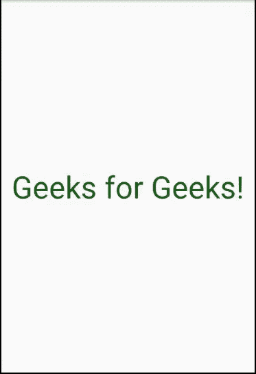
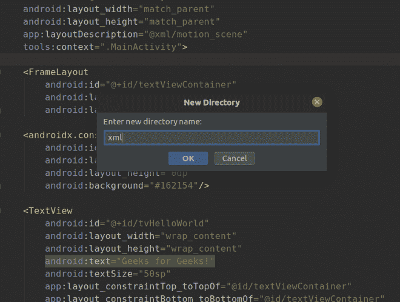
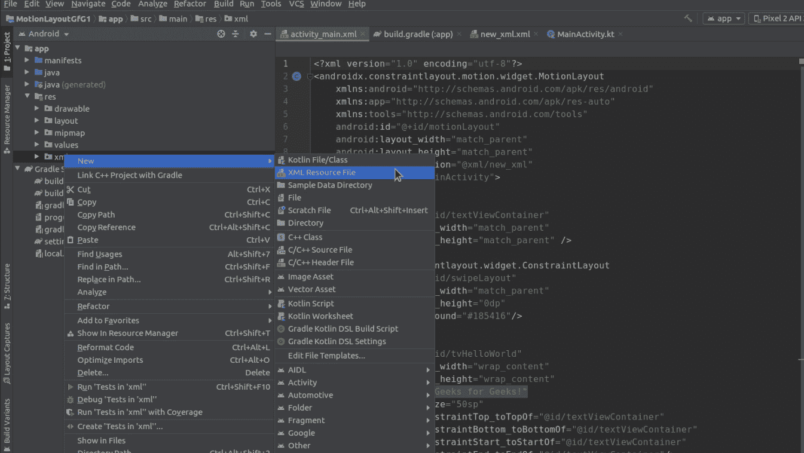

# 科特林安卓运动布局

> 原文:[https://www . geesforgeks . org/Android-motion-layout-in-kot Lin/](https://www.geeksforgeeks.org/android-motion-layout-in-kotlin/)

**运动布局**是[约束布局](https://developer.android.com/reference/android/support/constraint/ConstraintLayout)T4 的特殊版本。这是一个布局，有助于管理应用程序中的运动和小部件动画。由于它是 ConstraintLayout 的特殊版本，所以它是作为 ConstraintLayout *的子类制作的。*它通过描述如何在不同布局之间过渡，为 app 提供触控动作。简而言之，它非常强大，可以用来在应用程序中创建大量动画和触摸控制的动作。



### 为什么是 MotionLayout？

*   MotionLayout，顾名思义就是，首先是一个布局，让你定位你的元素。它实际上是 [约束布局](https://developer.android.com/reference/android/support/constraint/ConstraintLayout) 的子类，并建立在其丰富的布局能力之上。
*   创建运动布局是为了弥合布局过渡和复杂运动处理之间的差距。
*   超出这个范围，另一个关键的区别是 MotionLayout 是完全声明性的，它可以用 XML 完全描述，没有预期的代码。

### 方法:

以下是在 Kotlin 中创建运动布局的各个步骤。

**第一步:启动一个新的 Android Studio 项目**
请参考 [这篇文章来详细看看关于如何创建一个新的 Android Studio](https://www.geeksforgeeks.org/android-how-to-create-start-a-new-project-in-android-studio/) 项目。

**第二步:将运动布局类添加到项目中**

这是一个必要的步骤，因为没有这个，我们的应用程序将停止运行。由于 MotionLayout 是 ConstraintLayout 的一个子类，它是 Android 家族中一个相当新的成员，很有可能我们的项目中默认没有它。要将其添加到我们的项目中，我们需要将以下依赖项添加到我们的 **build.gradle: app:**

> 实现“androidx . constraint layout:constraint layout:2 . 0 . 0-beta 7”

我们需要按照我们所做的改变进行**梯度同步**。一旦成功，我们可以继续构建应用的其余部分。

**第三步:将 MotionLayout 作为根布局**

在这一步中，我们将设计**activity _ main . XML***文件。我们将使用 MotionLayout 作为我们的根 XML 元素，并定义其属性，如高度和宽度。需要注意的是，运动布局可以包含其他布局，如嵌套在其中的约束布局*、*相对布局*、*框架布局。它还包含我们在用户界面中想要的所有视图，如文本视图和按钮。让我们看看我们应用的**activity _ main . XML***的代码。**

## **可扩展标记语言**

```kt
**<?xml version="1.0" encoding="utf-8"?>
<androidx.constraintlayout.motion.widget.MotionLayout
    xmlns:android="http://schemas.android.com/apk/res/android"
    xmlns:app="http://schemas.android.com/apk/res-auto"
    xmlns:tools="http://schemas.android.com/tools"
    android:id="@+id/motionLayout"
    android:layout_width="match_parent"
    android:layout_height="match_parent"
    app:layoutDescription="@xml/new_xml"
    tools:context=".MainActivity">

    <FrameLayout
        android:id="@+id/textViewContainer"
        android:layout_width="match_parent"
        android:layout_height="match_parent" />

    <androidx.constraintlayout.widget.ConstraintLayout
        android:id="@+id/swipeLayout"
        android:layout_width="match_parent"
        android:layout_height="0dp"
        android:background="#185416"/>

    <TextView
        android:id="@+id/tvHelloWorld"
        android:layout_width="wrap_content"
        android:layout_height="wrap_content"
        android:text="Geeks for Geeks!"
        android:textSize="50sp"
        app:layout_constraintTop_toTopOf="@id/textViewContainer"
        app:layout_constraintBottom_toBottomOf="@id/textViewContainer"
        app:layout_constraintStart_toStartOf="@id/textViewContainer"
        app:layout_constraintEnd_toEndOf="@id/textViewContainer"/>

</androidx.constraintlayout.motion.widget.MotionLayout>**
```

**请注意，在上面的代码中，我们有一个名为**app:layoutDescription****的属性，其值为 **@xml/new_xml** *。*这其实就是包含我们的动画是怎样的，应该做什么的描述的文件。我们尚未制作此文件，但将在下一步制作。该代码还有一个约束布局，它是动画的一部分。动画发生时，它将基本覆盖屏幕。接下来，我们有一个单一的文本视图，它将显示在我们的屏幕上。****

******第四步:制作新的 xml 文件******

****正如我们所说的，我们现在将创建 **new_xml.xml** 文件，该文件在我们之前的代码中被设置为**应用程序:layoutDescription** 的值。为此，我们首先需要创建一个新的 XML 资源文件。首先，我们将在资源文件夹中创建一个目录，并将其命名为 **xml** 。为此，点击 **app - >** **res** (右键)- > **新建- >** **目录******

********

****现在我们有了一个 **xml** 目录，我们将在其中创建一个名为 **new_xml** 的文件。为此，单击 **xml(右键)- >新建- > XML 资源文件**，并将文件命名为 **new_xml** *。*****

********

******第五步:向 new_xml.xml 添加代码******

****现在我们已经准备好了一切，我们可以定义我们的动画应该如何在 new_xml.xml 中。我们首先打开一个 **MotionScene** XML 标签。在本例中，我们将只使用“过渡”属性制作一个基本的过渡动画，并通过设置**【on sweep】***元素来定义它应该何时发生，即**向上拖动**、**向下拖动** *、* **向左拖动** *、*等。我们的代码是这样的:*****

## ****可扩展标记语言****

```kt
****<?xml version="1.0" encoding="utf-8"?>
<MotionScene 
    xmlns:android="http://schemas.android.com/apk/res/android"
    xmlns:app="http://schemas.android.com/apk/res-auto"
    xmlns:motion="http://schemas.android.com/tools">

    <Transition
        app:constraintSetStart="@+id/start"
        app:constraintSetEnd="@+id/end"
        app:duration="100"
        app:motionInterpolator="linear">

        <OnSwipe
            app:dragDirection="dragUp"/>

    </Transition>

    <ConstraintSet android:id="@id/start">
        <Constraint
            android:id="@id/tvHelloWorld">
            <CustomAttribute
                app:attributeName="textColor"
                app:customColorValue="#175416" />
        </Constraint>

        <Constraint
            android:id="@id/swipeLayout"
            app:layout_constraintTop_toBottomOf="parent"
            app:layout_constraintBottom_toBottomOf="parent"
            app:layout_constraintStart_toStartOf="parent"
            app:layout_constraintEnd_toEndOf="parent" />
    </ConstraintSet>

    <ConstraintSet android:id="@id/end">
        <Constraint
            android:id="@id/tvHelloWorld">
            <CustomAttribute
                app:attributeName="textColor"
                app:customColorValue="@android:color/white" />
        </Constraint>

        <Constraint
            android:id="@id/swipeLayout"
            app:layout_constraintTop_toTopOf="parent"
            app:layout_constraintBottom_toBottomOf="parent"
            app:layout_constraintStart_toStartOf="parent"
            app:layout_constraintEnd_toEndOf="parent" />
    </ConstraintSet>

</MotionScene>****
```

> ****要知道我们还可以应用哪些动画，请查看此链接:[https://developer . Android . com/training/constraint-layout/motion layout # additional _ motion layout _ attributes](https://developer.android.com/training/constraint-layout/motionlayout#additional_motionlayout_attributes)。****

******第六步:MainActivity.kt 文件******

****现在，我们拥有了让我们的应用程序正常工作所需的一切。需要注意的一点是，到目前为止，我们还没有对 **MainActivity.kt** 文件进行任何更改。这是因为我们只是在设计 UI，而不是应用的逻辑。万一有人想让他们的应用做点什么，上面的文件中肯定会有一些代码，但是对于这个例子，这就是我们的**mainactivity . kt***T5 的样子:*****

## ****我的锅****

```kt
****package com.example.motionlayoutgfg1

import androidx.appcompat.app.AppCompatActivity
import android.os.Bundle

    class MainActivity : AppCompatActivity() {

    override fun onCreate(savedInstanceState: Bundle?)
    {
        super.onCreate(savedInstanceState)
            setContentView(R.layout.activity_main)
    }
}****
```

#### ****作为模拟器运行****

****因为在我们的 **new_xml.xml** 文件中，我们定义了我们的动画过渡将在我们向上滑动(dragUp)时发生，这就是我们这样做时的输出。****

****<video class="wp-video-shortcode" id="video-455181-1" width="640" height="360" preload="metadata" controls=""><source type="video/mp4" src="https://media.geeksforgeeks.org/wp-content/uploads/20200716130433/keshav5.mp4?_=1">[https://media.geeksforgeeks.org/wp-content/uploads/20200716130433/keshav5.mp4](https://media.geeksforgeeks.org/wp-content/uploads/20200716130433/keshav5.mp4)</video>****