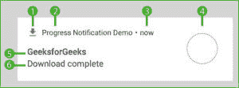
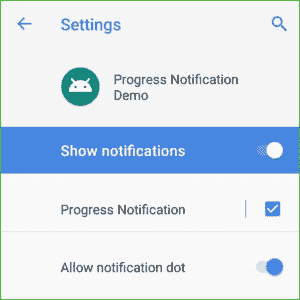

# Kotlin 中的安卓进度通知

> 原文:[https://www . geesforgeks . org/Android-progress-notifications-in-kot Lin/](https://www.geeksforgeeks.org/android-progress-notifications-in-kotlin/)

在本教程中，您将学习如何使用 Kotlin 为安卓系统创建基本的进度通知**(不确定进度指示器和固定工期进度指示器)**。

在开始之前，让我们先了解一下安卓系统中通知的组件。




1.  **小图标**–**必选**，可通过**设置小图标()进行设置。**
2.  **应用名称**–**由系统提供。**
3.  **时间戳**–**由系统提供，但可以被覆盖。**
4.  **大图标**–**可选**，可通过**设置大图标()进行设置。**
5.  **标题**–**可选**，可通过**设置内容标题()。**
6.  **文本**–**可选**，可通过**设置内容文本()进行设置。**

**注:通知渠道**
自安卓 8 版(安卓 Oreo)推出以来，现在强制将所有通知归类到名为“渠道”的类别中，这是为了方便用户，也是为了方便开发者。
下图为我们展示了一个名为“进度通知”的通知通道。




由于我们只需要创建一次通道，我们将使用一个助手类‘app . kt’来完成这项工作。

## App.kt

```kt
package com.gfg.progressnotificationdemo

import android.app.Application
import android.app.NotificationChannel
import android.app.NotificationManager
import android.os.Build

class App : Application(){
    val channelId = "Progress Notification" as String

    override fun onCreate(){
        super.onCreate()
        createNotificationChannels()
    }

    //Check if the Android version is greater than 8\. (Android Oreo)
    private fun createNotificationChannels(){
        if (Build.VERSION.SDK_INT >= Build.VERSION_CODES.O) {
            val channel1 = NotificationChannel(
                channelId,
                "Progress Notification",
    //IMPORTANCE_HIGH = shows a notification as peek notification.
    //IMPORTANCE_LOW = shows the notification in the status bar.
                NotificationManager.IMPORTANCE_HIGH
            )
            channel1.description = "Progress Notification Channel"
            val manager = getSystemService(
                NotificationManager::class.java
            )
            manager.createNotificationChannel(channel1)
        }
    }
}
```


现在，在主活动中，我们将使用一个线程来调用通知。
T3】

## MainActivity.kt 公司

```kt
package com.gfg.progressnotificationdemo

import android.app.PendingIntent
import android.content.Intent
import android.os.Bundle
import android.os.SystemClock
import android.view.View
import androidx.appcompat.app.AppCompatActivity
import androidx.core.app.NotificationCompat
import androidx.core.app.NotificationManagerCompat
import com.gfg.progressnotificationdemo.R.drawable

class MainActivity : AppCompatActivity(){

    private lateinit var notificationManager: NotificationManagerCompat
    val channelId = "Progress Notification" as String

    override fun onCreate(savedInstanceState: Bundle?){
        super.onCreate(savedInstanceState)
        setContentView(R.layout.activity_main)

    //Create a Notification Manager
        notificationManager = NotificationManagerCompat.from(this)

    }

    //Start() is called when the buttons is pressed.
    public fun start(view: View){

        val intent = Intent(this, MainActivity::class.java).apply{
            flags = Intent.FLAG_ACTIVITY_NEW_TASK or 
            Intent.FLAG_ACTIVITY_CLEAR_TASK
        }

        val pendingIntent: PendingIntent = PendingIntent.getActivity(
         this, 0, intent, 0)

    //Sets the maximum progress as 100
        val progressMax = 100
    //Creating a notification and setting its various attributes
        val notification =
            NotificationCompat.Builder(this, channelId)
                .setSmallIcon(drawable.ic_file_download)
                .setContentTitle("GeeksforGeeks")
                .setContentText("Downloading")
                .setPriority(NotificationCompat.PRIORITY_LOW)
                .setOngoing(true)
                .setOnlyAlertOnce(true)
                .setProgress(progressMax, 0, true)
                .setContentIntent(pendingIntent)
                .setAutoCancel(true)

    //Initial Alert
        notificationManager.notify(1, notification.build())

        Thread(Runnable{
            SystemClock.sleep(2000)
            var progress = 0
            while (progress <= progressMax) {
                SystemClock.sleep(
                    1000
                )
                progress += 20
    //Use this to make it a Fixed-duration progress indicator notification

    //notification.setContentText(progress.toString()+"%")
    //.setProgress(progressMax, progress, false)

    //notificationManager.notify(1, notification.build())
            }

            notification.setContentText("Download complete")
                .setProgress(0, 0, false)
                .setOngoing(false)
            notificationManager.notify(1, notification.build())
        }).start()
    }
}
```

## Activity Main.xml

布局由一个按钮组成。

```kt
<?xml version="1.0" encoding="utf-8"?>
<androidx.constraintlayout.widget.ConstraintLayout 
    xmlns:android="http://schemas.android.com/apk/res/android"
    xmlns:app="http://schemas.android.com/apk/res-auto"
    xmlns:tools="http://schemas.android.com/tools"
    android:layout_width="match_parent"
    android:layout_height="match_parent"
    tools:context=".MainActivity"
    android:orientation="vertical">

    <Button
        android:layout_width="wrap_content"
        android:layout_height="75dp"
        android:onClick="start"
        android:text="Show Notification"
        android:textSize="22sp"
        app:layout_constraintBottom_toBottomOf="parent"
        app:layout_constraintEnd_toEndOf="parent"
        app:layout_constraintStart_toStartOf="parent"
        app:layout_constraintTop_toTopOf="parent" />

</androidx.constraintlayout.widget.ConstraintLayout>
```


## 输出:

*   固定工期进度指标:(在 MainActivity.kt 第 67 行注释中添加代码后)
    
    
*   不确定进度指标:
    
    
*   下载后:
    
    

**这就是使用 Kotlin 在安卓系统中给通知添加进度指示器是多么简单容易。**