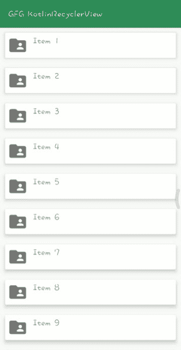

# 科特林 Android 回收服务

> 原文:[https://www . geeksforgeeks . org/Android-recycle view-in-kot Lin/](https://www.geeksforgeeks.org/android-recyclerview-in-kotlin/)

在本文中，您将了解如何使用**科特林**在安卓系统中实现**回收视图**。在继续之前，让我们了解一下 RecyclerView。回收视图是列表视图的高级版本，性能有所提高。当您有一长串要显示的项目时，您可以使用回收视图。它能够重用自己的视图。在回收视图中，当**视图**退出屏幕或者用户看不到它时，它不会破坏它，它会重用这些视图。此功能有助于降低功耗，并为应用程序提供更高的响应能力。现在让我们看看如何使用 Kotlin 实现 RecyclerView。



### 逐步实施

**第一步:创建新项目**

在安卓工作室的欢迎界面，点击**新建项目**。如果您已经打开了一个项目，**转到文件>新建>新项目。**然后选择一个项目模板窗口，选择**清空活动**，点击**下一步**。在名称字段中输入您的应用名称。从语言下拉菜单中选择**科特林**。

**步骤 2:添加依赖关系**

转到**应用程序<梯度脚本<梯度构建(模块:应用程序**)并添加以下依赖项。

```kt
dependencies{
  // for adding recyclerview
  implementation 'androidx.recyclerview:recyclerview:1.2.0'

  // for adding cardview
  implementation 'androidx.cardview:cardview:1.0.0'
}
```

**第三步:转到 activity_main.xml，添加如下代码**

将回收视图添加到 **activity_main.xml** 您可以从设计部分的拖放中添加它，也可以通过编写回收视图的一些初始字符来手动添加它，然后集成开发环境会为您提供回收视图的建议，然后选择回收视图，它会自动将其添加到您的布局文件中。

## 可扩展标记语言

```kt
<?xml version="1.0" encoding="utf-8"?>
<LinearLayout 
    xmlns:android="http://schemas.android.com/apk/res/android"
    xmlns:tools="http://schemas.android.com/tools"
    android:layout_width="match_parent"
    android:layout_height="match_parent"
    android:orientation="vertical"
    tools:context=".MainActivity">

    <androidx.recyclerview.widget.RecyclerView
        android:id="@+id/recyclerview"
        android:layout_width="match_parent"
        android:layout_height="match_parent"
        tools:itemCount="5"
        tools:listitem="@layout/card_view_design" />

</LinearLayout>
```

**第 4 步:** **新建布局资源文件**

现在创建一个新的布局资源文件，用于设计我们的**卡片视图**布局。转到 **app > res >布局>右键单击布局>** **新建>布局资源文件**并将该文件命名为 **card_view_design** 并添加下面提供的代码。在该文件中，您可以设计布局以将其显示在 RecyclerView 中。

## 可扩展标记语言

```kt
<?xml version="1.0" encoding="utf-8"?>
<androidx.cardview.widget.CardView 
    xmlns:android="http://schemas.android.com/apk/res/android"
    xmlns:app="http://schemas.android.com/apk/res-auto"
    android:layout_width="match_parent"
    android:layout_height="50dp"
    android:layout_margin="10dp"
    app:cardElevation="6dp">

    <LinearLayout
        android:layout_width="match_parent"
        android:layout_height="wrap_content"
        android:orientation="horizontal"
        android:padding="5dp">

        <ImageView
            android:id="@+id/imageview"
            android:layout_width="40dp"
            android:layout_height="40dp" />

        <TextView
            android:id="@+id/textView"
            android:layout_width="wrap_content"
            android:layout_height="wrap_content"
            android:layout_marginStart="10dp"
            android:layout_marginLeft="15dp"
            android:text="Item"
            android:textSize="20sp"
            android:textStyle="bold" />

    </LinearLayout>

</androidx.cardview.widget.CardView>
```