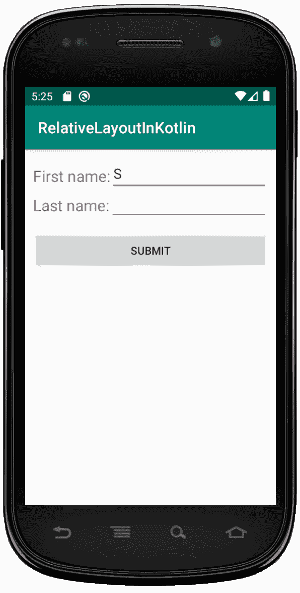

# Kotlin 中的安卓 relative layout

> 原文:[https://www . geeksforgeeks . org/Android-relative layout-in-kot Lin/](https://www.geeksforgeeks.org/android-relativelayout-in-kotlin/)

安卓 **RelativeLayout** 是 ViewGroup 子类，用于指定子视图元素相对于彼此的位置，如(B 右边的 A)或相对于父视图元素的位置(固定在父视图元素的顶部)。

我们必须使用 RelativeLayout 来设计用户界面，并保持我们的层次结构平坦，因为它提高了应用程序的性能，而不是使用 LinearLayout。

## 在相对布局中定位视图的重要属性

我们知道，我们需要定义子视图或视图组相对于其他元素或相对于父视图的位置。如果有人忘记指定子视图的位置，默认位置是左上角。

| XML 属性 | 描述 |
| --- | --- |
| 布局 _alignParentLeft | 它被设置为“真”以匹配视图的左边缘和父视图的左边缘。 |
| layout_alignParentRight | 它被设置为“真”以匹配视图的右边缘和父视图的右边缘。 |
| 布局 _ 对齐按钮 | 它被设置为“真”以匹配视图的上边缘和父视图的上边缘。 |
| layout _ alignparentbottom | 它被设置为“真”以匹配视图的下边缘和父视图的下边缘。 |
| 布局 _ 对齐英尺 | 它接受另一个同级视图 id，并将视图对齐到指定视图 id 的左侧 |
| 布局 _ 对齐灯 | 它接受另一个同级视图 id，并将视图对齐到指定视图 id 的右侧。 |
| 布局 _ 对齐开始 | 它接受另一个同级视图 id，并将视图与指定视图 id 的开头对齐。 |
| layout_alignEnd | 它接受另一个同级视图 id，并将视图与指定视图 id 的末尾对齐。 |
| 布局 _ 中心透明 | 当设置为“真”时，视图将与父视图的中心对齐。 |
| 布局 _ 中心水平 | 当设置为“真”时，视图将在其父视图中水平居中对齐。 |
| 布局 _ 中心垂直 | 当设置为“真”时，视图将在其父视图中垂直居中对齐。 |
| 布局 _toLeftOf | 它接受另一个同级视图 id，并将视图放在指定视图 id 的左侧。 |
| layout _ torightof-配置图 | 它接受另一个同级视图 id，并将视图放在指定视图 id 的右侧。 |
| layout_toStartOf | 它接受另一个同级视图 id，并将视图放在指定视图 id 的开头。 |
| 布局 _toEndOf | 它接受另一个同级视图 id，并将视图放在指定视图 id 的末尾。 |
| 布局 _ 上图 | 它接受另一个同级视图 id，并将视图放在指定视图 id 的上方。 |
| 布局 _ 下方 | 它接受另一个同级视图 id，并将视图放在指定视图 id 的下面。 |

## 如何在 XML 文件中声明 RelativeLayout？

首先，我们应该使用下面的代码在布局文件中声明 RelativeLayout。

```
<RelativeLayout xmlns:android="http://schemas.android.com/apk/res/android"
    android:layout_width="match_parent"
    android:layout_height="match_parent"
    android:paddingLeft="10dp"
    android:paddingRight="10dp">

    // Add other view or ViewGroup here
</RelativeLayout>
```

## activity_main.xml 文件中的 RelativeLayout

下面是 xml 文件中 RelativeLayout 的代码。

```
<?xml version="1.0" encoding="utf-8"?>
<RelativeLayout xmlns:android="http://schemas.android.com/apk/res/android"
    android:layout_width="match_parent"
    android:layout_height="match_parent"
    android:paddingLeft="10dp"
    android:paddingRight="10dp">

    <TextView
        android:id="@+id/textView1"
        android:layout_width="wrap_content"
        android:layout_height="wrap_content"
        android:layout_alignParentLeft="true"
        android:text="First name:"
        android:layout_marginTop="20dp"
        android:textSize="20dp"/>

    <EditText
        android:id="@+id/editText1"
        android:layout_width="match_parent"
        android:layout_height="wrap_content"
        android:layout_toRightOf="@id/textView1"
        android:layout_marginTop="8dp"/>

    <TextView
        android:id="@+id/textView2"
        android:layout_width="wrap_content"
        android:layout_height="wrap_content"
        android:layout_alignParentLeft="true"
        android:layout_below="@+id/textView1"
        android:layout_marginTop="10dp"
        android:text="Last name:"
        android:textSize="20dp"/>

    <EditText
        android:id="@+id/editText2"
        android:layout_width="match_parent"
        android:layout_height="wrap_content"
        android:layout_centerHorizontal="true"
        android:layout_toRightOf="@id/textView2"
        android:layout_marginTop="45dp"/>

    <Button
        android:id="@+id/btn4"
        android:layout_width="match_parent"
        android:layout_height="wrap_content"
        android:layout_centerHorizontal="true"
        android:layout_below="@id/textView2"
        android:layout_marginTop="20dp"
        android:text="Submit" />

</RelativeLayout>
```

## MainActivity.kt 文件

当我们创建了布局之后，我们需要从我们的活动 **onCreate()** 回调方法中加载 XML 布局资源，并使用 findViewById 从 XML 中访问 UI 元素。

```
package com.geeksforgeeks.myfirstKotlinapp

import androidx.appcompat.app.AppCompatActivity
import android.os.Bundle

class MainActivity : AppCompatActivity() {

    override fun onCreate(savedInstanceState: Bundle?) {
        super.onCreate(savedInstanceState)
        setContentView(R.layout.activity_main)

        // below access the UI elements

    }
}
```

## 相对视频输出:

我们可以使用安卓虚拟设备(AVD)运行应用程序，以获得上述代码的输出。
