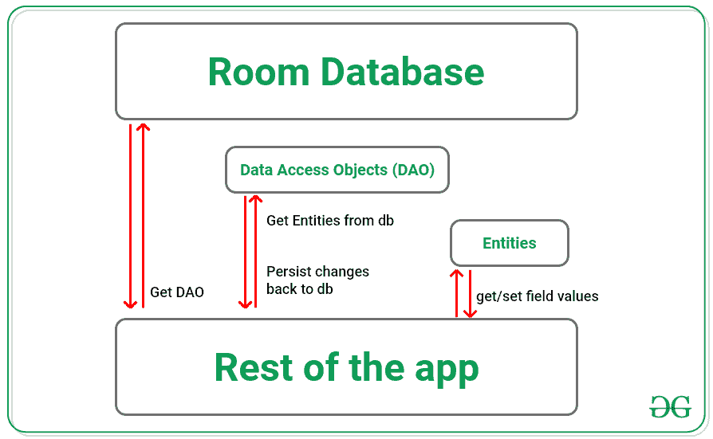

# 科特林安卓房间持久化库

> 原文:[https://www . geesforgeks . org/Android-room-persistence-library-in-kot Lin/](https://www.geeksforgeeks.org/android-room-persistence-library-in-kotlin/)

安卓房间持久性库是[安卓 Jetpack](https://www.geeksforgeeks.org/introduction-to-android-jetpack/) 提供的一套库之一，帮助开发者遵循最佳实践，同时消除样板代码，减少碎片。在安卓应用中，我们经常需要存储结构化数据，将这些数据保存在本地总是一个好主意。这样，如果我们的应用程序崩溃或重新启动，数据就不会丢失，并且可以在以后检索数据。尤其是当我们需要向用户显示一些相关信息时，即使没有网络，这些信息也需要存在，将数据保存到应用程序中非常方便。

### 使用房间持久性库的优势

房间持久性库被用作 SQLite 上的抽象层，用于更健壮的数据库访问。与 SQLite APIs 相比，使用这个库有几个优势，其中最突出的是以更自然的方式轻松使用 SQLite。

*   Room 具有对 SQL 查询进行编译时验证的出色功能，减少了运行时错误和崩溃的机会。
*   房间可以返回实时数据，即在提取数据后，在数据库中得到反映的自动即时更新。
*   因为作为用户，Room 是一个对象关系映射库，所以不需要将数据转换成 Java/Kotlin 对象，反之亦然。As Room 在内部将数据库对象映射到 Java 对象。
*   Room 可以方便地使用注释来代替冗余和样板代码部分。
*   Room 的另一个惊人的特性是，在这里，整个数据库模式都可以在不改变代码的情况下进行更改。或者从头开始。
*   Room 与 RxJava、Kotlin Coroutines、LifecycleObserver 等有很好的集成。

既然我们已经了解了这个库的惊人特性，那就让我们深入研究一下。

### 房间的组成

房间有三个主要组件，即数据库、实体(如表)和数据访问对象。现在让我们逐一讨论它们。

**数据库**

在 Room 中，一个用@Database 注释的*抽象*类在 SQLite 数据库上提供了一个抽象层。Room 的这个组件是应用程序中持久化的关系数据的主要访问资源。服务于此目的的类必须是抽象的，包括与数据库关联的实体列表，包含一个没有参数的抽象方法，返回类型与用@Dao 注释的接口相同。例如，下面的代码片段显示了一个名为*的注释类，它继承自 *RoomDatabase* 。*

```kt
@Database(entities = [ToDoModel::class], version = 1)
abstract class AppDatabase : RoomDatabase() {
    abstract fun toDoDao(): ToDoDao

    // Code Lines
}
```

**实体**

实体只不过是一个将数据库表的列表示为数据字段的类。这个类用@Entity 注释进行了注释。类中的所有字段都必须是可访问的，即要么是公共的，要么是用 getter/setter 方法。还必须有一个构造函数来创建入口实例。在 Kotlin 中，最好的方法是使用一个数据类，该类提供构造函数、getter 和 setter 方法，这些方法都是内在实现的。从 SQL 的知识可知，每个实体类必须至少有一个主键。为此，该特定字段可以用@PrimaryKey 注释来定义单个字段主键，或者在有多个主键的情况下，可以使用多个字段的@Entity 注释的属性。如果我们不想保留这些字段，我们也可以用@忽略注释来注释这些字段。这里我们有一个待办事项模型类作为例子，它包含变量标题、描述和一个 id，该 id 是自动生成的并充当主键。

```kt
@Entity
data class ToDoModel (
        var title: String,
        var description: String,
        // autoGenrate -attribute to
        // automatically assign primary keys.
        @PrimaryKey(autoGenerate = true)    
        var id: Long = 0
)
```

**数据访问对象**

如上所述，Room 允许开发人员以更加健壮和自然的方式使用 SQL 查询。当我们看到这一切发生的时候。Dao 是一个用@Dao 注释进行注释的接口，它拥有我们在使用中需要的所有 SQL 查询。这是使用各种注释完成的，如@插入、@更新、@查询、@删除等。这就像魔术一样减少了样板文件——使得添加或删除查询变得非常容易。它作为一个应用编程接口提供对数据库的访问。这些方法是在调用它们的线程上执行的，因此我们必须确保它们不是使用主(用户界面)线程调用的。如果我们需要处理多个实体，我们不需要将不同的方法从一个 Dao 复制到另一个 Dao，因为它也支持继承。为此，只需创建一个通用的 BaseDao <t>类，并在那里定义各种@Insert、@Update 和@Delete 方法。下面是一个简单的 Dao 接口，具有插入、更新和查询方法。</t>

```kt
@Dao
interface ToDoDao {
    @Insert()
    suspend fun insertTask(toDoModel: ToDoModel): Long

    @Update(onConflict = OnConflictStrategy.REPLACE)
    suspend fun updateTask(toDoModel: ToDoModel): Int

    @Query("SELECT * FROM ToDoModel WHERE isDone == 0")
    fun getTask(): LiveData<List<ToDoModel>>

    @Query("DELETE FROM ToDoModel WHERE id=:uid")
    fun deleteTask(uid: Long)
}
```

### 房间图书馆建筑

在浏览了房间图书馆的各个组成部分后，我们对每个组成部分是如何单独工作的以及它们的作用有了一个概念。在此基础上，我们有了代表它们功能的插图。我们可以看到我们获取的 Room Database 实例是用来访问 Dao 的，Dao 反过来拥有所有的查询功能和对实体的控制。通过使用这些实体来获取和设置数据，正如在 Dao 中通过查询所提到的，数据是持久化的。



房间持久性图书馆架构

### 在应用程序中使用房间数据库的实现和设置

完整项目请参考本文:[如何使用 MVVM 和房间数据库构建一个杂货安卓应用？](https://www.geeksforgeeks.org/how-to-build-a-grocery-android-app-using-mvvm-and-room-database/)