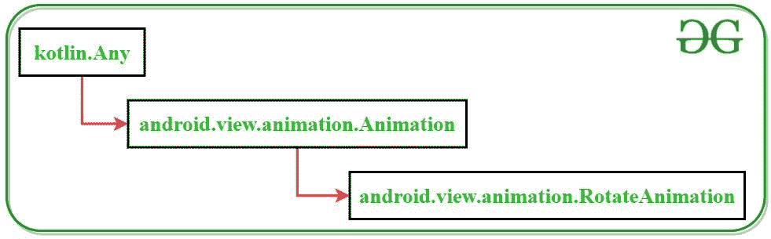

# Kotlin 中的安卓旋转动画

> 原文:[https://www . geesforgeks . org/Android-rotate-动画-in-kotlin/](https://www.geeksforgeeks.org/android-rotate-animations-in-kotlin/)

**旋转动画**是[安卓](https://www.geeksforgeeks.org/introduction-to-android-development/)中控制物体旋转的一种特殊动画。开发人员通常使用这些类型的动画向用户展示应用程序中发生的变化，如加载内容、处理数据等。通过使用旋转动画效果，对象可以在活动的 X-Y 平面上旋转，并且它允许顺时针和逆时针方向的旋转。


#### Kotlin 中 RotateAnimation 类的类层次结构



#### 定义对象旋转的 XML 属性

<figure class="table">

| XML 属性 | 描述 |
| --- | --- |
| android:pivotX | 定义对象围绕其旋转的点的 X 坐标 |
| Android:pivot(旋转) | 定义对象围绕其旋转的点的 Y 坐标 |
| 安卓:从度 | 物体的旋转从这个几何角度开始 |
| 安卓:toDegrees | 物体的旋转以这个几何角度结束 |
| 安卓:持续时间 | 用于以毫秒为单位定义动画的持续时间 |
| android:启动偏移 | 用于以毫秒为单位延迟动画时间 |

</figure>

#### 方法

这个例子演示了在图像文件中实现顺时针和逆时针旋转动画的步骤。将使用 [ImageView](https://www.geeksforgeeks.org/imageview-in-kotlin/) 在活动中添加一个图像文件。

> **注意:**步骤在 Android Studio 版本上执行

**第一步:创建新项目**

1.  单击文件，然后单击新建= >新建项目。
2.  选择语言作为 Kotlin。
3.  根据您的需要选择最小的软件开发工具包。

**第二步:修改 activity_main.xml 文件**

下面是 **activity_main.xml** 文件的代码，用于在一个活动中添加一个 TextView、ImageView 和两个按钮。

**文件名:activity_main.xml**

## 可扩展标记语言

```
<?xml version="1.0" encoding="utf-8"?>
<androidx.constraintlayout.widget.ConstraintLayout
    xmlns:android="http://schemas.android.com/apk/res/android"
    xmlns:app="http://schemas.android.com/apk/res-auto"
    xmlns:tools="http://schemas.android.com/tools"
    android:layout_width="match_parent"
    android:layout_height="match_parent"
    android:background="#168BC34A"
    tools:context=".MainActivity" >

    <TextView
        android:id="@+id/textView"
        android:layout_width="wrap_content"
        android:layout_height="wrap_content"
        android:fontFamily="@font/roboto"
        android:text="@string/heading"
        android:textAlignment="center"
        android:textColor="@android:color/holo_green_dark"
        android:textSize="36sp"
        android:textStyle="bold"
        app:layout_constraintBottom_toBottomOf="parent"
        app:layout_constraintEnd_toEndOf="parent"
        app:layout_constraintStart_toStartOf="parent"
        app:layout_constraintTop_toTopOf="parent"
        app:layout_constraintVertical_bias="0.050000012" />

    <ImageView
        android:id="@+id/imageView"
        android:layout_width="243dp"
        android:layout_height="241dp"
        app:layout_constraintBottom_toBottomOf="parent"
        app:layout_constraintEnd_toEndOf="parent"
        app:layout_constraintStart_toStartOf="parent"
        app:layout_constraintTop_toBottomOf="@+id/textView"
        app:layout_constraintVertical_bias="0.19999999"
        app:srcCompat="@drawable/logo" />

    <Button
        android:id="@+id/clk_rotate_button"
        android:layout_width="wrap_content"
        android:layout_height="wrap_content"
        android:background="#AB4CAF50"
        android:fontFamily="@font/roboto"
        android:text="@string/clk_rotate_button_text"
        android:textSize="14sp"
        android:textStyle="bold"
        app:layout_constraintBottom_toBottomOf="parent"
        app:layout_constraintEnd_toEndOf="parent"
        app:layout_constraintHorizontal_bias="0.12"
        app:layout_constraintStart_toStartOf="parent"
        app:layout_constraintTop_toBottomOf="@+id/imageView"
        app:layout_constraintVertical_bias="0.7" />

    <Button
        android:id="@+id/anticlk_rotate_button"
        android:layout_width="wrap_content"
        android:layout_height="wrap_content"
        android:background="#AB4CAF50"
        android:fontFamily="@font/roboto"
        android:text="@string/anticlk_rotate_button_text"
        android:textStyle="bold"
        app:layout_constraintBottom_toBottomOf="parent"
        app:layout_constraintEnd_toEndOf="parent"
        app:layout_constraintHorizontal_bias="0.78"
        app:layout_constraintStart_toEndOf="@+id/clk_rotate_button"
        app:layout_constraintTop_toBottomOf="@+id/imageView"
        app:layout_constraintVertical_bias="0.7" />
</androidx.constraintlayout.widget.ConstraintLayout>
```

**第三步:定义图像顺时针和逆时针旋转的 XML 文件**
在应用程序的 **res** 文件夹中创建新目录，并将其命名为 **anim** 。在该目录下创建 2 **动画资源文件**，即顺时针旋转和逆时针旋转。这两个文件是保存动画细节的 XML 文件。下面是这两个文件的代码。

**文件名:rotate _ 顺时针. xml**

## 可扩展标记语言

```
<?xml version="1.0" encoding="utf-8"?>
<set xmlns:android="http://schemas.android.com/apk/res/android">

    <rotate
        android:pivotX = "50%"
        android:pivotY = "50%"
        android:fromDegrees = "0"
        android:toDegrees = "360"
        android:duration = "2500"/>

</set>
```

**文件名:rotate _ 逆时针. xml**

## 可扩展标记语言

```
<?xml version="1.0" encoding="utf-8"?>
<set xmlns:android="http://schemas.android.com/apk/res/android">

    <rotate
        android:pivotX = "50%"
        android:pivotY = "50%"
        android:fromDegrees = "360"
        android:toDegrees = "0"
        android:duration = "2500"/>

</set>
```

**第四步:修改 MainActivity.kt 文件**
下面是 **MainActivity.kt** 文件的代码，根据用户点击的按钮在 ImageView 小部件上加载并启动动画。

文件名:MainActivity.kt

## Java 语言(一种计算机语言，尤用于创建网站)

```
package com.example.androidrotateanimation

import android.os.Bundle
import android.view.animation.AnimationUtils
import android.widget.Button
import android.widget.ImageView
import androidx.appcompat.app.AppCompatActivity

class MainActivity : AppCompatActivity() {

    override fun onCreate(savedInstanceState: Bundle?) {
        super.onCreate(savedInstanceState)
        setContentView(R.layout.activity_main)

        // assigning id of button which rotates
        // the image in clockwise direction
        val clk_button: Button = findViewById(R.id.clk_rotate_button)

        // assigning id of button which rotates
        // the image in anti-clockwise direction
        val anticlk_button: Button = findViewById(R.id.anticlk_rotate_button)

        // assiging id of imageview
        // which is to be rotated
        val image: ImageView = findViewById(R.id.imageView)

        // actions to be performed when
        // "rotate clockwise" button is clicked
        clk_button.setOnClickListener()
        {

            // loading the animation of
            // rotate_clockwise.xml file into a variable
            val clk_rotate = AnimationUtils.loadAnimation(
                this,
                R.anim.rotate_clockwise
            )

            // assigning that animation to
            // the image and start animation
            image.startAnimation(clk_rotate)
        }

        // actions to be performed when
        // "rotate anticlockwise" button is clicked
        anticlk_button.setOnClickListener()
        {

            // loading the animation of
            // rotate_anticlockwise.xml file into a variable
            val anticlk_rotate = AnimationUtils.loadAnimation(
                this,
                R.anim.rotate_anticlockwise
            )

            // assigning that animation to
            // the image and start animation
            image.startAnimation(anticlk_rotate)
        }
    }
}
```

**第五步:修改字符串. xml 文件**
活动中使用的所有字符串都列在这个文件中。

strings.xml

```
 <resources>
    <string name="app_name">Android Rotate Animation</string>
    <string name="heading">Rotate Animation in Android</string>
    <string name="clk_rotate_button_text">Rotate Clockwise</string>
    <string name="anticlk_rotate_button_text">Rotate Anticlokwise</string>
</resources> 
```