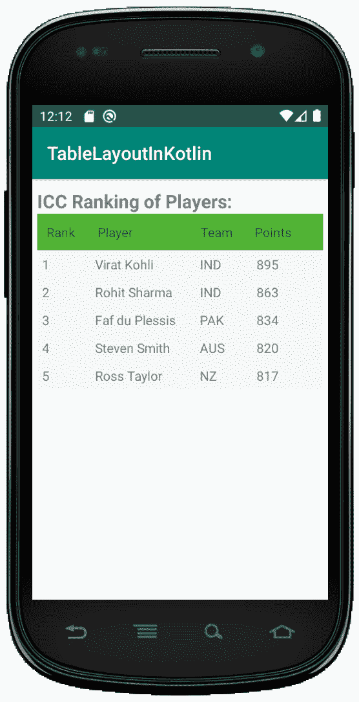

# 科特林 Android 平板布局

> 哎哎哎::1230【https://www . geeksforgeeks . org/Android-table layout-in-kot Lin/

安卓 **TableLayout** 是一个视图组子类，用于以行和列的形式显示子视图元素。它会将所有子元素排列成行和列，并且在行、列或单元格之间不显示任何边框线。

TableLayout 的工作方式几乎和 HTML 表格相似，它包含的列和包含最多单元格的行一样多。

## 如何声明 TableLayout 和 TableRow？

可以使用如下所示的<表格布局>来定义**表格布局**:

```
<TableLayout xmlns:android="http://schemas.android.com/apk/res/android"
    android:layout_width="match_parent"
    android:layout_height="match_parent"
    android:layout_marginTop="10dp"
    android:paddingLeft="5dp"
    android:paddingRight="5dp">

    // Add Table rows here
</TableLayout>
```

和**表格行**可以使用

```
<TableRow android:background="#51B435" android:padding="10dp">
        <TextView
            android:layout_width="wrap_content"
            android:layout_height="wrap_content"
            android:layout_weight="1"
            android:text="Rank" />
</TableRow>
```

## activity_main.xml 文件

在这个文件中，我们声明了 TableLayout，并开始在 TableRow 的帮助下添加表行。我们正在创建玩家排名表，其中我们定义了四列排名，姓名，国家和积分。

该表的代码是:

```
<?xml version="1.0" encoding="utf-8"?>
<TableLayout xmlns:android="http://schemas.android.com/apk/res/android"
    android:layout_width="match_parent"
    android:layout_height="match_parent"
    android:layout_marginTop="10dp"
    android:paddingLeft="5dp"
    android:paddingRight="5dp">

    <TextView
        android:id="@+id/txt"
        android:layout_width="wrap_content"
        android:layout_height="wrap_content"
        android:text="ICC Ranking of Players:"
        android:textSize = "20dp"
        android:textStyle="bold">

    </TextView>

    <TableRow android:background="#51B435" android:padding="10dp">
        <TextView
            android:layout_width="wrap_content"
            android:layout_height="wrap_content"
            android:layout_weight="1"
            android:text="Rank" />
        <TextView
            android:layout_width="wrap_content"
            android:layout_height="wrap_content"
            android:layout_weight="1"
            android:text="Player" />
        <TextView
            android:layout_width="wrap_content"
            android:layout_height="wrap_content"
            android:layout_weight="1"
            android:text="Team" />
        <TextView
            android:layout_width="wrap_content"
            android:layout_height="wrap_content"
            android:layout_weight="1"
            android:text="Points" />
    </TableRow>
    <TableRow android:background="#F0F7F7" android:padding="5dp">
        <TextView
            android:layout_width="wrap_content"
            android:layout_height="wrap_content"
            android:layout_weight="1"
            android:text="1" />
        <TextView
            android:layout_width="wrap_content"
            android:layout_height="wrap_content"
            android:layout_weight="1"
            android:text="Virat Kohli" />
        <TextView
            android:layout_width="wrap_content"
            android:layout_height="wrap_content"
            android:layout_weight="1"
            android:text="IND" />
        <TextView
            android:layout_width="wrap_content"
            android:layout_height="wrap_content"
            android:layout_weight="1"
            android:text="895" />
    </TableRow>
    <TableRow android:background="#F0F7F7" android:padding="5dp">
        <TextView
            android:layout_width="wrap_content"
            android:layout_height="wrap_content"
            android:layout_weight="1"
            android:text="2" />
        <TextView
            android:layout_width="wrap_content"
            android:layout_height="wrap_content"
            android:layout_weight="1"
            android:text="Rohit Sharma" />
        <TextView
            android:layout_width="wrap_content"
            android:layout_height="wrap_content"
            android:layout_weight="1"
            android:text="IND" />
        <TextView
            android:layout_width="wrap_content"
            android:layout_height="wrap_content"
            android:layout_weight="1"
            android:text="863" />

    </TableRow>
    <TableRow android:background="#F0F7F7" android:padding="5dp">
        <TextView
            android:layout_width="wrap_content"
            android:layout_height="wrap_content"
            android:layout_weight="1"
            android:text="3" />
        <TextView
            android:layout_width="wrap_content"
            android:layout_height="wrap_content"
            android:layout_weight="1"
            android:text="Faf du Plessis" />
        <TextView
            android:layout_width="wrap_content"
            android:layout_height="wrap_content"
            android:layout_weight="1"
            android:text="PAK" />
        <TextView
            android:layout_width="wrap_content"
            android:layout_height="wrap_content"
            android:layout_weight="1"
            android:text="834" />

    </TableRow>

    <TableRow android:background="#F0F7F7" android:padding="5dp">
        <TextView
            android:layout_width="wrap_content"
            android:layout_height="wrap_content"
            android:layout_weight="1"
            android:text="4" />
        <TextView
            android:layout_width="wrap_content"
            android:layout_height="wrap_content"
            android:layout_weight="1"
            android:text="Steven Smith" />
        <TextView
            android:layout_width="wrap_content"
            android:layout_height="wrap_content"
            android:layout_weight="1"
            android:text="AUS" />
        <TextView
            android:layout_width="wrap_content"
            android:layout_height="wrap_content"
            android:layout_weight="1"
            android:text="820" />

    </TableRow>

    <TableRow android:background="#F0F7F7" android:padding="5dp">
        <TextView
            android:layout_width="wrap_content"
            android:layout_height="wrap_content"
            android:layout_weight="1"
            android:text="5" />
        <TextView
            android:layout_width="wrap_content"
            android:layout_height="wrap_content"
            android:layout_weight="1"
            android:text="Ross Taylor" />
        <TextView
            android:layout_width="wrap_content"
            android:layout_height="wrap_content"
            android:layout_weight="1"
            android:text="NZ" />
        <TextView
            android:layout_width="wrap_content"
            android:layout_height="wrap_content"
            android:layout_weight="1"
            android:text="817" />

    </TableRow>

</TableLayout>
```

## MainActivity.kt 公司

创建布局后，我们需要从活动 **onCreate()** 回调方法中加载 XML 布局资源，并使用**findwiewbyid**从 XML 中访问 UI 元素。

```
package com.geeksforgeeks.myfirstKotlinapp

import androidx.appcompat.app.AppCompatActivity
import android.os.Bundle

class MainActivity : AppCompatActivity() {

    override fun onCreate(savedInstanceState: Bundle?) {
        super.onCreate(savedInstanceState)
        setContentView(R.layout.activity_main)
        // finding the UI elements

    }
}
```

## 表格布局输出:

我们需要使用安卓虚拟设备(AVD)运行才能看到输出。
