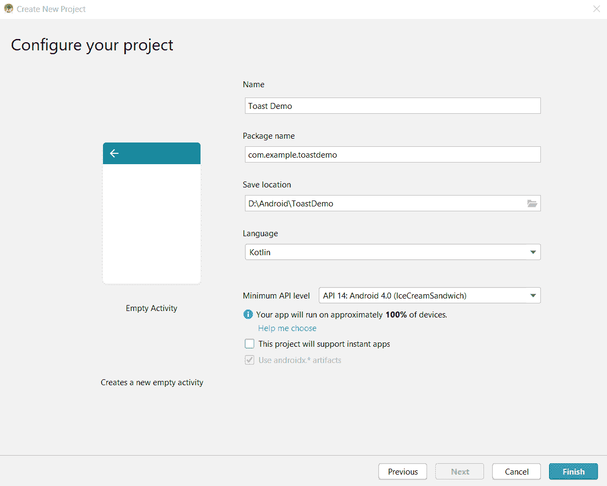

# 科特林安卓吐司

> 原文:[https://www.geeksforgeeks.org/android-toast-in-kotlin/](https://www.geeksforgeeks.org/android-toast-in-kotlin/)

A **Toast** 是安卓屏幕上短时间间隔显示的短提醒信息。安卓**吐司**是一个简短的弹出通知，当我们在应用程序中执行任何操作时，它用来显示信息。

在本教程中，我们将不仅仅通过创建一个蹩脚的祝酒词来限制我们，还将做一些用户交互的事情。

首先，我们将创建一个带有编辑文本(用于输入的文本框)和按钮的屏幕。

**第一步**:在 Android studio 中创建一个活动为空的项目，并确保已经用 Kotlin 语言配置了该应用。



项目配置窗口

**第二步**:在左侧的项目窗口中，导航至 *app > res >布局> activity_main.xml* 。

这里我们要添加一个编辑文本和一个按钮。因此，删除 XML 中的你好词文本视图。

现在您的 XML 应该是这样的。

```
<?xml version="1.0" encoding="utf-8"?>
<androidx.constraintlayout.widget.ConstraintLayout xmlns:android="http://schemas.android.com/apk/res/android"
    xmlns:app="http://schemas.android.com/apk/res-auto"
    xmlns:tools="http://schemas.android.com/tools"
    android:layout_width="match_parent"
    android:layout_height="match_parent"
    tools:context=".MainActivity">
</androidx.constraintlayout.widget.ConstraintLayout>
```

**第三步**:在布局中添加编辑文本。

```
<EditText
    android:id="@+id/messageEditText"
    android:layout_width="0dp"
    android:layout_height="wrap_content"
    android:ems="10"
    android:hint="Message to toast"
    app:layout_constraintHorizontal_bias="0.5"
    app:layout_constraintStart_toStartOf="parent"
    app:layout_constraintTop_toTopOf="parent" />
```

**第四步**:在布局中增加一个按钮。

```
<Button
   android:id="@+id/toastButton"
   android:layout_width="0dp"
   android:layout_height="wrap_content"
   android:text="Toast"
   app:layout_constraintEnd_toEndOf="parent"
   app:layout_constraintHorizontal_bias="0.5"
   app:layout_constraintTop_toTopOf="parent" />
```

**第五步**:让我们对齐编辑文本和按钮。为了使组件在安卓系统中链接，我们有一些限制。我们将在编辑文本的末尾保留按钮，在按钮的开头保留编辑文本。

为按钮添加以下内容。

```
app:layout_constraintStart_toEndOf="@+id/messageEditText"
```

为编辑文本添加以下内容。

```
app:layout_constraintEnd_toStartOf="@+id/toastButton"
```

保存 XML 文件并检查设计选项卡(您可以在编辑器选项卡的左下角找到它)。您可以看到编辑文本和按钮在应用程序的顶部对齐。

**第六步**:现在，我们去 Kotlin 类文件，让祝酒发生。
打开*app>Java>com . example . to stdemo>main activity . kt*中的 Kotlin 类文件

将以下方法添加到类中。

```
fun toastMessage(view: View)
{
    val messageEditText = findViewById<EditText>(R.id.messageEditText)
    val message = messageEditText.text.toString()
    var toast = Toast.makeText(this, message, Toast.LENGTH_LONG)
    toast.show()
}
```

这里，messageEditText 是我们在步骤 3 的布局文件中创建的 EditText 的对象。为了获取编辑文本的内容，我们使用了文本属性，并将其存储在变量消息中。
祝酒——这是本教程的核心，

```
var toast = Toast.makeText(this, message, Toast.LENGTH_LONG)
```

> *Toast.makeText()* 创建一个 Toast 并返回，我们应该传递三个参数:
> 
> *   *上下文*–要使用的上下文。通常是您的{ @ link Android . app . application }或{@link android.app.Activity}对象。
> *   *文本*–要显示的文本。可以是格式化文本。
> *   *持续时间*–显示消息的时间。{@link #LENGTH_SHORT}或{@link #LENGTH_LONG}

我们将吐司存储在变量*吐司*中。为了使吐司可见，我们应该称*吐司.显示()*

**第 7 步**:现在我们将在按钮上添加一个点击事件监听器，并使其在点击/点击按钮时调用我们的**演讲会()**方法。
返回 **activity_main.xml** 布局文件，并将该属性添加到按钮中

```
android : onClick = "toastMessage"
```

这就是我们所做的一切！现在运行应用程序，在编辑文本中输入消息，然后单击按钮。它会为信息干杯。

**点击吐司按钮后隐藏安卓软键盘**查看清晰的吐司

```
fun hideKeyboard(activity: Activity)
{
    val view = activity.findViewById<View>(android.R.id.content) if (view != null)
    {
        val imm = activity.getSystemService(Context.INPUT_METHOD_SERVICE)
                as InputMethodManager
            imm.hideSoftInputFromWindow(view.windowToken, 0)
    }
}
```

将上述方法添加到主活动类中，并在制作吐司之前调用它。

## 作为模拟器运行:


烤面包演示