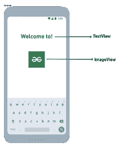
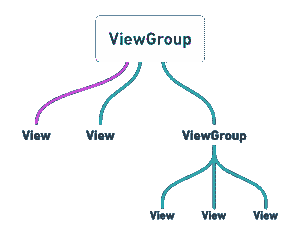

# Android UI 布局

> 原文:[https://www.geeksforgeeks.org/android-ui-layouts/](https://www.geeksforgeeks.org/android-ui-layouts/)

安卓**布局**用于定义用户界面，该界面包含将出现在安卓应用程序或活动屏幕上的用户界面控件或小部件。通常，每个应用程序都是视图和视图组的组合。正如我们所知，一个安卓应用程序包含大量的活动，我们可以说每个活动都是应用程序的一个页面。因此，每个活动包含多个用户界面组件，这些组件是视图和视图组的实例。布局中的所有元素都是使用**视图**和**视图组**对象的层次结构构建的。

### 视角

A **视图**定义为用于创建交互 UI 组件的用户界面，如[文本视图](https://www.geeksforgeeks.org/textview-widget-in-android-using-java-with-examples/)、[图像视图](https://www.geeksforgeeks.org/imageview-in-android-with-example/)、[编辑文本](https://www.geeksforgeeks.org/edittext-widget-in-android-using-java-with-examples/)、[单选按钮](https://www.geeksforgeeks.org/radiobutton-in-kotlin/)等。，并负责事件处理和绘图。它们通常被称为小部件。

[](https://whimsical.com/91txrXHfW3NywpD1qBXxhD)

视角

一个**视图组**作为保存其他视图或视图组的布局和布局参数的基类，并定义布局属性。它们通常被称为布局。

[](https://whimsical.com/viewgroup-8fCbKjTrG2rG76qpCiANX3)

view group-检视群组

安卓框架将允许我们以两种方式使用用户界面元素或小部件:

*   在 XML 文件中使用用户界面元素
*   在 Kotlin 文件中动态创建元素

### 安卓布局的类型

*   **安卓线性布局:**线性布局是一个视图组子类，用于根据方向属性，在特定方向上水平或垂直逐个提供子视图元素。
*   **安卓相对布局:** RelativeLayout 是 ViewGroup 子类，用于指定子视图元素相对于彼此的位置，如(B 右边的 A)或相对于父视图的位置(固定在父视图的顶部)。
*   **安卓约束布局:** ConstraintLayout 是 ViewGroup 子类，用于指定每个子视图的布局约束相对于其他视图的位置。约束布局类似于相对布局，但功能更强。
*   **Android Frame Layout:**Frame Layout 是一个 ViewGroup 子类，用于指定它所包含的 View 元素在彼此顶部的位置，以便在 Frame Layout 内部只显示单个 View。
*   **安卓表格布局:**表格布局是 ViewGroup 子类，用于以行和列的形式显示子视图元素。
*   **安卓网络视图:**网络视图是一个浏览器，用于显示我们活动布局中的网页。
*   **安卓 ListView:** ListView 是一个视图组，用于在单个列中显示可滚动的项目列表。
*   **安卓网格视图:** GridView 是一个视图组，用于在行和列的网格视图中显示可滚动的项目列表。

### 在 XML 文件中使用用户界面元素

在这里，我们可以创建一个类似于网页的布局。XML 布局文件至少包含一个根元素，在其中可以添加其他布局元素或小部件来构建视图层次结构。以下是示例:

## 可扩展标记语言

```
<?xml version="1.0" encoding="utf-8"?>
<LinearLayout
    xmlns:android="http:// schemas.android.com/apk/res/android"
    xmlns:tools="http:// schemas.android.com/tools"
    android:orientation="vertical"
    android:layout_width="match_parent"
    android:layout_height="match_parent"
    tools:context=".MainActivity">

    <!--EditText with id editText-->
    <EditText
        android:id="@+id/editText"
        android:layout_width="match_parent"
        android:layout_height="wrap_content"
        android:layout_margin="16dp"
        android:hint="Input"
        android:inputType="text"/>

    <!--Button with id showInput-->
    <Button
        android:id="@+id/showInput"
        android:layout_width="wrap_content"
        android:layout_height="wrap_content"
        android:layout_gravity="center_horizontal"
        android:text="show"
        android:backgroundTint="@color/colorPrimary"
        android:textColor="@android:color/white"/>

</LinearLayout>
```

### 从活动中加载 XML 布局文件及其元素

创建布局后，我们需要从活动 **onCreate()** 回调方法中加载 XML 布局资源，并使用**findwiewbyid**从 XML 中访问 UI 元素。

```
override fun onCreate(savedInstanceState: Bundle?) {
        super.onCreate(savedInstanceState)
        setContentView(R.layout.activity_main)

        // finding the button
        val showButton = findViewById<Button>(R.id.showInput)

        // finding the edit text
        val editText = findViewById<EditText>(R.id.editText)
```

在这里，我们可以观察上面的代码，发现我们正在使用 **R.layout.activity_main** 形式的 **setContentView** 方法调用我们的布局。通常，在我们活动的启动过程中，android 框架会调用 *onCreate()* 回调方法来获取活动所需的布局。

### 在柯特林文件中动态创建元素

我们可以在运行时通过在 Kotlin 文件中以编程方式使用自定义视图和视图组对象来创建或实例化用户界面元素或小部件。下面是使用线性布局以编程方式在活动中保存编辑文本和按钮来创建布局的示例。

## 我的锅

```
import android.os.Bundle
import android.widget.Button
import android.widget.EditText
import android.widget.LinearLayout
import android.widget.Toast
import androidx.appcompat.app.AppCompatActivity

class MainActivity : AppCompatActivity() {

    override fun onCreate(savedInstanceState: Bundle?) {
        super.onCreate(savedInstanceState)
        setContentView(R.layout.activity_main)

        // create the button
        val showButton = Button(this)
        showButton.setText("Submit")

        // create the editText
        val editText = EditText(this)

        val linearLayout = findViewById<LinearLayout>(R.id.l_layout)
        linearLayout.addView(editText)
        linearLayout.addView(showButton)

        // Setting On Click Listener
        showButton.setOnClickListener
        {
            // Getting the user input
            val text = editText.text

            // Showing the user input
            Toast.makeText(this, text, Toast.LENGTH_SHORT).show()
        }
    }
}
```

### 布局的不同属性

<figure class="table">

| 

XML 属性

 | 

描述

 |
| --- | --- |
| android:id | 用于指定视图的 id。 |
| 安卓:布局 _ 宽度 | 用于声明布局中视图和视图组元素的宽度。 |
| 安卓:布局 _ 高度 | 用于声明布局中视图和视图组元素的高度。 |
| android:layout_marginLeft | 用于声明视图和视图组元素左侧使用的额外空间。 |
| 安卓:布局 _ 边框灯 | 用于声明视图和视图组元素右侧使用的额外空间。 |
| 安卓:布局 _marginTop | 用于声明视图和视图组元素顶部使用的额外空间。 |
| android:layout_marginBottom | 用于声明视图和视图组元素底部使用的额外空间。 |
| 安卓:布局 _ 重力 | 用于定义子视图在布局中的位置。 |

</figure>