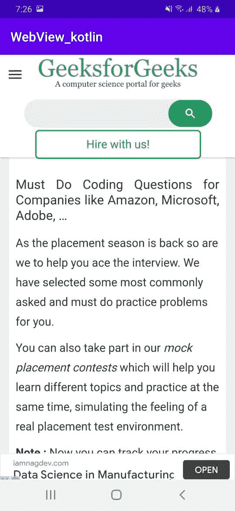

# 科特林安卓 WebView

> 原文:[https://www.geeksforgeeks.org/android-webview-in-kotlin/](https://www.geeksforgeeks.org/android-webview-in-kotlin/)

网络视图是一种用于在应用程序中显示网页的视图。它用于将应用程序转化为网络应用程序。在本文中，让我们使用柯特林在[安卓应用程序](https://www.geeksforgeeks.org/introduction-to-android-development/)中显示[https://www.geeksforgeeks.org/](https://www.geeksforgeeks.org/)。

> **注:**用 Java 实现安卓 WebView 请参考[如何用 Java 在安卓使用 WebView](https://www.geeksforgeeks.org/how-to-use-webview-in-android/)。

**等级体系**

```
kotlin.Any
     android.view.View
          android.view.ViewGroup
               android.widget.AbsoluteLayout
                    android.webkit.WebView
```

**接近**T2】

**第一步:创建新项目**

要在安卓工作室创建新项目，请参考[如何在安卓工作室创建/启动新项目。](https://www.geeksforgeeks.org/android-how-to-create-start-a-new-project-in-android-studio/)

**第二步:修改 activity_main.xml**

这用于设置应用程序的前端，我们将网络视图放在前端。

## 可扩展标记语言

```
<androidx.constraintlayout.widget.ConstraintLayout
    xmlns:android="http://schemas.android.com/apk/res/android"
    xmlns:tools="http://schemas.android.com/tools"
    android:layout_width="match_parent"
    android:layout_height="match_parent"
    tools:context=".MainActivity">

    <!-- Place Web-view on the Screen -->
    <WebView
        android:id="@+id/webView"
        android:layout_width="match_parent"
        android:layout_height="match_parent"></WebView>

</androidx.constraintlayout.widget.ConstraintLayout>
```

**第三步:修改 MainActivity.kt**

这是应用程序的后端，这里我们给视图赋值，给视图操作。

## 我的锅

```
package com.example.webview_kotlin

import android.os.Bundle
import android.webkit.WebViewClient
import androidx.appcompat.app.AppCompatActivity
import kotlinx.android.synthetic.main.activity_main.*

class MainActivity : AppCompatActivity() {

    override fun onCreate(savedInstanceState: Bundle?) {
        super.onCreate(savedInstanceState)
        setContentView(R.layout.activity_main)

        // WebViewClient allows you to handle
        // onPageFinished and override Url loading.
        webView.webViewClient = WebViewClient()

        // this will load the url of the website
        webView.loadUrl("https://www.geeksforgeeks.org/")

        // this will enable the javascript settings
        webView.settings.javaScriptEnabled = true

        // if you want to enable zoom feature
        webView.settings.setSupportZoom(true)
    }

    // if you press Back button this code will work
    override fun onBackPressed() {
        // if your webview can go back it will go back
        if (webView.canGoBack())
            webView.goBack()
        // if your webview cannot go back
        // it will exit the application
        else
            super.onBackPressed()
    }
}
```

**第四步:修改 AndroidManifest.xml**

在 **AndroidManifest.xml** 中，需要包含以下权限，才能访问互联网。

## 可扩展标记语言

```
<?xml version="1.0" encoding="utf-8"?>

<manifest xmlns:android="http://schemas.android.com/apk/res/android"
   package="com.example.webview_kotlin">

    <!-- Give permission for app to access the Internet -->
    <uses-permission android:name="android.permission.INTERNET"/>

   <application
       android:allowBackup="true"
       android:icon="@mipmap/ic_launcher"
       android:label="@string/app_name"
       android:roundIcon="@mipmap/ic_launcher_round"
       android:supportsRtl="true"
       android:theme="@style/AppTheme">
       <activity android:name=".MainActivity">
           <intent-filter>
               <action android:name="android.intent.action.MAIN" />
               <category android:name="android.intent.category.LAUNCHER" />
           </intent-filter>
       </activity>
   </application>
</manifest>
```

**输出:在仿真器**
上运行

当我们在模拟器或安卓智能手机上运行应用程序时，我们可以将此视为我们的输出。记得在你的设备上打开互联网。

