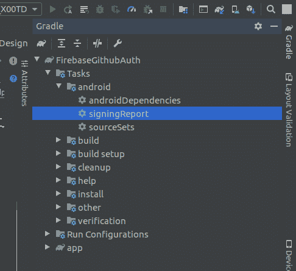
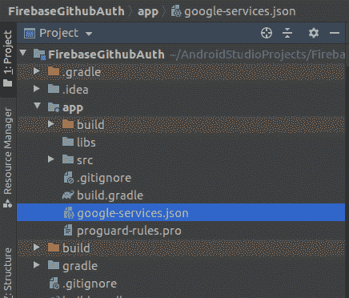
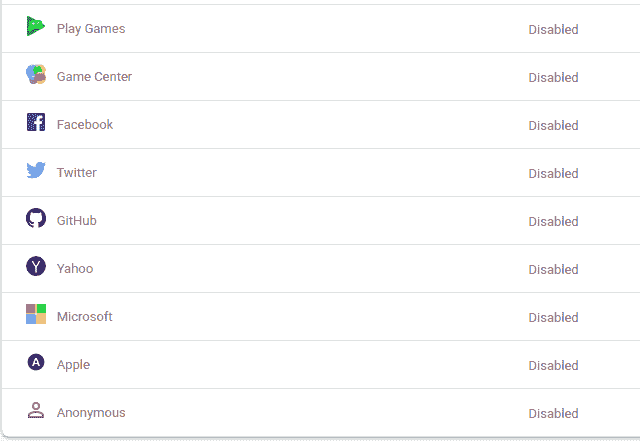
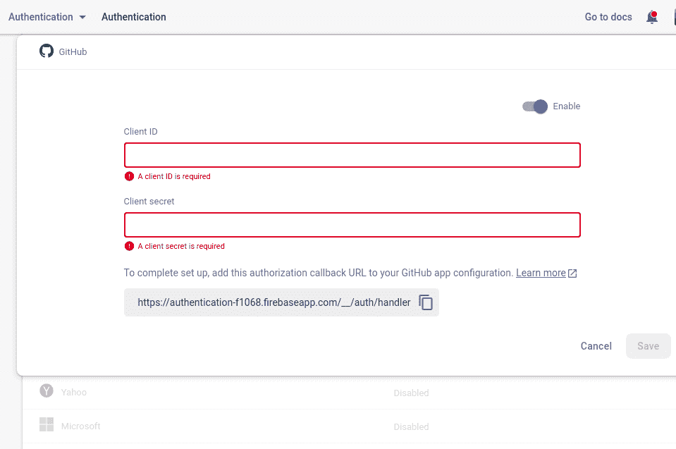
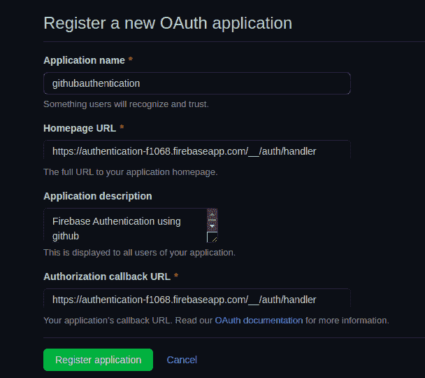
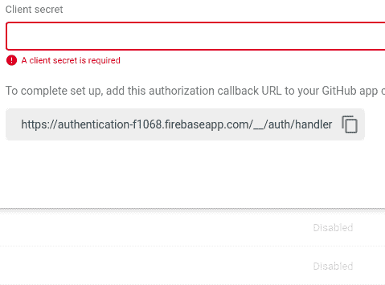
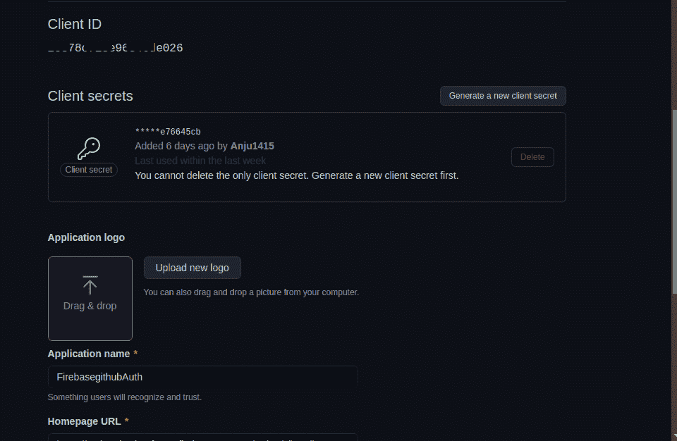
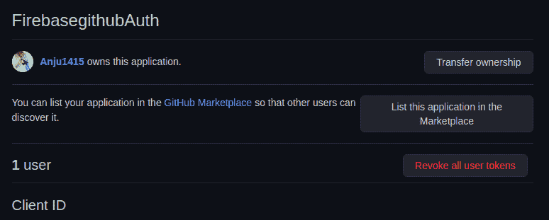

# 在安卓上使用 GitHub 进行认证

> 原文:[https://www . geeksforgeeks . org/authenticate-use-github-on-Android/](https://www.geeksforgeeks.org/authenticate-using-github-on-android/)

**GitHub** 是超越**6500 万开发者**共同塑造软件未来的地方。贡献给开源社区，管理你的 Git 存储库，像专业人员一样检查代码，跟踪 bug 和特性，为你的 CI/CD 和 DevOps 工作流提供动力，并在提交代码之前保护代码。因此，在本文中，我们将讨论如何在 Firebase 用户身份验证的帮助下，在您的安卓应用程序中使用 GitHub 进行身份验证。

### 使用 GitHub 进行 Firebase 用户身份验证的步骤

**第一步:**

在 android studio 中创建一个新项目，或者打开任何现有的项目，通过 GitHub 验证用户，并将 firebase 添加到该 android 应用程序中。[在应用程序中添加 firebase 的步骤](https://www.geeksforgeeks.org/adding-firebase-to-android-app/)。

**第二步:**

转到您的 [firebase 控制台](http://console.firebase.google.com/)，转到您的应用程序，然后导航到**项目设置**，并在连接的应用程序中添加类似指纹的 SHA1。要找到 SHA1，请前往 Gradle(安卓工作室窗口右侧)>您的应用程序名称>任务>安卓>登录端口(双击)



> **注意:**一定要在应用中添加 **google-services.json** ，否则从 firebase 控制台的项目设置中下载，添加到应用中。



**第三步:**

回到 firebase 控制台中的应用程序，导航到**认证**(firebase 的左侧面板)，然后转到**登录方法**启用 GitHub 提供程序。



启用 GitHub



要求客户标识和客户机密

现在，我们需要 C **留置权 ID** 和 C **留置权**秘密。为此[在 GitHub 上将你的应用](https://github.com/settings/applications/new)注册为开发者应用，并获取你的应用的 OAuth 2.0 客户端 ID 和客户端密码。要注册您的应用程序，请写下应用程序名称，输入应用程序的网站主页网址(这里我给出的网址与授权回调网址相同)，并简要提供应用程序描述。



在 GitHub 上注册应用程序

> **注意:**在 GitHub 应用程序的配置中，确保您的 Firebase OAuth 重定向 URI(例如 my-app-12345.firebaseapp.com/__/auth/handler)在应用程序的设置页面中设置为您的授权回调 URL。

获取您的**可授权回拨网址**，如下图所示。



获取您的授权回拨网址

点击**注册申请**。您将获得您的**客户端标识**和**客户端密码**，将其复制并粘贴到 firebase 控制台中(在登录方法下)，然后单击保存按钮启用 GitHub。



**第四步:**

回到安卓工作室。通过使用 [Firebase Android BoM](https://firebase.google.com/docs/android/learn-more#bom) ，在您的 **build.gradle** (模块:您的应用程序名称. app)中添加 Firebase 身份验证 Android 库的依赖项。

> 依赖项{
> 
> //导入 Firebase 平台的 BoM
> 
> 实现平台(' com . Google . firebase:firebase-BOM:28 . 0 . 1 ')
> 
> //声明 Firebase 身份验证库的依赖关系
> 
> //使用 BoM 时，不要在 Firebase 库依赖项中指定版本
> 
> 实现' com . Google . firebase:firebase-auth-ktx '
> 
> }

通过使用 **Firebase 安卓 BoM** ，您的应用将始终使用 **Firebase 安卓库**的**兼容版本**。

**步骤 5:使用主活动文件**

导航到 **app > res >布局> activity_main.xml** 并将下面的代码添加到该文件中。下面是**activity _ main . XML**文件的代码。

## 可扩展标记语言

```kt
<?xml version="1.0" encoding="utf-8"?>
<androidx.constraintlayout.widget.ConstraintLayout 
    xmlns:android="http://schemas.android.com/apk/res/android"
    xmlns:app="http://schemas.android.com/apk/res-auto"
    xmlns:tools="http://schemas.android.com/tools"
    android:layout_width="match_parent"
    android:layout_height="match_parent"
    tools:context=".MainActivity">

    <LinearLayout
        android:layout_width="match_parent"
        android:layout_height="wrap_content"
        android:layout_margin="10dp"
        android:orientation="vertical"
        app:layout_constraintBottom_toBottomOf="parent"
        app:layout_constraintEnd_toEndOf="parent"
        app:layout_constraintStart_toStartOf="parent"
        app:layout_constraintTop_toTopOf="parent">

        <EditText
            android:id="@+id/githubId"
            android:layout_width="match_parent"
            android:layout_height="wrap_content"
            android:layout_marginTop="100dp"
            android:hint="Enter your email associated with github"
            android:padding="8dp"
            android:textAlignment="center"
            android:textColor="#118016" />

        <Button
            android:id="@+id/github_login_btn"
            android:layout_width="match_parent"
            android:layout_height="wrap_content"
            android:layout_marginStart="100dp"
            android:layout_marginTop="10dp"
            android:layout_marginEnd="100dp"
            android:layout_marginBottom="100dp"
            android:backgroundTint="#fff"
            android:drawableLeft="@drawable/github"
            android:drawablePadding="8dp"
            android:padding="8dp"
            android:text="@string/log_in_with_github"
            android:textAllCaps="false"
            android:textColor="#000" />
    </LinearLayout>

</androidx.constraintlayout.widget.ConstraintLayout>
```

转到 **MainActivity.kt** 文件，参考以下代码。下面是 **MainActivity.kt** 文件的代码。代码中添加了注释，以更详细地理解代码。

## 我的锅

```kt
import android.content.Intent
import android.os.Bundle
import android.text.TextUtils
import android.widget.Button
import android.widget.EditText
import android.widget.Toast
import androidx.appcompat.app.AppCompatActivity
import com.google.android.gms.tasks.OnFailureListener
import com.google.android.gms.tasks.OnSuccessListener
import com.google.android.gms.tasks.Task
import com.google.firebase.auth.AuthResult
import com.google.firebase.auth.FirebaseAuth
import com.google.firebase.auth.FirebaseUser
import com.google.firebase.auth.OAuthProvider

class MainActivity : AppCompatActivity() {

    private lateinit var firebaseUser: FirebaseUser
    private lateinit var loginBtn: Button
    private lateinit var githubEdit: EditText

    // firebaseAuth variable to be initialized later
    private lateinit var auth: FirebaseAuth

    // an instance of an OAuthProvider using its Builder
      // with the provider ID github.com
    private val provider = OAuthProvider.newBuilder("github.com")

    override fun onCreate(savedInstanceState: Bundle?) {
        super.onCreate(savedInstanceState)
        setContentView(R.layout.activity_main)

        loginBtn = findViewById(R.id.github_login_btn)
        githubEdit = findViewById(R.id.githubId)

        // initializing auth
        auth = FirebaseAuth.getInstance() 

          // Target specific email with login hint.
        provider.addCustomParameter("login", githubEdit.text.toString())

        // Request read access to a user's email addresses.
        // This must be preconfigured in the app's API permissions.
        val scopes: ArrayList<String?> = object : ArrayList<String?>() {
            init {
                add("user:email")
            }
        }
        provider.scopes = scopes

        // call signInWithGithubProvider() method
          // after clicking login Button
        loginBtn.setOnClickListener {
            if (TextUtils.isEmpty(githubEdit.text.toString())) {
                Toast.makeText(this, "Enter your github id", Toast.LENGTH_LONG).show()
            } else {
                signInWithGithubProvider()
            }
        }
    }

    // To check if there is a pending result, call pendingAuthResult
    private fun signInWithGithubProvider() {

        // There's something already here! Finish the sign-in for your user.
        val pendingResultTask: Task<AuthResult>? = auth.pendingAuthResult
        if (pendingResultTask != null) {
            pendingResultTask
                    .addOnSuccessListener {
                        // User is signed in.
                        Toast.makeText(this, "User exist", Toast.LENGTH_LONG).show()
                    }
                    .addOnFailureListener {
                        // Handle failure.
                        Toast.makeText(this, "Error : $it", Toast.LENGTH_LONG).show()
                    }
        } else {

            auth.startActivityForSignInWithProvider( /* activity= */this, provider.build())
                    .addOnSuccessListener(
                            OnSuccessListener<AuthResult?> {
                                // User is signed in.
                                // retrieve the current user
                                firebaseUser = auth.currentUser!!

                                // navigate to HomePageActivity after successful login
                                val intent = Intent(this, HomePageActivity::class.java)

                                  // send github user name from MainActivity to HomePageActivity
                                intent.putExtra("githubUserName", firebaseUser.displayName)
                                this.startActivity(intent)
                                Toast.makeText(this, "Login Successfully", Toast.LENGTH_LONG).show()

                            })
                    .addOnFailureListener(
                            OnFailureListener {
                                // Handle failure.
                                Toast.makeText(this, "Error : $it", Toast.LENGTH_LONG).show()
                            })
        }

    }
}
```

**步骤 6:创建新的空活动**

参考本文[在安卓工作室](https://www.geeksforgeeks.org/how-to-create-constructor-getter-setter-methods-and-new-activity-in-android-studio-using-shortcuts/)新建活动，创建一个空活动。将活动命名为**主页活动。** 导航到 **app > res >布局>activity _ home _ page . XML**并将下面的代码添加到该文件中。下面是**activity _ home _ page . XML**文件的代码。

## 可扩展标记语言

```kt
<?xml version="1.0" encoding="utf-8"?>
<androidx.constraintlayout.widget.ConstraintLayout 
    xmlns:android="http://schemas.android.com/apk/res/android"
    xmlns:app="http://schemas.android.com/apk/res-auto"
    xmlns:tools="http://schemas.android.com/tools"
    android:layout_width="match_parent"
    android:layout_height="match_parent"
    tools:context=".HomePageActivity">

    <LinearLayout
        android:id="@+id/linearLayout"
        android:layout_width="match_parent"
        android:layout_height="wrap_content"
        android:layout_marginStart="10dp"
        android:layout_marginTop="10dp"
        android:layout_marginEnd="10dp"
        android:orientation="horizontal"
        app:layout_constraintEnd_toEndOf="parent"
        app:layout_constraintStart_toStartOf="parent"
        app:layout_constraintTop_toTopOf="parent">

        <TextView
            android:id="@+id/headerId"
            android:layout_width="wrap_content"
            android:layout_height="wrap_content"
            android:layout_marginTop="10dp"
            android:text="User Name :"
            android:textColor="#06590A"
            android:textSize="25sp"
            app:layout_constraintEnd_toEndOf="parent"
            app:layout_constraintStart_toStartOf="parent"
            app:layout_constraintTop_toTopOf="parent" />

        <TextView
            android:id="@+id/id"
            android:layout_width="match_parent"
            android:layout_height="wrap_content"
            android:layout_margin="10dp"
            android:layout_marginTop="10dp"
            android:hint="github Id"
            android:textAlignment="center"
            android:textSize="25sp"
            app:layout_constraintEnd_toEndOf="parent"
            app:layout_constraintStart_toStartOf="parent"
            app:layout_constraintTop_toTopOf="parent" />

    </LinearLayout>

    <Button
        android:id="@+id/logOut"
        android:layout_width="wrap_content"
        android:layout_height="wrap_content"
        android:layout_marginTop="456dp"
        android:layout_marginBottom="20dp"
        android:gravity="center"
        android:text="Logout"
        android:textColor="#fff"
        app:layout_constraintBottom_toBottomOf="parent"
        app:layout_constraintEnd_toEndOf="parent"
        app:layout_constraintStart_toStartOf="parent"
        app:layout_constraintTop_toBottomOf="@+id/linearLayout" />

</androidx.constraintlayout.widget.ConstraintLayout>
```

转到**HomePageActivity . kt**文件，参考以下代码。下面是**HomePageActivity . kt**文件的代码。

## 我的锅

```kt
import android.content.Intent
import androidx.appcompat.app.AppCompatActivity
import android.os.Bundle
import android.widget.Button
import android.widget.TextView

class HomePageActivity : AppCompatActivity() {

    var userName = ""

    private lateinit var githubUserName: TextView
    private lateinit var logoutBtn: Button

    override fun onCreate(savedInstanceState: Bundle?) {
        super.onCreate(savedInstanceState)
        setContentView(R.layout.activity_home_page)

        githubUserName = findViewById(R.id.id)
        logoutBtn = findViewById(R.id.logOut)
        userName = intent.getStringExtra("githubUserName")!!
        githubUserName.text = userName

        logoutBtn.setOnClickListener {
            val intent = Intent(this, MainActivity::class.java)
            this.startActivity(intent)
        }
    }
}
```

> **注意:**别忘了**撤销所有用户令牌**。当您的应用程序准备就绪并运行一次时，将显示此选项。或者你可以早点看到这个选项？



这是最后的输出。

**输出:**

<video class="wp-video-shortcode" id="video-617399-1" width="640" height="360" preload="metadata" controls=""><source type="video/mp4" src="https://media.geeksforgeeks.org/wp-content/uploads/20210528024150/githubAuthentication.mp4?_=1">[https://media.geeksforgeeks.org/wp-content/uploads/20210528024150/githubAuthentication.mp4](https://media.geeksforgeeks.org/wp-content/uploads/20210528024150/githubAuthentication.mp4)</video>