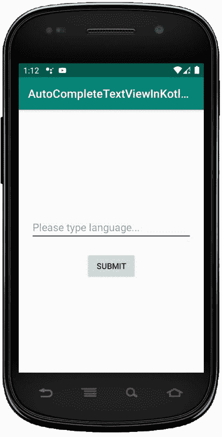
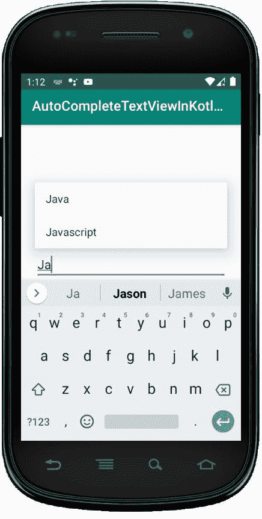

# 科特林的自复 text view

> 哎哎哎:# t0]https://www . geeksforgeeks . org/autocomputextview-in-kot Lin/

安卓**自动完成文本视图**是一个可编辑的文本视图，当用户开始输入文本时，它会显示一个建议列表。当用户开始键入时，会出现一个基于输入字符的下拉菜单，在阈值限制中定义，用户可以从列表中选择一个项目来替换文本。

自动完成文本视图是编辑文本类的一个子类，因此我们可以根据自己的需求轻松继承编辑文本的所有属性。

下拉列表将使用数据适配器获得，这些建议只有在输入阈值限制中定义的最小字符数后才会出现。**阈值限制**用于定义用户必须键入的最小字符数，以查看建议的下拉列表。

在 android 中，我们可以通过两种方式创建一个 AutoCompleteTextView 控件，要么在 XML 文件中手动创建，要么在 Activity 文件中以编程方式创建。

首先，我们按照以下步骤创建一个**新项目**:

1.  点击文件，然后**新建** = > **新项目**。
2.  之后加入 Kotlin 支持，点击下一步。
3.  根据方便选择最小 SDK，点击下一步按钮。
4.  然后选择**清空**活动= > **下一个** = > **完成**。

## 自动完成文本小部件的不同属性–

| XML 属性 | 描述 |
| --- | --- |
| android:id | 用于唯一标识控件。 |
| 安卓:重力 | 用于指定如何对齐文本，如左、右、中、上等。 |
| android:文本 | 用于设置文本。 |
| android:文本大小 | 用于设置文本的大小。 |
| android:textStyle | 用于将文本的样式设置为粗体、斜体。 |
| 安卓:背景 | 用于设置文本视图的背景颜色。 |
| 安卓:提示 | 用于在文本视图中设置显示提示文本。 |
| android:maxHeight | 用于设置文本视图的最大高度。 |
| android:最大宽度 | 用于设置文本视图的最大宽度。 |
| 安卓:填充 | 用于从左、右、上、下设置填充。 |

## 在 activity_main.xml 中添加自动完成文本视图

在这个文件中，我们将添加自动完成文本视图和按钮小部件，并设置它们的属性，以便可以在 kotlin 文件中访问它们。

```
<?xml version="1.0" encoding="utf-8"?>
<LinearLayout xmlns:android="http:// schemas.android.com/apk/res/android"
    android:orientation="vertical"
    android:layout_width="match_parent"
    android:layout_height="match_parent"
    android:id="@+id/linear_layout"
    android:gravity="center">

    <AutoCompleteTextView
        android:id="@+id/autoTextView"
        android:layout_width="match_parent"
        android:layout_height="wrap_content"
        android:layout_margin="20dp"
        android:hint="@string/hint"/>

    <Button
        android:id="@+id/btn"
        android:layout_width="wrap_content"
        android:layout_height="wrap_content"
        android:text="@string/submit"/>

</LinearLayout>
```

## 修改 strings.xml 文件以添加字符串数组

在这里，我们将指定活动的名称，并定义可以在活动的不同位置使用的其他字符串。另一件重要的事情是，我们将定义 **string_array** ，它包含**自动完成文本视图**的建议列表的项目。

```
<resources>
    <string name="app_name">AutoCompleteTextViewInKotlin</string>
    <string name="hint">Please type language...</string>
    <string name="submit">Submit</string>
    <string name="submitted_lang">Submitted language:</string>

    <string-array name="Languages">
        <item>Java</item>
        <item>Kotlin</item>
        <item>Swift</item>
        <item>Python</item>
        <item>Scala</item>
        <item>Perl</item>
        <item>Javascript</item>
        <item>Jquery</item>
    </string-array>

</resources>
```

## 访问 MainActivity.kt 文件中的自动完成文本视图

首先，我们声明一个变量*autoxtview*从 XML 布局中访问小部件。

```
val autotextView = findViewById<AutoCompleteTextView>(R.id.autoTextView)
```

然后，我们声明另一种变量语言，从 strings.xml 文件中获取字符串数组的项。

```
val languages = resources.getStringArray(R.array.Languages)
```

创建一个适配器，并使用

```
val adapter = ArrayAdapter(this,
       android.R.layout.simple_list_item_1, languages)
        autotextView.setAdapter(adapter)

```

我们熟悉前面文章中的进一步活动，如访问按钮和设置 OnClickListener 等。

```
package com.geeksforgeeks.myfirstkotlinapp

    import android.os.Bundle import android.view.View import androidx.appcompat.app.AppCompatActivity import android.widget.ArrayAdapter import android.widget.AutoCompleteTextView import android.widget.Button import android.widget.Toast

    class MainActivity : AppCompatActivity() {

    override fun onCreate(savedInstanceState: Bundle?)
    {
        super.onCreate(savedInstanceState)
            setContentView(R.layout.activity_main)

                val autotextView
            = findViewById<AutoCompleteTextView>(R.id.autoTextView)
            // Get the array of languages
            val languages
            = resources.getStringArray(R.array.Languages)
              // Create adapter and add in AutoCompleteTextView
              val adapter
            = ArrayAdapter(this,
                           android.R.layout.simple_list_item_1, languages)
                  autotextView.setAdapter(adapter)

                      val button
            = findViewById<Button>(R.id.btn) if (button != null)
        {
            button ?.setOnClickListener(View.OnClickListener {
                        val enteredText = getString(R.string.submitted_lang) + " " + autotextView.getText() Toast.makeText(this @MainActivity, enteredText, Toast.LENGTH_SHORT).show()
                    })
        }
    }
}
```

## AndroidManifest.xml 文件

```
<?xml version="1.0" encoding="utf-8"?>
<manifest xmlns:android="http:// schemas.android.com/apk/res/android"
package="com.geeksforgeeks.myfirstkotlinapp">

<application
    android:allowBackup="true"
    android:icon="@mipmap/ic_launcher"
    android:label="@string/app_name"
    android:roundIcon="@mipmap/ic_launcher_round"
    android:supportsRtl="true"
    android:theme="@style/AppTheme">
    <activity android:name=".MainActivity">
        <intent-filter>
            <action android:name="android.intent.action.MAIN" />

            <category android:name="android.intent.category.LAUNCHER" />
        </intent-filter>
    </activity>
</application>

</manifest>
```

## 作为模拟器运行:

