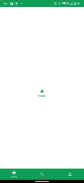
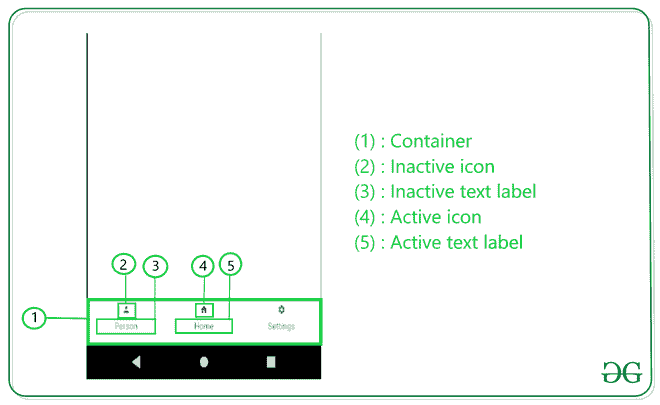
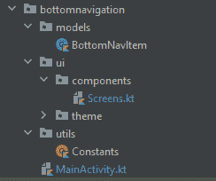

# 安卓 Jetpack 组合中的底部导航栏

> 原文:[https://www . geesforgeks . org/bottom-navigation-bar-in-Android-jet pack-compose/](https://www.geeksforgeeks.org/bottom-navigation-bar-in-android-jetpack-compose/)

我们都在这么多应用中见过 [BottomNavigationBar](https://www.geeksforgeeks.org/bottom-navigation-bar-in-android/) ，比如 Instagram、Quora。在本文中，我们将学习如何在 Jetpack Compose 中添加底部导航。下面是它的外观示例。



**为什么我们需要一个** **底部导航栏？**

*   它允许用户轻松切换到不同的活动/片段。
*   它让用户了解应用程序中可用的不同屏幕。
*   用户能够检查他们现在在哪个屏幕上。

**下面是底部导航栏的解剖图:**



**先决条件:**

*   [喷气背包作曲知识。](https://www.geeksforgeeks.org/basics-of-jetpack-compose-in-android/)
*   喷气背包中[脚手架的知识构成](https://www.geeksforgeeks.org/scaffold-in-android-using-jetpack-compose/)。
*   [知识组成导航。](https://www.geeksforgeeks.org/jetpack-compose-navigation-and-passing-data-in-android/)

### 逐步实施

**步骤 1:创建一个新项目(或在现有的合成项目中使用它)**

在安卓工作室加那利版本中创建新项目。参考本文:[如何用 Jetpack Compose 在 Android Studio Canary 版本中创建新项目？](https://www.geeksforgeeks.org/how-to-create-a-new-project-in-android-studio-canary-version-with-jetpack-compose/)



项目结构

**步骤 2:添加依赖关系**

打开[build . grade le(app)](https://www.geeksforgeeks.org/android-build-gradle/)，添加如下依赖项。

> 实现“androidx . navigation:navigation-compose:2 . 4 . 0-alpha 07”

**步骤 3:创建屏幕**

打开**屏幕。kt** 并创建三个屏幕，**主页，搜索，个人资料。**

**主屏幕:**

## 我的锅

```
@Composable
fun HomeScreen() {

    // Column Composable,
    Column(
        modifier = Modifier
            .fillMaxSize()
            .background(Color.White),
        // Parameters set to place the items in center
        horizontalAlignment = Alignment.CenterHorizontally,
        verticalArrangement = Arrangement.Center
    ) {
        // Icon Composable
        Icon(
            imageVector = Icons.Default.Home,
            contentDescription = "home",
            tint = Color(0xFF0F9D58)
        )
        // Text to Display the current Screen
        Text(text = "Home", color = Color.Black)
    }
}
```

**搜索屏幕:**

## 我的锅

```
@Composable
fun SearchScreen() {
    // Column Composable,
    Column(
        modifier = Modifier
            .fillMaxSize()
            .background(Color.White),
        // parameters set to place the items in center
        horizontalAlignment = Alignment.CenterHorizontally,
        verticalArrangement = Arrangement.Center
    ) {
        // Icon Composable
        Icon(
            imageVector = Icons.Default.Search,
            contentDescription = "search",
            tint = Color(0xFF0F9D58)
        )
        // Text to Display the current Screen
        Text(text = "Search", color = Color.Black)
    }
}
```

**轮廓绿色:**

## 我的锅

```
@Composable
fun ProfileScreen() {
    // Column Composable,
    Column(
        modifier = Modifier
            .fillMaxSize()
            .background(Color.White),
        // parameters set to place the items in center
        horizontalAlignment = Alignment.CenterHorizontally,
        verticalArrangement = Arrangement.Center
    ) {
        // Icon Composable
        Icon(
            imageVector = Icons.Default.Person,
            contentDescription = "Profile",
            tint = Color(0xFF0F9D58)
        )
        // Text to Display the current Screen
        Text(text = "Profile", color = Color.Black)
    }
}
```

**第 4 步:创建底部导航项目**

让我们创建一个[数据类](https://www.geeksforgeeks.org/kotlin-data-classes/)来保存与底部导航项目相关的数据，如标签、图标、路线。打开 models/ **BottomNavItem.kt** 并添加以下代码。

## 我的锅

```
import androidx.compose.ui.graphics.vector.ImageVector

data class BottomNavItem(
    val label: String,
    val icon: ImageVector,
    val route:String,
)
```