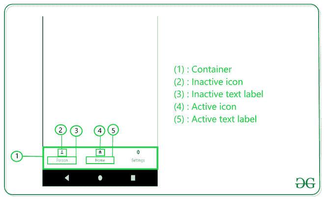

# 安卓中的底部导航栏

> 原文:[https://www . geesforgeks . org/bottom-navigation-bar-in-Android/](https://www.geeksforgeeks.org/bottom-navigation-bar-in-android/)

我们都遇到过有底部导航栏的应用程序。一些流行的例子包括 Instagram、WhatsApp 等*。*在本文中，让我们学习如何在安卓应用中实现这样一个功能性的底部导航栏。下面是底部导航栏示例的预览:


**为什么我们需要一个** **底部导航栏？**

*   它允许用户轻松切换到不同的活动/片段。
*   它让用户了解应用程序中可用的不同屏幕。
*   用户能够检查他们现在在哪个屏幕上。

**下面是底部导航栏的解剖图:**



### 创建底部导航栏的步骤

**第一步:新建安卓工作室项目**

在安卓工作室创建新项目请参考 [**【如何在安卓工作室创建/启动新项目】**](https://www.geeksforgeeks.org/android-how-to-create-start-a-new-project-in-android-studio/) 。

**第 2 步:将依赖项添加到 build.gradle(:app)文件中**

我们将使用安卓的材料设计库，因此我们需要将其导入[**build . gradle(:app)**](https://www.geeksforgeeks.org/android-build-gradle/)**文件**。**下面是我们需要添加的依赖项:**

> **实现' com . Google . Android . material:material:1 . 2 . 0 '**

****第三步:使用 activity_main.xml 文件****

**例如，创建一个带有 [**框架布局**](https://www.geeksforgeeks.org/android-framelayout-in-kotlin/) 和**底部导航栏**的基本应用程序。**框架布局**将包含 [**片段**](https://www.geeksforgeeks.org/introduction-fragments-android/) ，该片段将随着用户点击**底部导航栏**中的项目而改变。这就是 **activity_main.xml** 的样子:**

## **可扩展标记语言**

```kt
<?xml version="1.0" encoding="utf-8"?>
<androidx.constraintlayout.widget.ConstraintLayout
    xmlns:android="http://schemas.android.com/apk/res/android"
    xmlns:app="http://schemas.android.com/apk/res-auto"
    xmlns:tools="http://schemas.android.com/tools"
    android:layout_width="match_parent"
    android:layout_height="match_parent"
    tools:context=".MainActivity">

    <FrameLayout
        android:id="@+id/flFragment"
        android:layout_width="match_parent"
        android:layout_height="0dp"
        app:layout_constraintBottom_toTopOf="@+id/bottomNavigationView"
        app:layout_constraintEnd_toEndOf="parent"
        app:layout_constraintHorizontal_bias="0.5"
        app:layout_constraintStart_toStartOf="parent"
        app:layout_constraintTop_toTopOf="parent" />

    <com.google.android.material.bottomnavigation.BottomNavigationView
        android:id="@+id/bottomNavigationView"
        android:layout_width="match_parent"
        android:layout_height="75dp"
        app:layout_constraintBottom_toBottomOf="parent"
        app:layout_constraintEnd_toEndOf="parent"
        app:layout_constraintHorizontal_bias="0.5"
        app:layout_constraintStart_toStartOf="parent"
        app:menu="@menu/bottom_nav_menu"/>

</androidx.constraintlayout.widget.ConstraintLayout>
```

****步骤 4:为底部导航栏创建菜单****

**导航栏需要有一些使用 [**菜单**](https://www.geeksforgeeks.org/how-to-implement-options-menu-in-android/) 创建的项目。要创建**菜单**，首先通过点击 **app** - > **res** (右键)- > **新建** - > **安卓资源目录**创建**菜单**，在**资源类型** *中选择**菜单**。***

****

**创建**菜单资源文件**，点击**app**->**RES**->**菜单**(右键)- > **新建** - > **菜单资源文件**并命名为 **bottom_nav_menu** 。**

****

**现在，用户可以在 **bottom_nav_menu.xml** 文件中创建任意多个项目。用户还需要为每个项目创建一个图标。要创建图标，请单击**应用程序** - > **资源**->**(右键)- > **新建** - > **图像资源。******

********

****在打开的窗口中，用户可以随意命名图标，但是**不应该包含任何大写字母** *。*用户可以通过搜索选择自己想要的图标，完成后点击**下一步** - > **完成。******

********

****现在将这些项目添加到**底部的 _nav_menu.xml** 中。这是添加项目后的**底部 _nav_menu.xml** 文件的外观:****

## ****可扩展标记语言****

```kt
**<?xml version="1.0" encoding="utf-8"?>
<menu xmlns:android="http://schemas.android.com/apk/res/android">
    <item
        android:id="@+id/person"
        android:title="Person"
        android:icon="@drawable/ic_person_foreground"/>
    <item
        android:id="@+id/home"
        android:title="Home"
        android:icon="@drawable/ic_home_foreground"/>
    <item
        android:id="@+id/settings"
        android:title="Settings"
        android:icon="@drawable/ic_settings_foreground"/>
</menu>**
```

******第五步:改变动作栏样式******

****由于我们使用的是**谷歌的材质设计库**，我们需要改变动作栏的样式来使用同一个库，否则底部导航栏将是黑色的，其项目将不可见。要更改它，通过单击**应用程序** - > **res** - > **值**->**style . XML**导航至**style . XML，并将**样式**开始标记更改为:******