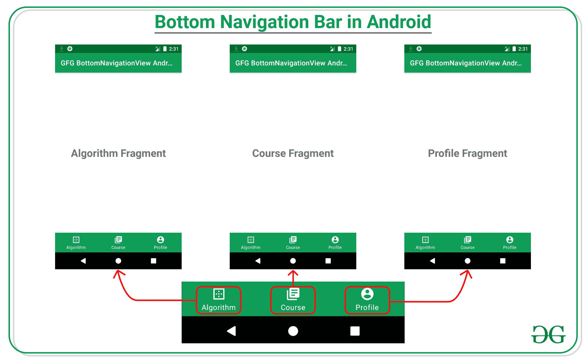

# Android 中的 botomnavigation view

> 哎哎哎:# t0]https://www . geeksforgeeks . org/bottomnavigation view-inand roid/

[**【bottom navigationview】**](https://developer.android.com/reference/com/google/android/material/bottomnavigation/BottomNavigationView)让用户只需轻轻一点，就能轻松探索和切换顶级视图。应该至少有 3 个顶级视图，最多有 5 个。如果目的地超过 5 个，则使用 [**导航抽屉**](https://material.io/components/navigation-drawer) 。当用户点击图标时，它将相应地改变顶层视图。在**音乐播放器**应用程序中，在**主页、专辑和收音机**之间切换，可以使用。 **Google plus** app 使用这个小部件在不同视图之间切换。 **Instagram** 使用**底部导航视图**在**提要、搜索、添加、喜欢和简介之间切换。**这就是**底部导航视图**的样子。



**底部导航视图**的一些优缺点是:

### **优势**

*   它是顶级目的地，可以从应用程序的任何地方访问。
*   它是一个材料设计组件。
*   易于使用和实施。

### **缺点**

*   它仅在我们只有三到五个目的地时使用。
*   只能用于手机和平板电脑。
*   文本标签的长度应该更短。
*   当用户 90%以上的时间都在同一个窗口的一个应用中时，就应该使用它。
*   配合**tableout**使用可能会给用户造成混淆。

### **接近**

*   在 [**build.gradle**](https://www.geeksforgeeks.org/android-build-gradle/) 文件中添加支持库，并在依赖项部分添加依赖项。该库具有用于底部导航视图的内置小部件，因此可以通过该库直接添加。

> **实现‘com . Google . Android . material:material:1 . 3 . 0-alpha 03’**

*   现在创建一个**新的安卓资源目录**。右键点击 **res** 文件夹，选择安卓资源目录。确保选择资源类型作为**菜单**。现在创建 **bottom_menu.xml** 文件并添加以下代码。在这个文件中，我们为**底部导航视图**添加了标题、id 和菜单图标。下面是**bottom _ menu . XML**文件的代码。

## 可扩展标记语言

```
<?xml version="1.0" encoding="utf-8"?>
<menu xmlns:android="http://schemas.android.com/apk/res/android">
    <item
        android:id="@+id/algorithm"
        android:title="Algorithm"
        android:icon="@drawable/ic_algorithm"/>
    <item
        android:id="@+id/course"
        android:title="Course"
        android:icon="@drawable/ic_course"/>
    <item
        android:id="@+id/profile"
        android:title="Profile"
        android:icon="@drawable/ic_account"/>
</menu>
```

*   通过右键单击 java 包创建一个**算法片段**，选择新建- > **片段(空白)**。
*   按照上述步骤进行**课程片段**和**逻辑片段**。
*   现在在 **AlgorithmFragment.xml** 文件中添加以下代码。此处布局中添加了一个[文本视图](https://www.geeksforgeeks.org/textview-widget-in-android-using-java-with-examples/)。
*   下面是**fragment _ algorithm**文件的代码。

## 可扩展标记语言

```
<?xml version="1.0" encoding="utf-8"?>
<androidx.constraintlayout.widget.ConstraintLayout
    xmlns:android="http://schemas.android.com/apk/res/android"
    xmlns:app="http://schemas.android.com/apk/res-auto"
    xmlns:tools="http://schemas.android.com/tools"
    android:layout_width="match_parent"
    android:layout_height="match_parent"
    tools:context=".Fragments.AlgorithmFragment"
    android:orientation="vertical">

    <TextView
        android:layout_width="wrap_content"
        android:layout_height="wrap_content"
        android:text="Algorithm"
        android:textSize="30sp"
        android:textStyle="bold"
        app:layout_constraintBottom_toBottomOf="parent"
        app:layout_constraintEnd_toEndOf="parent"
        app:layout_constraintStart_toStartOf="parent"
        app:layout_constraintTop_toTopOf="parent" />
</androidx.constraintlayout.widget.ConstraintLayout>
```

*   现在在 **CourseFragment.xml** 文件中添加以下代码。这里一个文本视图被添加到布局中。
*   下面是 **文件的代码。**

## 可扩展标记语言

```
<?xml version="1.0" encoding="utf-8"?>
<androidx.constraintlayout.widget.ConstraintLayout
    xmlns:android="http://schemas.android.com/apk/res/android"
    xmlns:app="http://schemas.android.com/apk/res-auto"
    xmlns:tools="http://schemas.android.com/tools"
    android:layout_width="match_parent"
    android:layout_height="match_parent"
    tools:context=".Fragments.AlgorithmFragment"
    android:orientation="vertical">

    <TextView
        android:layout_width="wrap_content"
        android:layout_height="wrap_content"
        android:text="Course"
        android:textSize="30sp"
        android:textStyle="bold"
        app:layout_constraintBottom_toBottomOf="parent"
        app:layout_constraintEnd_toEndOf="parent"
        app:layout_constraintStart_toStartOf="parent"
        app:layout_constraintTop_toTopOf="parent" />
</androidx.constraintlayout.widget.ConstraintLayout>
```

*   现在在 **fragment_profile.xml** 文件中添加以下代码。这里一个文本视图被添加到布局中。
*   下面是T2 文件的代码。

## 可扩展标记语言

```
<?xml version="1.0" encoding="utf-8"?>
<androidx.constraintlayout.widget.ConstraintLayout
    xmlns:android="http://schemas.android.com/apk/res/android"
    xmlns:app="http://schemas.android.com/apk/res-auto"
    xmlns:tools="http://schemas.android.com/tools"
    android:layout_width="match_parent"
    android:layout_height="match_parent"
    tools:context=".Fragments.AlgorithmFragment"
    android:orientation="vertical">

    <TextView
        android:layout_width="wrap_content"
        android:layout_height="wrap_content"
        android:text="Algorithm"
        android:textSize="30sp"
        android:textStyle="bold"
        app:layout_constraintBottom_toBottomOf="parent"
        app:layout_constraintEnd_toEndOf="parent"
        app:layout_constraintStart_toStartOf="parent"
        app:layout_constraintTop_toTopOf="parent" />
</androidx.constraintlayout.widget.ConstraintLayout>
```

*   现在在 **activity_main.xml** 文件中添加以下代码。在这个文件中，我们将**底部导航视图**添加到布局中。

## 可扩展标记语言

```
<?xml version="1.0" encoding="utf-8"?>
<RelativeLayout 
    xmlns:android="http://schemas.android.com/apk/res/android"
    android:layout_width="match_parent"
    android:layout_height="match_parent"
    xmlns:app="http://schemas.android.com/apk/res-auto">

    <FrameLayout
        android:id="@+id/fragment_container"
        android:layout_width="match_parent"
        android:layout_height="match_parent"
        android:layout_above="@id/bottom_navigation"
        />

    <com.google.android.material.bottomnavigation.BottomNavigationView
        android:id="@+id/bottom_navigation"
        android:layout_alignParentBottom="true"
        android:layout_gravity="bottom"
        android:layout_width="match_parent"
        android:layout_height="wrap_content"
        app:menu="@menu/bottom_menu"
        android:background="@color/colorPrimary"
        app:itemIconTint="@android:color/white"
        app:itemTextColor="@android:color/white"/>

</RelativeLayout>
```

*   现在在**MainActivity.java**文件中添加以下代码。在这个文件中，我们在导航中添加了**来帮助在片段之间导航。当用户点击图标时，它将切换片段。**

## Java 语言(一种计算机语言，尤用于创建网站)

```
import androidx.annotation.NonNull;
import androidx.appcompat.app.AppCompatActivity;
import androidx.fragment.app.Fragment;

import android.os.Bundle;
import android.view.MenuItem;

import com.google.android.material.bottomnavigation.BottomNavigationView;

public class MainActivity extends AppCompatActivity {

    @Override
    protected void onCreate(Bundle savedInstanceState) {
        super.onCreate(savedInstanceState);
        setContentView(R.layout.activity_main);

        BottomNavigationView bottomNav = findViewById(R.id.bottom_navigation);
        bottomNav.setOnNavigationItemSelectedListener(navListener);

        // as soon as the application opens the first
           // fragment should be shown to the user
        // in this case it is algorithm fragment
        getSupportFragmentManager().beginTransaction().replace(R.id.fragment_container, new AlgorithmFragment()).commit();
    }

    private BottomNavigationView.OnNavigationItemSelectedListener navListener = new BottomNavigationView.OnNavigationItemSelectedListener() {
        @Override
        public boolean onNavigationItemSelected(@NonNull MenuItem item) {
            // By using switch we can easily get
            // the selected fragment
            // by using there id.
            Fragment selectedFragment = null;
            switch (item.getItemId()) {
                case R.id.algorithm:
                    selectedFragment = new AlgorithmFragment();
                    break;
                case R.id.course:
                    selectedFragment = new CourseFragment();
                    break;
                case R.id.profile:
                    selectedFragment = new ProfileFragment();
                    break;
            }
            // It will help to replace the 
              // one fragment to other.
            getSupportFragmentManager()
                    .beginTransaction()
                    .replace(R.id.fragment_container, selectedFragment)
                    .commit();
            return true;
        }
    };
}
```

### **输出:**

<video class="wp-video-shortcode" id="video-447728-1" width="640" height="360" preload="metadata" controls=""><source type="video/mp4" src="https://media.geeksforgeeks.org/wp-content/uploads/20201225143102/GFG_nexus_5.mp4?_=1">[https://media.geeksforgeeks.org/wp-content/uploads/20201225143102/GFG_nexus_5.mp4](https://media.geeksforgeeks.org/wp-content/uploads/20201225143102/GFG_nexus_5.mp4)</video>