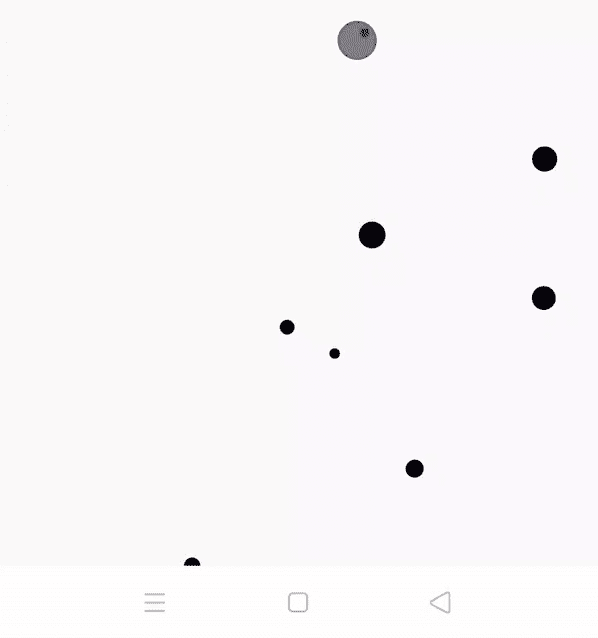

# 安卓中的气泡发射器动画示例

> 原文:[https://www . geeksforgeeks . org/bubble mitter-带示例的安卓动画/](https://www.geeksforgeeks.org/bubbleemitter-animation-in-android-with-examples/)

**气泡发射器**是一个动画库，有助于获得用户的注意力。它以安卓视角展示了奇特的动画泡泡。它用于创建一个漂亮的用户界面，用户可以在其中真实地感受应用程序。气泡传感器的一些有用特性和应用如下:

*   要创建一个实时壁纸应用程序，可以使用气泡发射器。
*   如果您希望用户等待一段时间，请使用此视图。
*   [ProgressBar](https://www.geeksforgeeks.org/progressbar-in-kotlin/) 可以用来代替这个，但是因为它独特的 UI，它会吸引用户，因此用户会等待足够的时间。
*   它还为开发人员提供了完全的控制。
*   还可以创建自定义的彩色气泡。



#### 方法

*   **第一步:**在根 **[build.gradle](https://www.geeksforgeeks.org/android-build-gradle/)** 文件中添加支持库(不在模块 build.gradle 文件中)。这个库 **jitpack** 是一个新颖的包库。它是为 JVM 而做的，因此 [github](https://www.geeksforgeeks.org/ultimate-guide-git-github/) 和 [bigbucket](https://www.geeksforgeeks.org/bitbucket-vs-github-vs-gitlab/) 中存在的任何库都可以直接在应用程序中使用。

    ```
    allprojects {           
     repositories {           
            maven { url 'https://jitpack.io' }           
         }          
    }           
    ```

*   **第二步:**在 **[build.gradle](https://www.geeksforgeeks.org/android-build-gradle/)** 文件中添加支持库，并在依赖项部分添加依赖项。

    ```
    implementation 'com.github.FireZenk:BubbleEmitter:-SNAPSHOT'          
    ```

*   **第三步:**在 **activity_main.xml** 文件中添加以下代码。在该文件中，向布局添加**气泡发射器**。

    ## activity _ main . XML

    ```
    <?xml version="1.0" encoding="utf-8"?>
    <androidx.constraintlayout.widget.ConstraintLayout
        xmlns:android="http://schemas.android.com/apk/res/android"
        xmlns:app="http://schemas.android.com/apk/res-auto"
        xmlns:tools="http://schemas.android.com/tools"
        android:layout_width="match_parent"
        android:layout_height="match_parent"
        tools:context=".MainActivity">

        <org.firezenk.bubbleemitter.BubbleEmitterView
            android:id="@+id/bubbleEmitter"
            android:layout_width="match_parent"
            android:layout_height="match_parent"
            app:layout_constraintBottom_toBottomOf="parent"
            app:layout_constraintLeft_toLeftOf="parent"
            app:layout_constraintRight_toRightOf="parent"
            app:layout_constraintTop_toTopOf="parent"/>

    </androidx.constraintlayout.widget.ConstraintLayout>  
    ```

*   **步骤 4:** 在 **MainActivity.kt** 文件中添加以下代码。在这个文件中创建一个线程，并将其附加到主线程。

    ## MainActivity.kt 公司

    ```
    package org.geeksforgeeks.bubbleemitter          

    import androidx.appcompat.app.AppCompatActivity
    import android.os.Bundle
    import android.os.Handler
    import kotlinx.android.synthetic.main.activity_main.*
    import kotlin.random.Random

    class MainActivity : AppCompatActivity() {
        override fun onCreate(savedInstanceState: Bundle?) {
            super.onCreate(savedInstanceState)
            setContentView(R.layout.activity_main)
            emitBubbles()
        }

        private fun emitBubbles() {
            // It will create a thread and attach it to
            // the main thread
            Handler().postDelayed({
                // Random is used to select random bubble
                // size
                val size = Random.nextInt(20, 80)
                bubbleEmitter.emitBubble(size)
                emitBubbles()
            }, Random.nextLong(100, 500))
        }
    }
    ```

    #### 输出：在模拟器上运行

    <video class="wp-video-shortcode" id="video-460480-1" width="320" height="540" preload="metadata" controls=""><source type="video/mp4" src="https://media.geeksforgeeks.org/wp-content/uploads/20200717205709/Record_2020-07-17-20-55-55_d41d2c11b381def290b21a35d5ce4e651.mp4?_=1">[https://media . geekesforgeks . org/WP-content/uploads/20200717205709/Record _ 2020-07-17-20-55-55 _ d41d 2c 11 b 381 de f 290 b 21 a 35 D5 ce 4e 651 . MP4](https://media.geeksforgeeks.org/wp-content/uploads/20200717205709/Record_2020-07-17-20-55-55_d41d2c11b381def290b21a35d5ce4e651.mp4)</video>在这个文件中，我们将创建黑色气泡。

    ## MainActivity.kt 公司

    ```
    package org.geeksforgeeks.bubbleemitter          

    import androidx.appcompat.app.AppCompatActivity
    import android.os.Bundle
    import android.os.Handler
    import kotlinx.android.synthetic.main.activity_main.*
    import kotlin.random.Random

    class MainActivity : AppCompatActivity() {
        override fun onCreate(savedInstanceState: Bundle?) {
            super.onCreate(savedInstanceState)
            setContentView(R.layout.activity_main)
            emitBubbles()
        }

        private fun emitBubbles() {
            // It will create a thread and attach it to
            // the main thread
            Handler().postDelayed({
                // Random is used to select random bubble
                // size
                val size = Random.nextInt(20, 80)
                bubbleEmitter.emitBubble(size)
                bubbleEmitter.setColors(android.R.color.black,
                    android.R.color.black,
                    android.R.color.black);
                emitBubbles()
            }, Random.nextLong(100, 500))
        }
    }
    ```

    #### 输出：在模拟器上运行

    <video class="wp-video-shortcode" id="video-460480-2" width="320" height="540" preload="metadata" controls=""><source type="video/mp4" src="https://media.geeksforgeeks.org/wp-content/uploads/20200717210813/Record_2020-07-17-21-03-42_d41d2c11b381def290b21a35d5ce4e651.mp4?_=2">[https://media . geekesforgeks . org/WP-content/uploads/20200717210813/Record _ 2020-07-17-21-03-42 _ d41d 2c 11 b 381 de f 290 b21a 35 D5 ce 4e 651 . MP4](https://media.geeksforgeeks.org/wp-content/uploads/20200717210813/Record_2020-07-17-21-03-42_d41d2c11b381def290b21a35d5ce4e651.mp4)</video>