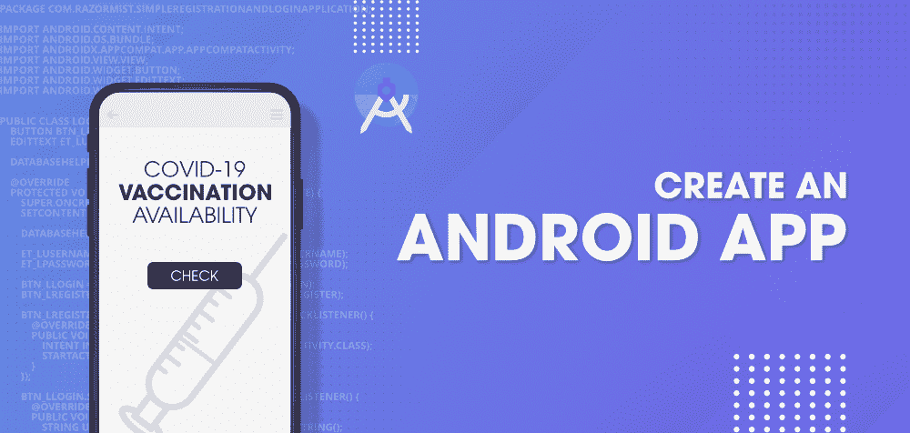

# 构建安卓应用检查新冠肺炎疫苗接种可用性

> 原文:[https://www . geesforgeks . org/build-an-Android-app-to-check-新冠肺炎-疫苗接种-可用性/](https://www.geeksforgeeks.org/build-an-android-app-to-check-covid-19-vaccination-availability/)

**先决条件:**

*   [<u>安卓应用开发基础入门</u>](https://www.geeksforgeeks.org/android-app-development-fundamentals-for-beginners/)
*   [<u>安卓工作室安装设置指南</u>](https://www.geeksforgeeks.org/guide-to-install-and-set-up-android-studio/?ref=rp)
*   [<u>安卓|如何在安卓工作室创建/启动新项目？</u>T3】](https://www.geeksforgeeks.org/android-how-to-create-start-a-new-project-in-android-studio/?ref=rp)
*   [<u>安卓|运行你的第一款安卓应用</u>](https://www.geeksforgeeks.org/android-running-your-first-android-app/?ref=rp)
*   [<u>REST API(简介)</u>](https://www.geeksforgeeks.org/rest-api-introduction/)
*   [<u>安卓中的凌空库</u>](https://www.geeksforgeeks.org/volley-library-in-android/)

印度政府开始了全印度最大规模的疫苗接种运动，为人们接种疫苗以对抗新冠肺炎病毒。由于印度有这么多疫苗接种中心，所以要检查印度各地不同中心的不同疫苗接种情况。我们将构建一个简单的应用程序来获取印度疫苗接种中心的详细信息。



### **本文我们将构建什么？**

我们将构建一个简单的应用程序，从该位置的密码中获取疫苗接种中心的数据。下面是视频，我们将在其中看到我们将在本文中构建的内容。注意，我们将使用 **Kotlin** 语言来实现这个项目。

<video class="wp-video-shortcode" id="video-604248-1" width="640" height="360" preload="metadata" controls=""><source type="video/mp4" src="https://media.geeksforgeeks.org/wp-content/uploads/20210513185830/20210513_185725.mp4?_=1">[https://media.geeksforgeeks.org/wp-content/uploads/20210513185830/20210513_185725.mp4](https://media.geeksforgeeks.org/wp-content/uploads/20210513185830/20210513_185725.mp4)</video>

**第一步:开启新项目**

*   打开一个新项目，只需点击左侧最顶端的文件选项。
*   然后点击新建，用你想要的名字打开一个新项目。
*   现在我们要用柯特林的语言来研究空活动。保持所有其他选项不变。
*   您可以根据自己的选择更改项目的名称
*   默认情况下会有两个文件 **activity_main.xml** 和 MainActivity.java。

或者在安卓工作室创建新项目请参考[如何在安卓工作室创建/启动新项目](https://www.geeksforgeeks.org/android-how-to-create-start-a-new-project-in-android-studio/)。

**第二步:在进入编码部分之前，你首先要做一些前置任务**

转到**应用程序>RES>values>colors . XML**部分，为您的应用程序设置颜色。

## 可扩展标记语言

```kt
<?xml version="1.0" encoding="utf-8"?>
<resources>
    <color name="purple_200">#0F9D58</color>
    <color name="purple_500">#0F9D58</color>
    <color name="purple_700">#0F9D58</color>
    <color name="teal_200">#FF03DAC5</color>
    <color name="teal_700">#FF018786</color>
    <color name="black">#FF000000</color>
    <color name="white">#FFFFFFFF</color>
</resources>
```

**第三步:在 build.gradle 文件**中添加凌空的依赖关系

转到**梯度脚本>构建.梯度(模块:应用)**部分，导入以下依赖项，并单击上面弹出窗口中的“立即同步”。我们在这个项目中使用了凌空库。

```kt
// Volley library
implementation 'com.android.volley:volley:1.1.1'
```

**第四步:在 AndroidManifest.xml 文件**中添加互联网权限

导航到**应用程序> AndroidManifest.xml** 文件，并在其中添加下面一行代码。

## 可扩展标记语言

```kt
<!--Allow Internet Permission-->
<uses-permission android:name="android.permission.INTERNET" />
```

**第 5 步:使用 activity_main.xml 文件**

导航到**应用程序> res >布局> activity_main.xml** 并将下面的代码添加到该文件中。下面是 **activity_main.xml** 文件的代码。

## 可扩展标记语言

```kt
<?xml version="1.0" encoding="utf-8"?>
<RelativeLayout
    xmlns:android="http://schemas.android.com/apk/res/android"
    xmlns:tools="http://schemas.android.com/tools"
    android:layout_width="match_parent"
    android:layout_height="match_parent"
    tools:context=".MainActivity">

    <!--edit text for entering the pin code-->
    <EditText
        android:id="@+id/idEdtPinCode"
        android:layout_width="match_parent"
        android:layout_height="wrap_content"
        android:layout_margin="5dp"
        android:layout_toStartOf="@id/idBtnSearch"
        android:layout_toLeftOf="@id/idBtnSearch"
        android:hint="Enter PinCode"
        android:inputType="number" />

    <!--button for searching the data-->
    <Button
        android:id="@+id/idBtnSearch"
        android:layout_width="wrap_content"
        android:layout_height="wrap_content"
        android:layout_alignParentEnd="true"
        android:layout_alignParentRight="true"
        android:layout_margin="5dp"
        android:background="@color/purple_200"
        android:text="Search"
        android:textAllCaps="false" />

    <!--progress bar for loading indicator-->
    <ProgressBar
        android:id="@+id/idPBLoading"
        android:layout_width="wrap_content"
        android:layout_height="wrap_content"
        android:layout_centerInParent="true"
        android:visibility="gone" />

    <!--recycler view for displaying results in the form of list-->
    <androidx.recyclerview.widget.RecyclerView
        android:id="@+id/centersRV"
        android:layout_width="match_parent"
        android:layout_height="match_parent"
        android:layout_below="@id/idEdtPinCode"
        tools:listitem="@layout/center_rv_item" />

</RelativeLayout>
```

**第 6 步:创建一个新的 Kotlin 文件来存储我们的数据**

我们必须将数据存储在一个模态类中，为此我们将创建一个新的 Kotlin 类文件。创建这个文件。导航到**应用程序> java >你的应用程序的包名>右键单击它>新建> Kotlin 文件/类**选项，然后选择类并将你的文件命名为 CenterRvModal 并添加下面的代码。代码中添加了注释，以便更详细地了解。

## 我的锅

```kt
data class CenterRvModal(

        // string variable for center name.
        val centerName: String,

        // string variable for center address.
        val centerAddress: String,

        // string variable for center opening time.
        val centerFromTime: String,

        // string variable for center closing time.
        val centerToTime: String,

        // string variable for center fee type
        var fee_type: String,

        // int variable for age limit.
        var ageLimit: Int,

        // string variable for vaccination name.
        var vaccineName: String,

        // int variable for vaccine availability.
        var availableCapacity: Int
)
```

**第 7 步:为我们的回收视图**创建一个新的布局文件

导航至 **app > res >布局>右键点击>新建>布局文件**并将其命名为 **center_rv_item** 并添加以下代码。代码中添加了注释，以便更详细地了解。下面的布局文件可用于显示我们的回收视图的每个项目。

> **注意:**项目中使用的图像出现在可绘制文件夹中。

## 可扩展标记语言

```kt
<?xml version="1.0" encoding="utf-8"?>
<androidx.cardview.widget.CardView
    xmlns:android="http://schemas.android.com/apk/res/android"
    android:layout_width="match_parent"
    android:layout_height="wrap_content"
    android:layout_margin="4dp">

    <RelativeLayout
        android:layout_width="match_parent"
        android:layout_height="wrap_content">

        <!--text view for displaying center name-->
        <TextView
            android:id="@+id/idTVCenterName"
            android:layout_width="match_parent"
            android:layout_height="wrap_content"
            android:layout_margin="3dp"
            android:drawableLeft="@drawable/ic_hospital"
            android:drawablePadding="4dp"
            android:padding="3dp"
            android:text="Center Name"
            android:textColor="@color/black" />

        <!--text view for displaying center address-->
        <TextView
            android:id="@+id/idTVCenterAddress"
            android:layout_width="match_parent"
            android:layout_height="wrap_content"
            android:layout_below="@id/idTVCenterName"
            android:layout_margin="3dp"
            android:drawableLeft="@drawable/ic_location"
            android:drawablePadding="4dp"
            android:padding="3dp"
            android:text="Center Address"
            android:textColor="@color/black" />

        <!--text view for displaying center timings-->
        <TextView
            android:id="@+id/idTVCenterTimings"
            android:layout_width="match_parent"
            android:layout_height="wrap_content"
            android:layout_below="@id/idTVCenterAddress"
            android:layout_margin="3dp"
            android:drawableLeft="@drawable/ic_time"
            android:drawablePadding="4dp"
            android:padding="3dp"
            android:text="Timings"
            android:textColor="@color/black" />

        <LinearLayout
            android:id="@+id/idLL1"
            android:layout_width="match_parent"
            android:layout_height="wrap_content"
            android:layout_below="@id/idTVCenterTimings"
            android:orientation="horizontal"
            android:weightSum="2">

            <!--text view for displaying vaccine name-->
            <TextView
                android:id="@+id/idTVVaccineName"
                android:layout_width="0dp"
                android:layout_height="wrap_content"
                android:layout_margin="3dp"
                android:layout_weight="1"
                android:drawableLeft="@drawable/ic_vaccine"
                android:drawablePadding="4dp"
                android:padding="3dp"
                android:text="Vaccine Name"
                android:textColor="@color/black" />

            <!--text view for displaying center fees type-->
            <TextView
                android:id="@+id/idTVFeeType"
                android:layout_width="0dp"
                android:layout_height="wrap_content"
                android:layout_gravity="center"
                android:layout_margin="3dp"
                android:layout_weight="1"
                android:padding="3dp"
                android:text="Fee Type"
                android:textAlignment="center"
                android:textColor="@color/black" />
        </LinearLayout>

        <LinearLayout
            android:id="@+id/idLL2"
            android:layout_width="match_parent"
            android:layout_height="wrap_content"
            android:layout_below="@id/idLL1"
            android:orientation="horizontal"
            android:weightSum="2">

            <!--text view for displaying age limit-->
            <TextView
                android:id="@+id/idTVAgeLimit"
                android:layout_width="0dp"
                android:layout_height="wrap_content"
                android:layout_gravity="center"
                android:layout_margin="3dp"
                android:layout_weight="1"
                android:padding="3dp"
                android:text="Age Limit"
                android:textAlignment="center"
                android:textColor="@color/black" />

            <!--text view for displaying center availability-->
            <TextView
                android:id="@+id/idTVAvaliablity"
                android:layout_width="0dp"
                android:layout_height="wrap_content"
                android:layout_gravity="center"
                android:layout_margin="3dp"
                android:layout_weight="1"
                android:padding="3dp"
                android:text="Avaliablity"
                android:textAlignment="center"
                android:textColor="@color/black" />

        </LinearLayout>

    </RelativeLayout>

</androidx.cardview.widget.CardView>
```

**第 8 步:为我们的适配器类创建一个新的 Kotlin 文件**

现在为我们的回收视图的每个项目设置数据。我们必须创建一个新的适配器类来为回收视图的每个项目设置数据。要创建一个新的 Kotlin 文件，导航到**应用程序> java >你的应用程序的包名>右键单击它>新建> Kotlin 文件/类**并将其命名为**中心应用程序**并添加下面的代码。代码中添加了注释，以便更详细地了解。

## 我的锅

```kt
import android.view.LayoutInflater
import android.view.View
import android.view.ViewGroup
import android.widget.TextView
import androidx.recyclerview.widget.RecyclerView

// on below line we are creating our adapter class
// in this class we are passing our array list
// and our View Holder class which we have created.
class CenterRVAdapter(private val centerList: List<CenterRvModal>) :
        RecyclerView.Adapter<CenterRVAdapter.CenterRVViewHolder>() {

    // on below line we are creating our view holder class which will
    // be used to initialize each view of our layout file.
    class CenterRVViewHolder(itemView: View) : RecyclerView.ViewHolder(itemView) {
        // on below line we are initializing all our text views along with  its ids.
        val centerNameTV: TextView = itemView.findViewById(R.id.idTVCenterName)
        val centerAddressTV: TextView = itemView.findViewById(R.id.idTVCenterAddress)
        val centerTimings: TextView = itemView.findViewById(R.id.idTVCenterTimings)
        val vaccineNameTV: TextView = itemView.findViewById(R.id.idTVVaccineName)
        val centerAgeLimitTV: TextView = itemView.findViewById(R.id.idTVAgeLimit)
        val centerFeeTypeTV: TextView = itemView.findViewById(R.id.idTVFeeType)
        val avalabilityTV: TextView = itemView.findViewById(R.id.idTVAvaliablity)
    }

    // below method is for on Create View Holder.
    override fun onCreateViewHolder(parent: ViewGroup, viewType: Int): CenterRVViewHolder {
        // this method is use to inflate the layout file
        // which we have created for our recycler view.
        // on below line we are inflating our layout file.
        val itemView = LayoutInflater.from(parent.context).inflate(
                R.layout.center_rv_item,
                parent, false
        )
        // at last we are returning our view holder
        // class with our item View File.
        return CenterRVViewHolder(itemView)
    }

    // this method is to count the size of our array list.
    override fun getItemCount(): Int {

        // on below line we are returning
        // the size of our array list.
        return centerList.size
    }

    // below method is to set the data to each view of our recycler view item.
    override fun onBindViewHolder(holder: CenterRVViewHolder, position: Int) {

        // on below line we are getting item
        // from our list along with its position.
        val currentItem = centerList[position]

        // after getting current item we are setting
        // data from our list to our text views.
        holder.centerNameTV.text = currentItem.centerName
        holder.centerAddressTV.text = currentItem.centerAddress
        holder.centerTimings.text = ("From : " + currentItem.centerFromTime + " To : " + currentItem.centerToTime)
        holder.vaccineNameTV.text = currentItem.vaccineName
        holder.centerAgeLimitTV.text = "Age Limit : " + currentItem.ageLimit.toString()
        holder.centerFeeTypeTV.text = currentItem.fee_type
        holder.avalabilityTV.text = "Availability : " + currentItem.availableCapacity.toString()
    }
}
```

**第九步:使用 MainActivity.kt 文件。**

导航到**应用程序> java >你的应用程序的包名> MainActivity.kt** 文件，并添加下面的代码。代码中添加了注释，以便更详细地了解。

## 我的锅

```kt
import android.app.DatePickerDialog
import android.os.Bundle
import android.util.Log
import android.view.View
import android.widget.Button
import android.widget.EditText
import android.widget.ProgressBar
import android.widget.Toast
import androidx.appcompat.app.AppCompatActivity
import androidx.recyclerview.widget.LinearLayoutManager
import androidx.recyclerview.widget.RecyclerView
import com.android.volley.Request
import com.android.volley.toolbox.JsonObjectRequest
import com.android.volley.toolbox.Volley
import org.json.JSONException
import java.util.*
import kotlin.collections.ArrayList

class MainActivity : AppCompatActivity() {

    // creating a variable for our button.
    private lateinit var searchButton: Button

    // creating variable for our edit text.
    lateinit var pinCodeEdt: EditText

    // creating a variable for our recycler view.
    lateinit var centersRV: RecyclerView

    // creating a variable for adapter class.
    lateinit var centerRVAdapter: CenterRVAdapter

    // creating a variable for our list
    lateinit var centerList: List<CenterRvModal>

    // creating a variable for progress bar.
    lateinit var loadingPB: ProgressBar

    override fun onCreate(savedInstanceState: Bundle?) {
        super.onCreate(savedInstanceState)
        setContentView(R.layout.activity_main)

        // inside on create method we are initializing
        // all our variables which we have declared.
        searchButton = findViewById(R.id.idBtnSearch)
        pinCodeEdt = findViewById(R.id.idEdtPinCode)
        centersRV = findViewById(R.id.centersRV)
        loadingPB = findViewById(R.id.idPBLoading)
        centerList = ArrayList<CenterRvModal>()

        // on below line we are adding on
        // click listener to our button.
        searchButton.setOnClickListener {

            // inside on click listener we are getting data from
            // edit text and creating a val for ite on below line.
            val pinCode = pinCodeEdt.text.toString()

            // on below line we are validating
            // our pin code as 6 digit or not.
            if (pinCode.length != 6) {

                // this method is called when users enter invalid pin code.
                Toast.makeText(this@MainActivity, "Please enter valid pin code", Toast.LENGTH_SHORT).show()
            } else {

                // if the pincode is correct.
                // first of all we are clearing our array list this
                // will clear the data in it if already present.
                (centerList as ArrayList<CenterRvModal>).clear()

                // on below line we are getting instance of our calendar.
                val c = Calendar.getInstance()

                // on below line we are getting our current year, month and day.
                val year = c.get(Calendar.YEAR)
                val month = c.get(Calendar.MONTH)
                val day = c.get(Calendar.DAY_OF_MONTH)

                // on below line we are creating our date picker dialog.
                val dpd = DatePickerDialog(
                        this,
                        DatePickerDialog.OnDateSetListener { view, year, monthOfYear, dayOfMonth ->
                            // after that we are making our progress bar as visible.
                            loadingPB.setVisibility(View.VISIBLE)

                            // on below line we are creating a date string for our date
                            val dateStr: String = """$dayOfMonth - ${monthOfYear + 1} - $year"""

                            // on below line we are calling a method to get
                            // the appointment info for vaccination centers
                            // and we are passing our pin code to it.
                            getAppointments(pinCode, dateStr)
                        },
                        year,
                        month,
                        day
                )
                // calling a method to display
                // our datepicker dialog.
                dpd.show()
            }
        }
    }

    // below is the method for getting data from API.
    private fun getAppointments(pinCode: String, date: String) {
        val url = "https://cdn-api.co-vin.in/api/v2/appointment/sessions/public/calendarByPin?pincode=" + pinCode + "&date=" + date
        val queue = Volley.newRequestQueue(this@MainActivity)

        // on below line we are creating a request
        // variable for making our json object request.
        val request =
                // as we are getting json object response and we are making a get request.
                JsonObjectRequest(Request.Method.GET, url, null, { response ->
                    // this method is called when we get successful response from API.
                    Log.e("TAG", "SUCCESS RESPONSE IS $response")
                    // we are setting the visibility of progress bar as gone.
                    loadingPB.setVisibility(View.GONE)
                    // on below line we are adding a try catch block.
                    try {
                        // in try block we are creating a variable for center
                        // array and getting our array from our object.
                        val centerArray = response.getJSONArray("centers")

                        // on below line we are checking if the length of the array is 0.
                        // the zero length indicates that there is no data for the given pincode.
                        if (centerArray.length().equals(0)) {
                            Toast.makeText(this, "No Center Found", Toast.LENGTH_SHORT).show()
                        }
                        for (i in 0 until centerArray.length()) {

                            // on below line we are creating a variable for our center object.
                            val centerObj = centerArray.getJSONObject(i)

                            // on below line we are getting data from our session
                            // object and we are storing that in a different variable.
                            val centerName: String = centerObj.getString("name")
                            val centerAddress: String = centerObj.getString("address")
                            val centerFromTime: String = centerObj.getString("from")
                            val centerToTime: String = centerObj.getString("to")
                            val fee_type: String = centerObj.getString("fee_type")

                            // on below line we are creating a variable for our session object
                            val sessionObj = centerObj.getJSONArray("sessions").getJSONObject(0)
                            val ageLimit: Int = sessionObj.getInt("min_age_limit")
                            val vaccineName: String = sessionObj.getString("vaccine")
                            val avaliableCapacity: Int = sessionObj.getInt("available_capacity")

                            // after extracting all the data we are passing this
                            // data to our modal class we have created
                            // a variable for it as center.
                            val center = CenterRvModal(
                                    centerName,
                                    centerAddress,
                                    centerFromTime,
                                    centerToTime,
                                    fee_type,
                                    ageLimit,
                                    vaccineName,
                                    avaliableCapacity
                            )
                            // after that we are passing this modal to our list on the below line.
                            centerList = centerList + center
                        }

                        // on the below line we are passing this list to our adapter class.
                        centerRVAdapter = CenterRVAdapter(centerList)

                        // on the below line we are setting layout manager to our recycler view.
                        centersRV.layoutManager = LinearLayoutManager(this)

                        // on the below line we are setting an adapter to our recycler view.
                        centersRV.adapter = centerRVAdapter

                        // on the below line we are notifying our adapter as the data is updated.
                        centerRVAdapter.notifyDataSetChanged()

                    } catch (e: JSONException) {
                        // below line is for handling json exception.
                        e.printStackTrace();
                    }
                },
                        { error ->
                            // this method is called when we get any
                            // error while fetching data from our API
                            Log.e("TAG", "RESPONSE IS $error")
                            // in this case we are simply displaying a toast message.
                            Toast.makeText(this@MainActivity, "Fail to get response", Toast.LENGTH_SHORT).show()
                        })
        // at last we are adding
        // our request to our queue.
        queue.add(request)
    }
}
```

现在运行你的应用，看看应用的输出

**输出:**

> **注意:**我们的应用程序当前将显示当前日期的可用数据。

<video class="wp-video-shortcode" id="video-604248-2" width="640" height="360" preload="metadata" controls=""><source type="video/mp4" src="https://media.geeksforgeeks.org/wp-content/uploads/20210513185830/20210513_185725.mp4?_=2">[https://media.geeksforgeeks.org/wp-content/uploads/20210513185830/20210513_185725.mp4](https://media.geeksforgeeks.org/wp-content/uploads/20210513185830/20210513_185725.mp4)</video>