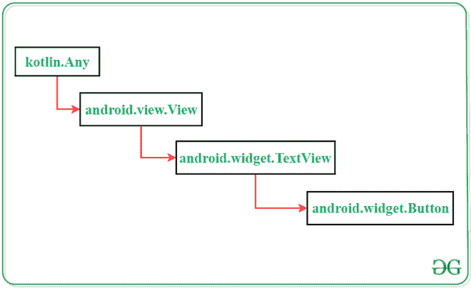

# 安卓中的按钮

> 原文:[https://www.geeksforgeeks.org/button-in-kotlin/](https://www.geeksforgeeks.org/button-in-kotlin/)

在[安卓](https://www.geeksforgeeks.org/kotlin-android-tutorial/)应用中，**按钮**是一个用户界面，用于在点击或轻击时执行一些动作。它是安卓系统中非常常见的小部件，开发者经常使用。本文演示了如何在安卓工作室中创建一个按钮。

### **柯特林中按钮类的类层次结构**



### 按钮部件的可扩展标记语言属性

<figure class="table">

| 

XML 属性

 | 

描述

 |
| --- | --- |
| android:id | 用于指定视图的 id。 |
| android:文本 | 用于显示按钮的文本。 |
| android:文本颜色 | 用于显示文本的颜色。 |
| android:文本大小 | 用于显示文本的大小。 |
| android:textStyle | 用于粗体、斜体等文本的显示样式。 |
| Android:text llcaps | 用于以大写字母显示文本。 |
| 安卓:背景 | 用于设置视图的背景。 |
| 安卓:填充 | 用于设置视图的填充。 |
| 安卓:可见性 | 用于设置视图的可见性。 |
| 安卓:重力 | 用于指定视图的重心，如中心、顶部、底部等 |

</figure>

### 例子

在此示例中，将逐步演示如何创建按钮。该应用程序将由一个按钮组成，当用户点击该按钮时会显示一条祝酒信息。

> **注意:**在 Android Studio 版本上执行以下步骤

**第一步:创建新项目**

1.  单击文件，然后单击新建= >新建项目。
2.  为项目模板选择“空活动”。
3.  选择语言作为 Kotlin。
4.  根据您的需要选择最小的软件开发工具包。

**第二步:修改 strings.xml 文件**

导航到**资源文件夹**的**【值】**目录下的 **strings.xml** 文件。该文件将包含应用程序中使用的所有字符串。以下是相应的代码。

## 可扩展标记语言

```kt
<resources>
    <string name="app_name">GfG | Button In Kotlin</string>
    <string name="btn">Button</string>
    <string name="message">Hello Geeks!! This is a Button.</string>
</resources>
```

**第三步:修改 activity_main.xml 文件**

在活动布局中添加按钮小部件。下面是 **activity_main.xml** 文件的代码，也是这么做的。

## 可扩展标记语言

```kt
<?xml version="1.0" encoding="utf-8"?>
<androidx.constraintlayout.widget.ConstraintLayout
    xmlns:android="http://schemas.android.com/apk/res/android"
    xmlns:app="http://schemas.android.com/apk/res-auto"
    xmlns:tools="http://schemas.android.com/tools"
    android:layout_width="match_parent"
    android:layout_height="match_parent"
    android:background="#168BC34A"
    tools:context=".MainActivity">

    <!-- Button added in the activity -->
    <Button
        android:id="@+id/button"
        android:layout_width="wrap_content"
        android:layout_height="wrap_content"
        android:background="#4CAF50"
        android:paddingStart="10dp"
        android:paddingEnd="10dp"
        android:text="@string/btn"
        android:textColor="@android:color/background_light"
        android:textSize="24sp"
        app:layout_constraintBottom_toBottomOf="parent"
        app:layout_constraintEnd_toEndOf="parent"
        app:layout_constraintStart_toStartOf="parent"
        app:layout_constraintTop_toTopOf="parent" />

</androidx.constraintlayout.widget.ConstraintLayout>
```

**第四步:访问主活动文件**中的按钮

在**主活动**文件中添加按钮功能。这里描述当用户点击按钮时显示[吐司信息](https://www.geeksforgeeks.org/android-what-is-toast-and-how-to-use-it-with-examples/)的操作。下面是执行这项任务的代码。

## Java 语言(一种计算机语言，尤用于创建网站)

```kt
import androidx.appcompat.app.AppCompatActivity;
import android.content.Context;
import android.os.Bundle;
import android.view.View;
import android.widget.Button;
import android.widget.Toast;

public class MainActivity extends AppCompatActivity {

    @Override
    protected void onCreate( Bundle savedInstanceState ) {
        super.onCreate(savedInstanceState);
        setContentView(R.layout.activity_main);

        // storing ID of the button
        // in a variable
        Button button = (Button)findViewById(R.id.button);

        // operations to be performed
        // when user tap on the button
        if (button != null) {
            button.setOnClickListener((View.OnClickListener)(new View.OnClickListener() {
                    public final void onClick(View it) {

                    // displaying a toast message
                    Toast.makeText((Context)MainActivity.this, R.string.message, Toast.LENGTH_LONG).show();
                }
            }));
        }
    }
}
```

## 我的锅

```kt
import androidx.appcompat.app.AppCompatActivity
import android.os.Bundle
import android.widget.Button
import android.widget.Toast

class MainActivity : AppCompatActivity() {

    override fun onCreate(savedInstanceState: Bundle?) {
        super.onCreate(savedInstanceState)
        setContentView(R.layout.activity_main)

        // storing ID of the button
        // in a variable
        val button = findViewById<Button>(R.id.button)

        // operations to be performed
        // when user tap on the button
        button?.setOnClickListener()
        {
            // displaying a toast message
            Toast.makeText(this@MainActivity, R.string.message, Toast.LENGTH_LONG).show() }
    }
}
```

**输出:**

<video class="wp-video-shortcode" id="video-354156-1" width="640" height="360" preload="metadata" controls=""><source type="video/mp4" src="https://media.geeksforgeeks.org/wp-content/uploads/20210130110935/Button-In-Kotlin-Recording.mp4?_=1">[https://media.geeksforgeeks.org/wp-content/uploads/20210130110935/Button-In-Kotlin-Recording.mp4](https://media.geeksforgeeks.org/wp-content/uploads/20210130110935/Button-In-Kotlin-Recording.mp4)</video>