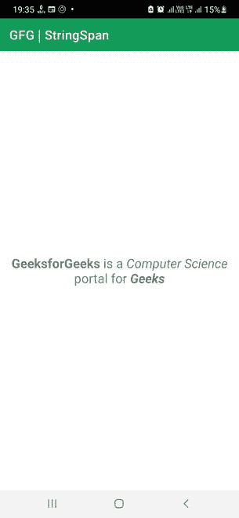

# 在安卓系统中改变字符串内特定长度字符的样式

> 原文:[https://www . geesforgeks . org/change-style-of-a-special-span-of-characters-in-string-in-Android/](https://www.geeksforgeeks.org/change-style-of-a-particular-span-of-characters-inside-a-string-in-android/)

[Android 中的 TextView](https://www.geeksforgeeks.org/textview-in-kotlin/) 用于显示文本或字符序列，更好的说法是字符串。这些字符串可以硬编码，也可以在运行时声明。通常，文本以原始格式显示，其中相同的文本格式应用于字符串中的每个字符。如果我们希望应用样式，格式将应用于整个字符串。没有对不同的字符应用不同的样式的直接规定。


因此，在本文中，我们将向您展示如何在 Android 中以编程方式将样式应用于子字符串或字符串跨度。

### 逐步实施

**第一步:在安卓工作室新建项目**

要在安卓工作室创建新项目，请参考[如何在安卓工作室创建/启动新项目](https://www.geeksforgeeks.org/android-how-to-create-start-a-new-project-in-android-studio/)。我们在 **Kotlin** 中演示了该应用程序，因此在创建新项目时，请确保选择 Kotlin 作为主要语言。

**步骤 2:使用 activity_main.xml 文件**

导航到**应用程序> res >布局> activity_main.xml** 并将下面的代码添加到该文件中。下面是 **activity_main.xml** 文件的代码。在布局文件中添加文本视图。这个文本视图将显示我们的格式化文本。

## 可扩展标记语言

```kt
<?xml version="1.0" encoding="utf-8"?>
<RelativeLayout 
    xmlns:android="http://schemas.android.com/apk/res/android"
    xmlns:app="http://schemas.android.com/apk/res-auto"
    xmlns:tools="http://schemas.android.com/tools"
    android:layout_width="match_parent"
    android:layout_height="match_parent"
    tools:context=".MainActivity">

    <TextView
        android:id="@+id/text_view"
        android:layout_width="match_parent"
        android:layout_height="wrap_content"
        android:layout_centerInParent="true"
        android:gravity="center"
        android:textSize="20sp"/>

</RelativeLayout>
```

**第三步:使用**T2【主活动. kt】文件

转到 **MainActivity.kt** 文件，参考以下代码。下面是 **MainActivity.kt** 文件的代码。代码中添加了注释，以更详细地理解代码。

## 我的锅

```kt
import android.graphics.Typeface
import androidx.appcompat.app.AppCompatActivity
import android.os.Bundle
import android.text.SpannableString
import android.text.Spanned
import android.text.style.StyleSpan
import android.widget.TextView

class MainActivity : AppCompatActivity() {
    override fun onCreate(savedInstanceState: Bundle?) {
        super.onCreate(savedInstanceState)
        setContentView(R.layout.activity_main)

        // Declaring TextView from the layout file
        val mTextView = findViewById<TextView>(R.id.text_view)

        // Declaring a string
        val mString = "GeeksforGeeks is a Computer Science portal for Geeks"

        // Getting a spannable string from the previous string
        val mSpannableString = SpannableString(mString)

        // Declaring Style Spans of different types
        val mBoldSpan = StyleSpan(Typeface.BOLD)
        val mItalicSpan = StyleSpan(Typeface.ITALIC)
        val mBoldItalicSpan = StyleSpan(Typeface.BOLD_ITALIC)

        // Applying style spans to the spannable string
        mSpannableString.setSpan(mBoldSpan, 0, 13, Spanned.SPAN_EXCLUSIVE_EXCLUSIVE)
        mSpannableString.setSpan(mItalicSpan, 19, 35, Spanned.SPAN_EXCLUSIVE_EXCLUSIVE)
        mSpannableString.setSpan(mBoldItalicSpan, 47, 52, Spanned.SPAN_EXCLUSIVE_EXCLUSIVE)

        // Displaying the formatted 
        // spannable string in the TextView
        mTextView.text = mSpannableString
    }
}
```

**输出:**

您可以看到该字符串在不同的跨度下被格式化。

