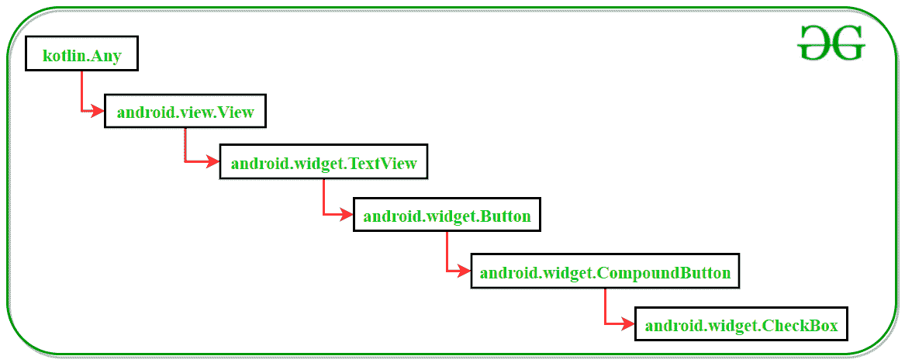
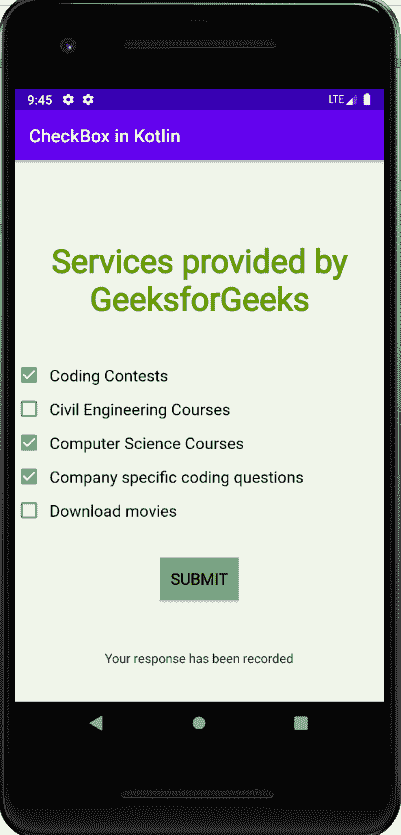

# 科特林中的

# 复选框

> 原文:[https://www.geeksforgeeks.org/checkbox-in-kotlin/](https://www.geeksforgeeks.org/checkbox-in-kotlin/)

复选框是[安卓](https://www.geeksforgeeks.org/introduction-to-android-development/)中的一种特殊按钮，有选中和未选中两种状态。复选框是安卓中非常常见的小部件，一个很好的例子是应用程序的任何登录活动中的**“记住我”**选项，该选项要求用户激活或停用该服务。CheckBox 小部件还有许多其他用途，比如提供选项列表供用户选择，并且这些选项是互斥的，即用户可以选择多个选项。CheckBox 的这一特性使其成为在安卓系统中设计选择题应用程序或调查应用程序的更好选择。

### Kotlin 中 CheckBox 类的类层次结构



### CheckBox 小部件的 XML 属性

| XML 属性 | 描述 |
| --- | --- |
| android:id | 用于唯一标识复选框 |
| 安卓:选中 | 将复选框的默认状态设置为选中或未选中 |
| 安卓:背景 | 设置复选框的背景颜色 |
| android:文本 | 用于在复选框中存储文本 |
| android:字体系列 | 设置复选框文本的字体 |
| android:文本大小 | 要设置 CheckBox 文本大小 |
| 安卓:布局 _ 宽度 | 要设置 CheckBox 宽度 |
| 安卓:布局 _ 高度 | 要设置 CheckBox 高度 |
| 安卓:重力 | 用于调整 CheckBox 文本对齐方式 |
| 安卓:填充 | 用于调整复选框的左、右、上和下填充 |

### 例子

这个例子演示了设计一个由 5 个 CheckBox 和一个额外的提交按钮组成的活动所涉及的步骤，该按钮用于显示一条记录了用户响应的吐司消息。

> 注意:以下步骤在安卓工作室 4.0 版本上执行

#### 创建新项目

1.  单击文件，然后单击新建= >新建项目。
2.  为项目模板选择“空活动”。
3.  选择语言作为 Kotlin。
4.  根据您的需要选择最小的软件开发工具包。

#### 打开 activity_main.xml 文件

下面是`**activity_main.xml**`文件添加 5 个 CheckBox 的代码。还添加了一个普通的“提交”按钮，以显示一条记录了用户响应的祝酒信息。

```kt
<?xml version="1.0" encoding="utf-8"?>
<androidx.constraintlayout.widget.ConstraintLayout
    xmlns:android="http://schemas.android.com/apk/res/android"
    xmlns:app="http://schemas.android.com/apk/res-auto"
    xmlns:tools="http://schemas.android.com/tools"
    android:layout_width="match_parent"
    android:layout_height="match_parent"
    android:background="#168BC34A"
    tools:context=".MainActivity" >

    <TextView
        android:id="@+id/textView"
        android:layout_width="wrap_content"
        android:layout_height="wrap_content"
        android:fontFamily="@font/roboto"
        android:text="@string/Heading"
        android:textAlignment="center"
        android:textColor="@android:color/holo_green_dark"
        android:textSize="36sp"
        android:textStyle="bold"
        app:layout_constraintBottom_toBottomOf="parent"
        app:layout_constraintEnd_toEndOf="parent"
        app:layout_constraintStart_toStartOf="parent"
        app:layout_constraintTop_toTopOf="parent"
        app:layout_constraintVertical_bias="0.17000002" />

    <LinearLayout
        android:id="@+id/checkBox_container"
        android:layout_width="0dp"
        android:layout_height="wrap_content"
        android:orientation="vertical"
        app:layout_constraintBottom_toBottomOf="parent"
        app:layout_constraintEnd_toEndOf="parent"
        app:layout_constraintStart_toStartOf="parent"
        app:layout_constraintTop_toBottomOf="@+id/textView"
        app:layout_constraintVertical_bias="0.18">

        <CheckBox
            android:id="@+id/checkBox"
            android:layout_width="match_parent"
            android:layout_height="wrap_content"
            android:fontFamily="@font/roboto"
            android:text="@string/checkBox1_text"
            android:textSize="18sp"
            android:padding="7dp"/>

        <CheckBox
            android:id="@+id/checkBox2"
            android:layout_width="match_parent"
            android:layout_height="wrap_content"
            android:fontFamily="@font/roboto"
            android:text="@string/checkBox2_text"
            android:textSize="18sp"
            android:padding="7dp"/>

        <CheckBox
            android:id="@+id/checkBox3"
            android:layout_width="match_parent"
            android:layout_height="wrap_content"
            android:fontFamily="@font/roboto"
            android:text="@string/checkBox3_text"
            android:textSize="18sp"
            android:padding="7dp"/>

        <CheckBox
            android:id="@+id/checkBox4"
            android:layout_width="match_parent"
            android:layout_height="wrap_content"
            android:fontFamily="@font/roboto"
            android:text="@string/checkBox4_text"
            android:textSize="18sp"
            android:padding="7dp"/>

        <CheckBox
            android:id="@+id/checkBox5"
            android:layout_width="match_parent"
            android:layout_height="wrap_content"
            android:fontFamily="@font/roboto"
            android:text="@string/checkBox5_text"
            android:textSize="18sp"
            android:padding="7dp"/>
    </LinearLayout>

    <Button
        android:id="@+id/submitButton"
        android:layout_width="wrap_content"
        android:layout_height="wrap_content"
        android:background="#AB4CAF50"
        android:fontFamily="@font/roboto"
        android:text="@string/submitButton"
        android:textSize="18sp"
        android:textStyle="bold"
        app:layout_constraintBottom_toBottomOf="parent"
        app:layout_constraintEnd_toEndOf="parent"
        app:layout_constraintStart_toStartOf="parent"
        app:layout_constraintTop_toBottomOf="@+id/checkBox_container"
        app:layout_constraintVertical_bias="0.23000002" />
</androidx.constraintlayout.widget.ConstraintLayout>
```

#### 打开 MainActivity.kt 文件

以下是`**MainActivity.kt**`文件的代码，用于访问 kotlin 文件中的 CheckBox 小部件，并在用户单击提交按钮时显示适当的消息。

```kt
package com.example.checkboxinkotlin

import androidx.appcompat.app.AppCompatActivity
import android.os.Bundle
import android.widget.Button
import android.widget.Toast

class MainActivity : AppCompatActivity() {
    override fun onCreate(savedInstanceState: Bundle?) {
        super.onCreate(savedInstanceState)
        setContentView(R.layout.activity_main)

        // Assigning id of the submit button
        val button : Button = findViewById(R.id.submitButton)

        // Actions to be performed
        // when Submit button is clicked
        button.setOnClickListener{

            // Display toast message
            Toast.makeText(applicationContext,
                "Your response has been recorded", Toast.LENGTH_LONG).show()
        }
    }
}
```

#### 修改 strings.xml 文件

活动中使用的所有字符串，从文本视图到复选框文本，都列在此文件中。

```kt
<resources>
    <string name="app_name">CheckBox in Kotlin</string>
    <string name="Heading">Services provided by GeeksforGeeks</string>
    <string name="checkBox1">Coding contests</string>
    <string name="checkBox2_text">Civil Engineering Courses</string>
    <string name="checkBox1_text">Coding Contests</string>
    <string name="checkBox3_text">Computer Science Courses</string>
    <string name="checkBox4_text">Company specific coding questions</string>
    <string name="checkBox5_text">Download movies</string>
    <string name="submitButton">SUBMIT</string>
</resources>
```

#### AndroidManifest.xml 文件

以下是`**AndroidManifest.xml**`文件的代码。

```kt
<?xml version="1.0" encoding="utf-8"?>
<manifest xmlns:android="http:// schemas.android.com/apk/res/android"
    package="com.example.checkboxinkotlin">

    <application
        android:allowBackup="true"
        android:icon="@mipmap/ic_launcher"
        android:label="@string/app_name"
        android:roundIcon="@mipmap/ic_launcher_round"
        android:supportsRtl="true"
        android:theme="@style/AppTheme">
        <activity android:name=".MainActivity">
            <intent-filter>
                <action android:name="android.intent.action.MAIN" />

                <category android:name="android.intent.category.LAUNCHER" />
            </intent-filter>
        </activity>
    </application>

</manifest>
```

### 输出

