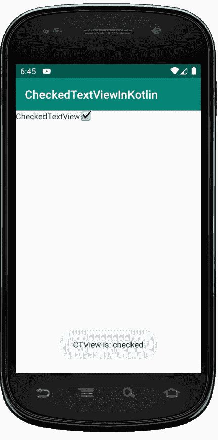
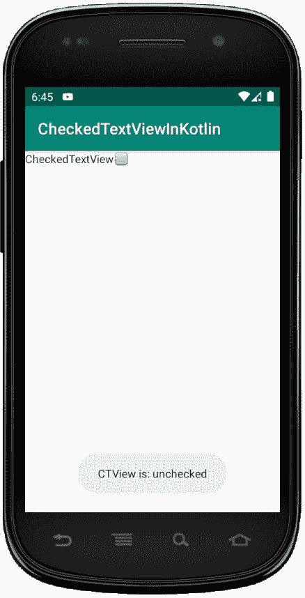

# 检查了流域内的 text view

> 哎哎哎:# t0]https://www . geeksforgeeks . org/checkdtxtview-in-kot Lin/

**CheckedTextView** 用于实现可检查的界面，用户可以勾选或检查所需或必需的项目，而忽略其余的项目。在本文中，我们将讨论如何手动创建 CheckedTextView。

第一步是在安卓工作室制作或创建一个项目。在这里，我们将创建一个名为 CheckedTextViewInKotlin 的项目。

要创建新项目:

1.  点击文件，然后**新建** = > **新项目**
2.  然后，勾选包含柯特林支持，点击下一步按钮。
3.  选择最小的软件开发工具包，无论你需要什么。
4.  选择**清空**活动，然后点击**完成**。

## CheckedTextView 的不同属性:

| 属性 | 描述 |
| android:id | 给文本视图一个唯一的标识。 |
| 安卓:重力 | 我们可以垂直或水平对齐文本视图的文本，或者两者都对齐。 |
| 安卓:身高 | 用于设置文本视图的高度。 |
| 安卓:宽度 | 设置文本视图的宽度。 |
| 安卓:填充 | 用于设置填充。 |
| 安卓:勾号 | 用于设置勾号的可绘制性。 |
| Android:check market(检查市场) | 用于设置复选标记的色调。 |
| Android:check market mode(检查市场模式) | 用于应用复选标记色调的混合模式。 |
| 安卓:选中 | 用于设置 checkedTextView 的初始选中状态，默认情况下为 false。 |

## 修改 activity_main.xml 文件

在这个文件中，我们将添加 CheckedTextView，并使用不同的属性，如 checked，gravity 等。稍后，它将在 Kotlin 文件中被调用，以添加更多功能。

```kt
<?xml version="1.0" encoding="utf-8"?>
<LinearLayout
    xmlns:android="http://schemas.android.com/apk/res/android"
    xmlns:tools="http://schemas.android.com/tools"
    android:id="@+id/container"
    android:layout_width="match_parent"
    android:layout_height="match_parent"
    tools:context=".MainActivity"
    android:orientation="vertical">

    <CheckedTextView
        android:id="@+id/ctv"
        android:layout_width="wrap_content"
        android:layout_height="wrap_content"
        android:checked="true"
        android:gravity="center"
        android:text="@string/checkedTextView"/>

</LinearLayout>
```

**对 strings.xml 文件进行一些修改，比如 app_name 和 Kotlin 文件中使用的其他字符串。**

```kt
<resources>
    <string name="app_name">CheckedTextViewInKotlin</string>
    <string name="msg_shown">CTView is:</string>
    <string name="checked">checked</string>
    <string name="unchecked">unchecked</string>
    <string name="checkedTextView">CheckedTextView</string>
</resources>
```

## MainActivity.kt 文件

这里，我们首先声明一个 checkedTextView 变量，并使用 id 找到 xml checkedTextView。

```kt
val CTView = findViewById(R.id.ctv)
```

然后，使用条件语句进行检查，如

```kt
if (CTView.isChecked)
    android.R.drawable.checkbox_on_background
else
    android.R.drawable.checkbox_off_background)

```

最后，当我们检查文本视图时，我们声明一个变量 msg 来打印该值。

```kt
package com.geeksforgeeks.myfirstkotlinapp

import androidx.appcompat.app.AppCompatActivity
import android.os.Bundle
import android.widget.CheckedTextView
import android.widget.Toast

class MainActivity : AppCompatActivity() {

    override fun onCreate(savedInstanceState: Bundle?) {
        super.onCreate(savedInstanceState)
        setContentView(R.layout.activity_main)

        val CTView = findViewById<CheckedTextView>(R.id.ctv)
        if (CTView != null) {
            CTView.isChecked = false
            CTView.setCheckMarkDrawable(
                android.R.drawable.checkbox_off_background)

            CTView.setOnClickListener {
                CTView.isChecked = !CTView.isChecked
                CTView.setCheckMarkDrawable(
                    if (CTView.isChecked)
                        android.R.drawable.checkbox_on_background
                    else
                        android.R.drawable.checkbox_off_background)

                val msg = getString(R.string.msg_shown)+ " " +
                        getString(if (CTView.isChecked)
                            R.string.checked else R.string.unchecked)
                Toast.makeText(this@MainActivity, msg,
                    Toast.LENGTH_SHORT).show()
            }
        }
    }
}
```

## AndroidManifest.xml 文件

该文件包含字符串. xml 中指定的 app_name 等信息以及其他重要的 android 信息。

```kt
<?xml version="1.0" encoding="utf-8"?>
<manifest xmlns:android="http://schemas.android.com/apk/res/android"
package="com.geeksforgeeks.myfirstkotlinapp">

<application
    android:allowBackup="true"
    android:icon="@mipmap/ic_launcher"
    android:label="@string/app_name"
    android:roundIcon="@mipmap/ic_launcher_round"
    android:supportsRtl="true"
    android:theme="@style/AppTheme">
    <activity android:name=".MainActivity">
        <intent-filter>
            <action android:name="android.intent.action.MAIN" />

            <category android:name="android.intent.category.LAUNCHER" />
        </intent-filter>
    </activity>
</application>

</manifest>
```

## 作为模拟器运行:

