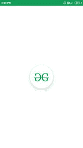

# 使用 Jetpack Compose

在安卓中的圆形图像视图

> 原文:[https://www . geesforgeks . org/circular-imageview-in-Android-using-jet pack-compose/](https://www.geeksforgeeks.org/circular-imageview-in-android-using-jetpack-compose/)

[圆形图像视图](https://www.geeksforgeeks.org/how-to-create-a-circularimageview-in-android-using-hdodenhof-library/)用于许多应用程序。这些类型的图像通常用于表示用户的个人资料图片以及更多的图像。我们已经看到了使用喷气背包合成在安卓系统中实现 [ImageView。在本文中，我们将看一下使用](https://www.geeksforgeeks.org/imageview-in-android-using-jetpack-compose/)[喷气背包合成](https://www.geeksforgeeks.org/basics-of-jetpack-compose-in-android/)在安卓系统中实现 Circle ImageView。

### **分步实施**

**第一步:创建新项目**

要在安卓工作室加那利版本中创建新项目，请参考[如何使用 Jetpack Compose](https://www.geeksforgeeks.org/how-to-create-a-new-project-in-android-studio-canary-version-with-jetpack-compose/) 在安卓工作室加那利版本中创建新项目。

**第二步:将图像添加到可绘制文件夹**

创建新项目后，我们必须在可绘制文件夹中添加一个图像，以便在 ImageView 中显示该图像。从您的文件夹位置复制您的图像并进入我们的项目。在我们的项目中，导航到**应用程序> res >可绘制>右键单击可绘制文件夹**并将您的图像粘贴到那里。

**第三步:使用 MainActivity.kt 文件**

添加此图片后，导航至**app>Java>main activity . kt**并添加以下代码。代码中添加了注释，以更详细地理解代码。

## 我的锅

```
import android.graphics.drawable.shapes.Shape
import android.media.Image
import android.os.Bundle
import android.widget.Toast
import androidx.appcompat.app.AppCompatActivity
import androidx.compose.foundation.BorderStroke
import androidx.compose.foundation.Image
import androidx.compose.foundation.InteractionState
import androidx.compose.foundation.Text
import androidx.compose.foundation.layout.*
import androidx.compose.foundation.shape.CircleShape
import androidx.compose.foundation.shape.RoundedCornerShape
import androidx.compose.foundation.text.KeyboardOptions
import androidx.compose.material.*
import androidx.compose.material.icons.Icons
import androidx.compose.material.icons.filled.AccountCircle
import androidx.compose.material.icons.filled.Info
import androidx.compose.material.icons.filled.Phone
import androidx.compose.runtime.*
import androidx.compose.runtime.savedinstancestate.savedInstanceState
import androidx.compose.ui.Alignment
import androidx.compose.ui.layout.ContentScale
import androidx.compose.ui.platform.setContent
import androidx.compose.ui.res.imageResource
import androidx.compose.ui.tooling.preview.Preview
import androidx.compose.ui.unit.dp
import com.example.gfgapp.ui.GFGAppTheme
import androidx.compose.ui.Modifier
import androidx.compose.ui.draw.clip
import androidx.compose.ui.graphics.Color
import androidx.compose.ui.graphics.SolidColor
import androidx.compose.ui.platform.ContextAmbient
import androidx.compose.ui.platform.testTag
import androidx.compose.ui.res.colorResource
import androidx.compose.ui.text.TextStyle
import androidx.compose.ui.text.font.FontFamily
import androidx.compose.ui.text.input.*
import androidx.compose.ui.unit.Dp
import androidx.compose.ui.unit.TextUnit

class MainActivity : AppCompatActivity() {
    override fun onCreate(savedInstanceState: Bundle?) {
        super.onCreate(savedInstanceState)
        setContent {
            GFGAppTheme {
                // A surface container using the 'background' color from the theme
                Surface(color = MaterialTheme.colors.background) {
                    // at below line we are calling 
                      // our function for button.
                    CircleImg();
                }
            }
        }
    }
}

@Preview(showBackground = true)
@Composable
fun DefaultPreview() {
    GFGAppTheme {
        CircleImg();
    }
}

@Composable
fun CircleImg() {

    Column(

          // we are using column to align our imageview 
          // to center of the screen.
        modifier = Modifier.fillMaxWidth().fillMaxHeight(),

        // below line is used for specifying 
          // vertical arrangement.
        verticalArrangement = Arrangement.Center,

        // below line is used for specifying 
          // horizontal arrangement.
        horizontalAlignment = Alignment.CenterHorizontally,

        ) {
        // creating a card for creating a circle image view. 
        Card(
            // below line is use to add size to our image view and 
              // test tag is use to add tag to our image. 
            modifier = Modifier.preferredSize(100.dp).testTag(tag = "circle"),

              // below line is use to 
              // add shape to our image view. 
            shape = CircleShape,

            // below line is use to add 
              // elevation to our image view. 
            elevation = 12.dp
        ) {
            // below line we are creating a new image.
            Image(
                // in below line we are providing image
                  // resource from drawable folder. 
                imageResource(id = R.drawable.gfgimage),

                  // below line is use to give scaling
                  // to our image view.
                contentScale = ContentScale.Crop,

                  // below line is use to add modifier
                  // to our image view. 
                modifier = Modifier.fillMaxSize()
            )
        }
    }
}
```

现在运行您的应用程序，并查看应用程序的输出。

### **输出:**

