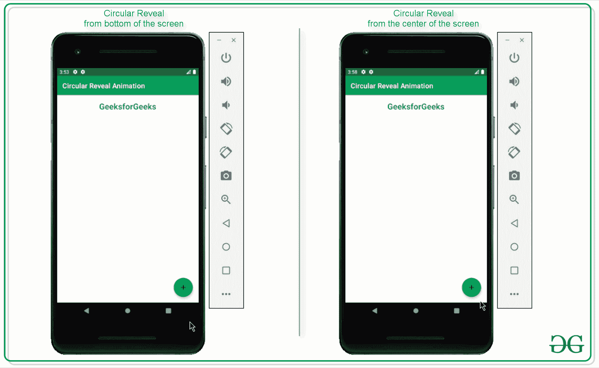
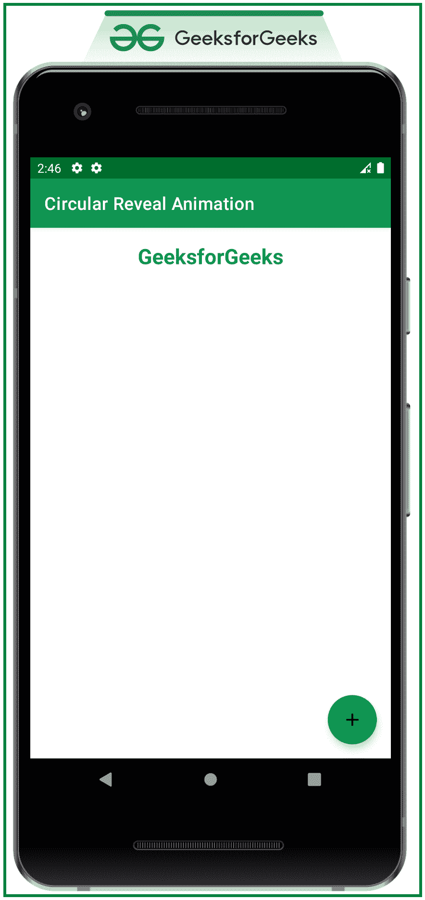

# 安卓中的循环显示动画

> 原文:[https://www . geesforgeks . org/circular-show-animation-in-Android/](https://www.geeksforgeeks.org/circular-reveal-animation-in-android/)

[安卓](https://www.geeksforgeeks.org/animation-in-android-with-example/)中的动画在用户体验中扮演着重要角色。这使得用户专注于他们想要的主要内容。也有助于用户互动。动画与用户交流，真正投入到应用程序的使用中。所以在这篇文章中，讨论了安卓系统中最受欢迎的动画之一**循环展示动画**。请看下图，了解圆形动画的外观。请注意，我们将使用 **Kotlin** 语言来实现该项目。



### **在安卓系统中实现循环动画的步骤**

**第一步:创建一个空的活动项目**

*   创建一个空的活动安卓工作室项目。或者参考[安卓|如何在安卓工作室创建/启动新项目？](https://www.geeksforgeeks.org/android-how-to-create-start-a-new-project-in-android-studio/)了解如何创建一个空的活动 Android Studio 项目。注意选择**科特林**作为编程语言。

**步骤 2:使用 activity_main.xml 文件**

*   实现应用程序的主布局，其中只包含一个按钮，单击该按钮时会触发循环显示动画。
*   要实现用户界面，在 **activity_main.xml** 文件中调用以下代码。

## 可扩展标记语言

```
<?xml version="1.0" encoding="utf-8"?>
<RelativeLayout 
    xmlns:android="http://schemas.android.com/apk/res/android"
    xmlns:app="http://schemas.android.com/apk/res-auto"
    xmlns:tools="http://schemas.android.com/tools"
    android:id="@+id/mainLayout"
    android:layout_width="match_parent"
    android:layout_height="match_parent"
    android:fitsSystemWindows="true"
    tools:context=".MainActivity"
    tools:ignore="HardcodedText">

    <TextView
        android:layout_width="match_parent"
        android:layout_height="wrap_content"
        android:layout_marginTop="16dp"
        android:gravity="center"
        android:text="GeeksforGeeks"
        android:textColor="@color/green_500"
        android:textSize="24sp"
        android:textStyle="bold" />

    <!--The layout which is invisible initially-->
    <LinearLayout
        android:id="@+id/revealLayout"
        android:layout_width="match_parent"
        android:layout_height="match_parent"
        android:background="@color/green_200"
        android:gravity="center"
        android:orientation="vertical"
        android:visibility="gone">

        <Button
            android:layout_width="wrap_content"
            android:layout_height="wrap_content"
            android:backgroundTint="@android:color/white"
            android:text="LEARN PROGRAMMING"
            android:textColor="@android:color/black" />

        <Button
            android:layout_width="wrap_content"
            android:layout_height="wrap_content"
            android:backgroundTint="@android:color/white"
            android:text="CONTRIBUTE"
            android:textColor="@android:color/black" />

        <Button
            android:layout_width="wrap_content"
            android:layout_height="wrap_content"
            android:backgroundTint="@android:color/white"
            android:text="VISIT WEBSITE"
            android:textColor="@android:color/black" />

    </LinearLayout>

    <!--The Fab to toggle the visibility of circular reveal animation-->
    <com.google.android.material.floatingactionbutton.FloatingActionButton
        android:id="@+id/fab"
        android:layout_width="wrap_content"
        android:layout_height="wrap_content"
        android:layout_alignParentEnd="true"
        android:layout_alignParentBottom="true"
        android:layout_gravity="bottom|end"
        android:layout_marginEnd="16dp"
        android:layout_marginBottom="16dp"
        app:srcCompat="@drawable/ic_add" />

</RelativeLayout>
```

**输出 UI:**



### **现在从屏幕底部显示相同的布局**

**第三步:使用 MainActivity.kt 文件**

*   首先，代码是从屏幕右下方的圆形显示动画。
*   调用下面的代码并参考它的输出以便更好地理解，添加注释是为了更好地理解。

## 我的锅

```
import android.animation.Animator
import android.annotation.SuppressLint
import android.content.res.ColorStateList
import android.os.Build
import android.os.Bundle
import android.view.View
import android.view.ViewAnimationUtils
import androidx.annotation.RequiresApi
import androidx.appcompat.app.AppCompatActivity
import androidx.core.content.res.ResourcesCompat
import com.google.android.material.floatingactionbutton.FloatingActionButton
import kotlin.math.hypot
import kotlin.math.max

class MainActivity : AppCompatActivity() {

    private lateinit var mRevealLayout: View
    private lateinit var mFab: FloatingActionButton

    // boolean variable to check whether the
      // reveal layout is visible or not
    private var isRevealed = false

    @RequiresApi(Build.VERSION_CODES.M)
    override fun onCreate(savedInstanceState: Bundle?) {
        super.onCreate(savedInstanceState)
        setContentView(R.layout.activity_main)

        mRevealLayout = findViewById(R.id.revealLayout)
        mFab = findViewById(R.id.fab)

        // initially the color of the FAB should be green
        mFab.backgroundTintList = ColorStateList.valueOf(
                ResourcesCompat.getColor(
                        resources,
                        R.color.green_500,
                        null
                )
        )

        // upon clicking the FAB the reveal should be 
          // toggled according to the boolean value
        mFab.setOnClickListener {
            revealLayoutFun()
        }
    }

    // this function is triggered when 
      // the FAB is clicked
    @RequiresApi(Build.VERSION_CODES.M)
    @SuppressLint("ResourceAsColor")
    private fun revealLayoutFun() {

        // based on the boolean value the 
          // reveal layout should be toggled
        if (!isRevealed) {

            // get the right and bottom side 
              // lengths of the reveal layout
            val x: Int = mRevealLayout.right
            val y: Int = mRevealLayout.bottom

            // here the starting radius of the reveal 
              // layout is 0 when it is not visible
            val startRadius = 0

            // make the end radius should match
              // the while parent view
            val endRadius = hypot(
                    mRevealLayout.width.toDouble(),
                    mRevealLayout.height.toDouble()
            ).toInt()

            // and set the background tint of the FAB to white 
              // color so that it can be visible
            mFab.backgroundTintList = ColorStateList.valueOf(
                    ResourcesCompat.getColor(
                            resources,
                            R.color.white,
                            null
                    )
            )
            // now set the icon as close for the FAB
            mFab.setImageResource(R.drawable.ic_close)

            // create the instance of the ViewAnimationUtils to 
              // initiate the circular reveal animation
            val anim = ViewAnimationUtils.createCircularReveal(
                    mRevealLayout,
                    x,
                    y,
                    startRadius.toFloat(),
                    endRadius.toFloat()
            )

            // make the invisible reveal layout to visible 
              // so that upon revealing it can be visible to user
            mRevealLayout.visibility = View.VISIBLE
            // now start the reveal animation
            anim.start()

            // set the boolean value to true as the reveal
              // layout is visible to the user
            isRevealed = true

        } else {

            // get the right and bottom side lengths 
              // of the reveal layout
            val x: Int = mRevealLayout.right
            val y: Int = mRevealLayout.bottom

            // here the starting radius of the reveal layout is its full width
            val startRadius: Int = max(mRevealLayout.width, mRevealLayout.height)

            // and the end radius should be zero 
              // at this point because the layout should be closed
            val endRadius = 0

            // now set the background tint of the FAB to green
              // so that it can be visible to the user
            mFab.backgroundTintList = ColorStateList.valueOf(
                    ResourcesCompat.getColor(
                            resources,
                            R.color.green_500,
                            null
                    )
            )

            // now again set the icon of the FAB to plus
            mFab.setImageResource(R.drawable.ic_add)

            // create the instance of the ViewAnimationUtils to 
              // initiate the circular reveal animation
            val anim = ViewAnimationUtils.createCircularReveal(
                    mRevealLayout,
                    x,
                    y,
                    startRadius.toFloat(),
                    endRadius.toFloat()
            )

            // now as soon as the animation is ending, the reveal 
              // layout should also be closed
            anim.addListener(object : Animator.AnimatorListener {
                override fun onAnimationStart(animator: Animator) {}
                override fun onAnimationEnd(animator: Animator) {
                    mRevealLayout.visibility = View.GONE
                }

                override fun onAnimationCancel(animator: Animator) {}
                override fun onAnimationRepeat(animator: Animator) {}
            })

            // start the closing animation
            anim.start()

            // set the boolean variable to false
              // as the reveal layout is invisible
            isRevealed = false
        }
    }
}
```

**输出:**

<video class="wp-video-shortcode" id="video-544315-1" width="640" height="360" preload="metadata" controls=""><source type="video/mp4" src="https://media.geeksforgeeks.org/wp-content/uploads/20210119152457/Untitled-Project.mp4?_=1">[https://media.geeksforgeeks.org/wp-content/uploads/20210119152457/Untitled-Project.mp4](https://media.geeksforgeeks.org/wp-content/uploads/20210119152457/Untitled-Project.mp4)</video>

### **现在从屏幕中心显示相同的布局**

> **注意:**应用程序的布局保持不变，只是 MainActivity.kt 文件中的代码发生了变化。

*   在 MainActivity.kt 文件中调用以下代码，从屏幕中心显示相同的布局。

## 我的锅

```
import android.animation.Animator
import android.annotation.SuppressLint
import android.content.res.ColorStateList
import android.os.Build
import android.os.Bundle
import android.view.View
import android.view.ViewAnimationUtils
import androidx.annotation.RequiresApi
import androidx.appcompat.app.AppCompatActivity
import androidx.core.content.res.ResourcesCompat
import com.google.android.material.floatingactionbutton.FloatingActionButton
import kotlin.math.hypot
import kotlin.math.max

class MainActivity : AppCompatActivity() {

    private lateinit var mRevealLayout: View
    private lateinit var mFab: FloatingActionButton

    // boolean variable to check whether
      // the reveal layout is visible or not
    private var isRevealed = false

    @RequiresApi(Build.VERSION_CODES.M)
    override fun onCreate(savedInstanceState: Bundle?) {
        super.onCreate(savedInstanceState)
        setContentView(R.layout.activity_main)

        mRevealLayout = findViewById(R.id.revealLayout)
        mFab = findViewById(R.id.fab)

        // initially the color of the FAB should be green
        mFab.backgroundTintList = ColorStateList.valueOf(
                ResourcesCompat.getColor(
                        resources,
                        R.color.green_500,
                        null
                )
        )

        // upon clicking the FAB the reveal should
          // be toggled according to the boolean value
        mFab.setOnClickListener {
            revealLayoutFun()
        }
    }

    // this function is triggered when
      // the FAB is clicked
    @RequiresApi(Build.VERSION_CODES.M)
    @SuppressLint("ResourceAsColor")
    private fun revealLayoutFun() {

        // based on the boolean value the 
          // reveal layout should be toggled
        if (!isRevealed) {

            // get the right and bottom side 
              // lengths of the reveal layout
            val x: Int = mRevealLayout.right / 2
            val y: Int = mRevealLayout.bottom / 2

            // here the starting radius of the reveal
              // layout is 0 when it is not visible
            val startRadius = 0

            // make the end radius should
              // match the while parent view
            val endRadius = hypot(
                    mRevealLayout.width.toDouble(),
                    mRevealLayout.height.toDouble()
            ).toInt()

            // and set the background tint of the FAB to white 
             // color so that it can be visible
            mFab.backgroundTintList = ColorStateList.valueOf(
                    ResourcesCompat.getColor(
                            resources,
                            R.color.white,
                            null
                    )
            )
            // now set the icon as close for the FAB
            mFab.setImageResource(R.drawable.ic_close)

            // create the instance of the ViewAnimationUtils to 
              // initiate the circular reveal animation
            val anim = ViewAnimationUtils.createCircularReveal(
                    mRevealLayout,
                    x,
                    y,
                    startRadius.toFloat(),
                    endRadius.toFloat()
            )

            // make the invisible reveal layout to visible 
              // so that upon revealing it can be visible to user
            mRevealLayout.visibility = View.VISIBLE
            // now start the reveal animation
            anim.start()

            // set the boolean value to true as the reveal 
              // layout is visible to the user
            isRevealed = true

        } else {

            // get the right and bottom side lengths
              // of the reveal layout
            val x: Int = mRevealLayout.right / 2
            val y: Int = mRevealLayout.bottom / 2

            // here the starting radius of the reveal layout is its full width
            val startRadius: Int = max(mRevealLayout.width, mRevealLayout.height)

            // and the end radius should be zero at this 
              // point because the layout should be closed
            val endRadius = 0

            // now set the background tint of the FAB to green
              // so that it can be visible to the user
            mFab.backgroundTintList = ColorStateList.valueOf(
                    ResourcesCompat.getColor(
                            resources,
                            R.color.green_500,
                            null
                    )
            )

            // now again set the icon of the FAB to plus
            mFab.setImageResource(R.drawable.ic_add)

            // create the instance of the ViewAnimationUtils 
              // to initiate the circular reveal animation
            val anim = ViewAnimationUtils.createCircularReveal(
                    mRevealLayout,
                    x,
                    y,
                    startRadius.toFloat(),
                    endRadius.toFloat()
            )

            // now as soon as the animation is ending, the reveal 
              // layout should also be closed
            anim.addListener(object : Animator.AnimatorListener {
                override fun onAnimationStart(animator: Animator) {}
                override fun onAnimationEnd(animator: Animator) {
                    mRevealLayout.visibility = View.GONE
                }

                override fun onAnimationCancel(animator: Animator) {}
                override fun onAnimationRepeat(animator: Animator) {}
            })

            // start the closing animation
            anim.start()

            // set the boolean variable to false 
             // as the reveal layout is invisible
            isRevealed = false
        }
    }
}
```

**输出:**

<video class="wp-video-shortcode" id="video-544315-2" width="640" height="360" preload="metadata" controls=""><source type="video/mp4" src="https://media.geeksforgeeks.org/wp-content/uploads/20210119152924/Untitled-Project.mp4?_=2">[https://media.geeksforgeeks.org/wp-content/uploads/20210119152924/Untitled-Project.mp4](https://media.geeksforgeeks.org/wp-content/uploads/20210119152924/Untitled-Project.mp4)</video>