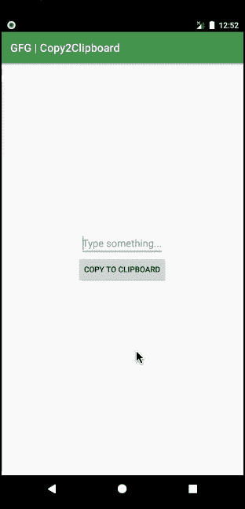

# 安卓中的剪贴板

> 原文:[https://www.geeksforgeeks.org/clipboard-in-android/](https://www.geeksforgeeks.org/clipboard-in-android/)

**安卓的剪贴板**对不同的数据类型进行复制粘贴，比如文本字符串、图像、二进制流数据等复杂的数据类型。剪贴板在同一个应用程序内以及实现了剪贴板框架的多个应用程序之间执行复制和粘贴操作。剪贴板一次可以容纳的剪辑对象数量是有限制的。剪贴板一次只能容纳一个对象。如果一个对象放在剪贴板上，剪贴板上以前保存的对象将被删除。剪辑对象可以接收**三种**类型的数据:

*   **文本:**一个字符串可以直接放入剪辑对象，然后放入剪贴板。然后，我们可以从剪贴板获取 clip 对象，并将字符串粘贴到应用程序的文本或存储字段中。
*   **URI:** 用于从内容提供商复制复杂数据。URI 对象可以放入剪辑对象，然后加载到剪贴板。要执行粘贴操作，必须将剪辑对象解析到源中，例如内容提供者。
*   **意图:**必须创建一个意图对象，并将其放入剪辑对象中，然后加载到剪贴板上。可以执行类似于文本的粘贴操作。

## 逐步实施

要在 Android 中制作一个将一些数据存储到剪贴板并从中派生数据的应用程序，我们需要执行以下步骤:

### 保存到剪贴板:

下面给出一个 GIF 示例，了解一下在这篇 文章中我们要做什么。注意，我们将使用 **Kotlin** 语言来实现这个项目。



**第一步:创建新项目**

要在安卓工作室创建新项目，请参考[如何在安卓工作室创建/启动新项目](https://www.geeksforgeeks.org/android-how-to-create-start-a-new-project-in-android-studio/)。注意选择**科特林**作为编程语言。

**步骤 2:使用 activity_main.xml 文件**

转到代表应用程序用户界面的 **activity_main.xml** 文件。创建一个 [**编辑文本**](https://www.geeksforgeeks.org/android-edittext-in-kotlin/) ，在这里我们将提供要保存在剪贴板中的文本，以及一个**按钮**来执行保存操作。下面是**activity _ main . XML**文件的代码。

## 可扩展标记语言

```kt
<?xml version="1.0" encoding="utf-8"?>
<RelativeLayout 
    xmlns:android="http://schemas.android.com/apk/res/android"
    android:layout_width="match_parent"
    android:layout_height="match_parent"
    android:orientation="vertical">

    <!--Text must be entered here-->
    <EditText
        android:id="@+id/txtCopy"
        android:layout_width="wrap_content"
        android:layout_height="wrap_content"
        android:layout_above="@id/btnCopy"
        android:layout_centerHorizontal="true"
        android:hint="Type something..." />

    <!--Text entered in the above field gets copied to 
        Clipboard on this button click-->
    <Button
        android:id="@+id/btnCopy"
        android:layout_width="wrap_content"
        android:layout_height="wrap_content"
        android:layout_centerInParent="true"
        android:text="Copy to Clipboard" />

</RelativeLayout>
```

**第三步:使用 MainActivity.kt 文件**

转到 **MainActivity.kt** 文件，参考以下代码。下面是 **MainActivity.kt** 文件的代码。代码中添加了注释，以更详细地理解代码。

## 我的锅

```kt
import android.content.ClipData
import android.content.ClipboardManager
import android.os.Bundle
import android.widget.Button
import android.widget.EditText
import android.widget.Toast
import androidx.appcompat.app.AppCompatActivity

class MainActivity : AppCompatActivity() {
    override fun onCreate(savedInstanceState: Bundle?) {
        super.onCreate(savedInstanceState)
        setContentView(R.layout.activity_main)

        // Declaring the edit text and button from the layout file
        val copyTxt = findViewById<EditText>(R.id.txtCopy)
        val copyBtn = findViewById<Button>(R.id.btnCopy)

        // Initializing the ClipboardManager and Clip data
        val clipboardManager = getSystemService(CLIPBOARD_SERVICE) as ClipboardManager
        var clipData: ClipData

        // Action when the copy button is clicked
        copyBtn.setOnClickListener {

            // Text from the edit text is stored in a val
            val txtCopy = copyTxt!!.text.toString()

            // clip data is initialized with the text variable declared above
            clipData = ClipData.newPlainText("text", txtCopy)

            // Clipboard saves this clip object
            clipboardManager.setPrimaryClip(clipData)

            // A toast is shown for user reference that the text is copied to the clipboard
            Toast.makeText(applicationContext, "Copied to Clipboard", Toast.LENGTH_SHORT).show()
        }
    }
}
```