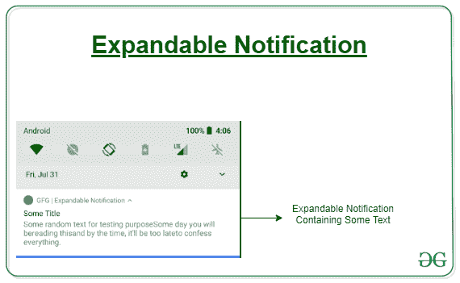

# 在安卓中创建包含一些文本的可扩展通知

> 原文:[https://www . geeksforgeeks . org/create-a-expandable-notification-contain-some-text-in-Android/](https://www.geeksforgeeks.org/create-an-expandable-notification-containing-some-text-in-android/)

通知是一种由手机中的任何应用程序生成的消息，建议检查应用程序，这可以是从更新(低优先级通知)到应用程序中出现问题的任何内容(高优先级通知)。 A [基本通知](https://www.geeksforgeeks.org/notifications-in-kotlin/) 由一个标题、一行文本以及用户可以作为响应执行的一个或多个动作组成。为了提供更多的信息，还可以通过应用本文中描述的几个通知模板之一来创建大的、可扩展的通知。一些日常生活中的例子可以是通知抽屉中由 Whatsapp、Gmail、SMS 等附加的通知，用户可以将其展开，在 Gmail 的情况下，可以找到关于收到的消息的一些细节，例如发件人姓名、主题和部分文本。在本文中，让我们在包含一些文本的应用程序中创建一个通知。



#### 方法

**第一步:创建新项目**

要在安卓工作室创建新项目，请参考[如何在安卓工作室创建/启动新项目。](https://www.geeksforgeeks.org/android-how-to-create-start-a-new-project-in-android-studio/)

**第二步:修改 activity_main.xml 文件**

在 XML 文件中，只需添加一个按钮，点击该按钮将构建一个可扩展的通知。通过展开通知抽屉中的通知，将显示一些文本。

## activity_main.xml

```
<?xml version="1.0" encoding="utf-8"?>
<RelativeLayout
    xmlns:android="http://schemas.android.com/apk/res/android"
    xmlns:tools="http://schemas.android.com/tools"
    xmlns:app="http://schemas.android.com/apk/res-auto"
    android:layout_width="match_parent"
    android:layout_height="match_parent"
    tools:context=".MainActivity">

    <Button
        android:id="@+id/btn"
        android:layout_width="wrap_content"
        android:layout_height="wrap_content"
        android:text="click"
        android:layout_centerInParent="true"/>

</RelativeLayout>
```

**第三步:修改主活动文件**

现在，看看下面在科特林的代码。首先，按照 [创建通知](https://www.geeksforgeeks.org/notifications-in-kotlin/) 中的描述，构建一个包含所有基本内容的通知。然后，用样式对象调用**【setStyle()】**，并提供每个模板对应的信息，如下图。

## MainActivity.kt 公司

```
package com.example.expandable_notification_bigtext

import android.app.*
import android.content.Context
import android.content.Intent
import android.graphics.Color
import android.os.Build
import androidx.appcompat.app.AppCompatActivity
import android.os.Bundle
import android.widget.Button
import androidx.annotation.RequiresApi
import androidx.core.app.NotificationManagerCompat

class MainActivity : AppCompatActivity() {

    // Assigning variables to Notification Manager, Channel and Builder
    lateinit var notifManager : NotificationManager
    lateinit var notifChannel : NotificationChannel
    lateinit var notifBuilder : Notification.Builder

    // Evaluating ChannelID and Description for the Custom Notification
    private val description = "Some Description"
    private val channelID = "Some Channel ID"

    override fun onCreate(savedInstanceState: Bundle?) {
        super.onCreate(savedInstanceState)
        setContentView(R.layout.activity_main)

        // Declaring the button which onclick generates a notification
        val btn = findViewById<Button>(R.id.btn)

        // Notification Service for the Manager
        notifManager = getSystemService(Context.NOTIFICATION_SERVICE) 
        as NotificationManager

        // Notifications are in the form of Intents
        val someintent = Intent(this,LauncherActivity::class.java)
        val pendingIntent = PendingIntent.getActivity(this,0,someintent,
        PendingIntent.FLAG_UPDATE_CURRENT)

        // Idea is to click the button and the notification appears
        btn.setOnClickListener {

        // Declaring a message (string) to be displayed 
        // in the notification
        val message = "Some random text for testing purpose" +
                      "Some day you will be" +
                         "reading this" +
                      "and by the time, it'll be too late" +
                      "to confess everything."

            // If Min. API level of the phone is 26, then notification could be 
            // made asthetic
            if (Build.VERSION.SDK_INT >= Build.VERSION_CODES.O) {
                notifChannel = NotificationChannel(channelID,description,
                NotificationManager.IMPORTANCE_HIGH)
                notifChannel.enableLights(true)
                notifChannel.lightColor = Color.RED
                notifChannel.enableVibration(true)

                notifManager.createNotificationChannel(notifChannel)

                notifBuilder = Notification.Builder(this,channelID)
                        .setContentTitle("Some Title")
                        .setContentText("Some Content Text")
                        .setSmallIcon(R.mipmap.ic_launcher_round)

                        // Command to Insert a message in the Notification
                        .setStyle(Notification.BigTextStyle()// <-- Look here
                        .bigText(message))// <---- Look here

                        .setContentIntent(pendingIntent)
            }
            // Else the Android device would give out default UI attributes
            else{
                notifBuilder = Notification.Builder(this)
                        .setContentTitle("Some Title")
                        .setContentText("Some Content Text")
                        .setContentIntent(pendingIntent)
            }

            // Everything is done now and the Manager is to be notified about 
            // the Builder which built a Notification for the application
            notifManager.notify(1234,notifBuilder.build())
        }
    }
}
```

> ***注意:*** 如果您之前搜索过可扩展通知的代码，那么您一定看到过这一行代码:
> 
> *。setStyle(通知 Compat)。BigTextStyle()。big text(message)〔t1〕*
> 
> 由于“通知兼容”目前已被弃用，每当试图构建通知时(在我们的例子中是点击按钮)，您的代码总是会崩溃。相反，只需使用“通知”。

#### 输出:在模拟器上运行

<video class="wp-video-shortcode" id="video-458484-1" width="640" height="360" preload="metadata" controls=""><source type="video/mp4" src="https://media.geeksforgeeks.org/wp-content/uploads/20200813172100/expandable-notification.mp4?_=1">[https://media.geeksforgeeks.org/wp-content/uploads/20200813172100/expandable-notification.mp4](https://media.geeksforgeeks.org/wp-content/uploads/20200813172100/expandable-notification.mp4)</video>