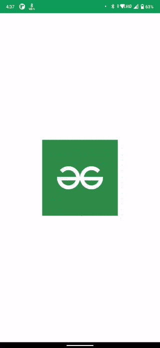

# 在安卓 Jetpack 作曲中创建触摸弹跳动画

> 原文:[https://www . geesforgeks . org/create-bounce-animation-in-Android-jet pack-compose/](https://www.geeksforgeeks.org/create-bounce-animation-on-touch-in-android-jetpack-compose/)

**先决条件:**

*   [科特林](https://www.geeksforgeeks.org/kotlin-programming-language/)基础知识
*   [喷气背包合成](https://www.geeksforgeeks.org/basics-of-jetpack-compose-in-android/)基础知识

在这篇文章中，我们将看看如何创建一个反弹动画时，用户点击任何东西，进一步说，它可以根据应用程序的使用进行扩展。这里有一个演示动画的示例 gif。



### 逐步实施

**步骤 1:创建一个新项目(或在现有的合成项目中使用它)**

要在 Android Studio Canary 版本中创建新项目，请参考文章如何[使用 Jetpack Compose 在 Android Studio Canary 版本中创建新项目。](https://www.geeksforgeeks.org/how-to-create-a-new-project-in-android-studio-canary-version-with-jetpack-compose/)

**步骤 2:使用 MainActivity.kt**

创建一个存储状态(释放/按下)的枚举类。

## 我的锅

```kt
enum class BounceState { Pressed, Released }
```

**第三步:添加动画**

创建一个可组合的函数 Bounce，添加以下代码

## 我的锅

```kt
var currentState: BounceState by remember { mutableStateOf(BounceState.Released) }
val transition = updateTransition(targetState = currentState, label = "animation")

val scale: Float by transition.animateFloat(
        transitionSpec = { spring(stiffness = 900f) }, label = ""
) { state ->

        // When the item is pressed , reduce
          // its size by 5% or make its size 0.95
          // of its original size
        // Change this value to see effect
        if (state == BounceState.Pressed) {
            0.95f
        } else {
            // When the item is released ,
              // make it of its original size
            1f
      }
}
```

然后使用 pointerInputScope 修改器来检测手势并应用动画，将下面的代码也添加到 Bounce 可组合中。

## 我的锅

```kt
// Basic compose Box Layout
Box(Modifier.fillMaxSize(), contentAlignment = Alignment.Center) {
Column(modifier = Modifier
            .pointerInput(Unit) {
                detectTapGestures(onPress = {

                    // Set the currentState to Pressed
                      // to trigger Pressed animation
                    currentState = BounceState.Pressed

                    // Waits for the tap to release
                      // before returning the call
                    tryAwaitRelease()

                    // Set the currentState to Release
                      // to trigger Release animation
                    currentState = BounceState.Released
                })
            }) {
            Image(
                painter = painterResource(id = R.drawable.gfg),
                contentDescription = "gfg",
                modifier = Modifier.graphicsLayer {
                    scaleX = scale
                    scaleY = scale
              })
      }
}
```

我们完了。这是**主活动. kt** 文件的最终代码。

## 我的锅

```kt
import android.os.Bundle
import androidx.activity.ComponentActivity
import androidx.activity.compose.setContent
import androidx.compose.animation.core.Transition
import androidx.compose.animation.core.animateFloat
import androidx.compose.animation.core.spring
import androidx.compose.animation.core.updateTransition
import androidx.compose.foundation.Image
import androidx.compose.foundation.gestures.detectTapGestures
import androidx.compose.foundation.layout.Box
import androidx.compose.foundation.layout.Column
import androidx.compose.foundation.layout.fillMaxSize
import androidx.compose.material.MaterialTheme
import androidx.compose.material.Surface
import androidx.compose.runtime.*
import androidx.compose.ui.Alignment
import androidx.compose.ui.Modifier
import androidx.compose.ui.graphics.graphicsLayer
import androidx.compose.ui.input.pointer.pointerInput
import androidx.compose.ui.res.painterResource
import androidx.compose.ui.tooling.preview.Preview
import com.shaun.bounceanimation.ui.theme.BounceAnimationTheme

class MainActivity : ComponentActivity() {
    override fun onCreate(savedInstanceState: Bundle?) {
        super.onCreate(savedInstanceState)
        setContent {
            BounceAnimationTheme {
                Surface(color = MaterialTheme.colors.background) {
                    Bounce()
                }
            }
        }
    }
}

enum class BounceState { Pressed, Released }

@Preview(showBackground = true)
@Composable
fun Bounce() {
    var currentState: BounceState by remember { mutableStateOf(BounceState.Released) }
    val transition = updateTransition(targetState = currentState, label = "animation")
    val scale: Float by transition.animateFloat(
        transitionSpec = { spring(stiffness = 900f) }, label = ""
    ) { state ->

        // When the item is pressed ,reduce its size
          // by 5% or make its size 0.95 of its original size
        // Change this value to see effect
        if (state == BounceState.Pressed) {
            0.95f
        } else {
            // When the item is released ,
             // make it of its original size
            1f
        }
    }

// Basic compose Box Layout
Box(Modifier.fillMaxSize(), contentAlignment = Alignment.Center) {

Column(modifier = Modifier
            .pointerInput(Unit) {
                detectTapGestures(onPress = {

                    // Set the currentState to Pressed
                      // to trigger Pressed animation
                    currentState = BounceState.Pressed

                    // Waits for the tap to release
                      // before returning the call
                    tryAwaitRelease()

                    // Set the currentState to Release
                      // to trigger Release animation
                    currentState = BounceState.Released
                })
            }) {
            Image(
                painter = painterResource(id = R.drawable.gfg),
                contentDescription = "gfg",
                modifier = Modifier.graphicsLayer {
                    scaleX = scale
                    scaleY = scale
              })
        }
    }
}
```

**输出:**

从[这里](https://github.com/sunny52525/GFG-articles/tree/master/BounceAnimation)获取完整的项目。