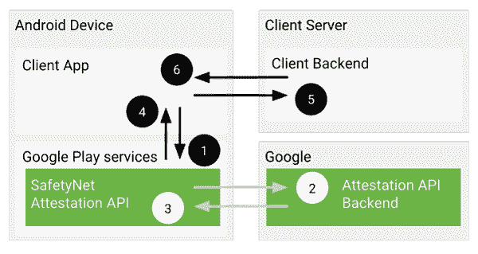
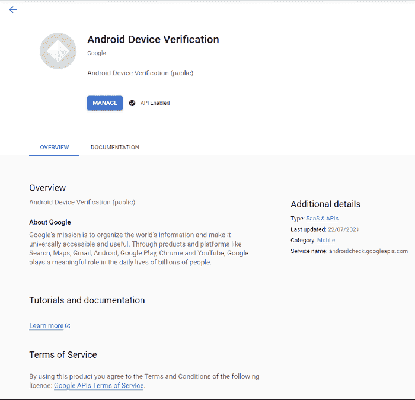

# 在安卓中创建安全网检查器应用程序

> 原文:[https://www . geesforgeks . org/creating-a-safety-net-checker-application-in-Android/](https://www.geeksforgeeks.org/creating-a-safety-net-checker-application-in-android/)

在本教程中，我们将构建一个安全网检查应用程序，它将帮助我们理解谷歌的安全网证明应用编程接口函数是如何工作的，并理解 JWS 在科特林中解析对象，生成随机数并在应用编程接口调用期间传递它们。此外，理解 Safetynet 对于每个安卓应用开发者来说都是必要的，因为它的安全检查机制使得开发者依赖谷歌的安全检查实现，而在构建可扩展的应用时，必须参考谷歌的安全检查实现。

**先决条件:**

1.  Android Studio 4.x.x 版
2.  谷歌云账户
3.  安卓设备或模拟器

### **了解安全网**

SafetyNet 是谷歌提供的一个简单且可扩展的解决方案，用于验证设备兼容性和安全性。对于担心应用程序安全性的应用程序开发人员来说，谷歌相信其安卓安全网将是正确的答案。由于非常强调安全性，SafetyNet 本质上保护了应用程序中的敏感数据，并有助于保持用户信任和设备完整性。安全网是谷歌游戏服务的一部分，独立于设备制造商。因此，它要求在设备上启用谷歌播放服务，以便应用编程接口顺利运行。



### **在谷歌云项目下创建项目**

首先你需要在 GCP 创建一个项目，并激活安卓设备验证应用编程接口。然后转到平台上的凭据部分获取密钥，这将是以后向安全网络认证应用编程接口发送认证请求所必需的。



### **现在在安卓工作室**创建一个空项目

基本上，在安卓工作室中创建一个空的应用程序，并添加我们将用于这个项目的依赖项。在本文中，我们将使用片段导航和视图绑定来处理视图的功能。要在项目中启用视图绑定，请遵循《视图绑定指南》。下面是 **build.gradle** 文件的代码。

## 我的锅

```kt
def nav_version = "2.3.1"
implementation 'androidx.core:core-ktx:1.6.0'
implementation 'androidx.appcompat:appcompat:1.3.1'
implementation 'com.google.android.material:material:1.4.0'
implementation 'androidx.constraintlayout:constraintlayout:2.1.0'
implementation("androidx.navigation:navigation-fragment-ktx:$nav_version")
implementation("androidx.navigation:navigation-ui-ktx:$nav_version")
implementation 'androidx.legacy:legacy-support-v4:1.0.0'
testImplementation 'junit:junit:4.13.2'
androidTestImplementation 'androidx.test.ext:junit:1.1.3'
androidTestImplementation 'androidx.test.espresso:espresso-core:3.4.0'
implementation "com.google.android.gms:play-services-location:18.0.0"
implementation 'com.google.android.gms:play-services-safetynet:17.0.1'
implementation 'androidx.fragment:fragment-ktx:1.3.6'
implementation 'com.google.api-client:google-api-client:1.30.11'
```

### **设置安全网应用**

现在我们需要在 MainActivity 下创建 2 个片段，并可以将它们称为 RequestFragment 和 ResultFragment。请求片段将有一个按钮来点击并拉出一个请求到 SafetyAttestationApi，以便从中获取数据并显示在结果片段中。首先，在名为 nav_graph.xml 的 res 中创建导航，它应该如下所示。并将下面的代码添加到该文件中。下面是 **nav_graph.xml** 文件的代码。

## 可扩展标记语言

```kt
<?xml version="1.0" encoding="utf-8"?>
<navigation xmlns:android="http://schemas.android.com/apk/res/android"
    xmlns:app="http://schemas.android.com/apk/res-auto"
    xmlns:tools="http://schemas.android.com/tools"
    android:id="@+id/nav_graph"
    app:startDestination="@+id/request_fragment">
    <!--This creates nav path to request fragment-->
    <fragment
        android:id="@+id/request_fragment"
        android:name="com.shanu.safetynetchecker.ui.Request"
        android:label="Safetynet Request"
        tools:layout="@layout/fragment_request"
        >
        <action
            android:id="@+id/action_request_fragment_to_result_fragment"
            app:destination="@id/result_fragment" />
    </fragment>

    <!--This creates nav path to result fragment-->
    <fragment
        android:id="@+id/result_fragment"
        android:name="com.shanu.safetynetchecker.ui.Result"
        android:label="Safetynet Result"
        tools:layout="@layout/fragment_result"
        >
        <action
            android:id="@+id/action_result_fragment_to_request_fragment"
            app:destination="@id/request_fragment" />
        <!--This is required parcel we need to pass between them -->
        <argument
            android:name="data"
            app:argType="com.shanu.safetynetchecker.model.SafetynetResultModel" />
    </fragment>

</navigation>
```

这个图将把我们的请求和结果片段连接到主活动之上，因此应用程序的流程可以顺利工作。

### **实现应用编程接口**

现在我们需要在 Request.kt 中添加函数，从 API 中获取数据，然后在 Result 屏幕中显示。在 Kotlin 中实现逻辑之前，我们需要准备如下布局。下面是 **activity_main.xml** 文件的代码。

## 可扩展标记语言

```kt
<?xml version="1.0" encoding="utf-8"?>
<androidx.constraintlayout.widget.ConstraintLayout xmlns:android="http://schemas.android.com/apk/res/android"
    xmlns:app="http://schemas.android.com/apk/res-auto"
    xmlns:tools="http://schemas.android.com/tools"
    android:layout_width="match_parent"
    android:layout_height="match_parent"
    tools:context=".MainActivity">
    <!--We create a container inside main activity to handle fragments-->
    <androidx.fragment.app.FragmentContainerView
        android:id="@+id/nav_host_fragment"
        android:name="androidx.navigation.fragment.NavHostFragment"
        android:layout_width="0dp"
        android:layout_height="0dp"
        app:layout_constraintLeft_toLeftOf="parent"
        app:layout_constraintRight_toRightOf="parent"
        app:layout_constraintTop_toTopOf="parent"
        app:layout_constraintBottom_toBottomOf="parent"
        app:defaultNavHost="true"
        app:navGraph="@navigation/nav_graph" />
</androidx.constraintlayout.widget.ConstraintLayout>
```

下面是 **fragment_request.xml** 文件的代码。

## 可扩展标记语言

```kt
<?xml version="1.0" encoding="utf-8"?>
<FrameLayout xmlns:android="http://schemas.android.com/apk/res/android"
    xmlns:app="http://schemas.android.com/apk/res-auto"
    xmlns:tools="http://schemas.android.com/tools"
    android:layout_width="match_parent"
    android:layout_height="match_parent"
    android:id="@+id/request_fragment"
    tools:context=".ui.Request">

    <androidx.constraintlayout.widget.ConstraintLayout
        android:layout_width="match_parent"
        android:layout_height="match_parent">

        <!--Button to handle click to send request-->
        <com.google.android.material.button.MaterialButton
            android:id="@+id/btnStatus"
            style="@style/Widget.App.Button.OutlinedButton.Icon"
            android:layout_width="wrap_content"
            android:layout_height="wrap_content"
            android:width="160dp"
            android:height="160dp"
            android:text="@string/check_status"
            android:textSize="20sp"
            android:textStyle="bold"
            app:layout_constraintBottom_toBottomOf="parent"
            app:layout_constraintEnd_toEndOf="parent"
            app:layout_constraintStart_toStartOf="parent"
            app:layout_constraintTop_toTopOf="parent"
            app:shapeAppearanceOverlay="@style/ShapeAppearanceOverlay.MyApp.Button.Circle" />

    </androidx.constraintlayout.widget.ConstraintLayout>

</FrameLayout>
```

下面是 **fragment_result.xml** 文件的代码。

## 可扩展标记语言

```kt
<?xml version="1.0" encoding="utf-8"?>
<FrameLayout xmlns:android="http://schemas.android.com/apk/res/android"
    xmlns:app="http://schemas.android.com/apk/res-auto"
    xmlns:tools="http://schemas.android.com/tools"
    android:layout_width="match_parent"
    android:layout_height="match_parent"
    android:id="@+id/result_fragment"
    tools:context=".ui.Result">

    <androidx.constraintlayout.widget.ConstraintLayout
        android:layout_width="match_parent"
        android:layout_height="match_parent">

        <androidx.cardview.widget.CardView
            android:layout_width="0dp"
            android:layout_height="0dp"
            android:layout_marginStart="20dp"
            android:layout_marginTop="40dp"
            android:layout_marginEnd="20dp"
            android:layout_marginBottom="40dp"
            app:layout_constraintBottom_toBottomOf="parent"
            app:layout_constraintEnd_toEndOf="parent"
            app:layout_constraintStart_toStartOf="parent"
            app:layout_constraintTop_toTopOf="parent">
            <!--Container to have data which shows result-->
            <androidx.constraintlayout.widget.ConstraintLayout
                android:layout_width="match_parent"
                android:layout_height="match_parent">

                <!--This shows profile match-->
                <TextView
                    android:id="@+id/textView2"
                    android:layout_width="wrap_content"
                    android:layout_height="wrap_content"
                    android:layout_marginStart="40dp"
                    android:layout_marginTop="40dp"
                    android:text="Profile Match"
                    android:textSize="16sp"
                    app:layout_constraintStart_toStartOf="parent"
                    app:layout_constraintTop_toTopOf="parent" />

                <TextView
                    android:id="@+id/profileMatchText"
                    android:layout_width="wrap_content"
                    android:layout_height="wrap_content"
                    android:layout_marginTop="40dp"
                    android:layout_marginEnd="60dp"
                    android:text="TextView"
                    android:textSize="16sp"
                    app:layout_constraintEnd_toEndOf="parent"
                    app:layout_constraintTop_toTopOf="parent" />

                <!--This shows evaluation type -->
                <TextView
                    android:id="@+id/textView3"
                    android:layout_width="wrap_content"
                    android:layout_height="wrap_content"
                    android:layout_marginStart="40dp"
                    android:layout_marginTop="60dp"
                    android:text="Evaluation Type"
                    android:textSize="16sp"
                    app:layout_constraintStart_toStartOf="parent"
                    app:layout_constraintTop_toBottomOf="@+id/textView2" />

                <TextView
                    android:id="@+id/evaluationText"
                    android:layout_width="wrap_content"
                    android:layout_height="wrap_content"
                    android:layout_marginTop="60dp"
                    android:layout_marginEnd="60dp"
                    android:text="TextView"
                    android:textSize="16sp"
                    app:layout_constraintEnd_toEndOf="parent"
                    app:layout_constraintTop_toBottomOf="@+id/profileMatchText" />

                <!--This shows basic integrity result -->
                <TextView
                    android:id="@+id/textView5"
                    android:layout_width="wrap_content"
                    android:layout_height="wrap_content"
                    android:layout_marginStart="48dp"
                    android:layout_marginTop="60dp"
                    android:text="Basic Integrity"
                    android:textSize="16sp"
                    app:layout_constraintBottom_toBottomOf="parent"
                    app:layout_constraintStart_toStartOf="parent"
                    app:layout_constraintTop_toBottomOf="@+id/textView3"
                    app:layout_constraintVertical_bias="0.0" />

                <TextView
                    android:id="@+id/basicIntegrityText"
                    android:layout_width="wrap_content"
                    android:layout_height="wrap_content"
                    android:layout_marginTop="60dp"
                    android:layout_marginEnd="60dp"
                    android:text="TextView"
                    android:textSize="16sp"
                    app:layout_constraintBottom_toBottomOf="parent"
                    app:layout_constraintEnd_toEndOf="parent"
                    app:layout_constraintTop_toBottomOf="@+id/evaluationText"
                    app:layout_constraintVertical_bias="0.0" />
            </androidx.constraintlayout.widget.ConstraintLayout>
        </androidx.cardview.widget.CardView>
    </androidx.constraintlayout.widget.ConstraintLayout>

</FrameLayout>
```

到目前为止，我们已经完成了应用程序的基本布局，并准备好实现应用程序需要处理的逻辑。在安全网应用编程接口上发送的请求最初取决于谷歌游戏服务的可用性。因此，首先需要做的是检查谷歌游戏服务的可用性。然后我们可以用生成的随机数向 API 发送一个请求，API 需要它在数据返回时重新检查。数据在 JsonWebSignature 中返回，需要解析成 Kotlin 对象才能显示。谷歌建议由后端验证返回的数据，以避免对 API 系统的不规则攻击。在这里，我们将只测试应用程序，而不会通过后端实现它，这需要在制作生产就绪应用程序时完成。以下是 **Request.kt** 文件的代码。

## 我的锅

```kt
package com.shanu.safetynetchecker.ui

import android.os.Bundle
import android.util.Base64.DEFAULT
import android.util.Log
import android.view.LayoutInflater
import android.view.View
import android.view.ViewGroup
import android.webkit.URLUtil.decode
import android.widget.Toast
import androidx.core.os.bundleOf
import androidx.fragment.app.Fragment
import androidx.navigation.fragment.findNavController
import androidx.navigation.fragment.navArgs
import com.google.android.gms.common.ConnectionResult
import com.google.android.gms.common.GoogleApiAvailability
import com.google.android.gms.common.api.ApiException
import com.google.android.gms.safetynet.SafetyNet
import com.google.api.client.json.jackson2.JacksonFactory
import com.google.api.client.json.webtoken.JsonWebSignature
import com.shanu.safetynetchecker.R
import com.shanu.safetynetchecker.databinding.FragmentRequestBinding
import com.shanu.safetynetchecker.model.SafetynetResultModel
import com.shanu.safetynetchecker.util.API_KEY
import java.io.ByteArrayOutputStream
import java.io.IOException
import java.security.SecureRandom
import java.util.*

class Request : Fragment() {

    private var _binding: FragmentRequestBinding? = null
    private val binding get() = _binding!!
    private val mRandom: Random = SecureRandom()

    override fun onCreateView(
        inflater: LayoutInflater, container: ViewGroup?,
        savedInstanceState: Bundle?
    ): View {
        _binding = FragmentRequestBinding.inflate(inflater, container, false)
        return binding.root
    }

    override fun onViewCreated(view: View, savedInstanceState: Bundle?) {
        super.onViewCreated(view, savedInstanceState)

        binding.btnStatus.setOnClickListener {
            checkGoogleApi()
        }
    }

    override fun onDestroyView() {
        super.onDestroyView()
        _binding = null
    }

    // Checking of google play services is necessary to send request
    private fun checkGoogleApi() {
        if (GoogleApiAvailability.getInstance()
                .isGooglePlayServicesAvailable(requireContext(), 13000000) ==
            ConnectionResult.SUCCESS
        ) {
            sendSafetynetRequest()
        } else {
            Toast.makeText(context,"Update your Google Play Services",Toast.LENGTH_SHORT).show()
        }
    }

    private fun sendSafetynetRequest() {
        // Generating the nonce
        val noonceData = "Safety Net Data: " + System.currentTimeMillis()
        val nonce = getRequestNonce(noonceData)

        // Sending the request
        SafetyNet.getClient(activity).attest(nonce!!, API_KEY)
            .addOnSuccessListener {
                val jws:JsonWebSignature = decodeJws(it.jwsResult!!)
                Log.d("data", jws.payload["apkPackageName"].toString())
                val data = SafetynetResultModel(
                    basicIntegrity = jws.payload["basicIntegrity"].toString(),
                    evaluationType = jws.payload["evaluationType"].toString(),
                    profileMatch = jws.payload["ctsProfileMatch"].toString()
                )
                binding.btnStatus.isClickable = true
                val directions = RequestDirections.actionRequestFragmentToResultFragment(data)
                findNavController().navigate(directions)
            }
            .addOnFailureListener{
                if(it is ApiException) {
                    val apiException = it as ApiException
                    Log.d("data",apiException.message.toString() )

                }else {
                    Log.d("data", it.message.toString())
                }
            }
    }

    // This is to decode JWS to kotlin object
    private fun decodeJws(jwsResult:String): JsonWebSignature {
        var jws: JsonWebSignature? = null
        try {
            jws = JsonWebSignature.parser(JacksonFactory.getDefaultInstance())
                .parse(jwsResult)
            return jws!!
        } catch (e: IOException) {
            return jws!!
        }
    }

    // Nonce generator to get nonce of 24 length
    private fun getRequestNonce(data: String): ByteArray? {
        val byteStream = ByteArrayOutputStream()
        val bytes = ByteArray(24)
        mRandom.nextBytes(bytes)
        try {
            byteStream.write(bytes)
            byteStream.write(data.toByteArray())
        } catch (e: IOException) {
            return null
        }
        return byteStream.toByteArray()
    }
}
```

这样，我们生成一个 24 字节的随机数，然后向应用编程接口发送一个请求，不传递任何随机数，我们获得 JsonWebSignature(jws)形式的数据，并将其提取到一个简单的数据类 SafetynetResultModel 中，我们将它打包成片段发送。下面是 **SafetynetResultModel.kt** 文件的代码。

## 我的锅

```kt
package com.shanu.safetynetchecker.model

import android.os.Parcelable
import kotlinx.parcelize.Parcelize

@Parcelize
data class SafetynetResultModel(
    val basicIntegrity: String,
    val evaluationType: String,
    val profileMatch: String
): Parcelable
```

我们将数据打包，并通过 navController 将其发送到结果片段，在第一步中，我们将它实现为 nav_graph。这样，我们的结果片段就可以访问参数，因此我们可以提取数据并将其显示在一个简单的页面上。下面是 **Result.kt** 文件的代码。

## 我的锅

```kt
package com.shanu.safetynetchecker.ui

import android.os.Bundle
import android.view.LayoutInflater
import android.view.View
import android.view.ViewGroup
import androidx.fragment.app.Fragment
import androidx.navigation.fragment.navArgs
import com.shanu.safetynetchecker.databinding.FragmentResultBinding
import com.shanu.safetynetchecker.model.SafetynetResultModel

class Result : Fragment() {
    private var _binding: FragmentResultBinding? = null
    private val binding get() = _binding!!

      // Declared to get args passed between navgraph
    private val args: ResultArgs by navArgs()

    private lateinit var data:SafetynetResultModel

    override fun onViewCreated(view: View, savedInstanceState: Bundle?) {
        super.onViewCreated(view, savedInstanceState)
        displayData()
    }
    override fun onCreateView(
        inflater: LayoutInflater, container: ViewGroup?,
        savedInstanceState: Bundle?
    ): View {
        _binding = FragmentResultBinding.inflate(inflater, container, false)
        data = args.data
        return binding.root
    }

    override fun onDestroyView() {
        super.onDestroyView()
        _binding = null
    }

    // Function to display data into screen
    private fun displayData() {
        binding.evaluationText.text = data.evaluationType
        binding.basicIntegrityText.text = data.basicIntegrity
        binding.profileMatchText.text = data.profileMatch
    }

}
```

我们通过导航获取数据，导航是通过在片段之间导航时将数据传递到导航控制器来生成的。类似于将数据传递给意图。然后 **displayData()** 函数可以将其显示到我们之前在布局中创建的视图中。这创建了一个基本的安全网络应用程序。用于创建生产就绪的应用程序进行分发。您必须添加一个后端来验证返回的数据，检查应用编程接口是否被滥用或攻击，并防止它向其中添加检查。

<video class="wp-video-shortcode" id="video-690047-1" width="640" height="360" preload="metadata" controls=""><source type="video/mp4" src="https://media.geeksforgeeks.org/wp-content/uploads/20210926091329/video_2021-09-26_09-13-07.mp4?_=1">[https://media.geeksforgeeks.org/wp-content/uploads/20210926091329/video_2021-09-26_09-13-07.mp4](https://media.geeksforgeeks.org/wp-content/uploads/20210926091329/video_2021-09-26_09-13-07.mp4)</video>

**项目链接:** [点击此处](https://media.geeksforgeeks.org/wp-content/cdn-uploads/20211002230458/safetynet-checker-master.zip)