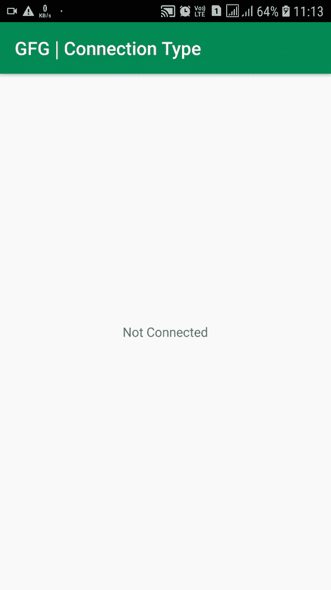

# 安卓实时编程当前互联网连接类型

> 原文:[https://www . geesforgeks . org/current-internet-connection-type-in-real-time-programming-in-Android/](https://www.geeksforgeeks.org/current-internet-connection-type-in-real-time-programmatically-in-android/)

在当今以信息为中心的网络联盟中，开发者需要知道用户在互联网上的网络搜索类型。为了用特定的数据瞄准受众，开发人员需要拥有并处理大量的实体。一个这样的实体是连接信息。你有没有注意到，当你在移动数据上试图下载应用程序时，谷歌游戏要求你切换到无线网络？从 Wi-Fi 切换到移动数据时，您是否看到过在线视频质量下降？伦理学说，监控所有应用程序中使用的每个实体是至关重要的，安卓系统有能力做到这一点。安卓架构在这里扮演的角色是在网络故障的情况下，将您从一种连接类型切换到另一种可能的连接类型，但不会改变正在显示的数据的规格。开发人员必须以优化所使用的数据的方式对应用程序进行编程。通过这篇文章，我们旨在扩展我们提取当前连接类型的知识，并以安卓应用程序的形式显示它。我们将使用可用的方法(没有第三方元素)来实时显示信息(连接类型)的变化。下面给出了一个 GIF 示例，来了解一下在这篇文章中要做什么。注意，我们将使用**柯特林**语言来实现这个项目。



### **接近**

要在安卓系统中获取当前连接类型(无线网络或移动数据)，我们将遵循以下步骤:

**第一步:创建新项目**

要在安卓工作室创建新项目，请参考[如何在安卓工作室创建/启动新项目](https://www.geeksforgeeks.org/android-how-to-create-start-a-new-project-in-android-studio/)。注意选择**科特林**作为编程语言。

**步骤 2:使用 AndroidManifest.xml 文件**

转到 **AndroidManifest.xml** 文件，添加这些使用权限: **ACCESS_NETWORK_STATE** 。

下面是 **AndroidManifest.xml** 文件的完整代码。

## 可扩展标记语言

```
<?xml version="1.0" encoding="utf-8"?>
<manifest xmlns:android="http://schemas.android.com/apk/res/android"
    package="org.geeksforgeeks.connectioninfo">

    <!--Add this permission to Access the Network State-->
    <uses-permission android:name="android.permission.ACCESS_NETWORK_STATE" />

    <application
        android:allowBackup="true"
        android:icon="@mipmap/ic_launcher"
        android:label="@string/app_name"
        android:roundIcon="@mipmap/ic_launcher_round"
        android:supportsRtl="true"
        android:theme="@style/AppTheme">
        <activity android:name=".MainActivity">
            <intent-filter>
                <action android:name="android.intent.action.MAIN" />

                <category android:name="android.intent.category.LAUNCHER" />
            </intent-filter>
        </activity>
    </application>

</manifest>
```

**步骤 3:使用 activity_main.xml 文件**

现在转到代表应用程序用户界面的 **activity_main.xml** 文件，并创建一个 [TextView](https://www.geeksforgeeks.org/textview-in-kotlin/) ，在这里我们将广播来自 **MainActivity.kt** 文件的信息。下面是 **activity_main.xml** 文件的代码。

## 可扩展标记语言

```
<?xml version="1.0" encoding="utf-8"?>
<RelativeLayout
    xmlns:android="http://schemas.android.com/apk/res/android"
    xmlns:tools="http://schemas.android.com/tools"
    android:layout_width="match_parent"
    android:layout_height="match_parent"
    tools:context=".MainActivity">

    <!--This textView will show the current connection status-->
    <TextView
        android:id="@+id/tv"
        android:layout_width="wrap_content"
        android:layout_height="wrap_content"
        android:layout_centerInParent="true"
        android:text="Not Connected" />

</RelativeLayout>
```

**第 4 步:使用 MainActivity.kt 文件**

转到 **MainActivity.kt** 文件，参考以下代码。下面是 **MainActivity.kt** 文件的代码。代码中添加了注释，以更详细地理解代码。

## 我的锅

```
import android.content.Context
import android.net.ConnectivityManager
import android.os.Bundle
import android.widget.TextView
import androidx.appcompat.app.AppCompatActivity

class MainActivity : AppCompatActivity() {

    override fun onCreate(savedInstanceState: Bundle?) {
        super.onCreate(savedInstanceState)
        setContentView(R.layout.activity_main)

        // Declaring the textView from the layout file
        // This textView will display the type of connection
        // Either WIFI, MOBILE DATA, or Not Connected
        val networkConnectionStatus = findViewById<TextView>(R.id.tv)

        // A Thread that will continuously monitor the Connection Type
        Thread(Runnable {
            while (true) {
                // This string is displayed when device is not connected
                // to either of the aforementioned states
                var conStant: String = "Not Connected"

                // Invoking the Connectivity Manager
                val cm = getSystemService(Context.CONNECTIVITY_SERVICE) as ConnectivityManager

                // Fetching the Network Information
                val netInfo = cm.allNetworkInfo

                // Finding if Network Info typeName is WIFI or MOBILE (Constants)
                // If found, the conStant string is supplied WIFI or MOBILE DATA
                // respectively. The supplied data is a Variable
                for (ni in netInfo) {
                    if (ni.typeName.equals("WIFI", ignoreCase = true))
                        if (ni.isConnected) conStant = "WIFI"
                    if (ni.typeName.equals("MOBILE", ignoreCase = true))
                        if (ni.isConnected) conStant = "MOBILE DATA"
                }

                // To update the layout elements in real-time, use runOnUiThread method
                // We are setting the text in the TextView as the string conState
                runOnUiThread {
                    networkConnectionStatus.text = conStant
                }
            }
        }).start() // Starting the thread
    }
}
```

### 输出:在物理设备上运行

<video class="wp-video-shortcode" id="video-498485-1" width="640" height="360" preload="metadata" controls=""><source type="video/mp4" src="https://media.geeksforgeeks.org/wp-content/uploads/20201008112529/2020_10_08_11_13_46.mp4?_=1">[https://media.geeksforgeeks.org/wp-content/uploads/20201008112529/2020_10_08_11_13_46.mp4](https://media.geeksforgeeks.org/wp-content/uploads/20201008112529/2020_10_08_11_13_46.mp4)</video>

**注意:**拥有一个活动的网络接口并不能保证某个特定的网络服务可用。网络问题、服务器宕机、低信号、强制门户、内容过滤器等都可能阻止您的应用程序到达服务器。例如，在应用程序收到来自推特服务的有效响应呼叫之前，你无法判断你的应用程序是否能联系到推特服务器。