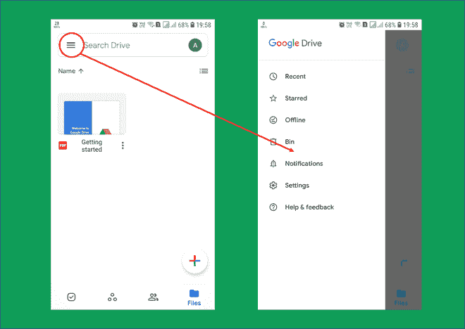

# 安卓使用 ArcNavigationView 的曲线导航抽屉

> 原文:[https://www . geesforgeks . org/curve-navigation-drawer-in-Android-using-arcnavigationview/](https://www.geeksforgeeks.org/curve-navigation-drawer-in-android-using-arcnavigationview/)

导航抽屉是一种可以在某些应用程序中看到的布局，由一些其他活动快捷方式(意图)组成。这个抽屉一般可以在屏幕左边缘看到，这是默认的。默认情况下，操作栏上会提供一个用于访问导航抽屉的按钮。



用户界面更改可以应用到导航抽屉。改变导航抽屉用户界面的一个想法是将其外边缘做成内弧或外弧。这给抽屉带来了创造性的“T0”和更丰富的“T2”外观。由于一些更改受到安卓工作室包的限制，这样的实现需要一个外部库来进行所需的更改。这是通过实现所需实现的已知依赖项(库)来实现的。同样，我们也实现了一个依赖来满足我们的需求。

### 导航抽屉内弧设计

要在安卓设备中为导航抽屉创建内弧设计，请执行以下步骤:

**第一步:创建新项目**

在安卓工作室创建一个**导航抽屉活动**。在安卓工作室创建新项目请参考 [如何在安卓工作室创建/启动新项目](https://www.geeksforgeeks.org/android-how-to-create-start-a-new-project-in-android-studio/) 。当您单击完成时，项目构建可能需要一两分钟。

**第二步:将依赖项添加到应用程序的构建梯度中**

将以下依赖项添加到[](https://www.geeksforgeeks.org/android-build-gradle/)****文件中。****

> ****实现' com . rom 4 ek:arcnavigationview:2 . 0 . 0 '****

******步骤 3:使用 activity_main.xml 文件******

****设置完成后，转到 **activity_main.xml** 文件，该文件代表项目的 UI。在打开和关闭抽屉布局元素之间添加如下所示的脚本。****

## ****可扩展标记语言****

```kt
**<?xml version="1.0" encoding="utf-8"?>
<androidx.drawerlayout.widget.DrawerLayout 
    xmlns:android="http://schemas.android.com/apk/res/android"
    xmlns:app="http://schemas.android.com/apk/res-auto"
    xmlns:tools="http://schemas.android.com/tools"
    android:id="@+id/drawer_layout"
    android:layout_width="match_parent"
    android:layout_height="match_parent"
    android:fitsSystemWindows="true"
    tools:openDrawer="start">

    <include
        layout="@layout/app_bar_main"
        android:layout_width="match_parent"
        android:layout_height="match_parent" />

    <!--ArcNavigationView Element-->
    <com.rom4ek.arcnavigationview.ArcNavigationView
        android:id="@+id/nav_view"
        android:layout_width="wrap_content"
        android:layout_height="match_parent"
        android:layout_gravity="start"
        android:background="@android:color/white"
        android:fitsSystemWindows="true"
        app:itemBackground="@android:color/white"
        app:headerLayout="@layout/nav_header_main"
        app:menu="@menu/activity_main_drawer"

        app:arc_cropDirection="cropInside"

        app:arc_width="96dp"/>

</androidx.drawerlayout.widget.DrawerLayout>**
```

### ****输出:在模拟器上运行****

****<video class="wp-video-shortcode" id="video-495720-1" width="640" height="360" preload="metadata" controls=""><source type="video/mp4" src="https://media.geeksforgeeks.org/wp-content/uploads/20201001101430/LeftInside.mp4?_=1">[https://media.geeksforgeeks.org/wp-content/uploads/20201001101430/LeftInside.mp4](https://media.geeksforgeeks.org/wp-content/uploads/20201001101430/LeftInside.mp4)</video>****

### ****导航抽屉的外弧设计****

****同样，要创建外部圆弧，请对布局文件进行更改。对 **activity_main.xml** 文件所做的更改:****

## ****可扩展标记语言****

```kt
**<?xml version="1.0" encoding="utf-8"?>
<androidx.drawerlayout.widget.DrawerLayout 
    xmlns:android="http://schemas.android.com/apk/res/android"
    xmlns:app="http://schemas.android.com/apk/res-auto"
    xmlns:tools="http://schemas.android.com/tools"
    android:id="@+id/drawer_layout"
    android:layout_width="match_parent"
    android:layout_height="match_parent"
    android:fitsSystemWindows="true"
    tools:openDrawer="start">

    <include
        layout="@layout/app_bar_main"
        android:layout_width="match_parent"
        android:layout_height="match_parent" />

      <!--ArcNavigationView Element-->
    <com.rom4ek.arcnavigationview.ArcNavigationView
        android:id="@+id/nav_view"
        android:layout_width="wrap_content"
        android:layout_height="match_parent"
        android:layout_gravity="start"
        android:background="@android:color/white"
        android:fitsSystemWindows="true"
        app:itemBackground="@android:color/white"
        app:headerLayout="@layout/nav_header_main"
        app:menu="@menu/activity_main_drawer"
        app:arc_width="96dp"

        app:arc_cropDirection="cropOutside"/>

</androidx.drawerlayout.widget.DrawerLayout>**
```

### ****输出:在模拟器上运行****

****<video class="wp-video-shortcode" id="video-495720-2" width="640" height="360" preload="metadata" controls=""><source type="video/mp4" src="https://media.geeksforgeeks.org/wp-content/uploads/20201001101327/LeftOutside.mp4?_=2">[https://media.geeksforgeeks.org/wp-content/uploads/20201001101327/LeftOutside.mp4](https://media.geeksforgeeks.org/wp-content/uploads/20201001101327/LeftOutside.mp4)</video>****