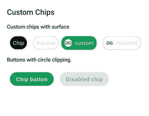
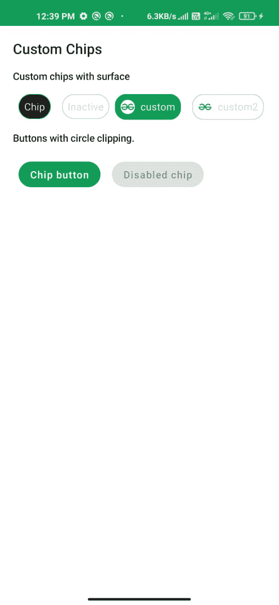

# 在安卓系统中使用 Jetpack Compose 定制芯片

> 原文:[https://www . geesforgeks . org/custom-chips-use-jet pack-compose-in-Android/](https://www.geeksforgeeks.org/custom-chips-using-jetpack-compose-in-android/)

安卓系统中的芯片是用来制作选择过滤器、动作和在安卓窗口的紧凑区域显示可选选项的组件之一。在本文中，我们将使用[安卓的 Jetpack Compose](https://www.geeksforgeeks.org/basics-of-jetpack-compose-in-android/) 来创建那些芯片。下面给出了一个示例图像，以说明我们将要构建的内容。请注意，我们将使用 Kotlin 语言实现这个项目。



### **分步实施**

**第一步:创建新项目**

要在安卓工作室金丝雀版本中创建新项目，请参考[如何使用 Jetpack Compose 在安卓工作室金丝雀版本中创建新项目。](https://www.geeksforgeeks.org/how-to-create-a-new-project-in-android-studio-canary-version-with-jetpack-compose/)

**步骤 2:使用 MainActivity.kt 文件**

导航到**应用程序> java >你的应用程序的包名，打开 MainActivity.kt** 文件。在该文件中添加下面的代码。代码中添加了注释，以更详细地理解代码。

## 我的锅

```
import android.os.Bundle
import androidx.activity.ComponentActivity
import androidx.activity.compose.setContent
import androidx.compose.foundation.BorderStroke
import androidx.compose.foundation.Image
import androidx.compose.foundation.layout.*
import androidx.compose.foundation.shape.CircleShape
import androidx.compose.foundation.shape.RoundedCornerShape
import androidx.compose.material.Button
import androidx.compose.material.MaterialTheme
import androidx.compose.material.MaterialTheme.typography
import androidx.compose.material.Surface
import androidx.compose.material.Text
import androidx.compose.runtime.Composable
import androidx.compose.ui.Modifier
import androidx.compose.ui.draw.clip
import androidx.compose.ui.graphics.Color
import androidx.compose.ui.res.painterResource
import androidx.compose.ui.text.style.TextAlign
import androidx.compose.ui.tooling.preview.Preview
import androidx.compose.ui.unit.dp
import com.example.jetpackcomposepractice.ui.theme.JetpackComposePracticeTheme

class MainActivity : ComponentActivity() {
    override fun onCreate(savedInstanceState: Bundle?) {
        super.onCreate(savedInstanceState)
        setContent {
            JetpackComposePracticeTheme {
                // A surface container using
                  // the 'background' color from the theme
                Surface(color = Color.White) {
                    Column(modifier = Modifier.padding(10.dp)) {
                        // call the function which
                          // contains all the chips
                        Chips()
                    }
                }
            }
        }
    }
}

// Function for Custom Chip
// Later we will reuse it to
// create chips wherever needed
// selected : Boolean - to Check
// whether it is checked or not
// text - To show the data
@Composable
fun CustomChip(
    selected: Boolean,
    text: String,
    modifier: Modifier = Modifier
) {
    // define properties to the chip
    // such as color, shape, width
    Surface(
        color = when {
            selected -> MaterialTheme.colors.onSurface
            else -> Color.Transparent
        },
        contentColor = when {
            selected -> MaterialTheme.colors.onPrimary
            else -> Color.LightGray
        },
        shape = CircleShape,
        border = BorderStroke(
            width = 1.dp,
            color = when {
                selected -> MaterialTheme.colors.primary
                else -> Color.LightGray
            }
        ),
        modifier = modifier
    ) {
        // Add text to show the data that we passed
        Text(
            text = text,
            textAlign = TextAlign.Center,
            style = MaterialTheme.typography.body2,
            modifier = Modifier.padding(8.dp)
        )

    }
}

// Function to create a Custom Image Chip with text
// text - For showing data on the chip
// imageId - For showing the image that we want to use
// selected : Boolean - to check if it is selected or not
@Composable
private fun CustomImageChip(
    text: String,
    imageId: Int,
    selected: Boolean,
    modifier: Modifier = Modifier
) {
    // define properties to the chip
    // such as color, shape, width
    Surface(
        color = when {
            selected -> MaterialTheme.colors.primary
            else -> Color.Transparent
        },
        contentColor = when {
            selected -> MaterialTheme.colors.onPrimary
            else -> Color.LightGray
        },
        shape = RoundedCornerShape(16.dp),
        border = BorderStroke(
            width = 1.dp,
            color = when {
                selected -> MaterialTheme.colors.primary
                else -> Color.LightGray
            }
        ),
        modifier = modifier
    ) {
        // Inside a Row pack the Image and text together to
        // show inside the chip
        Row(modifier = Modifier) {
            Image(
                painter = painterResource(imageId),
                contentDescription = null,
                modifier = Modifier
                    .padding(8.dp)
                    .size(20.dp)
                    .clip(CircleShape)
            )
            Text(
                text = text,
                style = typography.body2,
                modifier = Modifier.padding(end = 8.dp, top = 8.dp, bottom = 8.dp)
            )
        }
    }
}

@Preview
@Composable
fun Chips() {
    Text(text = "Custom Chips", style = typography.h6, modifier = Modifier.padding(8.dp))
    SubtitleText(subtitle = "Custom chips with surface")
    // Call the functions that we defined
      // above and pass the actual data
    Column {
        Row(modifier = Modifier.padding(8.dp)) {
            // creates a custom chip for active state
            CustomChip(
                selected = true,
                text = "Chip",
                modifier = Modifier.padding(horizontal = 8.dp)
            )
            // Creates a custom chip for inactive state
            CustomChip(
                selected = false,
                text = "Inactive",
                modifier = Modifier.padding(horizontal = 8.dp)
            )
            // Create a custom image chip whose state is active
            CustomImageChip(
                text = "custom",
                imageId = R.drawable.gfg_logo,
                selected = true
            )
            Spacer(modifier = Modifier.padding(8.dp))
            // Create a custom image chip whose state is inactive
            CustomImageChip(
                text = "custom2",
                imageId = R.drawable.gfg_logo,
                selected = false
            )
        }
        SubtitleText(subtitle = "Buttons with circle clipping.")
        // We can also use a circular shape button as a chip
        Row(modifier = Modifier.padding(8.dp)) {
            // Creates an active state chip using button
            Button(
                onClick = {},
                modifier = Modifier
                    .padding(8.dp)
                    .clip(CircleShape)
            ) {
                Text(text = "Chip button")
            }
            // Creates an inactive state chip using button
            Button(
                onClick = {},
                enabled = false,
                modifier = Modifier
                    .padding(8.dp)
                    .clip(CircleShape)
            ) {
                Text(text = "Disabled chip")
            }
        }
    }
}

// Function to show a text message
@Composable
fun SubtitleText(subtitle: String, modifier: Modifier = Modifier) {
    Text(text = subtitle, style = typography.subtitle2, modifier = modifier.padding(8.dp))
}
```

**输出:**

