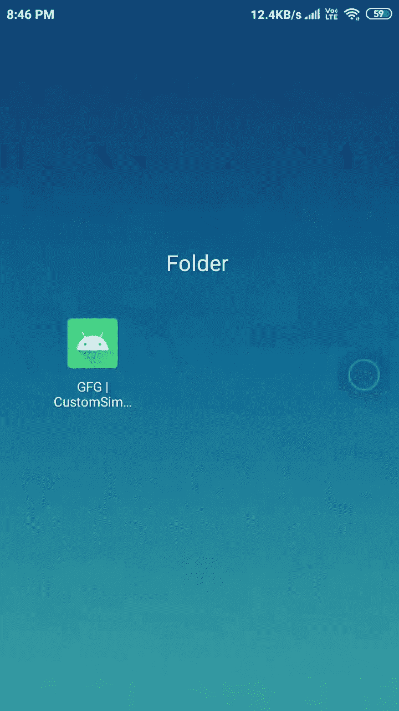

# 安卓中自定义简单适配器示例

> 原文:[https://www . geesforgeks . org/custom-simple adapter-in-Android-with-example/](https://www.geeksforgeeks.org/custom-simpleadapter-in-android-with-example/)

适配器充当用户界面组件和数据源之间的桥梁。它将数据源中的数据转换成可以显示在用户界面组件中的视图项。在 Android 中，SimpleAdapter 是一个简单的适配器，可以将**静态**数据映射到 XML(布局)文件中定义的视图。您可以将支持列表的数据指定为地图的数组列表。数组列表中的每个条目对应于列表中的一行。地图包含每行的数据。

## 为什么要使用 CustomSimpleAdapter？

SimpleAdapter 允许我们向每个列表项添加事件，但是如果我们想向属于列表项的不同视图添加不同的事件，我们不能通过使用 SimpleAdapter 本身来实现。在一个典型的安卓应用程序中，一个列表项可以包含一个复杂的布局，其中可能包含不同的视图。在这种情况下，我们必须使用定制的简单适配器。SimpleAdapter 的基本语法。

> **语法:**
> 
> 公共简单适配器(上下文上下文，列表 extends Map<string>>数据，int 资源，String[] from，int[] to)</string>
> 
> **参数:**
> 
> **上下文:**与此简单适配器关联的视图正在运行的上下文
> 
> **数据:**地图列表。列表中的每个条目对应于列表中的一行。“地图”包含每行的数据，并且应该包括“从”中指定的所有条目
> 
> **资源:**定义此列表项视图的视图布局的资源标识符。布局文件应该至少包括那些在“到”中定义的命名视图
> 
> **从:**将添加到与每个项目相关的地图中的列名列表。
> 
> **到:**应该在“从”参数中显示列的视图。这些都应该是文本视图。此列表中的前 N 个视图被赋予 from 参数中前 N 列的值。

简单适配器的两个最重要的方法:

1.  **getCount():** 这个适配器表示的数据集中有多少项。
2.  **getView():** 获取显示数据集中指定位置数据的视图。您可以手动创建视图，也可以从 XML 布局文件展开视图。当视图膨胀时，父视图(GridView，ListView…)将应用默认布局参数，除非您使用 LayoutInFlater . explain(int，android.view.ViewGroup，布尔值)来指定根视图并防止附加到根。

## 例子

下面是我们将为本文创建的最终应用程序的 gif。在这种情况下，您会注意到，通过单击 list_item，什么都没有发生，但是当我们单击 Image 时，只会显示 Toast。



### **分步实施**

**第一步:创建新项目**

要在安卓工作室创建新项目，请参考 H [如何使用 Kotlin 在安卓工作室创建/启动新项目。](https://www.geeksforgeeks.org/how-to-create-project-in-android-studio-using-kotlin/)我们将使用**科特林**。

**步骤 2:使用 activity_main.xml**

现在打开 activity_main.xml，并在其中插入下面的代码。它将创建一个由[列表视图](https://www.geeksforgeeks.org/android-listview-in-kotlin/)组成的约束布局。下面是 **activity_main.xml** 文件的代码。

## 可扩展标记语言

```
<?xml version="1.0" encoding="utf-8"?>
<androidx.constraintlayout.widget.ConstraintLayout 
    xmlns:android="http://schemas.android.com/apk/res/android"
    xmlns:app="http://schemas.android.com/apk/res-auto"
    xmlns:tools="http://schemas.android.com/tools"
    android:layout_width="match_parent"
    android:layout_height="match_parent"
    tools:context=".MainActivity">

    <!-- This is the listView which will 
         display our list_items -->
    <ListView
        android:id="@+id/listView"
        android:layout_width="match_parent"
        android:layout_height="match_parent"
        app:layout_constraintBottom_toBottomOf="parent"
        app:layout_constraintEnd_toEndOf="parent"
        app:layout_constraintStart_toStartOf="parent"
        app:layout_constraintTop_toTopOf="parent" />

</androidx.constraintlayout.widget.ConstraintLayout>
```

**步骤 3:为 ListItem 创建一个新的布局 XML 文件。**

转到 **app > res >布局>右键>新建>布局资源文件**并创建一个 XML 文件。将文件命名为**列表项**。下面是****list _ item . XML**文件的代码。**

## **可扩展标记语言**

```
<?xml version="1.0" encoding="utf-8"?>
<LinearLayout 
    xmlns:android="http://schemas.android.com/apk/res/android"
    xmlns:tools="http://schemas.android.com/tools"
    android:id="@+id/mainLayout"
    android:layout_width="match_parent"
    android:layout_height="wrap_content"
    android:padding="2dp">

    <!-- ImageView which is display 
         to the left of list_item -->
    <ImageView
        android:id="@+id/avatarImageView"
        android:layout_width="65dp"
        android:layout_height="65dp"
        android:clickable="true"
        android:focusable="true"
        tools:srcCompat="@tools:sample/avatars" />

    <!-- LinearLayout to hold title and subtite -->
    <LinearLayout
        android:layout_width="wrap_content"
        android:layout_height="match_parent"
        android:layout_marginStart="4dp"
        android:orientation="vertical">

        <!-- TextView to display title -->
        <TextView
            android:id="@+id/titleTextView"
            android:layout_width="wrap_content"
            android:layout_height="wrap_content"
            android:textColor="@color/black"
            android:textSize="18sp"
            android:textStyle="bold"
            tools:text="Title" />

        <!-- TextView to display subtitle -->
        <TextView
            android:id="@+id/subtitleTextView"
            android:layout_width="wrap_content"
            android:layout_height="match_parent"
            android:ellipsize="end"
            android:gravity="center_vertical"
            android:maxLines="2"
            tools:text="Subtitle" />

    </LinearLayout>
</LinearLayout>
```

****步骤 4:实现 CustomSimpleAdapter****

**现在创建一个新的 [Kotlin 类文件](https://www.geeksforgeeks.org/how-to-create-classes-in-android-studio/)，并将其命名为 **CustomSimpleAdapter** 。在这个文件中，我们将覆盖 **getView()** 方法来添加自定义代码。下面是****customsimpleAdapter . kt**文件的代码。代码中添加了注释，以更详细地理解代码。****

## ****我的锅****

```
**import android.content.Context
import android.view.View
import android.view.ViewGroup
import android.widget.ImageView
import android.widget.SimpleAdapter
import android.widget.TextView
import android.widget.Toast
import androidx.annotation.IdRes
import androidx.annotation.LayoutRes

class CustomSimpleAdapter(
    private val mContext: Context,
    data: MutableList<HashMap<String, String>>,
    @LayoutRes
    res: Int,
    from: Array<String>,
    @IdRes
    to: IntArray
) :
    // Passing these params to SimpleAdapter
    SimpleAdapter(mContext, data, res, from, to) {

    override fun getView(position: Int, convertView: View?, parent: ViewGroup?): View {

        // Get the view in our case list_item.xml
        val view = super.getView(position, convertView, parent)

        // Getting reference of ImageView that we 
        // have used in our list_item.xml file
        // so that we can add user defined code
        val avatarImageView = view.findViewById<ImageView>(R.id.avatarImageView)

        // Reference of TextView which is treated a title
        val titleTextView = view.findViewById<TextView>(R.id.titleTextView)

        // Adding an clickEvent to the ImageView, as soon as we click this
        // ImageView we will see a Toast which will display a message
        // Note: this event wil only fire when ImageView is pressed and
        //       not when whole list_item is pressed
        avatarImageView.setOnClickListener {
            Toast.makeText(
                mContext,
                "Image with title ${titleTextView.text} is pressed",
                Toast.LENGTH_SHORT
            ).show()
        }

        // Finally returning our view
        return view
    }
}**
```

******步骤 5:使用 MainActivity.kt 文件******

****在 MainActivity.kt 文件中编写任何代码之前，请添加您想要显示的图像。下面是 **MainActivity.kt** 文件的代码。代码中添加了注释，以更详细地理解代码。****

## ****Java 语言(一种计算机语言，尤用于创建网站)****

```
**import android.os.Bundle
import android.widget.ListView
import androidx.appcompat.app.AppCompatActivity

class MainActivity : AppCompatActivity() {
    override fun onCreate(savedInstanceState: Bundle?) {
        super.onCreate(savedInstanceState)
        setContentView(R.layout.activity_main)

        // Because SimpleAdapter works with static 
        // data so we need to initialize static data

        // This is the array for TitleText
        val titles = arrayOf("Test1", "Test2", "Test3")

        // This array is for SubtitleText
        val subtitles= arrayOf("This is test1 subtitle", "This is test2 subtitle", "This is test3 subtitle")

        // These are the Id's of the images that will be displayed as avatar
        val images = arrayOf(R.drawable.test1, R.drawable.test2, R.drawable.test3)

        // Instantiating our data List, which is a list of HashMap
        val data: MutableList<HashMap<String, String>> = mutableListOf()

        // Populating our data List with the 
        // arrays that we have already defined
        for (i in titles.indices) {
            val cur: HashMap<String, String> = HashMap()
            cur["titleText"] = titles[i]
            cur["subtitleText"] = subtitles[i]
            cur["avatarImage"] = "${images[i]}"
            data.add(cur)
        }

        // From and To array which will be used to map, HashMap values
        // to the Views that are defined in the XML file (in our case list_item.xml)
        val from = arrayOf("avatarImage", "titleText", "subtitleText")
        val to = intArrayOf(R.id.avatarImageView, R.id.titleTextView, R.id.subtitleTextView)

        // Instantiating customSimpleAdapter with the above values
        val customSimpleAdapter = CustomSimpleAdapter(this, data, R.layout.list_item, from, to)

        // Getting reference of listView which is defined in activity_main.xml
        val listView = findViewById<ListView>(R.id.listView)

        // Finally, setting adapter to our customSimpleAdapter
        listView.adapter = customSimpleAdapter
    }
}**
```

### ****输出:****

****<video class="wp-video-shortcode" id="video-519751-1" width="640" height="360" preload="metadata" controls=""><source type="video/mp4" src="https://media.geeksforgeeks.org/wp-content/uploads/20201125205714/video.mp4?_=1">[https://media.geeksforgeeks.org/wp-content/uploads/20201125205714/video.mp4](https://media.geeksforgeeks.org/wp-content/uploads/20201125205714/video.mp4)</video>****