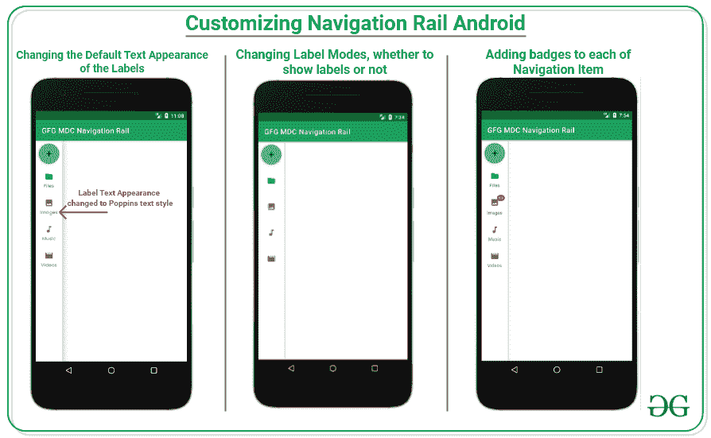
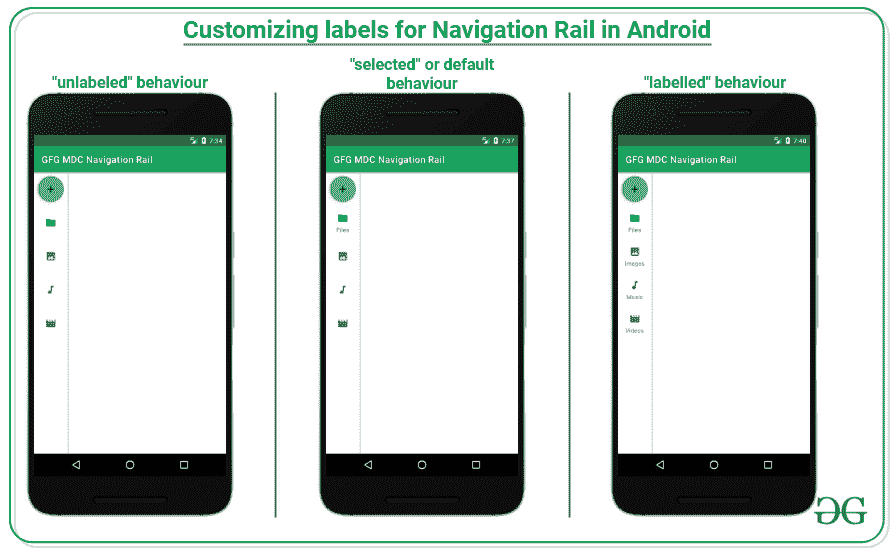
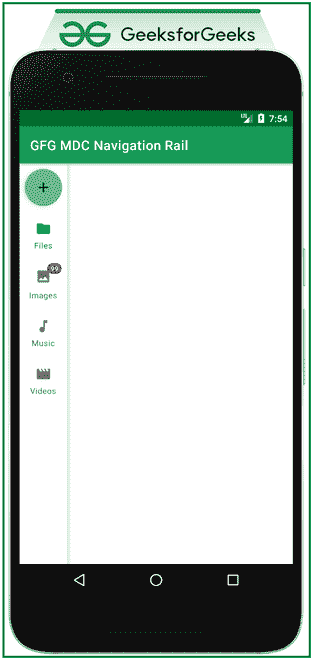
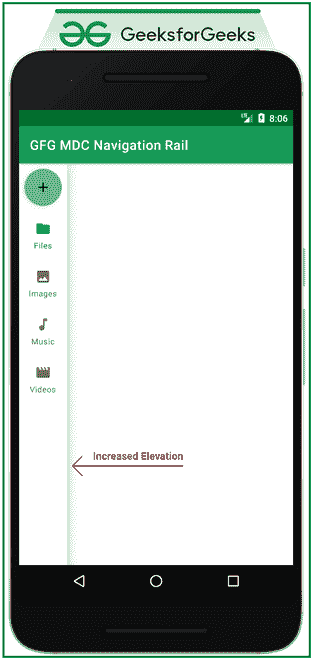
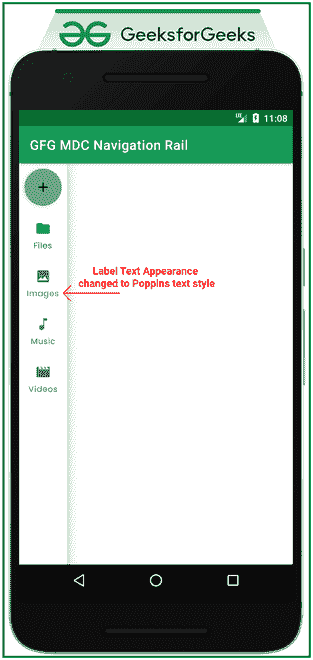

# 安卓定制素材导航轨

> 原文:[https://www . geesforgeks . org/customizing-material-navigation-rail-in-Android/](https://www.geeksforgeeks.org/customizing-material-navigation-rail-in-android/)

在文章[Android](https://www.geeksforgeeks.org/material-design-component-navigation-rail-in-android/)中的材料设计组件导航轨中，已经讨论了如何实现导航组件之一，即导航轨，尤其是对于像台式机或平板电脑这样的大屏幕。因此，在本文中，我们继续在安卓系统中定制导航轨道。请看下图，了解整个讨论的概况。



**创建一个空的活动项目**

要在安卓工作室创建新项目，请参考[如何在安卓工作室创建/启动新项目](https://www.geeksforgeeks.org/how-to-create-project-in-android-studio-using-kotlin/)。

**添加必需的依赖关系**

在[build . grade le](https://www.geeksforgeeks.org/android-build-gradle/)文件中包含谷歌材料设计组件依赖关系。添加依赖项后，不要忘记点击右上角的**“立即同步”**按钮。请注意，导航导轨是在 1.4.0 及更高版本的材料设计组件的最新版本中引入的。

> 实现' com . Google . Android . material:material:1 . 4 . 0 '

请注意，在同步您的项目时，您需要连接到网络，并确保您正在将依赖项添加到**应用程序级渐变**文件，如下所示。请注意，布局将保持与上一篇文章相同。

### **基本定制现在逐一讨论**

**图标的标签是可选的**

每个图标的标签有四种模式。这些是:

> 选定->标签仅显示在导航栏上选定的项目上。
> 
> 标签->显示所有项目的标签。
> 
> 无标签->所有标签都被隐藏，即使项目被选中。
> 
> 自动->当有 3 个或少于 3 个项目时，标签表现为“已标记”，当有 4 个或更多项目时，标签表现为“已选择”。

为了将这些值包含在 XML 中，导航轨道有一个属性:

> app:label visibility = " value "

看看下面的例子和输出:

## 可扩展标记语言

```kt
<?xml version="1.0" encoding="utf-8"?>
<androidx.constraintlayout.widget.ConstraintLayout 
    xmlns:android="http://schemas.android.com/apk/res/android"
    xmlns:app="http://schemas.android.com/apk/res-auto"
    xmlns:tools="http://schemas.android.com/tools"
    android:layout_width="match_parent"
    android:layout_height="match_parent"
    android:clipToPadding="false"
    tools:context=".MainActivity">

    <com.google.android.material.navigationrail.NavigationRailView
        android:id="@+id/navigationRail"
        android:layout_width="wrap_content"
        android:layout_height="match_parent"
        android:clipToPadding="false"
        app:headerLayout="@layout/navigation_rail_fab"
        app:labelVisibilityMode="unlabeled"
        app:layout_constraintBottom_toBottomOf="parent"
        app:layout_constraintStart_toStartOf="parent"
        app:layout_constraintTop_toTopOf="parent"
        app:menu="@menu/navigation_rail_menu" />

</androidx.constraintlayout.widget.ConstraintLayout>
```

**输出 UI:**



**为图标添加标签**

导航导轨中的物品也有徽章。例如，每当特定片段内的内容的新通知或计数增加时，则只能通过增加标记或简单的点标记来通知用户。看看下面的例子，你会有一个想法。导航到 **app > res >布局> activity_main.xml** 并将下面的代码添加到该文件中。下面是**activity _ main . XML**文件的代码。

## 可扩展标记语言

```kt
<?xml version="1.0" encoding="utf-8"?>
<androidx.constraintlayout.widget.ConstraintLayout 
    xmlns:android="http://schemas.android.com/apk/res/android"
    xmlns:app="http://schemas.android.com/apk/res-auto"
    xmlns:tools="http://schemas.android.com/tools"
    android:layout_width="match_parent"
    android:layout_height="match_parent"
    android:clipToPadding="false"
    tools:context=".MainActivity">

    <com.google.android.material.navigationrail.NavigationRailView
        android:id="@+id/navigationRail"
        android:layout_width="wrap_content"
        android:layout_height="match_parent"
        android:clipToPadding="false"
        app:headerLayout="@layout/navigation_rail_fab"
        app:labelVisibilityMode="labeled"
        app:layout_constraintBottom_toBottomOf="parent"
        app:layout_constraintStart_toStartOf="parent"
        app:layout_constraintTop_toTopOf="parent"
        app:menu="@menu/navigation_rail_menu" />

</androidx.constraintlayout.widget.ConstraintLayout>
```

下面是 **MainActivity.kt** 文件的代码。代码中添加了注释，以更详细地理解代码。

## 我的锅

```kt
import android.os.Bundle
import androidx.appcompat.app.AppCompatActivity
import com.google.android.material.navigationrail.NavigationRailView

class MainActivity : AppCompatActivity() {
    override fun onCreate(savedInstanceState: Bundle?) {
        super.onCreate(savedInstanceState)
        setContentView(R.layout.activity_main)

        // instance of navigation rail
        val navigationRail: NavigationRailView = findViewById(R.id.navigationRail)

        // instance of navigation rail badge
        val badge = navigationRail.getOrCreateBadge(R.id.images)
        badge.isVisible = true
        badge.number = 99
    }
}
```

**输出 UI:**



为图标添加任何徽章的最佳做法是，如果需要临时隐藏徽章直到收到下一个通知，那么，在这种情况下，更改 BadgeDrawable 的可见性，如下所示:

## 我的锅

```kt
val badgeDrawable = navigationRail.getBadge(R.id.images)
if (badgeDrawable != null) {
    badgeDrawable.isVisible = false
    badgeDrawable.clearNumber()
}
```

### **改变导航轨道容器的高度**

有属性提升。此属性仅影响导航轨道容器。属性是:

> app:elevation="value_in_dp "

看看下面的例子及其输出:

## 可扩展标记语言

```kt
<?xml version="1.0" encoding="utf-8"?>
<androidx.constraintlayout.widget.ConstraintLayout
    xmlns:android="http://schemas.android.com/apk/res/android"
    xmlns:app="http://schemas.android.com/apk/res-auto"
    xmlns:tools="http://schemas.android.com/tools"
    android:layout_width="match_parent"
    android:layout_height="match_parent"
    android:clipToPadding="false"
    tools:context=".MainActivity">

    <com.google.android.material.navigationrail.NavigationRailView
        android:id="@+id/navigationRail"
        android:layout_width="wrap_content"
        android:layout_height="match_parent"
        android:clipToPadding="false"
        app:elevation="18dp"
        app:headerLayout="@layout/navigation_rail_fab"
        app:labelVisibilityMode="labeled"
        app:layout_constraintBottom_toBottomOf="parent"
        app:layout_constraintStart_toStartOf="parent"
        app:layout_constraintTop_toTopOf="parent"
        app:menu="@menu/navigation_rail_menu" />

</androidx.constraintlayout.widget.ConstraintLayout>
```

**输出 UI:**



### **改变导航轨道容器的颜色**

导航轨道有一个 XML 属性，用于更改导航轨道的样式或颜色，即:

> style="@style/Widget。材料组件。导航铁路视图。彩色。紧凑”

请注意，通过包括这一点，导航栏的大小变得紧凑，建议移除浮动操作按钮，移除导航栏中的标题布局属性。看看下面的例子，你会有一个想法。

<video class="wp-video-shortcode" id="video-692749-1" width="640" height="360" preload="metadata" controls=""><source type="video/mp4" src="https://media.geeksforgeeks.org/wp-content/uploads/20210930200325/Untitled.mp4?_=1">[https://media.geeksforgeeks.org/wp-content/uploads/20210930200325/Untitled.mp4](https://media.geeksforgeeks.org/wp-content/uploads/20210930200325/Untitled.mp4)</video>

### **更改标签的文本外观**

标签的默认文本外观是“材质设计类型”系统中的“标题”，因此需要用自定义字体覆盖。所以在 themes.xml 文件中，调用 Caption 类型系统的自定义样式。

## 可扩展标记语言

```kt
<style name="TextAppearance.MdcTypographyStyles.Caption" parent="TextAppearance.MaterialComponents.Caption">
    <item name="fontFamily">@font/poppins_regular</item>
    <item name="android:fontFamily">@font/poppins_regular</item>
    <item name="android:textSize">12sp</item>
</style>
```

现在包括 ***文本外观。导航栏下属性中的标题*** :

> app:itemtextappearance ActiVe = @ style/text appearance。描述"
> 
> app:itemtextappearance inactive = @ style/text appearance。描述"

**输出 UI:**



**通航铁路集装箱的其他一些属性有:**

<figure class="table">

| 

元素

 | 

属性

 | 

相关方法

 |
| --- | --- | --- |
| 颜色 | app:backgroundTint | 不适用的 |
| 海拔 | app:立面图 | setElevation |

</figure>

**导航轨道项目的其他一些属性有:**

<figure class="table">

| 

元素

 | 

属性

 | 

相关方法

 |
| --- | --- | --- |
| 菜单资源 | app:菜单 | 通货膨胀getMenu(获取菜单) |
| 波纹(不活动) | app:itemRippleColor | setitemrapplecolorgetitemrapplecolor |
| 纹波(活动) | app:itemRippleColor | setitemrapplecolorgetitemrapplecolor |
| 标签可见模式 | app:labelVisibilityMode | setLabelVisibilityModegetLabelVisibilityMode |

</figure>

**导航轨道项目图标的其他一些属性有:**

<figure class="table">

| 

元素

 | 

属性

 | 

相关方法

 |
| --- | --- | --- |
| 图标 | 安卓:图标 | 不适用的 |
| 大小 | app:itemIconSize | setItemIconSizesetItemIconSizeResgetItemIconSize |
| 颜色(非活动) | app:itemIconTint | setItemIconTintListgetItemIconTintList |
| 颜色(活动) | app:itemIconTint | setItemIconTintListgetItemIconTintList

 |

</figure>

**导航轨道项目文本标签的其他一些属性有:**

<figure class="table">

| 

元素

 | 

属性

 | 

相关方法

 |
| --- | --- | --- |
| 标签文字 | 安卓:标题 | 不适用的 |
| 颜色(非活动) | 应用：项目文本颜色 | setItemTextColorgetItemTextColor |
| 颜色(活动) | 应用：项目文本颜色 | setItemTextColorgetItemTextColor |
| 排版(非活动) | 应用程序:项目文本外观非活动 | setItemTextAppearanceInactive 非活动getitemtextapparerance inactive |
| 排版(活动) | app:itemtextapparerance active | setitemtextapparerance activegetitemtextapparerance active |

</figure>