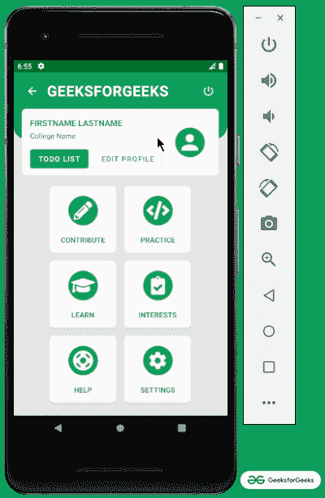
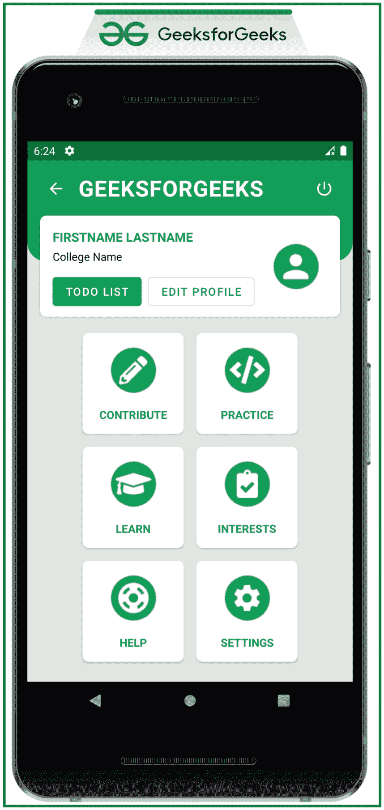

# 安卓中的仪表盘 UI 设计

> 原文:[https://www . geesforgeks . org/dashboard-ui-design-in-Android/](https://www.geeksforgeeks.org/dashboard-ui-design-in-android/)

**仪表盘设计**是让用户参与应用功能的关键元素之一。它在一个地方提供关于应用程序整体功能的信息。仪表板设计就像将所有应用程序功能放在一个页面上。设计仪表板需要在选择合适的颜色、创建图标(以避免版权问题)、将东西放在屏幕的正确位置、管理用户帐户等方面付出一些努力。在本文中，我们讨论了如何为应用程序实现漂亮的仪表板。请看下图，了解整个讨论。



### **在安卓系统中实现唯物主义现代仪表盘的步骤**

**第一步:创建一个空的活动项目**

*   我们正在使用安卓工作室构建应用，请参考[安卓|如何在安卓工作室创建/启动新项目？](https://www.geeksforgeeks.org/android-how-to-create-start-a-new-project-in-android-studio/)，要知道如何创建一个空的活动 Android Studio 项目。

**第二步:添加需要的依赖关系**

*   将以下材料设计依赖项添加到应用程序级渐变文件中。点击右上角的**“立即同步”**按钮。
*   确保系统连接到网络，以便安卓工作室可以下载所有所需的文件。

> **实现‘com . Google . Android . material:material:1 . 2 . 1’**

> **注意:**在继续之前，建议自己制作图标，以免出现任何版权问题。并将所有图像和图标添加到可绘制文件夹中。

**步骤 3:使用 activity_main.xml 文件**

*   在应用程序本身的主布局中，设计了仪表板(仅用于演示目的)。
*   以下布局包含类似 [cardview](https://www.geeksforgeeks.org/cardview-in-android-with-example/) 的材料设计组件。
*   要调用的主要内容是公司名称或徽标、用户简介、注销按钮、应用程序的主要功能。
*   设计仪表板布局取决于个人的思维和创造力，取决于开发人员如何简化仪表板并在一个地方呈现应用程序的所有功能。
*   这里最主要的是约束布局，这使得开发人员很容易构建复杂的用户界面。
*   这里有一点很重要，那就是每个元素的触觉反馈都非常重要。因为它增强了用户体验，也给用户带来了元素被触摸的信心。
*   参考[安卓按钮](https://www.geeksforgeeks.org/ripple-effect-on-android-button/)上的涟漪效应，了解如何实现触摸反馈，也就是元素被触摸时的涟漪效应。
*   文本标题 GEEKSFORGEEKS 后面的绿色视图是使用以下代码创建的。需要放在可绘制文件夹下作为文件名“ **custom_rectangle** ”。

## 可扩展标记语言

```
<?xml version="1.0" encoding="utf-8"?>
<shape xmlns:android="http://schemas.android.com/apk/res/android">
    <solid android:color="@color/green_500" />
    <corners
        android:bottomLeftRadius="24dp"
        android:bottomRightRadius="24dp" />
</shape>
```

*   在 activity_main.xml 文件中调用以下代码来实现用户界面。它包含整个仪表板用户界面(仅供参考。但是，可以根据自己的选择来设计 UI)。

## 可扩展标记语言

```
<?xml version="1.0" encoding="utf-8"?>
<androidx.constraintlayout.widget.ConstraintLayout 
    xmlns:android="http://schemas.android.com/apk/res/android"
    xmlns:app="http://schemas.android.com/apk/res-auto"
    xmlns:tools="http://schemas.android.com/tools"
    android:layout_width="match_parent"
    android:layout_height="match_parent"
    android:background="#e4e4e4"
    tools:context=".MainActivity"
    tools:ignore="HardcodedText">

    <View
        android:id="@+id/view"
        android:layout_width="match_parent"
        android:layout_height="128dp"
        android:background="@drawable/custom_rectangle"
        app:layout_constraintEnd_toEndOf="parent"
        app:layout_constraintStart_toStartOf="parent"
        app:layout_constraintTop_toTopOf="parent" />

    <ImageButton
        android:id="@+id/backB"
        android:layout_width="wrap_content"
        android:layout_height="wrap_content"
        android:layout_marginStart="16dp"
        android:layout_marginTop="16dp"
        android:background="?attr/selectableItemBackground"
        android:padding="8dp"
        android:src="@drawable/ic_back"
        app:layout_constraintStart_toStartOf="parent"
        app:layout_constraintTop_toTopOf="parent" />

    <TextView
        android:id="@+id/textView"
        android:layout_width="wrap_content"
        android:layout_height="wrap_content"
        android:layout_marginStart="8dp"
        android:layout_marginTop="16dp"
        android:gravity="center_horizontal"
        android:letterSpacing="0.025"
        android:text="GEEKSFORGEEKS"
        android:textColor="@color/white"
        android:textSize="28sp"
        android:textStyle="bold"
        app:layout_constraintStart_toEndOf="@+id/backB"
        app:layout_constraintTop_toTopOf="parent" />

    <ImageButton
        android:id="@+id/logOutB"
        android:layout_width="wrap_content"
        android:layout_height="wrap_content"
        android:layout_marginTop="16dp"
        android:layout_marginEnd="16dp"
        android:background="?attr/selectableItemBackground"
        android:padding="8dp"
        android:src="@drawable/ic_logout"
        app:layout_constraintCircleRadius="24dp"
        app:layout_constraintEnd_toEndOf="parent"
        app:layout_constraintTop_toTopOf="parent" />

    <androidx.cardview.widget.CardView
        android:id="@+id/cardView"
        android:layout_width="match_parent"
        android:layout_height="128dp"
        android:layout_marginStart="16dp"
        android:layout_marginTop="16dp"
        android:layout_marginEnd="16dp"
        android:elevation="12dp"
        app:cardCornerRadius="8dp"
        app:layout_constraintEnd_toEndOf="parent"
        app:layout_constraintHorizontal_bias="0.0"
        app:layout_constraintStart_toStartOf="parent"
        app:layout_constraintTop_toBottomOf="@+id/textView">

        <androidx.constraintlayout.widget.ConstraintLayout
            android:layout_width="match_parent"
            android:layout_height="match_parent">

            <TextView
                android:id="@+id/textView2"
                android:layout_width="wrap_content"
                android:layout_height="wrap_content"
                android:layout_marginStart="16dp"
                android:layout_marginTop="16dp"
                android:text="FIRSTNAME LASTNAME"
                android:textAllCaps="true"
                android:textColor="@color/green_500"
                android:textSize="16sp"
                android:textStyle="bold"
                app:layout_constraintStart_toStartOf="parent"
                app:layout_constraintTop_toTopOf="parent" />

            <TextView
                android:id="@+id/textView3"
                android:layout_width="wrap_content"
                android:layout_height="wrap_content"
                android:layout_marginTop="4dp"
                android:text="College Name"
                android:textColor="@android:color/black"
                android:textSize="14sp"
                app:layout_constraintStart_toStartOf="@+id/textView2"
                app:layout_constraintTop_toBottomOf="@+id/textView2" />

            <com.google.android.material.button.MaterialButton
                android:id="@+id/todoB"
                android:layout_width="wrap_content"
                android:layout_height="wrap_content"
                android:layout_marginStart="16dp"
                android:layout_marginBottom="8dp"
                android:text="TODO LIST"
                app:layout_constraintBottom_toBottomOf="parent"
                app:layout_constraintStart_toStartOf="parent" />

            <com.google.android.material.button.MaterialButton
                android:id="@+id/editProfileB"
                style="@style/Widget.MaterialComponents.Button.OutlinedButton"
                android:layout_width="wrap_content"
                android:layout_height="wrap_content"
                android:layout_marginStart="8dp"
                android:text="EDIT PROFILE"
                android:textColor="@color/green_500"
                app:layout_constraintBottom_toBottomOf="@+id/todoB"
                app:layout_constraintStart_toEndOf="@+id/todoB" />

            <ImageButton
                android:id="@+id/profileB"
                android:layout_width="wrap_content"
                android:layout_height="wrap_content"
                android:layout_marginEnd="16dp"
                android:background="?attr/selectableItemBackground"
                android:padding="8dp"
                android:src="@drawable/profile"
                app:layout_constraintBottom_toBottomOf="parent"
                app:layout_constraintEnd_toEndOf="parent"
                app:layout_constraintTop_toTopOf="parent" />

        </androidx.constraintlayout.widget.ConstraintLayout>

    </androidx.cardview.widget.CardView>

    <LinearLayout
        android:id="@+id/linearLayout"
        android:layout_width="match_parent"
        android:layout_height="wrap_content"
        android:layout_marginTop="12dp"
        android:gravity="center_horizontal"
        android:orientation="horizontal"
        android:weightSum="2"
        app:layout_constraintEnd_toEndOf="parent"
        app:layout_constraintStart_toStartOf="parent"
        app:layout_constraintTop_toBottomOf="@+id/cardView">

        <androidx.cardview.widget.CardView
            android:id="@+id/contributeCard"
            android:layout_width="128dp"
            android:layout_height="128dp"
            android:layout_margin="8dp"
            android:layout_marginEnd="16dp"
            android:clickable="true"
            android:elevation="12dp"
            android:focusable="true"
            android:foreground="?android:attr/selectableItemBackground"
            app:cardCornerRadius="8dp">

            <androidx.constraintlayout.widget.ConstraintLayout
                android:layout_width="match_parent"
                android:layout_height="match_parent">

                <ImageView
                    android:id="@+id/image_view1"
                    android:layout_width="0dp"
                    android:layout_height="wrap_content"
                    android:src="@drawable/write"
                    app:layout_constraintBottom_toTopOf="@+id/textView1"
                    app:layout_constraintEnd_toEndOf="parent"
                    app:layout_constraintHorizontal_bias="0.5"
                    app:layout_constraintStart_toStartOf="parent"
                    app:layout_constraintTop_toTopOf="parent" />

                <TextView
                    android:id="@+id/textView1"
                    android:layout_width="match_parent"
                    android:layout_height="wrap_content"
                    android:gravity="center"
                    android:text="CONTRIBUTE"
                    android:textAllCaps="true"
                    android:textColor="@color/green_500"
                    android:textSize="14sp"
                    android:textStyle="bold"
                    app:layout_constraintBottom_toBottomOf="parent"
                    app:layout_constraintEnd_toEndOf="parent"
                    app:layout_constraintHorizontal_bias="0.5"
                    app:layout_constraintStart_toStartOf="parent"
                    app:layout_constraintTop_toBottomOf="@+id/image_view1" />

            </androidx.constraintlayout.widget.ConstraintLayout>

        </androidx.cardview.widget.CardView>

        <androidx.cardview.widget.CardView
            android:id="@+id/practiceCard"
            android:layout_width="128dp"
            android:layout_height="128dp"
            android:layout_margin="8dp"
            android:layout_marginStart="16dp"
            android:clickable="true"
            android:elevation="12dp"
            android:focusable="true"
            android:foreground="?android:attr/selectableItemBackground"
            app:cardCornerRadius="8dp">

            <androidx.constraintlayout.widget.ConstraintLayout
                android:layout_width="match_parent"
                android:layout_height="match_parent">

                <ImageView
                    android:id="@+id/image_view20"
                    android:layout_width="0dp"
                    android:layout_height="wrap_content"
                    android:src="@drawable/practice"
                    app:layout_constraintBottom_toTopOf="@+id/textView20"
                    app:layout_constraintEnd_toEndOf="parent"
                    app:layout_constraintHorizontal_bias="0.5"
                    app:layout_constraintStart_toStartOf="parent"
                    app:layout_constraintTop_toTopOf="parent" />

                <TextView
                    android:id="@+id/textView20"
                    android:layout_width="match_parent"
                    android:layout_height="wrap_content"
                    android:gravity="center"
                    android:text="PRACTICE"
                    android:textAllCaps="true"
                    android:textColor="@color/green_500"
                    android:textSize="14sp"
                    android:textStyle="bold"
                    app:layout_constraintBottom_toBottomOf="parent"
                    app:layout_constraintEnd_toEndOf="parent"
                    app:layout_constraintHorizontal_bias="0.5"
                    app:layout_constraintStart_toStartOf="parent"
                    app:layout_constraintTop_toBottomOf="@+id/image_view20" />

            </androidx.constraintlayout.widget.ConstraintLayout>

        </androidx.cardview.widget.CardView>

    </LinearLayout>

    <LinearLayout
        android:id="@+id/linearLayout2"
        android:layout_width="match_parent"
        android:layout_height="wrap_content"
        android:gravity="center_horizontal"
        android:orientation="horizontal"
        android:weightSum="2"
        app:layout_constraintEnd_toEndOf="parent"
        app:layout_constraintStart_toStartOf="parent"
        app:layout_constraintTop_toBottomOf="@+id/linearLayout">

        <androidx.cardview.widget.CardView
            android:id="@+id/learnCard"
            android:layout_width="128dp"
            android:layout_height="128dp"
            android:layout_margin="8dp"
            android:layout_marginEnd="16dp"
            android:clickable="true"
            android:elevation="12dp"
            android:focusable="true"
            android:foreground="?android:attr/selectableItemBackground"
            app:cardCornerRadius="8dp">

            <androidx.constraintlayout.widget.ConstraintLayout
                android:layout_width="match_parent"
                android:layout_height="match_parent">

                <ImageView
                    android:id="@+id/image_view21"
                    android:layout_width="0dp"
                    android:layout_height="wrap_content"
                    android:src="@drawable/learn"
                    app:layout_constraintBottom_toTopOf="@+id/textView21"
                    app:layout_constraintEnd_toEndOf="parent"
                    app:layout_constraintHorizontal_bias="0.5"
                    app:layout_constraintStart_toStartOf="parent"
                    app:layout_constraintTop_toTopOf="parent" />

                <TextView
                    android:id="@+id/textView21"
                    android:layout_width="match_parent"
                    android:layout_height="wrap_content"
                    android:gravity="center"
                    android:text="LEARN"
                    android:textAllCaps="true"
                    android:textColor="@color/green_500"
                    android:textSize="14sp"
                    android:textStyle="bold"
                    app:layout_constraintBottom_toBottomOf="parent"
                    app:layout_constraintEnd_toEndOf="parent"
                    app:layout_constraintHorizontal_bias="0.5"
                    app:layout_constraintStart_toStartOf="parent"
                    app:layout_constraintTop_toBottomOf="@+id/image_view21" />

            </androidx.constraintlayout.widget.ConstraintLayout>

        </androidx.cardview.widget.CardView>

        <androidx.cardview.widget.CardView
            android:id="@+id/interestsCard"
            android:layout_width="128dp"
            android:layout_height="128dp"
            android:layout_margin="8dp"
            android:layout_marginStart="16dp"
            android:clickable="true"
            android:elevation="12dp"
            android:focusable="true"
            android:foreground="?android:attr/selectableItemBackground"
            app:cardCornerRadius="8dp">

            <androidx.constraintlayout.widget.ConstraintLayout
                android:layout_width="match_parent"
                android:layout_height="match_parent">

                <ImageView
                    android:id="@+id/image_view22"
                    android:layout_width="0dp"
                    android:layout_height="wrap_content"
                    android:src="@drawable/interests"
                    app:layout_constraintBottom_toTopOf="@+id/textView22"
                    app:layout_constraintEnd_toEndOf="parent"
                    app:layout_constraintHorizontal_bias="0.5"
                    app:layout_constraintStart_toStartOf="parent"
                    app:layout_constraintTop_toTopOf="parent" />

                <TextView
                    android:id="@+id/textView22"
                    android:layout_width="match_parent"
                    android:layout_height="wrap_content"
                    android:gravity="center"
                    android:text="INTERESTS"
                    android:textAllCaps="true"
                    android:textColor="@color/green_500"
                    android:textSize="14sp"
                    android:textStyle="bold"
                    app:layout_constraintBottom_toBottomOf="parent"
                    app:layout_constraintEnd_toEndOf="parent"
                    app:layout_constraintHorizontal_bias="0.5"
                    app:layout_constraintStart_toStartOf="parent"
                    app:layout_constraintTop_toBottomOf="@+id/image_view22" />

            </androidx.constraintlayout.widget.ConstraintLayout>

        </androidx.cardview.widget.CardView>

    </LinearLayout>

    <LinearLayout
        android:layout_width="match_parent"
        android:layout_height="wrap_content"
        android:gravity="center_horizontal"
        android:orientation="horizontal"
        android:weightSum="2"
        app:layout_constraintEnd_toEndOf="parent"
        app:layout_constraintStart_toStartOf="parent"
        app:layout_constraintTop_toBottomOf="@+id/linearLayout2">

        <androidx.cardview.widget.CardView
            android:id="@+id/helpCard"
            android:layout_width="128dp"
            android:layout_height="128dp"
            android:layout_margin="8dp"
            android:layout_marginEnd="16dp"
            android:clickable="true"
            android:elevation="12dp"
            android:focusable="true"
            android:foreground="?android:attr/selectableItemBackground"
            app:cardCornerRadius="8dp">

            <androidx.constraintlayout.widget.ConstraintLayout
                android:layout_width="match_parent"
                android:layout_height="match_parent">

                <ImageView
                    android:id="@+id/image_view23"
                    android:layout_width="0dp"
                    android:layout_height="wrap_content"
                    android:src="@drawable/help"
                    app:layout_constraintBottom_toTopOf="@+id/textView23"
                    app:layout_constraintEnd_toEndOf="parent"
                    app:layout_constraintHorizontal_bias="0.5"
                    app:layout_constraintStart_toStartOf="parent"
                    app:layout_constraintTop_toTopOf="parent" />

                <TextView
                    android:id="@+id/textView23"
                    android:layout_width="match_parent"
                    android:layout_height="wrap_content"
                    android:gravity="center"
                    android:text="HELP"
                    android:textAllCaps="true"
                    android:textColor="@color/green_500"
                    android:textSize="14sp"
                    android:textStyle="bold"
                    app:layout_constraintBottom_toBottomOf="parent"
                    app:layout_constraintEnd_toEndOf="parent"
                    app:layout_constraintHorizontal_bias="0.5"
                    app:layout_constraintStart_toStartOf="parent"
                    app:layout_constraintTop_toBottomOf="@+id/image_view23" />

            </androidx.constraintlayout.widget.ConstraintLayout>

        </androidx.cardview.widget.CardView>

        <androidx.cardview.widget.CardView
            android:id="@+id/settingsCard"
            android:layout_width="128dp"
            android:layout_height="128dp"
            android:layout_margin="8dp"
            android:layout_marginStart="16dp"
            android:clickable="true"
            android:elevation="12dp"
            android:focusable="true"
            android:foreground="?android:attr/selectableItemBackground"
            app:cardCornerRadius="8dp">

            <androidx.constraintlayout.widget.ConstraintLayout
                android:layout_width="match_parent"
                android:layout_height="match_parent">

                <ImageView
                    android:id="@+id/image_view"
                    android:layout_width="0dp"
                    android:layout_height="wrap_content"
                    android:src="@drawable/settings"
                    app:layout_constraintBottom_toTopOf="@+id/textView4"
                    app:layout_constraintEnd_toEndOf="parent"
                    app:layout_constraintHorizontal_bias="0.5"
                    app:layout_constraintStart_toStartOf="parent"
                    app:layout_constraintTop_toTopOf="parent" />

                <TextView
                    android:id="@+id/textView4"
                    android:layout_width="match_parent"
                    android:layout_height="wrap_content"
                    android:gravity="center"
                    android:text="SETTINGS"
                    android:textAllCaps="true"
                    android:textColor="@color/green_500"
                    android:textSize="14sp"
                    android:textStyle="bold"
                    app:layout_constraintBottom_toBottomOf="parent"
                    app:layout_constraintEnd_toEndOf="parent"
                    app:layout_constraintHorizontal_bias="0.5"
                    app:layout_constraintStart_toStartOf="parent"
                    app:layout_constraintTop_toBottomOf="@+id/image_view" />

            </androidx.constraintlayout.widget.ConstraintLayout>

        </androidx.cardview.widget.CardView>

    </LinearLayout>

</androidx.constraintlayout.widget.ConstraintLayout>
```

**输出 UI:**



**第 4 步:使用 MainActivity.kt 文件**

*   这里，为了演示的目的，所有的元素都是使用 OnClickListener 方法来处理的，该方法会在单击它们时显示一条 toast 消息。
*   然而，在每个卡片视图的实际实现中，需要创建单独的活动并实现功能。
*   为了更好地理解，请参考下面的代码及其输出。

## 我的锅

```
import androidx.appcompat.app.AppCompatActivity
import android.os.Bundle
import android.widget.Button
import android.widget.ImageButton
import android.widget.Toast
import androidx.cardview.widget.CardView

class MainActivity : AppCompatActivity() {
    override fun onCreate(savedInstanceState: Bundle?) {
        super.onCreate(savedInstanceState)
        setContentView(R.layout.activity_main)

        // register all the ImageButtons with their appropriate IDs
        val backB: ImageButton = findViewById(R.id.backB)
        val logOutB: ImageButton = findViewById(R.id.logOutB)
        val profileB: ImageButton = findViewById(R.id.profileB)

        // register all the Buttons with their appropriate IDs
        val todoB: Button = findViewById(R.id.todoB)
        val editProfileB: Button = findViewById(R.id.editProfileB)

        // register all the card views with their appropriate IDs
        val contributeCard: CardView = findViewById(R.id.contributeCard)
        val practiceCard: CardView = findViewById(R.id.practiceCard)
        val learnCard: CardView = findViewById(R.id.learnCard)
        val interestsCard: CardView = findViewById(R.id.interestsCard)
        val helpCard: CardView = findViewById(R.id.helpCard)
        val settingsCard: CardView = findViewById(R.id.settingsCard)

        // handle each of the image buttons with the OnClickListener
        backB.setOnClickListener {
            Toast.makeText(this, "Back Button", Toast.LENGTH_SHORT).show()
        }
        logOutB.setOnClickListener {
            Toast.makeText(this, "Logout Button", Toast.LENGTH_SHORT).show()
        }
        profileB.setOnClickListener {
            Toast.makeText(this, "Profile Image", Toast.LENGTH_SHORT).show()
        }

        // handle each of the buttons with the OnClickListener
        todoB.setOnClickListener {
            Toast.makeText(this, "TODO LIST", Toast.LENGTH_SHORT).show()
        }
        editProfileB.setOnClickListener {
            Toast.makeText(this, "Editing Profile", Toast.LENGTH_SHORT).show()
        }

        // handle each of the cards with the OnClickListener
        contributeCard.setOnClickListener {
            Toast.makeText(this, "Contribute Articles", Toast.LENGTH_SHORT).show()
        }
        practiceCard.setOnClickListener {
            Toast.makeText(this, "Practice Programming", Toast.LENGTH_SHORT).show()
        }
        learnCard.setOnClickListener {
            Toast.makeText(this, "Learn Programming", Toast.LENGTH_SHORT).show()
        }
        interestsCard.setOnClickListener {
            Toast.makeText(this, "Filter your Interests", Toast.LENGTH_SHORT).show()
        }
        helpCard.setOnClickListener {
            Toast.makeText(this, "Anything Help you want?", Toast.LENGTH_SHORT).show()
        }
        settingsCard.setOnClickListener {
            Toast.makeText(this, "Change the settings", Toast.LENGTH_SHORT).show()
        }
    }
}
```

### **输出:**

<video class="wp-video-shortcode" id="video-546969-1" width="640" height="360" preload="metadata" controls=""><source type="video/mp4" src="https://media.geeksforgeeks.org/wp-content/uploads/20210120185817/Untitled-Project.mp4?_=1">[https://media.geeksforgeeks.org/wp-content/uploads/20210120185817/Untitled-Project.mp4](https://media.geeksforgeeks.org/wp-content/uploads/20210120185817/Untitled-Project.mp4)</video>

**github link:**T2】https://github . com/adityashilyali/dashboard _ design _ gfg