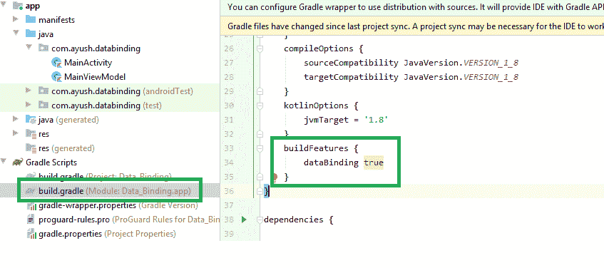
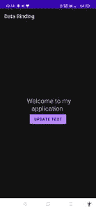

# 安卓系统中视图模型的数据绑定

> 原文:[https://www . geesforgeks . org/data-binding-with-view model-in-Android/](https://www.geeksforgeeks.org/data-binding-with-viewmodel-in-android/)

**先决条件:**

*   [检视模型](https://www.geeksforgeeks.org/viewmodel-in-android-architecture-components/)
*   [数据绑定](https://www.geeksforgeeks.org/overview-of-data-binding-in-android-architecture-components/)

在 ViewModel 中集成数据绑定有什么好处？简单地说，它提供了视图与其数据(或者可以说是视图的数据)之间的**便捷通信。正如我们所知，视图是在 XML 文件中定义的，XML 文件与它们的活动或片段文件相链接，但是它们的数据存储在视图模型对象中。因此，如果数据想要与视图通信，活动或片段文件将充当中介。这也将提高开发者的生产力，因为它**减少了样板代码**。因此，在本文中，我们将讨论如何直接连接视图和视图模型对象中的数据。**

### **实施**

我们将通过使用 Kotlin 创建一个简单的应用程序来了解这一点。

创建活动为空的应用程序。当我们使用数据绑定时，我们需要在 **build.gradle** 文件中启用数据绑定



创建视图模型类

## 我的锅

```kt
class MainViewModel : ViewModel() {
    var text = " Welcome to my application "

    fun updateText() {
        text = " Text is Updated "
    }
}
```

现在我们需要在 XML 中创建一个布局，并在 XML 布局中创建一个变量。使用数据标签我们声明一个变量。

## 可扩展标记语言

```kt
<?xml version="1.0" encoding="utf-8"?>
<layout xmlns:android="http://schemas.android.com/apk/res/android"
    xmlns:app="http://schemas.android.com/apk/res-auto"
    xmlns:tools="http://schemas.android.com/tools">

    <data>
        <variable
            name="mainViewModel"
            type="com.ayush.databinding.MainViewModel" />
    </data>

    <LinearLayout
        android:layout_width="match_parent"
        android:layout_height="match_parent"
        android:gravity="center"
        android:orientation="vertical"
        android:padding="50dp"
        tools:context=".MainActivity">

        <TextView
            android:layout_width="wrap_content"
            android:layout_height="wrap_content"
            android:layout_gravity="center_vertical"
            android:gravity="center_horizontal"
            android:text="@{ mainViewModel.text }"
            android:textSize="24sp" />

        <Button
            android:layout_width="wrap_content"
            android:layout_height="wrap_content"
            android:text="Update text"
            android:onClick="@{ ()-> mainViewModel.updateText() }"/>

    </LinearLayout>

</layout>
```

现在，我们需要在 Activity 中创建一个绑定对象，将数据传递给我们在 XML 布局和 MainViewModel 对象中定义的变量，作为视图的数据源。

## 我的锅

```kt
class MainActivity : AppCompatActivity() {

    lateinit var binding: ActivityMainBinding
    lateinit var mainViewModel: MainViewModel

    override fun onCreate(savedInstanceState: Bundle?) {
        super.onCreate(savedInstanceState)
        binding = DataBindingUtil.setContentView(this, R.layout.activity_main)

        mainViewModel = MainViewModel()

        binding.mainViewModel = mainViewModel
    }
}
```

**输出:**



我们的应用程序已经准备好了，它也在工作，因为我们可以看到存储在视图模型对象中的文本形式的数据。因此，我们知道了如何直接将视图与其数据进行通信，而无需借助任何中介。但是，在这个应用程序中，有一个问题，如果我们单击“更新文本”按钮，文本不会像预期的那样更新，但它将保持不变。这是因为对于任何新的数据更改，我们需要再次将更改文本(数据)设置为视图，因此我们需要在活动文件中定义一个函数来更新视图。但是我们不想让视图与活动交流。

所以这里我们可以使用**实况数据**，简单的说，实况数据就是**观测者数据持有者类**。如果我们将任何数据声明为 [LiveData](https://www.geeksforgeeks.org/livedata-in-android-architecture-components/) ，那么这些数据就可以被像 Activity、Fragments 等安卓组件观察到。因此，如果我们将任何数据声明为实时数据，并使用视图绑定将其绑定到视图，那么每当数据更改时，视图都会自动更新。在本文中，我们只讨论了使用视图模型的数据绑定，在下一篇文章中，我们还将看到使用 LiveData 的数据绑定。