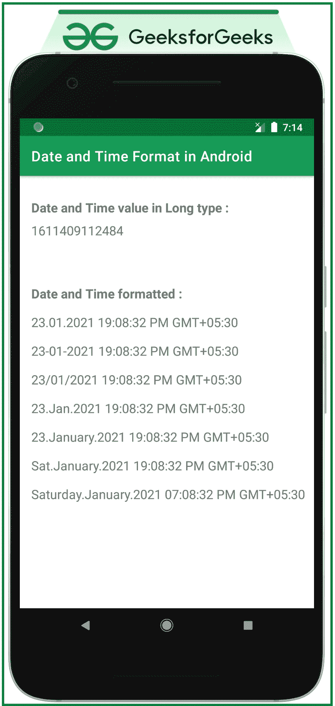

# 安卓中的日期和时间格式

> 原文:[https://www . geeksforgeeks . org/Android 中的日期和时间格式/](https://www.geeksforgeeks.org/date-and-time-formatting-in-android/)

**Android 中的日期和时间**使用 Java 中的 SimpleDateFormat 库进行格式化，使用 Calendar 实例帮助获取当前系统的日期和时间。当前日期和时间属于 Long 类型，可以转换为人类可读的日期和时间。在本文中，已经讨论了日期和时间值如何以各种格式格式化和显示。请看下图，了解整个讨论。



## **在安卓系统中格式化日期和时间的步骤**

**第一步:创建一个空的活动项目**

*   使用安卓工作室创建一个空的活动项目。参考[安卓|如何在安卓工作室创建/启动新项目？](https://www.geeksforgeeks.org/android-how-to-create-start-a-new-project-in-android-studio/)

**步骤 2:使用 activity_main.xml 文件**

*   包含 8 个[文本视图](https://www.geeksforgeeks.org/textview-widget-in-android-using-java-with-examples/)的活动文件的主布局。一个以长整型显示当前系统日期和时间值，另一个以格式化的可读方式显示相同的日期和时间值。
*   要实现用户界面，在 **activity_main.xml** 文件中调用以下代码。

## 可扩展标记语言

```kt
<?xml version="1.0" encoding="utf-8"?>
<androidx.constraintlayout.widget.ConstraintLayout 
    xmlns:android="http://schemas.android.com/apk/res/android"
    xmlns:app="http://schemas.android.com/apk/res-auto"
    xmlns:tools="http://schemas.android.com/tools"
    android:layout_width="match_parent"
    android:layout_height="match_parent"
    tools:context=".MainActivity"
    tools:ignore="HardcodedText">

    <TextView
        android:layout_width="wrap_content"
        android:layout_height="wrap_content"
        android:layout_marginStart="16dp"
        android:layout_marginTop="32dp"
        android:text="Date and Time value in Long type :"
        android:textSize="18sp"
        android:textStyle="bold"
        app:layout_constraintStart_toStartOf="parent"
        app:layout_constraintTop_toTopOf="parent" />

    <!--text view to show the current
        date and time in Long type-->
    <TextView
        android:id="@+id/dateTimeLongValue"
        android:layout_width="wrap_content"
        android:layout_height="wrap_content"
        android:layout_marginStart="16dp"
        android:layout_marginTop="64dp"
        android:textSize="18sp"
        app:layout_constraintStart_toStartOf="parent"
        app:layout_constraintTop_toTopOf="parent" />

    <TextView
        android:id="@+id/textView"
        android:layout_width="wrap_content"
        android:layout_height="wrap_content"
        android:layout_marginStart="16dp"
        android:layout_marginTop="64dp"
        android:text="Date and Time formatted :"
        android:textSize="18sp"
        android:textStyle="bold"
        app:layout_constraintStart_toStartOf="parent"
        app:layout_constraintTop_toBottomOf="@+id/dateTimeLongValue" />

    <!--text views to show the current date and
        time in formatted and human readable way-->
    <TextView
        android:id="@+id/format1"
        android:layout_width="wrap_content"
        android:layout_height="wrap_content"
        android:layout_marginStart="16dp"
        android:layout_marginTop="16dp"
        android:textSize="18sp"
        app:layout_constraintStart_toStartOf="parent"
        app:layout_constraintTop_toBottomOf="@+id/textView" />

    <TextView
        android:id="@+id/format2"
        android:layout_width="wrap_content"
        android:layout_height="wrap_content"
        android:layout_marginStart="16dp"
        android:layout_marginTop="16dp"
        android:textSize="18sp"
        app:layout_constraintStart_toStartOf="parent"
        app:layout_constraintTop_toBottomOf="@+id/format1" />

    <TextView
        android:id="@+id/format3"
        android:layout_width="wrap_content"
        android:layout_height="wrap_content"
        android:layout_marginStart="16dp"
        android:layout_marginTop="16dp"
        android:textSize="18sp"
        app:layout_constraintStart_toStartOf="parent"
        app:layout_constraintTop_toBottomOf="@+id/format2" />

    <TextView
        android:id="@+id/format4"
        android:layout_width="wrap_content"
        android:layout_height="wrap_content"
        android:layout_marginStart="16dp"
        android:layout_marginTop="16dp"
        android:textSize="18sp"
        app:layout_constraintStart_toStartOf="parent"
        app:layout_constraintTop_toBottomOf="@+id/format3" />

    <TextView
        android:id="@+id/format5"
        android:layout_width="wrap_content"
        android:layout_height="wrap_content"
        android:layout_marginStart="16dp"
        android:layout_marginTop="16dp"
        android:textSize="18sp"
        app:layout_constraintStart_toStartOf="parent"
        app:layout_constraintTop_toBottomOf="@+id/format4" />

    <TextView
        android:id="@+id/format6"
        android:layout_width="wrap_content"
        android:layout_height="wrap_content"
        android:layout_marginStart="16dp"
        android:layout_marginTop="16dp"
        android:textSize="18sp"
        app:layout_constraintStart_toStartOf="parent"
        app:layout_constraintTop_toBottomOf="@+id/format5" />

    <TextView
        android:id="@+id/format7"
        android:layout_width="wrap_content"
        android:layout_height="wrap_content"
        android:layout_marginStart="16dp"
        android:layout_marginTop="16dp"
        android:textSize="18sp"
        app:layout_constraintStart_toStartOf="parent"
        app:layout_constraintTop_toBottomOf="@+id/format6" />

</androidx.constraintlayout.widget.ConstraintLayout>
```

**第三步:使用** **主要活动文件**

**了解安卓中使用 SimpleDateFormat** 格式化日期和时间的方式

*   首先，创建日历的实例，并且要显示的日期和时间的期望格式被传递给**简单日期格式**方法。字符串应该包含以下字符，并且可以包含分隔符，如-、/等。
*   下表包括用于生成最常用的日期和时间模式的字符。

<figure class="table">

| 

要使用的字符

 | 

输出

 |
| --- | --- |
| 截止日期（Deadline Date 的缩写） | 数值形式的日期 |
| E | 字符串形式的日期(简称。例:周一) |
| EEEE | 字符串形式的日期(完整形式。例:星期一) |
| abbr. 毫米（millimeter） | 数值中的月份 |
| yyyy | 数值年 |
| 微光 | 字符串形式的月份(简称。例:三月) |
| left lower lung lobe 左下方肺叶 | 字符串形式的月份(完整形式。例:三月) |
| 殿下 | 数值形式的小时(24 小时计时格式) |
| 千开 | 数值形式的小时(12 小时计时格式) |
| 毫米 | 数值分钟 |
| 悬浮物 | 数值中的秒 |
| 美国汽车协会 | 显示上午或下午(根据 12 小时计时格式) |
| z | 显示该地区的时区 |

</figure>

*   请参考下面的代码及其输出，以便更好地理解上表。

## 我的锅

```kt
import androidx.appcompat.app.AppCompatActivity
import android.os.Bundle
import android.widget.TextView
import java.text.SimpleDateFormat
import java.util.*

class MainActivity : AppCompatActivity() {
    override fun onCreate(savedInstanceState: Bundle?) {
        super.onCreate(savedInstanceState)
        setContentView(R.layout.activity_main)

        var dateTime: String
        var calendar: Calendar
        var simpleDateFormat: SimpleDateFormat

        // register all the text view with appropriate IDs
        val dateTimeInLongTextView: TextView = findViewById(R.id.dateTimeLongValue)
        val format1: TextView = findViewById(R.id.format1)
        val format2: TextView = findViewById(R.id.format2)
        val format3: TextView = findViewById(R.id.format3)
        val format4: TextView = findViewById(R.id.format4)
        val format5: TextView = findViewById(R.id.format5)
        val format6: TextView = findViewById(R.id.format6)
        val format7: TextView = findViewById(R.id.format7)

        // get the Long type value of the current system date
        val dateValueInLong: Long = System.currentTimeMillis()
        dateTimeInLongTextView.text = dateValueInLong.toString()

        // different format type to format the 
        // current date and time of the system
        // format type 1
        calendar = Calendar.getInstance()
        simpleDateFormat = SimpleDateFormat("dd.MM.yyyy HH:mm:ss aaa z")
        dateTime = simpleDateFormat.format(calendar.time).toString()
        format1.text = dateTime

        // format type 2
        calendar = Calendar.getInstance()
        simpleDateFormat = SimpleDateFormat("dd-MM-yyyy HH:mm:ss aaa z")
        dateTime = simpleDateFormat.format(calendar.time).toString()
        format2.text = dateTime

        // format type 3
        calendar = Calendar.getInstance()
        simpleDateFormat = SimpleDateFormat("dd/MM/yyyy HH:mm:ss aaa z")
        dateTime = simpleDateFormat.format(calendar.time).toString()
        format3.text = dateTime

        // format type 4
        calendar = Calendar.getInstance()
        simpleDateFormat = SimpleDateFormat("dd.LLL.yyyy HH:mm:ss aaa z")
        dateTime = simpleDateFormat.format(calendar.time).toString()
        format4.text = dateTime

        // format type 5
        calendar = Calendar.getInstance()
        simpleDateFormat = SimpleDateFormat("dd.LLLL.yyyy HH:mm:ss aaa z")
        dateTime = simpleDateFormat.format(calendar.time).toString()
        format5.text = dateTime

        // format type 6
        calendar = Calendar.getInstance()
        simpleDateFormat = SimpleDateFormat("E.LLLL.yyyy HH:mm:ss aaa z")
        dateTime = simpleDateFormat.format(calendar.time).toString()
        format6.text = dateTime

        // format type 7
        calendar = Calendar.getInstance()
        simpleDateFormat = SimpleDateFormat("EEEE.LLLL.yyyy KK:mm:ss aaa z")
        dateTime = simpleDateFormat.format(calendar.time).toString()
        format7.text = dateTime
    }
}
```

## Java 语言(一种计算机语言，尤用于创建网站)

```kt
import android.os.Bundle;
import android.widget.TextView;
import androidx.appcompat.app.AppCompatActivity;
import java.text.SimpleDateFormat;
import java.util.Calendar;

public class MainActivity extends AppCompatActivity {

    TextView dateTimeInLongTextView, format1, format2,
             format3, format4, format5, format6, format7;

    @Override
    protected void onCreate(Bundle savedInstanceState) {
        super.onCreate(savedInstanceState);
        setContentView(R.layout.activity_main);

        String dateTime;
        Calendar calendar;
        SimpleDateFormat simpleDateFormat;

        // register all the text view with appropriate IDs
        dateTimeInLongTextView = (TextView) findViewById(R.id.dateTimeLongValue);
        format1 = (TextView) findViewById(R.id.format1);
        format2 = (TextView) findViewById(R.id.format2);
        format3 = (TextView) findViewById(R.id.format3);
        format4 = (TextView) findViewById(R.id.format4);
        format5 = (TextView) findViewById(R.id.format5);
        format6 = (TextView) findViewById(R.id.format6);
        format7 = (TextView) findViewById(R.id.format7);

        // get the Long type value of the current system date
        Long dateValueInLong = System.currentTimeMillis();
        dateTimeInLongTextView.setText(dateValueInLong.toString());

        // different format type to format the
        // current date and time of the system
        // format type 1
        calendar = Calendar.getInstance();
        simpleDateFormat = new SimpleDateFormat("dd.MM.yyyy HH:mm:ss aaa z");
        dateTime = simpleDateFormat.format(calendar.getTime()).toString();
        format1.setText(dateTime);

        // format type 2
        calendar = Calendar.getInstance();
        simpleDateFormat = new SimpleDateFormat("dd-MM-yyyy HH:mm:ss aaa z");
        dateTime = simpleDateFormat.format(calendar.getTime()).toString();
        format2.setText(dateTime);

        // format type 3
        calendar = Calendar.getInstance();
        simpleDateFormat = new SimpleDateFormat("dd/MM/yyyy HH:mm:ss aaa z");
        dateTime = simpleDateFormat.format(calendar.getTime()).toString();
        format3.setText(dateTime);

        // format type 4
        calendar = Calendar.getInstance();
        simpleDateFormat = new SimpleDateFormat("dd.LLL.yyyy HH:mm:ss aaa z");
        dateTime = simpleDateFormat.format(calendar.getTime()).toString();
        format4.setText(dateTime);

        // format type 5
        calendar = Calendar.getInstance();
        simpleDateFormat = new SimpleDateFormat("dd.LLLL.yyyy HH:mm:ss aaa z");
        dateTime = simpleDateFormat.format(calendar.getTime()).toString();
        format5.setText(dateTime);

        // format type 6
        calendar = Calendar.getInstance();
        simpleDateFormat = new SimpleDateFormat("E.LLLL.yyyy HH:mm:ss aaa z");
        dateTime = simpleDateFormat.format(calendar.getTime()).toString();
        format6.setText(dateTime);

        // format type 7
        calendar = Calendar.getInstance();
        simpleDateFormat = new SimpleDateFormat("EEEE.LLLL.yyyy KK:mm:ss aaa z");
        dateTime = simpleDateFormat.format(calendar.getTime()).toString();
        format7.setText(dateTime);
    }
}
```

### **输出:**

