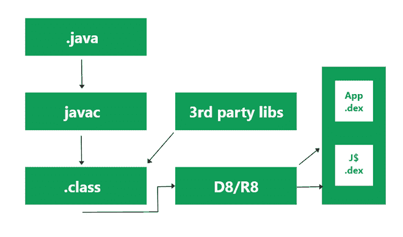

# 安卓中的脱糖

> 原文:[https://www.geeksforgeeks.org/desugaring-in-android/](https://www.geeksforgeeks.org/desugaring-in-android/)

谷歌已经正式宣布 Kotlin 作为 Android 开发的推荐语言，这就是为什么这么多开发人员从 **Java 转而使用 Kotlin** 进行 Android 开发。因此，谷歌团队每天都在安卓系统中引入新的应用编程接口，这些接口也可以在更新版本的安卓设备中使用。因此，去糖也是我们应该在应用程序中启用的安卓重要功能之一，这也将允许我们的应用程序在较低的应用程序接口级别下工作。因此，在本文中，我们将了解脱糖。

*   什么是脱糖？
*   为什么我们需要脱糖？
*   去糖的实际实现。
*   引擎盖下发生了什么？

### 什么是脱糖？

安卓设备日益优化。安卓系统为用户和开发者提供的许多功能都在不断优化。当安卓的任何操作系统被开发出来时，它都带有如此多的 Java 类，为用户设备中的不同应用程序提供各种功能的支持，如时间、日期和许多其他功能。现在，如果我们考虑时间应用编程接口，它是在应用编程接口级别 26 中引入的，使用该应用编程接口的应用程序将在较低应用编程接口级别的设备上崩溃，如棉花糖和较低版本。所以在这种情况下为了避免应用崩溃，去糖开始发挥作用。它允许较低的应用编程接口级别使用新的 JAVA 库。

### 为什么我们需要脱糖？

例如，假设我们正在使用一个新的时间 API，它是在 API 级别 26 中引入的，并且我们已经在我们的应用程序中使用了这个时间 API。这个应用程序将完美地工作在应用编程接口级别 26 及以上，但是当我们将这个应用程序安装在较低的应用编程接口级别时，假设应用编程接口级别 23 或更低，那么我们的应用程序将崩溃，因为我们的设备操作系统支持从应用编程接口级别 23 提供的功能，而我们使用的是应用编程接口级别 26 的功能，这将不起作用。因此，为了避免这个应用程序崩溃，为了支持从 API 级别 26 到 API 级别 23 的新特性，我们必须在我们的应用程序中添加去编程。

### 安卓系统中去糖的实际实现

当我们在低于 API 级别 26 的设备中使用 API 级别 26 提供的功能时，应用将会崩溃。在应用程序接口级别较低的应用程序中，我们将看到一个名为 NoClassDefFoundError 的错误。所以为了解决这个错误，我们必须在安卓系统中启用去糖。

**逐步实施脱糖**

**步骤 1** :导航到**渐变脚本>构建.渐变(:app)** 并在您的依赖项部分添加下面给出的依赖项

> corelibrary disuging ' com . Android . tools:disugar _ JDK _ libs:1 . 0 . 9 '

现在，在添加这个依赖项之后，您必须在代码的编译部分添加下面一行

> corelibrary 已停用 true

**第 2 步**:现在我们必须在我们的应用程序中启用 multiDex，以便导航到您的 Gradle 文件，在 defaultConfig 部分的该部分中，将下面的行添加为

> 多位真

同步你的项目。在成功的项目同步后，去编程已经在我们的应用程序中实现，现在我们将不会在应用编程接口级别较低的设备中看到 NoClassDefFoundError。**Gradle 文件的完整代码如下:**

## 我的锅

```
plugins {
    id 'com.android.application'
    id 'kotlin-android'
}

android {
    compileSdkVersion 30
    buildToolsVersion "30.0.2"

    defaultConfig {
        applicationId "com.gtappdevelopers.desugaring"
        minSdkVersion 19
        multiDexEnabled true
        targetSdkVersion 30
        versionCode 1
        versionName "1.0"

        testInstrumentationRunner "androidx.test.runner.AndroidJUnitRunner"
    }

    buildTypes {
        release {
            minifyEnabled false
            proguardFiles getDefaultProguardFile('proguard-android-optimize.txt'), 'proguard-rules.pro'
        }
    }
    compileOptions {
        sourceCompatibility JavaVersion.VERSION_1_8
        targetCompatibility JavaVersion.VERSION_1_8
        coreLibraryDesugaringEnabled true
    }
    kotlinOptions {
        jvmTarget = '1.8'
    }
}

dependencies {

    implementation "org.jetbrains.kotlin:kotlin-stdlib:$kotlin_version"
    implementation 'androidx.core:core-ktx:1.3.2'
    coreLibraryDesugaring 'com.android.tools:desugar_jdk_libs:1.0.9'
    implementation 'androidx.appcompat:appcompat:1.2.0'
    implementation 'com.google.android.material:material:1.2.1'
    implementation 'androidx.constraintlayout:constraintlayout:2.0.4'
    testImplementation 'junit:junit:4.+'
    androidTestImplementation 'androidx.test.ext:junit:1.1.2'
    androidTestImplementation 'androidx.test.espresso:espresso-core:3.3.0'
}
```

### 引擎盖下发生了什么？

那么这里发生了什么，缺失的 java 类是如何突然出现在这里的。这是因为 D8 和 R8 的工具。之前为了将你的应用程序代码转换成 dex 代码，我们不得不使用 Proguard，但是为了减少编译时间和减少应用程序大小，引入了新的 R8 工具。这个 R8 工具提供了对缺失的 Java 类的支持。当这个工具将你的应用程序代码转换为 dex 代码时，它还会添加新 java 库的 dex 代码，这些代码随后会被添加到 APK。您可以从下图中清楚地了解这个过程。



通过这种方式，Desugaring 可以工作，并且它为具有较低 API 级别的设备中的新 Java 库提供了向后兼容性。