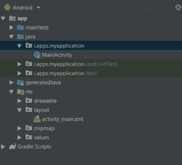

# 科特林中的离散 SeekBar

> 原文:[https://www.geeksforgeeks.org/discrete-seekbar-in-kotlin/](https://www.geeksforgeeks.org/discrete-seekbar-in-kotlin/)

在**安卓**中，离散 SeekBar 只是 progressBar 的一个进步，就像 SeekBar 一样，SeekBar 和离散 SeekBar 唯一的区别是，在离散 SeekBar 中，我们只能将值设置为 1、2、3 等离散值。
在本文中，我们将讨论如何在科特林创建 **SeekBar** 。

## 安卓离散 SeekBar 的不同属性

<figure class="table">

| XML 属性 | 描述 |
| --- | --- |
| android:最大 | 设置最大值 |
| android:min | 设置最小值 |
| 安卓:进步 | 指定了已经设置的进度值 |
| 机器人：进度可绘制 | 设置可绘制的进度模式。 |
| 安卓:拇指 | 帮助在 seekBar 上画一个拇指.. |
| Android:thumbint | 设置混合模式以应用拇指色调。 |
| Android:thumbintmode | 将色调设置为应用于可绘制的刻度线。 |
| Android:tick market(滚动市场) | 设置用于应用刻度线色调的混合模式。 |
| Android:tick market mode(滚动市场模式) | 设置用于应用刻度线色调的混合模式。 |
| 安卓:背景 | 设置视图的背景 |
| android:id | 设置视图的唯一 id |
| 安卓:提升 | 设置视图的基准 z 深度 |

</figure>

第一步是在安卓工作室创建一个新的项目。为此，请遵循以下步骤:

*   点击文件，然后**新建**然后新建项目，随便命名
*   然后，选择 **Kotlin** 语言支持，点击下一步按钮。
*   选择最小 SDK，无论您需要什么
*   选择空活动，然后点击**完成**。

这样做之后，在你的项目/梯度完成加载之后，你会在左手边看到一些目录。应该是这样的:



之后，我们需要设计我们的布局。为此，我们需要处理 XML 文件。转到应用>资源>布局并粘贴以下代码:

## 修改 activity_main.xml 文件

## 可扩展标记语言

```
<?xml version="1.0" encoding="utf-8"?>
<RelativeLayout
        xmlns:android="http://schemas.android.com/apk/res/android"
        android:layout_width="match_parent"
        android:layout_height="match_parent"
        android:gravity="center"
        android:orientation="vertical">

    <SeekBar
            android:id="@+id/seekBar"
            style="@style/Widget.AppCompat.SeekBar.Discrete"
            android:layout_width="match_parent"
            android:layout_height="wrap_content"
            android:min="1"
            android:max="10"
            android:progress="7"/>

</RelativeLayout>
```

**注:**

```
style=”@style/Widget.AppCompat.SeekBar.Discrete”
```

此样式用于显示 seekBar，使其适用于离散值。

## 在 MainActivity.kt 文件中创建 SeekBar

打开 app/src/main/Java/your package name/main activity . kt 并进行以下更改:

## Java 语言(一种计算机语言，尤用于创建网站)

```
package com.geeksforgeeks.myfirstKotlinapp

import androidx.appcompat.app.AppCompatActivity
import android.os.Bundle
import android.widget.SeekBar
import android.widget.Toast

class MainActivity : AppCompatActivity() {

    override fun onCreate(savedInstanceState: Bundle?) {
        super.onCreate(savedInstanceState)
        setContentView(R.layout.activity_main)

        //accessing the seekbar from our layout
        val seekBar = findViewById<SeekBar>(R.id.seekBar)

        seekBar?.setOnSeekBarChangeListener(object : SeekBar.OnSeekBarChangeListener {
            override fun onProgressChanged(seekBar: SeekBar, progress: Int, fromUser: Boolean) {
               //here we can write some code to do something when progress is changed
            }

            override fun onStartTrackingTouch(seekBar: SeekBar) {
               //here we can write some code to do something whenever the user touche the seekbar
            }

            override fun onStopTrackingTouch(seekBar: SeekBar) {
                // show some message after user stopped scrolling the seekbar
                Toast.makeText(this@MainActivity, "Discrete Value of SeekBar is  " + seekBar.progress, Toast.LENGTH_SHORT).show()
            }
        })

    }
}
```

## AndroidManifest.xml 文件

## 可扩展标记语言

```
<?xml version="1.0" encoding="utf-8"?>
<manifest xmlns:android="http://schemas.android.com/apk/res/android"
          package="i.apps.myapplication">

    <application
            android:allowBackup="true"
            android:icon="@mipmap/ic_launcher"
            android:label="@string/app_name"
            android:roundIcon="@mipmap/ic_launcher_round"
            android:supportsRtl="true"
            android:theme="@style/AppTheme">
        <activity android:name=".MainActivity">
            <intent-filter>
                <action android:name="android.intent.action.MAIN"/>

                <category android:name="android.intent.category.LAUNCHER"/>
            </intent-filter>
        </activity>
    </application>

</manifest>
```

## 作为模拟器运行:

<video class="wp-video-shortcode" id="video-362225-1" width="640" height="360" preload="metadata" controls=""><source type="video/mp4" src="https://media.geeksforgeeks.org/wp-content/uploads/20191121220106/seek.mp4?_=1">[https://media.geeksforgeeks.org/wp-content/uploads/20191121220106/seek.mp4](https://media.geeksforgeeks.org/wp-content/uploads/20191121220106/seek.mp4)</video>