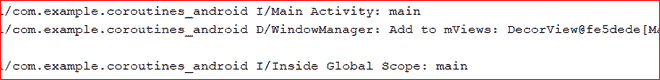

# 科特林验尸官

> 原文:[https://www . geesforgeks . org/dispatcher-in-kot Lin-coroutines/](https://www.geeksforgeeks.org/dispatchers-in-kotlin-coroutines/)

**先决条件:** [安卓系统上的柯特林卡罗廷](https://www.geeksforgeeks.org/kotlin-coroutines-on-android/)

众所周知[协同程序](https://www.geeksforgeeks.org/kotlin-coroutines-on-android/)总是在特定的上下文中启动，该上下文描述了协同程序将在哪个线程中启动。一般来说，我们可以使用 GlobalScope 启动协同程序，而无需向其传递任何参数，这是在我们没有指定协同程序应该在其中启动的线程时完成的。这个方法没有给我们太多的控制权，因为我们的协同程序可以在任何可用的线程中启动，因此不可能预测我们的协同程序在哪个线程中启动。

## 我的锅

```
class MainActivity : AppCompatActivity() {
    override fun onCreate(savedInstanceState: Bundle?) {
        super.onCreate(savedInstanceState)
        setContentView(R.layout.activity_main)

        // coroutine launched in GlobalScope
        GlobalScope.launch() {
        Log.i("Inside Global Scope ",Thread.currentThread().name.toString())
            // getting the name of thread in
            // which our coroutine has been launched
        }

        Log.i("Main Activity ",Thread.currentThread().name.toString())
    }
}
```

日志输出如下所示:


我们可以看到启动协同程序的线程是无法预测的，有时候是 DefaultDispatcher-worker-1，或者 DefaultDispatcher-worker-2 或者 DefaultDispatcher-worker-3。

**调度员如何解决上述问题？**

调度程序帮助[协同](https://www.geeksforgeeks.org/kotlin-coroutines-on-android/)决定工作要在哪个线程上完成。调度程序作为参数传递给**全局范围**，根据我们希望协同程序完成的工作，我们可以使用哪种类型的调度程序。

### 调度员的类型

调度员主要有 4 种类型。

1.  **主调度员**
2.  **IO 调度器**
3.  **默认调度程序**
4.  **无约束调度器**

#### **主调度员:**

它在主线程中启动协同程序。它主要用于我们需要在协同程序中执行用户界面操作时，因为用户界面只能从主线程(也称为用户界面线程)更改。

## 我的锅

```
GlobalScope.launch(Dispatchers.Main) {
       Log.i("Inside Global Scope ",Thread.currentThread().name.toString())
           // getting the name of thread in which 
              // our coroutine has been launched
       }
       Log.i("Main Activity ",Thread.currentThread().name.toString())
```



#### **IO 调度器:**

它在输入输出线程中启动协同程序，用于执行所有数据操作，如联网、从数据库读取或写入、读取或写入文件等。例如:从数据库获取数据是一个输入输出操作，在输入输出线程上完成。

## 我的锅

```
GlobalScope.launch(Dispatchers.IO) {
       Log.i("Inside IO dispatcher ",Thread.currentThread().name.toString())
           // getting the name of thread in which
              // our coroutine has been launched
       }
       Log.i("Main Activity ",Thread.currentThread().name.toString())
```


#### **默认调度程序:**

它在默认线程中启动协同程序。当我们计划进行复杂且长时间运行的计算时，我们应该选择这个，这可能会阻塞主线程并冻结用户界面例如:假设我们需要进行 10，000 次计算，并且我们正在用户界面线程 ie 主线程上进行所有这些计算，如果我们等待结果或 10，000 次计算，直到那时，我们的主线程将被阻塞，我们的用户界面将被冻结，导致用户体验不佳。所以在这种情况下，我们需要使用默认线程。在全局作用域中启动协同程序时使用的默认调度程序由调度程序表示。默认并使用共享的后台线程池，因此启动(Dispatchers。默认值){ … }使用与 GlobalScope.launch 相同的调度程序{ … }。

## 我的锅

```
GlobalScope.launch(Dispatchers.Default) {
        Log.i("Inside Default dispatcher ",Thread.currentThread().name.toString())
            // getting the name of thread in which 
              // our coroutine has been launched
        }
        Log.i("Main Activity ",Thread.currentThread().name.toString())
```


#### **无约束调度器:**

顾名思义，不受限制的调度程序并不局限于任何特定的线程。它在当前调用框架中执行协同程序的初始延续，并让协同程序在相应挂起函数使用的任何线程中继续，而不强制任何特定的线程策略。