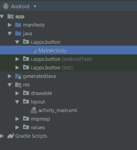

# 科特林

中的动态按钮

> 原文:[https://www.geeksforgeeks.org/dynamic-button-in-kotlin/](https://www.geeksforgeeks.org/dynamic-button-in-kotlin/)

在**安卓**中，一个按钮代表用户可以点击来执行一些动作的东西。
首先，我们需要在安卓工作室创建一个项目。为此，请遵循以下步骤:

单击文件，然后单击新建，然后单击新建项目，并给出您喜欢的名称:

*   点击文件，然后**新建**，然后新建项目，给你喜欢的名字
*   然后，选择 **Kotlin** 语言支持，点击下一步按钮。
*   选择最小的软件开发工具包，无论你需要什么。
*   选择空活动，然后点击**完成**。

这样做之后，在你的项目/梯度完成加载之后，你会在左手边看到一些目录。应该是这样的:



第二步是设计我们的布局页面。转到应用>资源>布局并粘贴以下代码:

## 修改 activity_main.xml 文件

## 可扩展标记语言

```kt
<?xml version="1.0" encoding="utf-8"?>
<android.support.constraint.ConstraintLayout
        xmlns:android="http://schemas.android.com/apk/res/android"
        xmlns:tools="http://schemas.android.com/tools"
        xmlns:app="http://schemas.android.com/apk/res-auto"
        android:layout_width="match_parent"
        android:layout_height="match_parent"
        tools:context=".MainActivity">

    <LinearLayout
            android:id="@+id/layout"
            android:layout_width="match_parent"
            android:layout_height="match_parent"
            android:gravity="center"
            android:orientation="vertical">
    </LinearLayout>

</android.support.constraint.ConstraintLayout>
```

设置好设计后，我们的最后一步是对进度条进行编码。打开 app/src/main/Java/your package name/main activity . kt

## 在 MainActivity.kt 文件中创建按钮

首先，我们定义按钮并设置其属性。

```kt
val button = Button(this)
        // setting layout_width and layout_height using layout parameters
        button.layoutParams = LinearLayout.LayoutParams(LinearLayout.LayoutParams.WRAP_CONTENT,
 ViewGroup.LayoutParams.WRAP_CONTENT)

```

然后，使用 **addView()** 在布局中添加按钮

```kt

 val layout = findViewById(R.id.layout) as LinearLayout
 // add Button to LinearLayout
        layout.addView(button)
```

## Java 语言(一种计算机语言，尤用于创建网站)

```kt
package com.geeksforgeeks.myfirstkotlinapp

import androidx.appcompat.app.AppCompatActivity
import android.os.Bundle
import android.view.ViewGroup
import android.widget.Button
import android.widget.LinearLayout
import android.widget.Toast

class MainActivity : AppCompatActivity() {

    override fun onCreate(savedInstanceState: Bundle?) {
        super.onCreate(savedInstanceState)
        setContentView(R.layout.activity_main)

        val layout = findViewById(R.id.layout) as LinearLayout

        // creating the button
        val button = Button(this)
        // setting layout_width and layout_height using layout parameters
        button.layoutParams = LinearLayout.LayoutParams(LinearLayout.LayoutParams.WRAP_CONTENT, ViewGroup.LayoutParams.WRAP_CONTENT)
        button.text = "WELCOME TO GFG"
        button.setOnClickListener { Toast.makeText(this@MainActivity, "Hello GEEK", Toast.LENGTH_LONG).show() }

        // add Button to LinearLayout
        layout.addView(button)
    }
}
```

## AndroidManifest.xml 文件

## 可扩展标记语言

```kt
<?xml version="1.0" encoding="utf-8"?>
<manifest xmlns:android="http://schemas.android.com/apk/res/android"
          package="i.apps.button">

    <application
            android:allowBackup="true"
            android:icon="@mipmap/ic_launcher"
            android:label="@string/app_name"
            android:roundIcon="@mipmap/ic_launcher_round"
            android:supportsRtl="true"
            android:theme="@style/AppTheme">
        <activity android:name=".MainActivity">
            <intent-filter>
                <action android:name="android.intent.action.MAIN"/>

                <category android:name="android.intent.category.LAUNCHER"/>
            </intent-filter>
        </activity>
    </application>

</manifest>
```

## 作为模拟器运行:

<video class="wp-video-shortcode" id="video-360001-1" width="640" height="360" preload="metadata" controls=""><source type="video/mp4" src="https://media.geeksforgeeks.org/wp-content/uploads/20191115180121/button.mp4?_=1">[https://media.geeksforgeeks.org/wp-content/uploads/20191115180121/button.mp4](https://media.geeksforgeeks.org/wp-content/uploads/20191115180121/button.mp4)</video>